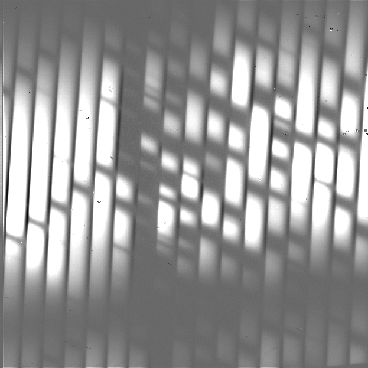
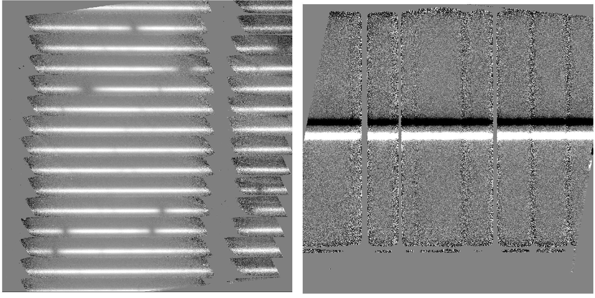

SI Observing Modes Supported
============================

EXES observing techniques
-------------------------

EXES is a mid-infrared instrument, which implies that its observations
must be taken with care in order to remove the effects of the spatially
and temporally variable sky background. Unlike some other mid-infrared
instruments, EXES does not make use of the chopping secondary mirror,
but it does use telescope nods to alternate the object observation with
a sky observation.

EXES has four basic nod patterns: stare, nod-on-slit, nod-off-slit, and
map. The stare mode is simply a continuous observation of a source, with
no telescope offsets to sky. This mode is primarily used for testing,
rather than for science observations. In either of the nodding modes,
the telescope moves in order to take frames at two different positions
(the A position and the B position). For nod-along-slit mode, the frames
alternate between placing the source at the bottom and top of the slit.
This mode can be used for relatively compact sources (FWHM less than a
quarter of the slit). For nod-off-slit mode, the frames alternate
between the source and a patch of blank sky. This mode is useful for
extended sources or crowded fields. Sky background for either nodding
mode is removed by subtracting the two adjacent nod beams. Typically,
EXES does a BA nod pattern, so that the nod pair is every second frame
minus the previous frame. In map mode, the telescope starts in blank
sky, then steps the source across the slit, and then returns to blank
sky. The sky frames are averaged together to reduce their noise, and
then subtracted from each source frame. This mode is used to map
extended sources.

Before each observation sequence, EXES takes a series of calibration
frames: typically a dark frame and a spectrum of a blackbody in the same
configuration as the science observation. The dark frame is
subtracted from the black frame, and the difference is used as a flat
field for the 2D object spectrum. The black frame is also used to
determine the edges of the orders in cross-dispersed modes.

EXES instrument configurations
------------------------------

EXES is a spectroscopic instrument that uses a slit to provide a spatial
dimension and gratings to provide a spectral dimension. EXES has two
gratings used for science: the echelle grating and the echelon. The
echelle grating, used alone, produces single-order long-slit spectra. The
Medium resolution configuration for EXES uses the echelle grating as the primary
disperser at angles 30-65 degrees; the Low resolution configuration uses
the echelle grating at angles less than 30 degrees. When the echelon
grating is used as the primary disperser and the echelle grating is used
as a secondary disperser, EXES produces multi-order, cross-dispersed
spectra. In this configuration, the wavelength coverage and the number
of orders is determined by the echelle angle. The High-Medium resolution
configuration uses an echelle angle of 30-65 degrees. The High-Low
resolution configuration uses an angle of less than 30 degrees.

The slit height and width for all modes can be varied depending on the
observational needs, although the length is limited in the
cross-dispersed modes by the requirement that echelon orders must not
overlap.

EXES also has an imaging configuration, but it is used primarily
for testing and for acquiring targets for spectroscopic observations. It
is not used for science and will not be addressed in this document.

Algorithm Description
=====================

Overview of data reduction steps
--------------------------------

This section will describe, in general terms, the major algorithms that
the EXES Redux pipeline uses to reduce an EXES observation.

See :numref:`exes_flowchart` for a flowchart of the processing steps used
by the pipeline.

.. figure:: images/exes_flowchart.png
   :name: exes_flowchart
   :alt: Flowchart of processing steps for EXES data with cartoon
         depictions of all steps.  Under "Reformat data": correct
         nonlinearity, coadd readout frames.  Under "Make calibration files":
         process flat field.  Under "Correct for background and instrumental
         response": despike, debounce, subtract sky, flat correct, clean
         bad pixels.  Under "Rectify and combine spectral images": undistort,
         coadd frames.  Under "Extract and combine expectra": identify
         apertures, extract spectra, combine spectra.

   Processing steps for EXES data.

Reduction algorithms
--------------------

The following subsections detail each of the data reduction pipeline
steps:

   -  Correct nonlinearity and coadd readout frames

   -  Process flat field

   -  Correct outliers (despike)

   -  Correct optical shifts (debounce)

   -  Subtract sky

   -  Flat correct

   -  Clean bad pixels

   -  Rectify spectral orders (undistort)

   -  Coadd frames

   -  Identify apertures

   -  Extract spectra

   -  Combine multiple spectra

Correct nonlinearity and coadd readout frames
~~~~~~~~~~~~~~~~~~~~~~~~~~~~~~~~~~~~~~~~~~~~~

Raw EXES data is stored in FITS image files, as a 3D data cube in which
each plane corresponds to a digitized readout of the array.
Readouts can be destructive or non-destructive. The readout method can
vary for EXES, so the pattern of readout actions used for a particular
observation is recorded in the OTPAT header keyword. The value for OTPAT
is a combination of the letters S, T, N, D, and C, each with a digit
afterwards. The letters have the following meaning:

-  S = spin (no reset, no digitization). This action effectively
   increases the integration time.

-  T = trash (reset, no digitization). This action resets the array
   without storing the previous value.

-  N = non-destructive read (no reset, but digitized). This action
   stores the current value of the array.

-  D = destructive read (reset and digitization). This action stores the
   current value, and resets the array.

-  C = coadd (reset and digitization). This action coadds previous reads
   in hardware and resets the array.

The digit after each letter gives the number of times the action was
taken, minus one. For example: S0 is one spin, N3 is four
non-destructive reads.

The pattern listed in the OTPAT can then be repeated any number of times
(:math:`n_{pat}`), so that the final number of frames in the raw file is
:math:`n_{pat} (n_{nd} + n_d)`,
where :math:`n_{nd}` is the number of nondestructive reads and
:math:`n_d` is the number of destructive reads per pattern.

Since near-infrared detectors do not have completely linear responses to
incoming flux, each frame in the raw file may optionally be corrected for
nonlinearity before proceeding. The nonlinearity coefficients for EXES
were determined by taking a series of nondestructive flat exposures,
followed by a single destructive read. Each readout was subtracted from
a bias frame, then the resulting counts in each pixel were fit with a
polynomial. The linearity correction algorithm reads in these polynomial
coefficients from a 3D array and uses them to calculate a correction
factor for each pixel in each raw readout. Pixels with counts below the
bias level, or above the maximum value used to calculate the
nonlinearity coefficients at that pixel, have no correction applied.

After linearity correction, in order to create a usable estimate of the
input flux, the non-destructive and destructive reads must be combined
in a way that maximizes the signal-to-noise. The EXES pipeline currently
has support for combining frames taken with the patterns listed in the
following subsections. Equations for the net signal and the associated
variance come from Vacca et. al., 2004 (see :ref:`exes_resources`).
After this initial calculation of the variance for each image pixel, the
variance plane is propagated along with the image through all pipeline
steps.

After the frames for each pattern are combined according to the
algorithms below, the pipeline checks whether multiple patterns were
taken at the same nod position. This is recorded in the header keyword
NINT. If NINT is greater than 1, then NINT coadded patterns are averaged
together before proceeding.  Optionally, one or more of the initial
patterns may be discarded before averaging.

.. figure:: images/raw_frames.png
   :name: exes_raw_frames
   :alt: Left: square frame with small hatching patterns. Middle:
         diagonal dark lines, overlaid with hatching patterns.
         Right: diagonal bright lines, no hatching patterns.

   Sample raw frames in nod-off-slit, High-Medium configuration: a
   pedestal image (left), a final destructive read (middle), and
   the Fowler coadd (right).  The bright spectrum is visible as a
   dark line in the final raw readout and a bright line in the coadd.

All destructive mode
^^^^^^^^^^^^^^^^^^^^

In this mode, each frame is a destructive read. There may be spins in
between reads to increase integration time, but there are no
non-destructive reads. In this case, the flux is simply the read signal
(*s*), minus a standard bias frame (*b*) stored on disk, subtracted
from a zero value (*z*), corresponding to a dark current, and divided by
the integration time (:math:`\Delta t`) and the pre-amp gain factor
(:math:`g_p`):

.. math::
   I_{net} = z - \frac{(s - b)}{\Delta t\ g_p}.

The dark current is typically zero for EXES.

The variance associated with this readout mode is the Poisson noise
(first term) plus the readout noise (second term):

.. math::

   V = \frac{I_{net}}{g\ \Delta t} + \frac{{\sigma_{read}}^{2}}{g^2\ {\Delta t}^{2}},

where :math:`\sigma_{read}` is the read noise, and *g* is the gain factor (to
convert from ADU to electrons).

This readout mode may optionally be used for any readout pattern, ignoring
the non-destructive reads and using the final destructive read only.

Fowler mode
^^^^^^^^^^^

In this mode, a number of non-destructive reads are taken at the
beginning of the integration, the array integrates for a while, then a
number of non-destructive reads and a single destructive read are taken
at the end of the integration. The initial reads are averaged together
to estimate the "pedestal" level; the final reads are averaged together
to estimate the total signal. The pedestal is then subtracted from the
total signal to get the net signal. We then subtract the negative signal
from a zero value (*z*) and divide by the pre-amp gain factor (:math:`g_p`)
and the integration time (:math:`\Delta t`, the time between the first pedestal read
and the first signal read). The net flux is then:

.. math::
   I_{net} = z - \frac{1}{n_r\ \Delta t\ g_p} \left( \sum_{i=1}^{n_r} s_i - \sum_{i=1}^{n_r}p_i \right).

We assume that the number of reads (:math:`n_r`) is the same for the pedestal
and the signal.

The variance associated with this readout mode is:

.. math::
   V = \frac{I_{net}}{g\ \Delta t}\left( 1 - \frac{\delta t \left( {n_r}^{2} - 1 \right)}{3\ \Delta t\ n_r} \right) + \frac{2\ {\sigma_{read}}^2}{g^2\ {\Delta t}^2\ n_r}.

Here, :math:`\delta t` is the frame time, :math:`\sigma_{read}` is the read noise, and *g* is
the gain factor to convert from ADU to electrons.

Sample OTPAT values for Fowler mode look like this:

-  **N0 D0**: a single non-destructive/destructive pair. This is the minimal
   Fowler case: the first read is the pedestal, the second read is the
   signal. There are 2 frames per pattern.

-  **N3 S15 N2 D0**: a Fowler 4 set. This set comprises 4 non-destructive
   reads, 16 spins to increase the integration time, 3 non-destructive
   reads, and a destructive read. There are 8 frames per pattern.

Sample-up-the-ramp mode
^^^^^^^^^^^^^^^^^^^^^^^

In this mode, non-destructive reads are taken at even intervals
throughout the integration. The count values for all reads are fit with
a straight line; the slope of this line gives the net flux. As with the
other modes, we then subtract from the zero value and divide by the
pre-amp gain and the integration time. The net flux for the
evenly-sampled case is calculated as:

.. math::
   I_{net} = z - \frac{12}{n_r\ \left( n_r + 1 \right) \Delta t\ g_p} \left( \sum_{i = 1}^{n_r} s_{i}\left\lbrack i - \frac{n_{r} + 1}{2} \right\rbrack \right),

where :math:`n_r` is the total number of reads (non-destructive and
destructive).

The variance associated with this readout mode is:

.. math::
   V = \frac{6\ I_{net} \left( {n_r}^2 + 1 \right)}{5\ g\ \Delta t\ n_r\ \left( n_r + 1 \right)} + \frac{12\ {\sigma_{read}}^{2} \left( n_r - 1 \right)}{g^2\ {\Delta t}^2\ n_r\ \left( n_r + 1 \right)}.

Sample OTPAT values for sample-up-the-ramp mode look like this:

-  **N0 S3 N0 S3 N0 S3 D0**: Sample-up-the-ramp with 4 spins in between each
   non-destructive read, ending with a destructive read. There are 4
   frames per pattern.

Coadding
^^^^^^^^

If the OT pattern contains a coadd (C), it is treated as a destructive
read for which the appropriate combination has already been done. That
is, if the pattern indicates Fowler mode, for example, the intensity is
simply calculated as for a destructive read:

.. math::
   I_{net} = z - \frac{s}{\Delta t\ g_p},

but the variance is calculated from the net intensity as for the Fowler
mode, above.

Process flat field
~~~~~~~~~~~~~~~~~~

Each EXES reduction requires a flat observation taken in the same mode
as the science data. The instrument configuration (eg. HIGH_MED or
MEDIUM), central wavenumber, slit height, slit width, and grating angle
must all match. This flat observation is used to correct for spectral
and spatial instrumental gain variations, and to calibrate the source
intensity of the science observation.

The flat observation consists of an observation of a blackbody in
EXES’s calibration box (*black*) and a dark frame (*dark*). If the
blackbody's temperature is known, then dividing the sky-subtracted science
frame by *black-dark*, normalized by the blackbody function, gives a calibrated
intensity as follows (Lacy et. al., 2002, see :ref:`exes_resources`).

.. math::
   S_{\nu}(black-dark) &= B_{\nu}(T_{black})\ R_{\nu}

   S_{\nu}(obj-sky) &\approx I_{\nu}(obj)\ R_{\nu}

   I_{\nu}(obj) &\approx S_{\nu}(obj-sky)\ \frac{B_{\nu}(T_{black})}{S_{\nu}(black-dark)}

where :math:`S_{\nu}` is the measured signal, :math:`B_{\nu}(T)`
is the blackbody function at temperature *T*, and :math:`R_{\nu}`
is the instrumental responsivity. The master flat frame produced by
the EXES pipeline, therefore, is the blackbody function calculated at the
temperature recorded in the flat frame’s header (BB_TEMP) and the central
wavenumber for the observation (WAVENO0), divided by
*black-dark* (:numref:`exes_flat_frames`). [#fn_correct_calibration]_

.. [#fn_correct_calibration]
   The flat value as derived is an approximation to the calibration
   function for all data in the spectrum: the true value depends
   slightly on the wavenumber value for each pixel in the spectrum. In
   pipeline version 3.0.0 and later, a correction for this wavenumber
   dependence is applied directly to the 2D spectral data, immediately
   following the undistort pipeline step.

In all instrument configurations, the *black* frame is also used to
determine an illumination mask that defines the good pixels for
extraction. In the cross-dispersed modes, the *black* frame is further
used to determine the edges of the orders for extraction and to check
the optical distortion parameters. The pipeline cleans and undistorts
the *black* frame, takes its derivative, then performs a 2D FFT of the
resulting image to determine the spacing and orientation of the orders
on the array. In particular, the value of :math:`k_{rot}`, the angle of the
order rotation, is adjusted automatically at this step: it is calculated
from the characteristics of the FFT, then used to recompute the
undistortion of the *black* frame, and redo the FFT, until the value of
:math:`k_{rot}` converges, or 5 iterations are reached. This process must be
closely monitored: if the *black* frame has insufficient signal, or the
optical parameters used to calculate the distortion correction are
insufficiently accurate, the spacing and rotation angle may be wrongly
calculated at this step. These values can be manually overridden in
parameters for the pipeline if necessary.

The distortion parameters and order definitions, as determined from the
*black* frame, are written to the header of the master flat, to be used
in later reduction steps.

.. figure:: images/flat_frames.png
   :name: exes_flat_frames
   :alt: Left: square frame with wide diagonal stripes of variable
         illumination. Right: diagonal stripes, overlaid with flat
         patches at top and lower middle of the square.  The flat patches
         in the Right image correspond to dark areas in the Left image.

   Sample flat in High-Medium configuration. The left image is the
   black frame; the right image is the final processed flat frame.
   Unilluminated regions are set to zero in the final frame.

Despike
~~~~~~~

After coadding the raw frames to make A and B nod frames, the pipeline
attempts to identify and correct spikes (outlier data points) in the
individual images. All A frames are compared, and any pixels with values
greater than a threshold number of standard deviations from the mean
value across the other frames are replaced with that mean value. B
frames are similarly compared with each other. The threshold for
identifying spikes is a tunable parameter; the default value is 20
sigma. Also in the despike step, frames with significantly different
overall background levels ("trashed" frames) may be identified
automatically and removed from subsequent reduction. It is common, for
example, for the first frame to look significantly different from the
rest of the frames. In this case, leaving out this frame may improve the
signal-to-noise of the final result.

Optionally, all input files may be combined at the despike step, prior to
performing the outlier analysis.  If the background levels do not differ
significantly from one file to the next, this option can help perform
better despiking on short or truncated observations.

Debounce
~~~~~~~~

After despiking, there is an optional step called debouncing, which may
help alleviate the effects of small optics shifts ("bounces") between
the nod beams. If there is a slight mismatch in the order placement on
the array, it can lead to poor background subtraction when the nods are
subtracted. In the debouncing algorithm, each nod pair is undistorted,
then the B nod is shifted slightly in the spatial direction and
differenced with the A nod. The shift direction that results in a
minimum squared difference (summed over the spectral direction) is used
as the bounce direction. The amplitude of the shift is controlled by the
bounce parameter, which should be set to a number whose absolute value
is between 0 and 1 (typically 0.1). If the bounce parameter is set to a
positive number, only the above shift (the first-derivative bounce) will
be corrected. If the bounce parameter is set to a negative value (e.g.
-0.1), the debouncing algorithm will also attempt to fix the
second-derivative bounce by smoothing the A or B nod slightly; the
amount of smoothing is also controlled by the absolute value of the
bounce parameter. Note that if the observed source is too near the edge
of the order, it may confuse the debouncing algorithm; in this case, it
is usually best to turn debouncing off (i.e. set the bounce parameter to
0). The default is not to use the debounce algorithm.

Subtract sky
~~~~~~~~~~~~

In either nod-on-slit or nod-off-slit mode, each B nod is subtracted
from each adjacent A nod (:numref:`exes_nodsub`). This step usually removes most of the
background emission from the image, but if there were changes in the sky
level between the two nod frames, there may still be some residual sky
signal. For the nod-off-slit mode, this residual signal can be estimated
and corrected for before subtracting the nods, by subtracting a weighted
fraction of the B data from the A data. The weighting is chosen to
minimize the squared difference between the A and B nods. For the
nod-on-slit mode, the mean background at each wavelength may be
subtracted after nod subtraction and distortion correction, so that the
wavelengths align with columns in the image. The pipeline performs this
step immediately before coadding, if desired.

.. figure:: images/nodsub.png
   :name: exes_nodsub
   :alt: Left: square frame with bright diagonal stripes.  The source
         stands out from the background as a single bright spectral trace.
         Right: square frame with bright and dark diagonal stripes. The source
         is nodded on array, so appears as a positive (bright) and negative
         (dark) spectral trace in each order.

   Background subtracted frames in nod-off-slit (left) and nod-on-slit (right),
   in High-Medium configuration.

For the mapping mode, each of the steps across the source is treated as
an A frame. The three sky frames taken at the end of the map are
averaged together and this average is subtracted from each A frame
(:numref:`exes_mapsub`). This mode is usually used for extended sources that
fill the entire slit, in which case there is no way to estimate or correct
for any residual background remaining after sky subtraction. The three sky
frames at the end of the map can be part of the map (without science target
signal) or dedicated sky positions away from the source.

   Background subtracted image in High-Medium configuration with map
   mode.  The extended source fills the entire slit.

Flat correct
~~~~~~~~~~~~

After background subtraction, each science frame is multiplied by the
processed flat calibration frame, described above. This has the effect
of both correcting the science frame for instrumental response and
calibrating it to intensity units.

Clean bad pixels
~~~~~~~~~~~~~~~~

In this step, bad pixels are identified and corrected. Bad pixels may
first be identified in a bad pixel mask, provided by the instrument
team. In this FITS image, pixels that are known to be bad are marked
with a value of 0; good pixels are marked with a value of 1.
Alternately, bad pixels may be identified from their noise
characteristics: if the error associated with a pixel is
greater than a threshold value (by default: 20) times the mean error
for the frame, then it is marked as a bad pixel. Unlike the
despike algorithm, which identifies outliers by comparing separate
frames, outliers in this algorithm are identified by comparing the
values within a single frame.

Bad pixels may be corrected by using neighboring good values to linearly
interpolate over the bad ones. The search for good pixels checks first
in the y-direction, then in the x-direction. If good pixels cannot be
identified within a 10-pixel radius, then the bad pixel will not be
corrected.  Alternately, bad pixels may be flagged for later handling
by setting their values to NaN.  In this case, bad pixels are ignored
in later coaddition and extraction steps.

Note that bad pixels may also be fixed or ignored in the spectral
extraction process, so it is not critical to correct all bad pixels at
this stage.

Undistort
~~~~~~~~~

Next, the pipeline corrects the image for optical distortion, resampling
the image onto a regular grid of spatial and spectral elements. The EXES
distortion correction uses knowledge of the optical design of the
instrument, as well as data recorded in the header of the observation,
to calculate and correct for the optical distortion in each observation.

The optical parameters used to calculate the distortion correction are
listed in the table below. Most of these parameters should not change,
or should change rarely, so they have default values listed in
configuration tables available to the pipeline (the *.dat* files listed
below). Values in the *tortparm.dat* configuration table tend to change
over time, as the instrument is adjusted, so their defaults vary by
date. Some of the distortion parameters must come from the headers and
do not have default values. One parameter is tuned at run-time
(*krot*), and one must be manually optimized by the user (*waveno0*).

.. table:: Optical distortion parameters.

   +---------------+----------------+------------------+-------------------+
   | **Parameter** | **Default      | **Source**       | **Comment**       |
   |               | value**        |                  |                   |
   +===============+================+==================+===================+
   | *hrfl*        | (varies by     | *tortparm.dat*   | High              |
   |               | date)          |                  | resolution        |
   |               |                |                  | chamber focal     |
   |               |                |                  | length            |
   +---------------+----------------+------------------+-------------------+
   | *xdfl*        | (varies by     | *tortparm.dat*   | Assumed           |
   |               | date)          |                  | cross-            |
   |               |                |                  | dispersed         |
   |               |                |                  | focal length      |
   +---------------+----------------+------------------+-------------------+
   | *slitrot*     | (varies by     | *tortparm.dat*   | Slit rotation     |
   |               | date)          |                  |                   |
   +---------------+----------------+------------------+-------------------+
   | *detrot*      | (varies by     | *tortparm.dat*   | Detector          |
   |               | date)          |                  | rotation          |
   +---------------+----------------+------------------+-------------------+
   | *hrr*         | (varies by     | *tortparm.dat*   | R number for      |
   |               | date)          |                  | echelon           |
   |               |                |                  | grating           |
   +---------------+----------------+------------------+-------------------+
   | *brl*         | 0.00           | *tortparm.dat*   | Barrel            |
   |               |                |                  | distortion        |
   |               |                |                  | parameter         |
   +---------------+----------------+------------------+-------------------+
   | *x0brl*       | 0.00           | *tortparm.dat*   | X-coordinate      |
   |               |                |                  | for the center    |
   |               |                |                  | of the barrel     |
   |               |                |                  | distortion        |
   +---------------+----------------+------------------+-------------------+
   | *y0brl*       | 0.00           | *tortparm.dat*   | Y-coordinate      |
   |               |                |                  | for the center    |
   |               |                |                  | of the barrel     |
   |               |                |                  | distortion        |
   +---------------+----------------+------------------+-------------------+
   | *hrg*         | -0.015         | *headerdef.dat*  | Gamma (out of     |
   |               |                |                  | plane) angle      |
   |               |                |                  | for the           |
   |               |                |                  | echelon           |
   |               |                |                  | grating           |
   |               |                |                  | (radians)         |
   +---------------+----------------+------------------+-------------------+
   | *xdg*         | 0.033          | *headerdef.dat*  | Gamma angle       |
   |               |                |                  | for               |
   |               |                |                  | cross-            |
   |               |                |                  | dispersion        |
   |               |                |                  | grating           |
   |               |                |                  | (radians)         |
   +---------------+----------------+------------------+-------------------+
   | *xdlrdgr*     | 0.001328       | *headerdef.dat*  | Low resolution    |
   |               |                |                  | groove spacing    |
   |               |                |                  | (cm)              |
   +---------------+----------------+------------------+-------------------+
   | *xdmrdgr*     | 0.003151       | *headerdef.dat*  | Medium            |
   |               |                |                  | resolution        |
   |               |                |                  | groove spacing    |
   |               |                |                  | (cm)              |
   +---------------+----------------+------------------+-------------------+
   | *pixelwd*     | 0.0025         | *headerdef.dat*  | Pixel width       |
   |               |                |                  |                   |
   +---------------+----------------+------------------+-------------------+
   | *waveno0*     | (none)         | Header keyword   | Planned           |
   |               |                | WAVENO0          | central           |
   |               |                |                  | wavenumber        |
   +---------------+----------------+------------------+-------------------+
   | *echelle*     | (none)         | Header keyword   | Echelle           |
   |               |                | ECHELLE          | grating angle     |
   |               |                |                  | (deg)             |
   +---------------+----------------+------------------+-------------------+
   | *krot*        | (varies by     | *tortparm.dat*   | Rotation          |
   |               | date)          | /                | between           |
   |               |                |                  | chambers          |
   |               |                | Optimized at     |                   |
   |               |                | run-time         |                   |
   +---------------+----------------+------------------+-------------------+

Several of these parameters are then combined or recalculated before
being used in the distortion correction. The cross-dispersed R number
(*xdr*) is calculated from the groove spacing (*xdlrdgr* or *xdmrdgr*),
the grating angle (*echelle*), and the central wavenumber (*waveno0*).
The expected order spacing for cross-dispersed modes is calculated from the
cross-dispersed R number (*xdr*), the cross-dispersed focal length
(*xdfl*), the pixel width (*pixelwd*), and the echelon gamma angle
(*hrg*). The order spacing and the rotation angle (*krot*) are optimized
for cross-dispersed modes when the calibration frame is processed, as
described above.

The distortion correction equations calculate undistorted coordinates by
correcting for the following effects for the cross-dispersed modes:

-  slit skewing within orders due to the echelon "smile" (*hrg, hrr,
   slitrot*)

-  nonlinearity of the echelon spectrum (*hrr, pixelwd, hrfl*)

-  skewing by spectrum rotation on the detector due to the angle between
   the chambers, and the cross-dispersion smile (*xdg, xdr, krot,
   pixelwd, xdfl, hrfl, hrr*)

-  nonlinearity of the cross-dispersion spectrum (*xdr, pixelwd, xdfl*)

-  barrel distortion (*brl, x0brl, y0brl*)

For the long-slit modes, the distortion correction accounts for:

-  skewing by the cross-dispersion smile (*xdg, xdr, slitrot, pixelwd,
   xdfl*)

-  nonlinearity of the cross-dispersion spectrum (*xdr, pixelwd, xdfl*)

-  barrel distortion (*brl, x0brl, y0brl*)

When the undistorted coordinates have been calculated, the 2D science
image is interpolated from raw *(x,y)* pixel coordinates onto these
coordinates. By default, a cubic interpolation is used that closely
approximates a sinc interpolation function; bilinear interpolation is
also available.

After distortion correction, the spatial and spectral
elements should be aligned with the columns and rows of the image
(:numref:`exes_undistorted`). For both long-slit and cross-dispersed modes,
the x-axis is the dispersion axis and the y-axis is the
spatial axis.  Values outside the illuminated areas for each spectral order
are set to NaN.

         square frame with two horizontal stripes, one dark and one bright.

   Undistorted images in High-Medium configuration (left) and
   Medium configuration (right).

Coadd frames
~~~~~~~~~~~~

The final step in the image processing prior to spectral extraction is
coadding of the background-subtracted, undistorted frames
(:numref:`exes_coadded`). If desired,
coaddition can be skipped, and individual spectra can be extracted from
each frame, to be combined later. For faint sources, however, coaddition
of the 2D image is recommended, for more accurate extraction.

Prior to coadding, the spectra can be shifted in the spatial direction
to account for slight shifts in the position of the object in the slit
between nod pairs. The shift is calculated by creating a template of the
spectrum from all frames, averaged in the spectral direction, and
cross-correlating each frame with the template.

By default, the pipeline weights all input frames by their correlation
with this spectral template, so that if a frame is unusually noisy, or
missed a nod, or had some other error, it will not contribute
significantly to the coadded frame. However, it is possible to force the
pipeline to use an unweighted coadd, if desired, or to explicitly identify
frames for exclusion from the coadd.

The pipeline typically only coadds frames within a single file.  Optionally,
it may instead coadd frames from all files.  This action is performed as
an robust mean across all input frames, with or without weighting by the
associated error image.  In cases where the target has not moved across the
array between input files, this option may help increase signal-to-noise
prior to extraction.

.. figure:: images/coadded.png
   :name: exes_coadded
   :alt: Square frame with many horizontal bright stripes.

   Coadded image in High-Medium configuration.

.. _exes_set_apertures:

Identify apertures
~~~~~~~~~~~~~~~~~~
In order to aid in spectral extraction, the pipeline constructs a smoothed
model of the relative intensity of the target spectrum at each spatial
position, for each wavelength. This spatial profile is used to compute
the weights in optimal extraction or to fix bad pixels in standard
extraction (see next section). Also, the pipeline uses the median profile,
collapsed along the wavelength axis, to define the extraction
parameters.

To construct the spatial profile, the pipeline first subtracts the median
signal from each column in the rectified spectral image to remove the residual
background.  The intensity in this image in column *i* and row *j* is given by

.. math::
   O_{ij} = f_{i}P_{ij}

where :math:`f_i` is the total intensity of the spectrum at
wavelength *i*, and :math:`P_{ij}` is the spatial profile at column *i*
and row *j*. To get the spatial profile :math:`P_{ij}`, we must
approximate the intensity :math:`f_i`. To do so, the pipeline computes a
median over the wavelength dimension (columns) of the order image to get a
first-order approximation of the median spatial profile at each row
:math:`P_j`. Assuming that

.. math::
   O_{ij} \approx c_{i}P_{j},

the pipeline uses a linear least-squares algorithm to fit :math:`P_j` to
:math:`O_{ij}` and thereby determine the coefficients :math:`c_i`. These
coefficients are then used as the first-order approximation to :math:`f_i`:
the resampled order image :math:`O_{ij}` is divided by :math:`f_i` to derive
:math:`P_{ij}`.  The pipeline then fits a low-order polynomial along the
columns at each spatial point *s* in order to smooth the profile and
thereby increase its signal-to-noise. The coefficients of these fits can
then be used to determine the value of :math:`P_{ij}` at any column *i* and
spatial point *j* (see :numref:`exes_profile`, left). The median of :math:`P_{ij}`
along the wavelength axis generates the median spatial profile, :math:`P_j`
(see :numref:`exes_profile`, right).

.. Plot source code:

    from astropy.io import fits
    import numpy as np
    from matplotlib import pyplot as plt

    # from testkits medium mode data (star.scimin.20086.fits)
    # coerced into running in python flitecam spec pipeline
    hdul = fits.open('UNKNOWN_FC_IMA_AOR_NONE_RIM_UNKNOWN.fits')
    smap = hdul[5].data[200:600, :]
    sprof = hdul[6].data[200:600]
    x, y = np.meshgrid(np.arange(smap.shape[1]), np.arange(smap.shape[0]))
    y += 200

    fig = plt.figure()

    ax = fig.add_subplot(1, 2, 1, projection='3d')
    surf = ax.plot_surface(x, y, smap, cmap='viridis',
                           antialiased=False, linewidth=0)
    ax.set_xlabel('Wavelength\n(column pixels)', fontsize='small')
    ax.set_ylabel('Slit position\n(row pixels)', fontsize='small')
    ax.set_zlabel('Relative flux', fontsize='small')
    ax.tick_params(axis='both', which='major', labelsize=8)
    plt.gca().invert_xaxis()

    ax = fig.add_subplot(1, 2, 2)
    surf = ax.plot(y, sprof, color='#298289')
    ax.set_xlabel('Slit position (row pixels)')
    ax.set_ylabel('Relative flux')

    fig.suptitle('Spatial Map and Median Profile')

    fig.tight_layout()
    plt.show()

.. figure:: images/spatial_profile.png
   :name: exes_profile
   :alt: Left: 3D surface in slit position vs. wavelength
         vs. flux.  Right: 1D plot of slit position vs.
         flux.

   Spatial model and median spatial profile, for the Medium configuration image
   in :numref:`exes_undistorted`.  The spatial model image here
   is rotated for comparison with the profile plot: the y-axis is
   along the bottom of the surface plot; the x-axis is along the left.

The pipeline then uses the median spatial profile to identify extraction
apertures for the source. The aperture centers can be identified
automatically by iteratively finding local maxima in the absolute value
of the spatial profile, or can be specified directly by the user.  By
default, a single aperture is expected and defined for nod-off-slit mode;
two apertures are expected for nod-along-slit mode.

Besides the aperture centers, the pipeline also specifies a PSF radius,
corresponding to the distance from the center at which the flux from the
source falls to zero. By default, this value is automatically determined from the
width of a Gaussian fit to the peak in the median spatial profile, as

.. math::
   R_{psf} = 2.15 \cdot \text{FWHM}.

For optimal extraction, the pipeline also identifies a smaller aperture
radius, to be used as the integration region:

.. math::
   R_{ap} = 0.7 \cdot \text{FWHM}.

This value should give close to optimal signal-to-noise for a Moffat or
Gaussian profile.  The pipeline also attempts to specify background regions
outside of any extraction apertures, for fitting and removing the residual
sky signal.  All aperture parameters may be optionally overridden by the
pipeline user.

Extract spectra
~~~~~~~~~~~~~~~

The spectral extraction algorithms used by the pipeline offer two
different extraction methods, depending on the nature of the target
source. For point sources, the pipeline uses an optimal extraction
algorithm, described at length in the Spextool paper (see the
:ref:`exes_resources` section, below, for a reference).
For extended sources, the pipeline uses a standard summing extraction.

In either method, before extracting a spectrum, the pipeline first uses
any identified background regions to find the residual sky background
level. For each column in the 2D image, it fits a low-order
polynomial to the values in the specified regions, as a function of
slit position. This polynomial determines the wavelength-dependent
sky level (:math:`B_{ij}`) to be subtracted from the spectrum
(:math:`D_{ij}`).

Standard extraction
^^^^^^^^^^^^^^^^^^^

The standard extraction method uses values from the spatial profile image
(:math:`P_{ij}`) to replace bad pixels and outliers, then sums the flux
from all pixels contained within the PSF radius. The flux at column
*i* is then:

.. math::
   f_{i,\text{sum}} = \sum_{j=j_1}^{j_2}(D_{ij} - B_{ij})

where :math:`j_1` and :math:`j_2` are the upper and lower limits of the extraction
aperture (in pixels):

.. math::
   j_1 &= t - R_{PSF}

   j_2 &= t + R_{PSF}

given the aperture center (*t*). This extraction method is the only algorithm
available for extended sources.

Optimal extraction
^^^^^^^^^^^^^^^^^^^

Point sources may occasionally benefit from using standard extraction,
but optimal extraction generally produces higher signal-to-noise ratios
for these targets. This method works by weighting each pixel in the
extraction aperture by how much of the target’s flux it contains.
The pipeline first normalizes the spatial profile by the sum of the spatial
profile within the PSF radius defined by the user:

.. math::
   P_{ij}^{'} = P_{ij} \Big/ \sum_{j=j_1}^{j_2}P_{ij}.

:math:`P_{ij}^{'}` now represents the fraction of the total flux from
the target that is contained within pixel *(i,j)*, so that
:math:`(D_{ij} - B_{ij}) / P_{ij}^{'}` is a set of *j* independent
estimates of the total flux at column *i*. The pipeline does a weighted
average of these estimates, where the weight depends on the pixel's
variance and the normalized profile value. Then, the flux at column *i* is:

.. math::
   f_{i,\text{opt}} = \frac{\sum_{j=j_3}^{j_4}{M_{ij}P_{ij}^{'}(D_{ij} - B_{ij}) \big/ (V_{D_{ij}} + V_{B_{ij}})}}{\sum_{j=j_3}^{j_4}{M_{ij}{P_{ij}^{'}}^{2} \big/ (V_{D_{ij}} + V_{B_{ij}})}}

where :math:`M_{ij}` is a bad pixel mask and :math:`j_3`
and :math:`j_4` are the upper and lower limits given by the aperture radius:

.. math::
   j_3 &= t - R_{ap}

   j_4 &= t + R_{ap}

Note that bad pixels are simply ignored, and outliers will have little
effect on the average because of the weighting scheme.

The variance for the standard spectroscopic extraction is a simple sum of the
variances in each pixel within the aperture. For the optimal extraction
algorithm, the variance on the :math:`i^{th}` pixel in the extracted spectrum
is calculated as:

.. math::
    V_{i} = \sum_{j=j_3}^{j_4} \frac{M_{ij}}{{P_{ij}^{'}}^2 V_{ij}}

where :math:`P_{ij}^{'}` is the scaled spatial profile, :math:`M_{ij}` is
a bad pixel mask, :math:`V_{ij}` is the variance at each background-subtracted
pixel, and the sum is over all spatial pixels :math:`j` within the aperture
radius. The error spectrum for 1D spectra is the square root of the
variance.

Wavelength calibration
^^^^^^^^^^^^^^^^^^^^^^

Wavelength calibration for EXES is calculated from the grating equation,
using the optical parameters and central wavenumber for the observation.
It is stored as a calibration map identifying the
wavenumber for each column in each spectral order.

The wavelength calibration is expected to be good to within one pixel of
dispersion, if the central wavenumber is accurate. To refine the
wavelength solution, the pipeline allows the user to identify a single
spectral feature in the extracted spectrum. Using this feature, the
central wavenumber is recalculated and the calibration is
adjusted to match. However, the distortion correction also depends on
the central wavenumber, so if the recalculated value is significantly
different from the assumed value, the reduction should be repeated with
the new value to ensure an accurate distortion correction and dispersion
solution.

Combine multiple spectra
~~~~~~~~~~~~~~~~~~~~~~~~

The final pipeline step is the combination of multiple spectra of the same
source, from separate observations, apertures, and orders.  For all
configurations, the individual extracted 1D spectra for each order are
combined with a robust weighted mean, by default.

For cross-dispersed configurations, the pipeline performs an
automatic merge of the spectra from all orders. This algorithm uses the
signal-to-noise ratio in overlapping regions to determine which pixels
to exclude, and performs a weighted mean of any remaining overlapping
regions. Artifacts near the edges of orders may optionally be manually
trimmed before the merge.

.. _exes_resources:

Other Resources
---------------

For more information on the reduction algorithms used in the EXES
package, adapted from the TEXES pipeline, see the TEXES paper:

    `TEXES: A Sensitive High-Resolution Grating Spectrograph for the
    Mid-Infrared <http://arxiv.org/pdf/astro-ph/0110521v1.pdf>`__, J.H.
    Lacy, M.J. Richter, T.K. Greathouse, D.T. Jaffe and Q. Zhu (2002, PASP
    114, 153)

For more information on the reduction algorithms used in FSpextool, see
the Spextool papers:

    `Spextool: A Spectral Extraction Package for SpeX, a 0.8-5.5 Micron
    Cross-Dispersed
    Spectrograph <http://irtfweb.ifa.hawaii.edu/~spex/Spextool.pdf>`__,
    Michael C. Cushing, William D. Vacca and John T. Rayner (2004, PASP
    116, 362).

    `A Method of Correcting Near-Infrared Spectra for Telluric
    Absorption <http://irtfweb.ifa.hawaii.edu/~spex/Telluric.pdf>`__,
    William D. Vacca, Michael C. Cushing and John T. Rayner(2003, PASP 115,
    389).

    `Nonlinearity Corrections and Statistical Uncertainties Associated with
    Near-Infrared
    Arrays <http://irtfweb.ifa.hawaii.edu/~spex/Nonlinearity.pdf>`__,
    William D. Vacca, Michael C. Cushing and John T. Rayner (2004, PASP
    116, 352).

Flux calibration
================

EXES spectra are calibrated to physical intensity units
(:math:`erg/s/cm^2/sr/cm^{-1}`) when they are multiplied by the
blackbody-normalized calibration frame. This process does not
account for residual atmospheric effects.  These may be corrected
by dividing by a telluric standard spectrum, or a model of the
atmosphere.

Following the coaddition of 2D spectral images from each nod pair, a
conversion factor is applied to convert the units to integrated flux units
of Jy per spatial pixel for 2D images. Extraction performed on these images
sums over spatial pixels, resulting in units of Jy for all 1D spectra. To
derive a surface brightness value from 1D spectra, such as Jy/arcsec,
refer to the aperture width in the FITS header (PSFRADn, for order
n = 01, 02, 03...).

Please note that the absolute flux calibration for EXES targets may require
additional corrections for slit loss, instrument response, poorly determined
background levels, or other systematic effects.

Data products
=============

Filenames
---------

EXES output files are named according to the convention:

    FILENAME = *F\[flight\]\_EX\_SPE\_AOR-ID\_SPECTEL1SPECTEL2\_type\_FN1\[-FN2\][\_SN]*.fits

where *flight* is the SOFIA flight number, *EX* is the instrument
identifier, *SPE* specifies that it is a spectral file, *AOR-ID* is the
AOR identifier for the observation, *SPECTEL1SPECTEL2* are the
keywords specifying the spectral elements used, *type* is the three-letter
identifier for the product type (listed in the table below), and *FN1* is the
file number corresponding to the input file. *FN1-FN2* is used if there
are multiple input files for a single output file, where *FN1* is the file
number of the first input file and *FN2* is the file number of the last
input file.  If the output file corresponds to a single frame of the
input file, there may also be a trailing serial number (*SN*) that identifies
the input frame associated with the output file.

Pipeline Products
-----------------

The following table lists all intermediate products generated by the pipeline
for EXES spectral modes, in the order in which they are produced.
[#fn_exes_pipeprod]_  The product type
is stored in the FITS headers under the keyword PRODTYPE. By default,
the *readouts\_coadded*, *flat*, *undistorted*, *coadded*, *spectra*,
*spectra\_1d*, *coadded\_spectrum*, *combined\_spectrum\_1d*,
*orders_merged*, and *orders_merged_1d* products are saved.

For calibration purposes, it is often useful to set pipeline parameters to
skip nod subtraction and extract a sky spectrum rather than a science spectrum.
Data products reduced in this mode have separate product types, with 'sky\_'
prepended to the standard product name, and file codes that begin with the
letter 'S'.

For most observation modes, the pipeline additionally produces an image in PNG
format, intended to provide a quick-look preview of the data contained in
the final product.  These auxiliary products may be distributed to observers
separately from the FITS file products.

.. [#fn_exes_pipeprod]
    Earlier versions of this pipeline (before v3.0.0) produced different
    sets of default products.  Refer to earlier revisions of this manual
    for complete information.

.. table:: Intermediate and final data products for EXES reductions
   :name: exes_prod
   :class: longtable
   :widths: 9 10 10 10 7 7 25

   +------------------------+-----------------+------------------+----------------+------------+-------------+-----------------------------+
   |  **Step**              |  **Data type**  |  **PRODTYPE**    |  **PROCSTAT**  |  **Code**  |  **Saved**  |  **Extensions**             |
   +========================+=================+==================+================+============+=============+=============================+
   || Coadd Readouts        || 2D spectral    || readouts\_      || LEVEL\_2      || RDC       || Y          || FLUX, ERROR, MASK          |
   |                        || image          || coadded         |                |            |             |                             |
   +------------------------+-----------------+------------------+----------------+------------+-------------+-----------------------------+
   || Make Flat             || 2D spectral    || flat\_          || LEVEL\_2      || FTA       || N          || FLUX, ERROR, MASK,         |
   |                        || image          || appended        |                |            |             || FLAT, FLAT\_ERROR,         |
   |                        |                 |                  |                |            |             || FLAT\_ILLUMINATION         |
   +------------------------+-----------------+------------------+----------------+------------+-------------+-----------------------------+
   || Make Flat             || 2D spectral    || flat            || LEVEL\_2      || FLT       || Y          || FLAT, FLAT\_ERROR,         |
   |                        || flat           |                  |                |            |             || TORT\_FLAT,                |
   |                        |                 |                  |                |            |             || TORT\_FLAT\_ERROR,         |
   |                        |                 |                  |                |            |             || ILLUMINATION,              |
   |                        |                 |                  |                |            |             || WAVECAL, SPATCAL,          |
   |                        |                 |                  |                |            |             || ORDER\_MASK                |
   +------------------------+-----------------+------------------+----------------+------------+-------------+-----------------------------+
   || Despike               || 2D spectral    || despiked        || LEVEL\_2      || DSP       || N          || FLUX, ERROR, MASK,         |
   |                        || image          ||                 |                |            |             || FLAT, FLAT\_ERROR,         |
   |                        |                 |                  |                |            |             || FLAT\_ILLUMINATION         |
   +------------------------+-----------------+------------------+----------------+------------+-------------+-----------------------------+
   || Debounce              || 2D spectral    || debounced       || LEVEL\_2      || DBC       || N          || FLUX, ERROR, MASK,         |
   |                        || image          |                  |                |            |             || FLAT, FLAT\_ERROR,         |
   |                        |                 |                  |                |            |             || FLAT\_ILLUMINATION         |
   +------------------------+-----------------+------------------+----------------+------------+-------------+-----------------------------+
   || Subtract Nods         || 2D spectral    || nods\_          || LEVEL\_2      || NSB       || N          || FLUX, ERROR, MASK,         |
   |                        || image          || subtracted      |                || or SNS    |             || FLAT, FLAT\_ERROR,         |
   |                        |                 || or              |                |            |             || FLAT\_ILLUMINATION         |
   |                        |                 || sky\_nods\_     |                |            |             |                             |
   |                        |                 || subtracted      |                |            |             |                             |
   +------------------------+-----------------+------------------+----------------+------------+-------------+-----------------------------+
   || Flat Correct          || 2D spectral    || flat\_          || LEVEL\_2      || FTD       || N          || FLUX, ERROR, MASK,         |
   |                        || image          || corrected       |                || or SFT    |             || FLAT, FLAT\_ERROR,         |
   |                        |                 || or              |                |            |             || FLAT\_ILLUMINATION         |
   |                        |                 || sky\_flat\_     |                |            |             |                             |
   |                        |                 || corrected       |                |            |             |                             |
   +------------------------+-----------------+------------------+----------------+------------+-------------+-----------------------------+
   || Clean Bad Pixels      || 2D spectral    || cleaned         || LEVEL\_2      || CLN       || N          || FLUX, ERROR, MASK,         |
   |                        || image          || or              |                || or SCN    |             || FLAT, FLAT\_ERROR,         |
   |                        |                 || sky\_cleaned    |                |            |             || FLAT\_ILLUMINATION         |
   +------------------------+-----------------+------------------+----------------+------------+-------------+-----------------------------+
   || Undistort             || 2D spectral    || undistorted     || LEVEL\_2      || UND       || Y          || FLUX, ERROR, MASK,         |
   |                        || image          || or              |                || or SUN    |             || FLAT, FLAT\_ERROR,         |
   |                        |                 || sky\_           |                |            |             || FLAT\_ILLUMINATION,        |
   |                        |                 || undistorted     |                |            |             || WAVECAL, SPATCAL,          |
   |                        |                 |                  |                |            |             || ORDER\_MASK                |
   +------------------------+-----------------+------------------+----------------+------------+-------------+-----------------------------+
   || Correct Calibration   || 2D spectral    || calibration\_   || LEVEL\_2      || CCR       || N          || FLUX, ERROR, MASK,         |
   |                        || image          || corrected       |                || or SCR    |             || FLAT, FLAT\_ERROR,         |
   |                        |                 || or              |                |            |             || FLAT\_ILLUMINATION,        |
   |                        |                 || sky\_           |                |            |             || WAVECAL, SPATCAL,          |
   |                        |                 || calibration\_   |                |            |             || ORDER\_MASK                |
   |                        |                 || corrected       |                |            |             |                             |
   +------------------------+-----------------+------------------+----------------+------------+-------------+-----------------------------+
   || Coadd Pairs           || 2D spectral    || coadded         || LEVEL\_2      || COA       || Y          || FLUX, ERROR, MASK,         |
   |                        || image          || or sky_coadded  |                || or SCO    |             || FLAT, FLAT\_ERROR,         |
   |                        |                 |                  |                |            |             || FLAT\_ILLUMINATION,        |
   |                        |                 |                  |                |            |             || WAVECAL, SPATCAL,          |
   |                        |                 |                  |                |            |             || ORDER\_MASK                |
   +------------------------+-----------------+------------------+----------------+------------+-------------+-----------------------------+
   || Convert Units         || 2D spectral    || calibrated      || LEVEL\_2      || CAL       || Y          || FLUX, ERROR, MASK,         |
   |                        || image          || or              |                || or SCL    |             || FLAT, FLAT\_ERROR,         |
   |                        |                 || sky_calibrated  |                |            |             || FLAT\_ILLUMINATION,        |
   |                        |                 |                  |                |            |             || WAVECAL, SPATCAL,          |
   |                        |                 |                  |                |            |             || ORDER\_MASK                |
   +------------------------+-----------------+------------------+----------------+------------+-------------+-----------------------------+
   || Make Profiles         || 2D spectral    || rectified\_     || LEVEL\_2      || RIM       || N          || FLUX, ERROR, MASK,         |
   |                        || image          || image           |                || or SRM    |             || FLAT, WAVECAL, SPATCAL,    |
   |                        |                 || or              |                |            |             || FLAT\_ILLUMINATION,        |
   |                        |                 || sky\_           |                |            |             ||                            |
   |                        |                 || rectified\_     |                |            |             || For each order n:          |
   |                        |                 || image           |                |            |             || FLUX\_ORDER_n              |
   |                        |                 |                  |                |            |             || ERROR\_ORDER_n             |
   |                        |                 |                  |                |            |             || FLAT\_ORDER_n              |
   |                        |                 |                  |                |            |             || BADMASK\_ORDER_n           |
   |                        |                 |                  |                |            |             || WAVEPOS\_ORDER_n           |
   |                        |                 |                  |                |            |             || SLITPOS\_ORDER_n           |
   |                        |                 |                  |                |            |             || SPATIAL\_MAP\_ORDER_n      |
   |                        |                 |                  |                |            |             || SPATIAL\_PROFILE\_ORDER_n  |
   +------------------------+-----------------+------------------+----------------+------------+-------------+-----------------------------+
   || Locate Apertures      || 2D spectral    || apertures\_     || LEVEL\_2      || LOC       || N          || FLUX, ERROR, MASK,         |
   |                        || image          || located         |                || or SLC    |             || FLAT, WAVECAL, SPATCAL,    |
   |                        |                 || or              |                |            |             || ORDER\_MASK                |
   |                        |                 || sky\_           |                |            |             ||                            |
   |                        |                 || apertures\_     |                |            |             || For each order n:          |
   |                        |                 || located         |                |            |             || FLUX\_ORDER_n              |
   |                        |                 |                  |                |            |             || ERROR\_ORDER_n             |
   |                        |                 |                  |                |            |             || FLAT\_ORDER_n              |
   |                        |                 |                  |                |            |             || BADMASK\_ORDER_n           |
   |                        |                 |                  |                |            |             || WAVEPOS\_ORDER_n           |
   |                        |                 |                  |                |            |             || SLITPOS\_ORDER_n           |
   |                        |                 |                  |                |            |             || SPATIAL\_MAP\_ORDER_n      |
   |                        |                 |                  |                |            |             || SPATIAL\_PROFILE\_ORDER_n  |
   +------------------------+-----------------+------------------+----------------+------------+-------------+-----------------------------+
   || Set Apertures         || 2D spectral    || apertures\_     || LEVEL\_2      || APS       || N          || FLUX, ERROR, MASK,         |
   |                        || image          || set             |                || or SAP    |             || FLAT, WAVECAL, SPATCAL,    |
   |                        |                 || or              |                |            |             || ORDER\_MASK                |
   |                        |                 || sky\_           |                |            |             ||                            |
   |                        |                 || apertures\_     |                |            |             || For each order n:          |
   |                        |                 || set             |                |            |             || FLUX\_ORDER_n              |
   |                        |                 |                  |                |            |             || ERROR\_ORDER_n             |
   |                        |                 |                  |                |            |             || FLAT\_ORDER_n              |
   |                        |                 |                  |                |            |             || BADMASK\_ORDER_n           |
   |                        |                 |                  |                |            |             || WAVEPOS\_ORDER_n           |
   |                        |                 |                  |                |            |             || SLITPOS\_ORDER_n           |
   |                        |                 |                  |                |            |             || SPATIAL\_MAP\_ORDER_n      |
   |                        |                 |                  |                |            |             || SPATIAL\_PROFILE\_ORDER_n  |
   |                        |                 |                  |                |            |             || APERTURE\_MASK\_ORDER_n    |
   +------------------------+-----------------+------------------+----------------+------------+-------------+-----------------------------+
   || Subtract              || 2D spectral    || background\_    || LEVEL\_2      || BGS       || N          || FLUX, ERROR, MASK,         |
   || Background            || image          || subtracted      |                || or SBG    |             || FLAT, WAVECAL, SPATCAL,    |
   |                        |                 || or              |                |            |             || ORDER\_MASK                |
   |                        |                 || sky\_           |                |            |             ||                            |
   |                        |                 || background\_    |                |            |             || For each order n:          |
   |                        |                 || subtracted      |                |            |             || FLUX\_ORDER_n              |
   |                        |                 |                  |                |            |             || ERROR\_ORDER_n             |
   |                        |                 |                  |                |            |             || FLAT\_ORDER_n              |
   |                        |                 |                  |                |            |             || BADMASK\_ORDER_n           |
   |                        |                 |                  |                |            |             || WAVEPOS\_ORDER_n           |
   |                        |                 |                  |                |            |             || SLITPOS\_ORDER_n           |
   |                        |                 |                  |                |            |             || SPATIAL\_MAP\_ORDER_n      |
   |                        |                 |                  |                |            |             || SPATIAL\_PROFILE\_ORDER_n  |
   |                        |                 |                  |                |            |             || APERTURE\_MASK\_ORDER_n    |
   +------------------------+-----------------+------------------+----------------+------------+-------------+-----------------------------+
   || Extract Spectra       || 2D spectral    || spectra         || LEVEL\_2      || SPM       || Y          || FLUX, ERROR, MASK,         |
   |                        || image;         || or              |                || or SSM    |             || FLAT, WAVECAL, SPATCAL,    |
   |                        || 1D spectrum    || sky\_           |                |            |             || ORDER\_MASK,               |
   |                        |                 || spectra         |                |            |             || TRANSMISSION               |
   |                        |                 |                  |                |            |             ||                            |
   |                        |                 |                  |                |            |             || For each order n:          |
   |                        |                 |                  |                |            |             || FLUX\_ORDER_n              |
   |                        |                 |                  |                |            |             || ERROR\_ORDER_n             |
   |                        |                 |                  |                |            |             || FLAT\_ORDER_n              |
   |                        |                 |                  |                |            |             || BADMASK\_ORDER_n           |
   |                        |                 |                  |                |            |             || WAVEPOS\_ORDER_n           |
   |                        |                 |                  |                |            |             || SLITPOS\_ORDER_n           |
   |                        |                 |                  |                |            |             || SPATIAL\_MAP\_ORDER_n      |
   |                        |                 |                  |                |            |             || SPATIAL\_PROFILE\_ORDER_n  |
   |                        |                 |                  |                |            |             || APERTURE\_MASK\_ORDER_n    |
   |                        |                 |                  |                |            |             || SPECTRAL\_FLUX\_ORDER_n    |
   |                        |                 |                  |                |            |             || SPECTRAL\_ERROR\_ORDER_n   |
   |                        |                 |                  |                |            |             || TRANSMISSION\_ORDER_n      |
   |                        |                 |                  |                |            |             || RESPONSE\_ORDER_n          |
   +------------------------+-----------------+------------------+----------------+------------+-------------+-----------------------------+
   || Extract Spectra       || 1D spectrum    || spectra_1d      || LEVEL\_2      || SPC       || Y          || FLUX                       |
   |                        |                 || or              |                || or SSP    |             |                             |
   |                        |                 || sky\_           |                |            |             |                             |
   |                        |                 || spectra\_1d     |                |            |             |                             |
   +------------------------+-----------------+------------------+----------------+------------+-------------+-----------------------------+
   || Combine Spectra       || 2D spectral    || coadded\_       || LEVEL\_2      || COM       || Y          || FLUX, ERROR,               |
   |                        || image;         || spectrum        |                || or SCM    |             || TRANSMISSION               |
   |                        || 1D spectrum    || or              |                |            |             ||                            |
   |                        |                 || sky\_           |                |            |             || For each order n:          |
   |                        |                 || coadded\_       |                |            |             || FLUX\_ORDER_n              |
   |                        |                 || spectrum        |                |            |             || ERROR\_ORDER_n             |
   |                        |                 |                  |                |            |             || WAVEPOS\_ORDER_n           |
   |                        |                 |                  |                |            |             || SPECTRAL\_FLUX\_ORDER_n    |
   |                        |                 |                  |                |            |             || SPECTRAL\_ERROR\_ORDER_n   |
   |                        |                 |                  |                |            |             || TRANSMISSION\_ORDER_n      |
   |                        |                 |                  |                |            |             || RESPONSE\_ORDER_n          |
   +------------------------+-----------------+------------------+----------------+------------+-------------+-----------------------------+
   || Combine Spectra       || 1D spectrum    || combined\_      || LEVEL\_2      || CMB       || Y          || FLUX                       |
   |                        |                 || spectrum\_1d    |                || or SCS    |             |                             |
   |                        |                 || or              |                |            |             |                             |
   |                        |                 || sky\_           |                |            |             |                             |
   |                        |                 || combined\_      |                |            |             |                             |
   |                        |                 || spectrum\_1d    |                |            |             |                             |
   +------------------------+-----------------+------------------+----------------+------------+-------------+-----------------------------+
   || Refine Wavecal        || 2D spectral    || wavecal\_       || LEVEL\_2      || WRF       || Y          || FLUX, ERROR,               |
   |                        || image;         || refined         |                || or SWR    |             || TRANSMISSION               |
   |                        || 1D spectrum    || or              |                |            |             ||                            |
   |                        |                 || sky\_           |                |            |             || For each order n:          |
   |                        |                 || wavecal\_       |                |            |             || FLUX\_ORDER_n              |
   |                        |                 || refined         |                |            |             || ERROR\_ORDER_n             |
   |                        |                 |                  |                |            |             || WAVEPOS\_ORDER_n           |
   |                        |                 |                  |                |            |             || SPECTRAL\_FLUX\_ORDER_n    |
   |                        |                 |                  |                |            |             || SPECTRAL\_ERROR\_ORDER_n   |
   |                        |                 |                  |                |            |             || TRANSMISSION\_ORDER_n      |
   |                        |                 |                  |                |            |             || RESPONSE\_ORDER_n          |
   +------------------------+-----------------+------------------+----------------+------------+-------------+-----------------------------+
   || Refine Wavecal        || 1D spectrum    || wavecal\_       || LEVEL\_2      || WRS       || Y          || FLUX                       |
   |                        |                 || refined\_1d     |                || or SWS    |             |                             |
   |                        |                 || or              |                |            |             |                             |
   |                        |                 || sky\_           |                |            |             |                             |
   |                        |                 || wavecal\_       |                |            |             |                             |
   |                        |                 || refined\_1d     |                |            |             |                             |
   +------------------------+-----------------+------------------+----------------+------------+-------------+-----------------------------+
   || Merge Orders          || 2D spectral    || orders\_        || LEVEL\_3      || MRM       || Y          || FLUX, ERROR,               |
   |                        || image;         || merged          |                || or SMM    |             || WAVEPOS, SPECTRAL\_FLUX,   |
   |                        || 1D spectrum    || or              |                |            |             || SPECTRAL\_ERROR,           |
   |                        |                 || sky\_orders\_   |                |            |             || TRANSMISSION, RESPONSE     |
   |                        |                 || merged          |                |            |             |                             |
   +------------------------+-----------------+------------------+----------------+------------+-------------+-----------------------------+
   || Merge Orders          || 1D spectrum    || orders\_        || LEVEL\_3      || MRD       || Y          || FLUX                       |
   |                        |                 || merged\_1d      |                || or SMD    |             |                             |
   |                        |                 || or              |                |            |             |                             |
   |                        |                 || sky\_orders\_   |                |            |             |                             |
   |                        |                 || merged\_1d      |                |            |             |                             |
   +------------------------+-----------------+------------------+----------------+------------+-------------+-----------------------------+

Data Format
-----------

All files produced by the pipeline are multi-extension FITS
files (except for the *spectra_1d*, *combined_spectrum_1d*, and
*orders_merged_1d* products: see below). [#fn_exes_dataprod]_
The flux image is stored in the primary header-data unit (HDU);
its associated error image is stored in extension 1, with EXTNAME=ERROR.

In spectroscopic products, the SLITPOS and WAVEPOS extensions give the
spatial (rows) and spectral (columns) coordinates, respectively, for
rectified images for each order.  These coordinates may also be derived from
the WCS in the primary header.  WAVEPOS also indicates the wavenumber
coordinates for 1D extracted spectra.

Intermediate spectral products may contain SPATIAL_MAP and SPATIAL_PROFILE
extensions.  These contain the spatial map and median spatial profile,
described in the :ref:`exes_set_apertures` section, above.  They may also contain
an APERTURE_MASK extension with the spectral aperture
definitions, also described in the :ref:`exes_set_apertures` section.

Final spectral products contain SPECTRAL_FLUX and SPECTRAL_ERROR extensions:
these are the extracted 1D spectrum and associated uncertainty.  They
also contain TRANSMISSION and RESPONSE extensions for reference, containing
a model of the atmospheric transmission at the extracted wavenumber values
and an extraction of the flat calibration data at the science aperture
locations, respectively.

The *spectra_1d*, *combined_spectrum_1d*, and *orders_merged_1d* products
are one-dimensional spectra, stored in Spextool format, as rows of data in
the primary extension.  If there were multiple orders in the intermediate
spectra (e.g. the High-Medium configuration) or multiple apertures selected
(e.g. for the nod-on-slit mode), then the spectrum for each aperture and
order is stacked into a different plane.

For these spectra, the first row is the wavenumber (:math:`cm^{-1}`), the second
is the intensity (:math:`erg/s/cm^2/sr/cm^{-1}`), the third is the error
(:math:`erg/s/cm^2/sr/cm^{-1}`), the fourth is
the estimated fractional atmospheric transmission spectrum, and the fifth
is a reference response spectrum (:math:`ct/(erg/s/cm^2/sr/cm^{-1})`).
These rows correspond directly to the WAVEPOS, SPECTRAL_FLUX, SPECTRAL_ERROR,
TRANSMISSION, and RESPONSE extensions in the *spectra*, *coadded_spectrum*, or
*orders_merged* products.

The final uncertainties in calibrated images and spectra contain
only the estimated statistical uncertainties due to the noise in the
image or the extracted spectrum. Any systematic uncertainties due to the
reduction or calibration process are not recorded.

.. [#fn_exes_dataprod]
   In earlier versions of this pipeline (prior to v3.0.0), all image products
   were 3D arrays of data, where the first half of the planes were the image
   frames and the second half of the planes were the variances associated with
   each pixel in each image frame. All spectral products were
   in the Spextool format described above.
