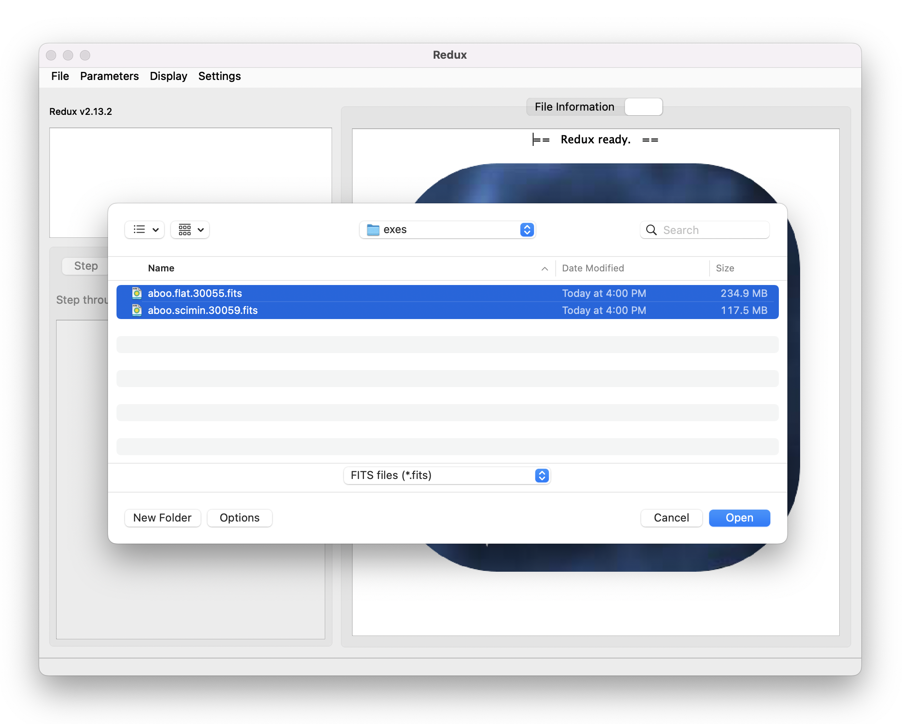
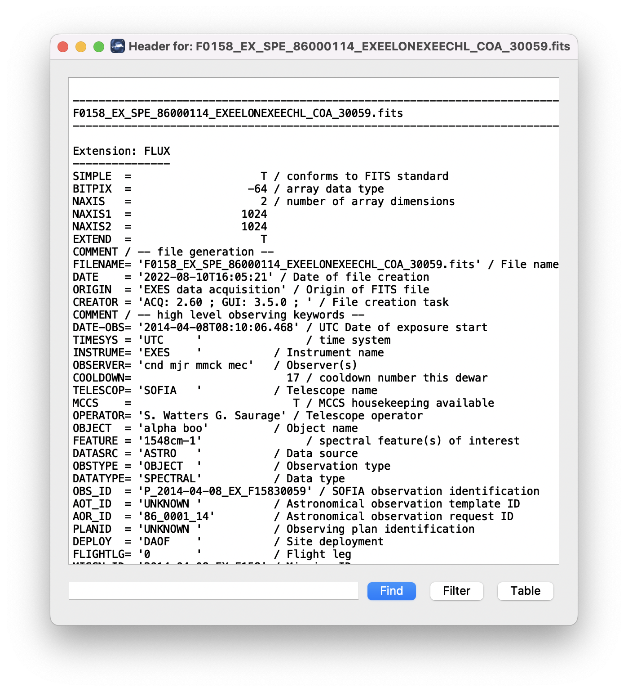
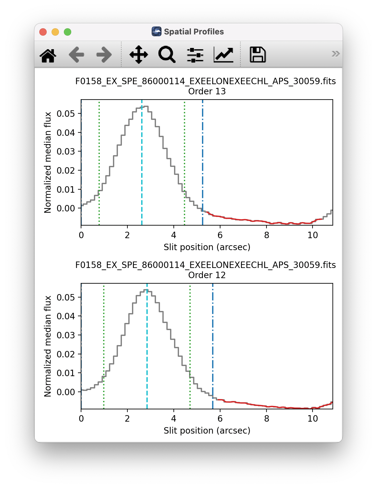
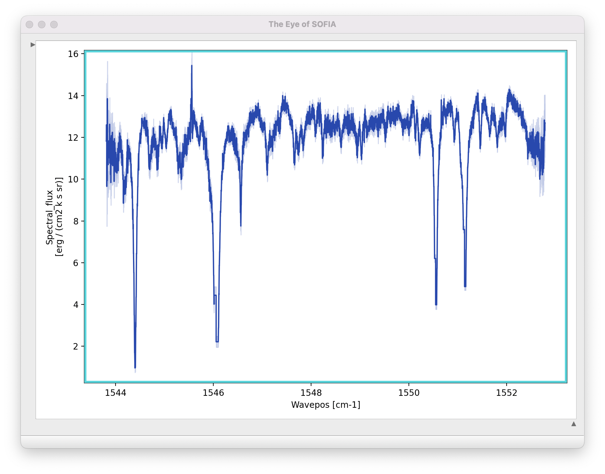
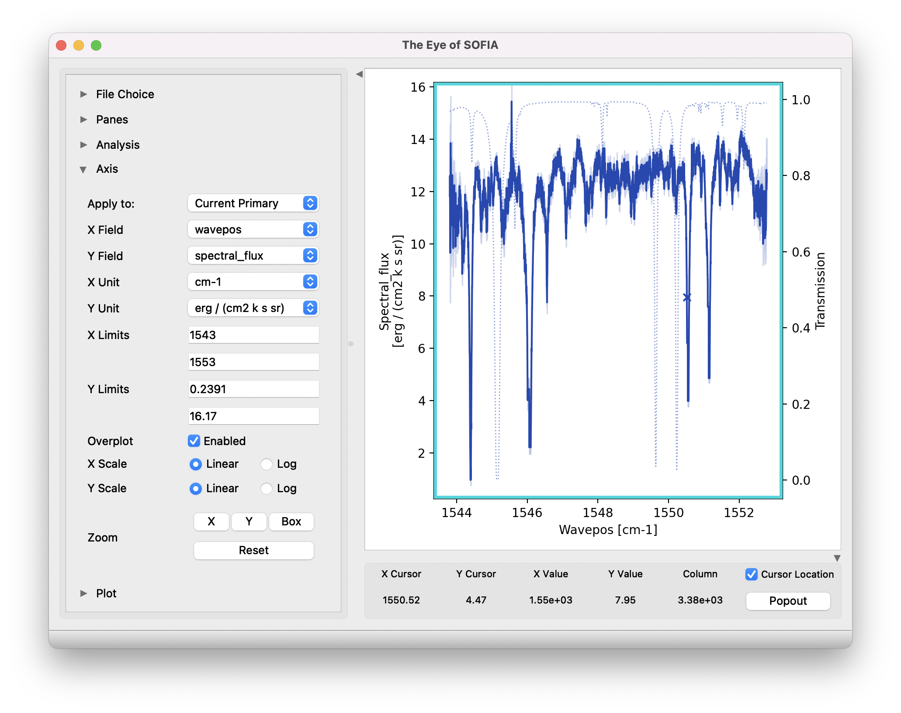

Grouping LEVEL_1 data for processing
====================================

For EXES spectroscopy modes, there are three kinds of data: darks, flats, and
sources. Flats and darks are required for all reductions, as they are used
to calibrate the data, correct for instrumental response, and identify
the edges of the slit. Dark frames should be taken near in time to the
flat frame.  Flat frames should have the same instrument
configuration, slit height, slit width, and grating angle as the science
observation. In order for separate science files to be
grouped together, these same conditions apply, and they should
additionally share a common target and be taken with the same nodding
mode.

These requirements translate into a set of FITS header keywords
that must match in order for a set of data to be usefully reduced
together: see the table below for a listing of these
keywords.  All match requirements apply to science targets; flat
exceptions are noted.

Note that data grouping must be carried out before the pipeline is run.
The pipeline expects all inputs to be reduced together as a single data
set.

.. table:: Grouping criteria
   :name: exes_group

   ====================== =============== ===================
   **Keyword**            **Datatype**    **Match Criterion**
   ====================== =============== ===================
   **INSTCFG**            STR             Exact
   **SPECTEL1**           STR             Exact
   **SPECTEL2**           STR             Exact
   **SLIT**               STR             Exact
   **ECHELLE**            FLT             Exact
   **SDEG**               FLT             Exact
   **WAVENO0**            FLT             Exact
   **MISSN-ID**           STR             Exact
   **ALTI_STA**           FLT             +/- 500
   **ALTI_END**           FLT             +/- 500
   **ZA_START**           FLT             +/- 2.5
   **ZA_END**             FLT             +/- 2.5
   **OBSTYPE**            STR             Exact (unless flat)
   **OBJECT**             STR             Exact (unless flat)
   **INSTMODE**           STR             Exact (unless flat)
   **PLANID**             STR             Exact (unless flat)
   **AOR-ID (optional)**  STR             Exact (unless flat)
   ====================== =============== ===================

Configuration and execution
===========================

Installation
------------

The EXES pipeline is written entirely in Python.  The pipeline is
platform independent and has been tested on Linux, Mac OS X, and Windows
operating systems.  Running the pipeline requires a minimum of 16GB RAM,
or equivalent-sized swap file.

The pipeline is comprised of five modules within the `sofia_redux` package:
`sofia_redux.instruments.exes`, `sofia_redux.pipeline`,
`sofia_redux.calibration`, `sofia_redux.spectroscopy`,
`sofia_redux.toolkit`, and `sofia_redux.visualization`.
The `exes` module provides the data processing
algorithms specific to EXES, with supporting libraries from the
`toolkit`, `calibration`, `spectroscopy`, and `visualization`
modules.  The `pipeline` module provides interactive and batch interfaces
to the pipeline algorithms.

External Requirements
~~~~~~~~~~~~~~~~~~~~~

To run the pipeline for any mode, Python 3.8 or
higher is required, as well as the following packages: numpy, scipy,
matplotlib, pandas, astropy, configobj, numba, bottleneck, joblib,
and photutils.
Some display functions for the graphical user interface (GUI)
additionally require the PyQt5, pyds9, and regions packages.
All required external packages are available to install via the
pip or conda package managers.  See the Anaconda environment file
(environment.yml), or the pip requirements file (requirements.txt)
distributed with `sofia_redux` for up-to-date version requirements.

Running the pipeline interactively also requires an installation of
SAO DS9 for FITS image display. See http://ds9.si.edu/ for download
and installation instructions.  The *ds9* executable
must be available in the PATH environment variable for the pyds9
interface to be able to find and control it.  Please note that pyds9
is not available on the Windows platform.

Source Code Installation
~~~~~~~~~~~~~~~~~~~~~~~~

The source code for the EXES pipeline maintained by the SOFIA Data
Processing Systems (DPS) team can be obtained directly from the
DPS, or from the external
`GitHub repository <https://github.com/SOFIA-USRA/sofia_redux>`__.
This repository contains all needed configuration
files, auxiliary files, and Python code to run the pipeline on EXES
data in any observation mode.

After obtaining the source code, install the package with
the command::

    python setup.py install

from the top-level directory.

Alternately, a development installation may be performed from inside the
directory with the command::

    pip install -e .

After installation, the top-level pipeline interface commands should
be available in the PATH.  Typing::

    redux

from the command line should launch the GUI interface, and::

    redux_pipe -h

should display a brief help message for the command line interface.

Configuration
-------------

For EXES algorithms, default parameter values are defined by the
Redux object that interfaces to them. These values may be overridden
manually for each step, while running in interactive mode. They may also
be overridden by an input parameter file, in INI format, in either
interactive or automatic mode. See Appendix A for an example of an input
parameter file, which contains the current defaults for all parameters.

Input data
----------

Redux takes as input raw EXES FITS data files, which are image cubes
composed of 1024 x 1024 pixel image arrays. The number of frames per raw
data cube depends on the readout mode used to acquire the data. The FITS
headers contain data acquisition and observation parameters and,
combined with the pipeline configuration files, comprise the information
necessary to complete all steps of the data reduction process. Some critical
keywords are required to be present in the raw data in order to perform a
successful grouping, reduction, and ingestion into the SOFIA archive.
See the header configuration file in Appendix B for a full list of these
keywords.

It is assumed that the input data have been successfully grouped before
beginning reduction: EXES Redux considers all input files in a reduction to
be part of a single homogeneous reduction group, to be reduced together
with the same parameters. At least one input flat file, either raw or
previously processed, is required to complete any reduction.

.. redux usage section

.. |ref_startup| replace:: :numref:`exes_startup`

.. |ref_open_new| replace:: :numref:`exes_open_new`

.. |ref_reduction_steps| replace:: :numref:`exes_reduction_steps`

.. |ref_parameters| replace:: :numref:`exes_parameters`

.. |ref_file_info| replace:: :numref:`exes_file_info`

.. |ref_data_view| replace:: :numref:`exes_data_view`

.. |ref_headers| replace:: :numref:`exes_headers`

.. include:: ../../../sofia_redux/pipeline/usage/startup.rst

.. figure:: images/startup.png
   :name: exes_startup
   :alt: Startup screen showing a white outline of an airplane with an open
         telescope door on a blue background showing faint spiral arms
         and stylized white stars overlaid.

   Redux GUI startup.

.. include:: ../../../sofia_redux/pipeline/usage/open.rst

   Open new reduction.

.. figure:: images/reduction_steps.png
   :name: exes_reduction_steps
   :alt: GUI window showing reduction steps with Edit and Run buttons.
         A log window is displayed with text messages from a reduction.

   Sample reduction steps. Log output from the pipeline is
   displayed in the **Log** tab.

.. include:: ../../../sofia_redux/pipeline/usage/params.rst

.. figure:: images/parameters.png
   :name: exes_parameters
   :alt: An Edit Parameters dialog window, showing various selection
         widgets.

   Sample parameter editor for a pipeline step.

.. include:: ../../../sofia_redux/pipeline/usage/info.rst

.. figure:: images/file_info.png
   :name: exes_file_info
   :alt: A table display showing filenames and FITS keyword values.

   File information table.

.. include:: ../../../sofia_redux/pipeline/usage/view.rst

.. figure:: images/data_view.png
   :name: exes_data_view
   :alt: Data viewer settings with various widgets and buttons to control
         display parameters and analysis tools.

   Data viewer settings and tools.

.. include:: ../../../sofia_redux/pipeline/usage/headers.rst

   QAD FITS header viewer.

EXES Reduction
--------------

EXES data reduction with Redux follows the data reduction flowchart
in :numref:`exes_flowchart`. At each step, Redux attempts to determine
automatically the correct action, given the input data and default
parameters, but each step can be customized as needed.

Image Processing
~~~~~~~~~~~~~~~~

The early steps of the EXES pipeline are straightforward: the 2D images
are processed to remove instrument and sky artifacts and calibrate to
physical units.  Their associated variances and reference data are propagated
alongside the modified image in intermediate data products.

Spectroscopic Processing
~~~~~~~~~~~~~~~~~~~~~~~~

Extraction Steps
^^^^^^^^^^^^^^^^

.. |ref_profile| replace:: :numref:`exes_profile_plot`

.. |ref_spectral| replace:: :numref:`exes_spectral_plot`

.. |ref_eye_controls| replace:: :numref:`exes_eye_controls_image`

Spectral extraction with Redux is slightly more complicated than
image processing. The pipeline breaks down the spectral extraction algorithms
into five separate reduction steps to give more control over the extraction
process. These steps are:

-  Make Profiles: Generate a smoothed model of the relative distribution
   of the flux across the slit (the spatial profile). After this step is
   run, a separate display window showing a plot of the spatial profile
   for each order appears.

-  Locate Apertures: Use the spatial profile to identify spectra to extract.
   By default for most configurations, Redux attempts to automatically
   identify sources, but they can also be manually identified by entering a
   guess position to fit near, or a fixed position, in the parameters.
   Aperture locations are plotted in the profile window.

-  Set Apertures: Identify the data to extract from the spatial profile.
   This is done automatically by default, but all aperture
   parameters can be overridden manually in the parameters for this
   step.  Aperture radii and background regions are plotted in the
   profile window (see |ref_profile|).

-  Subtract Background: Residual background is fit and removed for
   each column in the 2D image, using background regions specified
   in the Set Apertures step.

-  Extract Spectra: Extract one-dimensional spectra from the
   identified apertures. By default, Redux will attempt optimal extraction for
   most configurations. The method can be overridden in the parameters
   for this step.

EXES has a number of configurations for which either the source is too
extended or the slit is too short to treat the target as a compact source.
In particular, for high-low mode (unless nod-on-slit), for observations that
are marked as extended sources (SRCTYPE=EXTENDED\_SOURCE), or for sky spectra
the default parameters are modified to:

- turn off median level subtraction in the spatial profile generation

- place a single aperture position at the center of the slit

- set the aperture radius to extract the full slit

- turn off background subtraction

- use standard extraction instead of optimal.

These defaults may still be overridden in the parameters for each step.

Spectral Displays
^^^^^^^^^^^^^^^^^

.. include::  ../../forcast/users/spectral_display.rst

   Aperture location automatically identified and over-plotted
   on the spatial profile.  The cyan line indicates the aperture center.
   Green lines indicate the integration aperture for optimal extraction,
   dark blue lines indicate the PSF radius (the point at which the flux
   goes to zero), and red lines indicate background regions.

         vs. Spectral_flux (erg/cm2 k s sr).

   Final extracted spectrum, displayed in an interactive plot window.

         widgets to control the plot display.

   Control panels for the spectral viewer are located to the left and
   below the plot window.  Click the arrow icons to show or collapse
   them.

Useful Parameters
~~~~~~~~~~~~~~~~~

Some key parameters for all reduction steps are listed below.

In addition to the specified parameters, the output from each step may
be optionally saved by selecting the 'save' parameter.

-  **Load Data**:

   -  *Abort reduction for invalid headers*: By default, Redux will abort the
      reduction if the input header keywords do not meet requirements. Unset
      this option to attempt the reduction anyway.

   -  *Extract sky spectrum*: If set, the subsequent reduction will be
      treated as a sky extraction, for calibration purposes, rather than
      a science extraction.  This will set the dark subtraction option in
      the Subtract Nods step, the 'fix to center' option in Locate Apertures,
      'extract the full slit' option in Set Apertures, 'skip background
      subtraction' in Subtract Background, and extraction method: 'standard'
      in Extract Spectra.  All output filenames and product types at and after
      the Subtract Nods step will be modified (see :numref:`exes_prod`).

   -  *Central wavenumber*: If the central wavenumber is known more precisely
      than the value in the WAVENO0 keyword, enter it here to use it in
      the distortion correction calculations and wavelength calibration.
      This value will be filled in automatically at the end of a
      reduction, if the Refine Wavecal step modifies the central
      wavenumber, so that the reduction may be reset and re-run with the
      new parameter.

   -  *HR focal length*: This distortion parameter may be adjusted to
      tune the dispersion solution for cross-dispersed spectra. Reducing
      HRFL decreases the wavenumber of the left end of the order.

   -  *XD focal length*: This distortion parameter may be adjusted to
      tune the dispersion solution for long-slit spectra. Reducing XDFL
      decreases the wavenumber of the left end of the order for a
      correctly identified central wavenumber. This parameter may also
      be adjusted to tune the predicted spacing between orders in
      cross-dispersed mode. In this case, increasing XDFL increases the
      predicted spacing.

   -  *Slit rotation*: This distortion parameter may be adjusted to tune
      the slit skewing, to correct for spectral features that appear
      tilted across an order. For cross-dispersed modes, increasing the
      slit rotation angle rotates the lines clockwise in the undistorted
      image. For long-slit modes, decreasing the slit rotation angle
      rotates the lines clockwise in the undistorted image.

   -  *Detector rotation*: This parameter may be adjusted to change
      the detector rotation from the default value.

   -  *HRR*: This parameter may be adjusted to change the R number for
      the echelon grating.

   -  *Ambient temperature for the flat mirror*: Set to override the
      default ambient temperature for the flat mirror. Typical default is 290K.

   -  *Emissivity for the flat mirror*: Set to override the default
      emissivity fraction for the flat mirror. Typical default is 0.1.

-  **Coadd Readouts**:

   -  General Parameters

      -  *Readout algorithm*: Set the readout mode.  The default is
         'Last destructive only', indicating
         that only the final destructive read should be used, regardless of
         readout pattern.  'First/last' will use the first
         non-destructive read and the last destructive; 'Second/penultimate'
         will use the second and second-to-last frames.
         'Default for read mode' will attempt to choose the best read mode
         for the readout pattern used (typically Fowler mode).

      -  *Apply linear correction*: If set, a standard linearity correction
         will be applied.

      -  *Correct odd/even row gains*: If set, gain offsets between odd and
         even rows will be fit and removed.

   - Integration Handling Parameters

      -  *Science files: toss first integrations*:
         If set to 0, all integration sets will be used.
         If set to 1 or 2, that many integrations will be discarded from the
         beginning of the raw input science files.

      -  *Flat files: toss first integrations*:
         If set to 0, all integration sets will be used.
         If set to 1 or 2, that many integrations will be discarded from the
         beginning of the raw input flat files.

      -  *Dark files: toss first integrations*:
         If set to 0, all integration sets will be used.
         If set to 1 or 2, that many integrations will be discarded from the
         beginning of the raw input dark files.

      -  *Copy integrations instead of tossing*: If set, "tossed" integrations
         will be replaced with frames from the next B nod instead of discarded.

-  **Make Flat**:

   -  General Parameters

      -  *Save flat as separate file*: The standard output from this step is the
         science files with flat planes attached.  If this option is set,
         the flat information is additionally saved to a separate FITS file.
         This flat file may be used in place of raw flat files for future
         data reductions with the same instrument configuration.

   -  Order Edge Determination Parameters

      -  *Threshold factor*: This value defines the illumination threshold
         for a flat, which determines where the edges of cross-dispersed
         orders are placed. Enter a number between 0 and 1. If the pipeline
         reports that it can not determine order edges, increasing the
         threshold slightly, to widen the gaps between orders, may help.

      -  *Optimize rotation angle*: Unset this option to prevent the
         pipeline from using the 2D FFT of the edge-enhanced flat to try to
         determine the best rotation angle (*krot*).

      -  *Edge enhancement method*: Depending on the noise and illumination
         characteristics of the input flat, it may work better to take the
         2D FFT of the squared derivative or the Sobel filtered image,
         rather than the derivative, of the flat. Use the drop-list to
         select an alternate algorithm.

      -  *Starting rotation angle*: Enter a number here to use as the
         starting value for *krot*. If not set, the starting value will be
         taken from the default parameters in configuration tables.

      -  *Predicted spacing*: Enter a value here, in pixels, to use as the
         predicted spacing for cross-dispersed orders. This number will be
         used as a first guess for the spacing parameter in the fit to the
         2D FFT, overriding the value calculated from header parameters.

   - Order Edge Override Parameters

      -  *Bottom pixel for undistorted order*: For medium and low configurations,
         specifying a value here sets the bottom edge of the order mask to
         this value.

      -  *Top pixel for undistorted order*: Sets the top edge of the order mask
         to this value (medium and low only).

      -  *Starting pixel for undistorted order*: Sets the left edge of
         all orders in the order mask to this value.

      -  *Ending pixel for undistorted order*: Sets the right edges of
         all orders in the order mask to this value.

      -  *Custom cross-dispersed order mask*: Select a file to directly define
         cross-dispersed order edges (bottom, top, start, and end).  There
         should be one line for each order with edge values specified as
         white-space separated integers (B T S E), starting with the top-most
         order (largest B/T). Values are post-distortion correction and rotation,
         so that B/T are y values and S/E are x values, zero-indexed.

-  **Despike**:

   -  *Combine all files before despike*: If set, all planes from all files
      will be combined into a single file before computing outlier statistics.
      Input data will be treated as a single file for all subsequent steps.

   -  *Ignore beam designation*: If set, all frames are used for computing
      outlier statistics, rather than comparing A nods and B nods separately.

   -  *Spike factor*: Enter a value for the threshold for a pixel to be
      considered a spike. This value is multiplied by the standard
      deviation of the pixel across all frames: e.g. a value of 20 marks
      pixels with values over 20 sigma as bad pixels.

   -  *Mark trashed frames for exclusion*: If set, frames that
      have significantly more noise compared to the rest will be identified
      and excluded from future processing. These frames will not be
      spike-corrected.

   -  *Propagate NaN values*: If set, spiky pixels will be replaced with NaN
      values.  If not, they will be replaced with the average value from the
      remaining frames.

-  **Debounce**:

   -  *Bounce factor*: Enter a number to use as the amplitude of the
      bounce correction. A value of 0 means no bounce correction will be
      applied. Values greater than 0 apply the first derivative bounce
      (shifting) only. Values less than 0 also apply the second
      derivative bounce (smoothing). Typical nonzero values are 0.1 or
      -0.1.

   -  *Spectral direction* If set, the bounce correction will be applied
      in the spectral direction instead of the spatial direction.

-  **Subtract Nods**:

   -  *Skip nod subtraction*: If set, this option will cause the
      pipeline to continue without performing nod-subtraction. This
      option may be used to extract reference sky spectra.

   -  *Subtract residual sky*: This option applies only to nod-off-slit
      mode. If set, it will attempt to remove any residual sky
      signal before subtracting pairs. This option will remove any
      average continuum value along the slit; if this is not desired,
      background regions should be set at the time of extraction instead.

   -  *Dark subtraction*: If set, nod subtraction will be skipped and
      a dark frame will be subtracted from all planes instead.  The
      dark file must have been loaded into the reduction with the raw
      data or attached to an input processed flat.  If no dark is available,
      the step will fall back to skipping nod subtraction. This option may
      produce cleaner reference sky spectra than simply skipping nod
      subtraction.

-  **Flat Correct**:

   -  *Skip flat correction*: If set, the data will not be multiplied by
      the flat.  This option is primarily used for testing.

-  **Clean Bad Pixels**:

   -  *Bad pixel threshold*: Enter a value for the threshold for a pixel
      to be considered a bad pixel. This value is multiplied by the
      standard deviation of all good pixels in the frame.

   -  *Propagate NaN values*: If set, bad pixels are replaced with NaN and
      ignored in future processing steps.  If not set, bad pixels are
      interpolated over.

-  **Undistort**:

   -  *Interpolation method*: Two interpolation methods are available for
      performing the distortion correction.  'Cubic convolution' replicates
      the behavior of the IDL interpolate function in the original pipeline,
      implementing a 2D separable parametric cubic convolution, with the
      edge-preserving parameter alpha set to -0.5 to mimic sinc interpolation.
      'Piecewise spline' implements polynomial spline interpolation of
      specified order; cubic by default.

   -  *Spline order*: Sets the polynomial order for piecewise spline
      interpolation.  May be 0-5, where 0 is nearest value, 1 is linear,
      and 3 is cubic interpolation.

   -  *Set unilluminated pixels to NaN*: If set, unilluminated areas of the
      flat field and order edges are set to NaN.

-  **Correct Calibration**:

   -  *Skip calibration correction*: If set, no calibration correction will
      be performed.  This option is primarily used for testing.

-  **Coadd Pairs**:

   -  *Save modified frames before coadd*: If set, modified input data
      is saved to disk for inspection, prior to coadding.  The output
      FITS file has file code COI and PRODTYPE = 'coadd_input'.

   -  *Subtract residual sky*: If set, the mean value at each wavelength
      bin will be subtracted to remove any residual sky noise. This option
      applies only to nod-on-slit mode.

   -  *Shift before coadd*: Set to attempt to shift spectra in the
      spatial direction to align with each other before coadding.

   -  *Shift method*: Select whether to maximize the signal or the
      signal-to-noise when determining the spatial shift.

   -  *Skip coadd*: Check to skip coadding images and instead extract
      separate spectra from each frame. If selected, each frame will be
      treated as a separate file after this step. For map mode, coadding
      is skipped by default.

   -  *Coadd all files*: If set, all input files will be coadded together,
      as if they were in a single file.

   -  *Exclude pairs*: Enter comma-separated numbers to identify
      specific nod-subtracted frames to exclude from the coadd. For
      example, entering *1,4,7* will exclude the first, fourth, and
      seventh frame from the coadd. If multiple files are loaded, lists
      for each file may be entered, separated by a semi-colon. For
      example, *1,4;;3,10* will exclude the first and fourth frames for
      the first file and the third and tenth for the third file.

   -  *Robust threshold*: Set to a number greater than zero to enable
      outlier rejection before coadding.  The threshold value is the
      number of standard deviations away from the median for which a value
      is rejected.

   -  *Weighting method*: Set to 'uniform weights' to use equal
      weights for all input frames.  Otherwise, select 'weight by flat'
      to weight frames, using the flat illumination to determine good data,
      or 'weight by variance' to use the variance plane to identify good data.

   -  *Override weights*: Enter comma-separated numbers to directly
      specify weight values for each input frame. Separate lists for
      multiple files with a semi-colon. If provided, the weighting method
      parameter is ignored.

-  **Convert units**:

   -  *Skip unit conversion*: If set, no flux unit conversion will
      be performed.  This option is primarily used for testing.

   -  *Additional calibration scaling*: If provided, this factor is multiplied
      into all flux extensions, for additional a priori calibration correction
      to the flux scale.  This may be used to account for any known
      multiplicative systematic effects.

   -  *Additional calibration offset*: If provided, this factor is added
      into all flux extensions after scaling, for additional a priori
      calibration correction to the flux zero level.  This may be used to
      account for any known additive systematic effects.

-  **Make Profiles**:

   -  *Row fit order*: Typically a fourth-order polynomial fit is used
      to calculate the smooth spatial profile. Occasionally, a higher or
      lower order fit may give better results.

   -  *Subtract median background*: If set, the median level of the
      smoothed spatial profile will be subtracted to remove residual
      background from the total extracted flux.
      This option is off by default for some modes (e.g. high-low data, sky spectra).
      For other data, this option is appropriate as long as the slit is
      dominated by background, rather than source flux. If the spatial profile
      dips below zero at any point (other than for a negative spectrum), this
      option should be deselected.

-  **Locate Apertures**

   -  *Aperture location method*: If 'auto', the strongest Gaussian peak(s) in the
      spatial profile will be selected, with an optional starting guess
      (*Aperture position*, below).  If 'fix to input', the value in the
      *Aperture position* parameter will be used without refinement.
      If 'fix to center', the center of the slit will be used.  'Fix to center'
      is default for some modes (high-low data,sky spectra); otherwise 'auto' is default.

   -  *Number of auto apertures*: Set this parameter
      to 1 to automatically find the single brightest source, or 2 to find the
      two brightest sources, etc. Sources may be positive or negative.

   -  *Aperture position*: Enter a guess value for the aperture to use as a
      starting point for method = 'auto', or a fixed value to use as the
      aperture center for method = 'fix to input'. Values are in arcseconds
      up the slit (refer to the spatial profile). Separate multiple
      apertures for a single file by commas;
      separate values for multiple files by semi-colons. For example,
      *3,8;2,7* will look for two apertures in each of two files, near
      3" and 8" in the first image and 2" and 7" in the second image. If
      there are multiple files loaded, but only one aperture list is
      given, the aperture parameters will be used for all images.

   -  *Expected aperture FWHM (arcsec)*: Gaussian FWHM estimate for spatial
      profile fits, to determine peaks.

   -  *Exclude orders*: Enter comma-separated numbers to identify
      specific orders to exclude from spectral extraction.

-  **Set Apertures**:

   -  *Extract the full slit*: If set, all other parameters are ignored,
      and the PSF radius will be set to include the full slit.

   -  *Refit apertures for FWHM*: The spatial FWHM for the aperture is used
      to determine the aperture and PSF radii, unless they are directly
      specified.  If this parameter is set, the profile will be re-fit with
      a Gaussian to determine the FWHM.  If it is not set, the value
      determined or set in the Locate Apertures step is used (stored
      as APFWHM01 in the FITS header).

   -  *Aperture sign*: Enter either 1 or -1 to skip the
      automatic determination of the aperture sign from the spatial
      profile. If the value is -1, the spectrum will be multiplied by
      -1. Separate multiple apertures by commas; separate values for
      multiple files by semi-colons. If a single value is specified,
      it will be applied to all apertures.

   -  *Aperture radius*: Enter a radius in arcsec to skip the
      automatic determination of the aperture radius from the profile
      FWHM. Separate multiple apertures by commas; separate values for
      multiple files by semi-colons. If a single value is specified,
      it will be applied to all apertures.

   -  *PSF radius*: Enter a radius in arcsec to skip the
      automatic determination of the PSF radius from the profile
      FWHM. Separate multiple apertures by commas; separate values for
      multiple files by semi-colons. If a single value is specified,
      it will be applied to all apertures.

   -  *Background regions*: Enter a range in arcsec to use as the
      background region, skipping automatic background determination.
      For example, *0-1,8-10* will use the regions
      between 0" and 1" and between 8" and 10" to determine the
      background level to subtract in extraction. Values are for the
      full image, rather than for a particular aperture.  Separate
      values for multiple files with semi-colons.

   -  *Override aperture start*: Enter an aperture start location in arcsec.
      If set, and aperture end is also specified, this parameter overrides
      all other settings, including the starting aperture position.

   -  *Override aperture end*: Enter an aperture end location in arcsec.
      If set, and aperture start is also specified, this parameter overrides
      all other settings, including the starting aperture position.

-  **Subtract Background**

   -  *Skip background subtraction*: Set to skip calculating and removing
      residual background. If no background regions were set, background
      subtraction will be automatically skipped.

   -  *Background fit order*: Set to a number greater than or equal to
      zero for the polynomial order of the fit to the background
      regions.

   -  *Bad pixel threshold*: Set to a value greater than or equal to zero
      to modify the robust threshold in the background fit.

-  **Extract Spectra**

   -  *Save extracted 1D spectra*: If set, the extracted spectra will
      be saved to disk in Spextool format (file code SPC,
      PRODTYPE = spectra\_1d).

   -  *Extraction method*: The default is to use
      standard extraction for EXTENDED_SOURCE, high-low data, and sky spectra;
      optimal extraction otherwise. Standard extraction may be necessary for
      some faint sources.

   -  *Use median profile instead of spatial map*: By default, the pipeline uses a
      wavelength-dependent spatial map for extraction, but this
      method may give poor results if the signal-to-noise
      in the profile is low. Set this option to use the median spatial
      profile across all wavelengths instead.

   -  *Use spatial profile to fix bad pixels*: The pipeline usually
      uses the spatial profile to attempt to interpolate over bad pixels during
      standard extraction, and in the output 2D image for either extraction
      method. Occasionally, this may result in a failed extraction.
      Unset this options to extract the spectra without bad pixel correction.

   -  *Bad pixel threshold*: Enter a value for the threshold for a pixel
      to be considered a bad pixel. This value is multiplied by the
      standard deviation of all good pixels in the aperture at each
      wavelength bin.

   -  *ATRAN directory*: This parameter specifies the location of a
      library of ATRAN FITS files to use.  If blank or set to a directory
      that does not exist, the default files provided with the pipeline
      will be used.

   -  *ATRAN file*: This parameter is used to directly override the ATRAN data
      to attach to the output spectrum, for reference. If blank, the default ATRAN
      file on disk will be used. Set to a valid FITS file path to override the
      default ATRAN file with a new one.

-  **Combine Spectra**:

   -  General Parameters

      -  *Combination method*: Mean is the default for all data; median
         may also be useful for some input data.

      -  *Weight by errors*: If set, the average of the data will be
         weighted by the errors. Ignored for method=median.

   -  1-2D Combination Parameters

      -  *Combine apertures*: If unset, spectra from separate files
         will be combined, but separate apertures will remain separate in
         the output file.

      -  *Robust combination*: If set, data will be sigma-clipped before
         combination for mean or median methods.

      -  *Outlier rejection threshold (sigma)*: The sigma-clipping threshold
         for robust combination methods, in units of sigma (standard deviation).

      -  *Maximum sigma-clipping iterations*: The maximum number of rounds to
         use in outlier rejection.

-  **Refine Wavecal**:

   -  *Order number for identified line*: Enter an integer order number
      containing the identified spectral feature.

   -  *Identify line*: Enter the pixel position of the spectral feature
      to use for refining the calibration.

   -  *Identify wavenumber*: Enter the calibrated wavenumber of the identified
      spectral feature.

-  **Merge Orders**:

   -  General Parameters

      -  *ATRAN directory*: This parameter specifies the location of a
         library of ATRAN FITS files to use.  If blank or set to a directory
         that does not exist, the default files provided with the pipeline
         will be used.

      -  *ATRAN file*: This parameter is used to directly override the ATRAN file
         to attach to the output spectrum, for reference. If blank, the default ATRAN
         file on disk will be used. Set to a valid FITS file path to override the
         default ATRAN file with a new one.

   -  Trimming Parameters

      -  *Regions to trim before merge*: Specified regions will be set to NaN
         before merging. Specify as semi-colon separated lists of order number :
         wavenumber regions. For example, "1:780-785,786-787;2:801.5-802.3" will
         trim 2 regions from order 1 and 1 region from order 2.

   -  Merging Parameters

      -  *Selection threshold*: By default, pixels in overlapping regions
         are used if their signal-to-noise ratio is greater than 0.1 times
         the maximum signal-to-noise in the order. Increasing or decreasing
         this value may reduce artifacts like discontinuous jumps or
         excessively noisy overlap regions.  Set to 0 to turn off.

      -  *S/N statistic to compare*: Sets the signal-to-noise statistic
         for use in rejecting pixels in overlapping regions.  Default is
         'max'; 'mean' or 'median' may give more robust results in some cases.

      -  *Apply selection threshold to noise only*: If set, the S/N statistic
         is computed from 1/noise only. This may be useful if there are
         large outliers in signal with low computed noise.

      -  *Use local standard deviation for noise thresholding*: If set, the
         input error spectrum is ignored and a sliding standard deviation
         calculation is used in its place for S/N thresholding.

      -  *Radius for local standard deviation*: Sets the window size for the
         sliding standard deviation calculation, in pixels.

-  **Make Spectral Map**

   -  *Normalize spectrum before plotting*: If set, the spectrum will be
      divided by its median value.

   -  *Flux scale for plot*: Specify a low and high percentile value
      for the spectral flux scale, e.g. [0,99].  If set to [0, 100],
      Matplotlib defaults are used.

   -  *Fraction of outer wavelengths to ignore*:  Used to block edge effects
      for noisy spectral orders. Set to 0 to include all wavelengths in
      the plot.

   -  *Overplot transmission*: If set, the atmospheric transmission spectrum
      will be displayed in the spectral plot.

   -  *Overplot error range*: If set, the error spectrum is plotted as a
      range overlay.

   -  *Color map*: Color map for the spectral plot colors.  Any valid Matplotlib
      color map name may be specified.

   -  *Overplot color*: Color for the transmission spectrum over plot.
      Any valid Matplotlib color value may be specified.

   -  *Watermark text*: If set to a non-empty string, the text will be
      added to the lower-right of the image as a semi-transparent watermark.

Data quality assessment
=======================

After the pipeline has been run on a set of input data, the output
products should be checked to ensure that the data has been properly
reduced:

-  Check the output to the terminal or the log for warnings or
   errors. Non-fatal warnings will be prepended with the string
   *WARNING*. Fatal errors will be prepended with the string *ERROR*.

-  Check that the expected files were written to disk: there should, at
   a minimum, be a coadded 2D image (*COA*) and an extracted spectrum
   (*MRD)*.

-  Look at the reduced image. Check that the distortion correction
   appears to have been calculated and applied correctly: order edges
   and spectral lines should appear to be aligned with the image columns
   and rows. If they are not, there may be a problem with the flat or
   with the optical parameters used.

-  Look at the intermediate extracted spectra in the spectral viewer. The spectra
   from positive and negative apertures should look similar. Spectra
   from separate observations of the same source in the same mode should
   look similar.

-  Compare the signal-to-noise in the extracted spectrum to the reduced
   image. If the target seems bright in the reduced image, but the
   spectrum looks noisy, it may be that the aperture centers were not
   defined correctly.

-  Check the aperture parameters recorded in the pipeline output and in
   the output file headers. The calculated aperture and PSF radii should
   have similar values for all apertures. The aperture centers for each
   order should also be similar in cross-dispersed spectra.

-  Check the extracted spectra for excessive outliers. Most bad pixels
   should be removed in the extraction process. If they are not, it may
   be helpful to use the median spatial profile, set the bad pixel
   threshold lower, or manually trim noisy regions.

Appendix A: Sample configuration file
=====================================

Below is a sample EXES Redux parameter override file in INI format.
If present, the parameter value overrides the default defined by the EXES
reduction object. If not present, the default value will be used.

.. include:: include/redux_param.cfg
   :literal:

.. raw:: latex

    \clearpage

Appendix B: Required Header Keywords
====================================

Sample EXES configuration file, typically located in
*sofia_redux/instruments/exes/data/header/headerdef.dat*. Values marked with
a Y in the *reqd?* column are keywords required to be present in input data.
They must meet the type and range requirements listed for grouping and data
reduction to be successful.

.. include:: include/headerdef.dat
   :literal:

.. raw:: latex

    \clearpage
