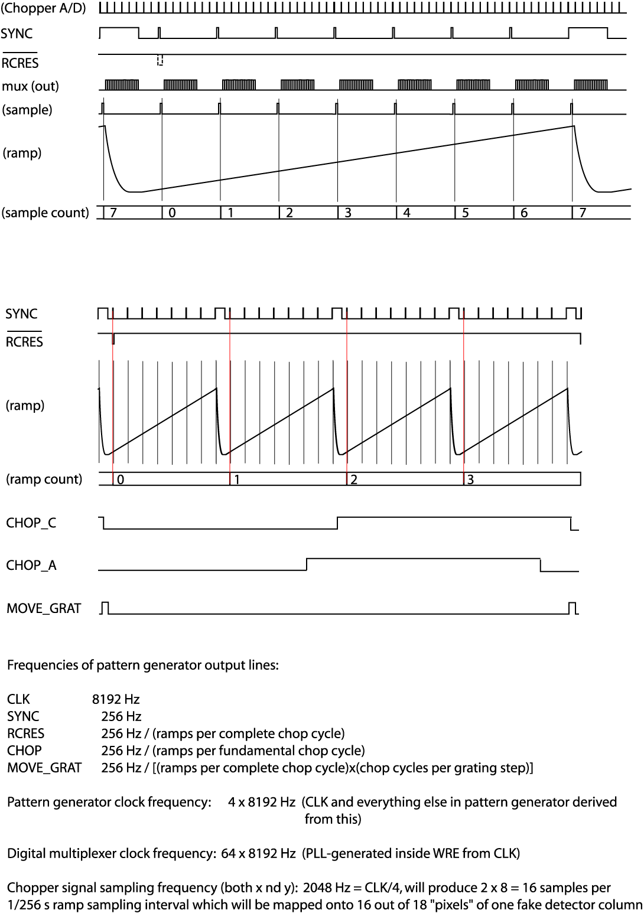
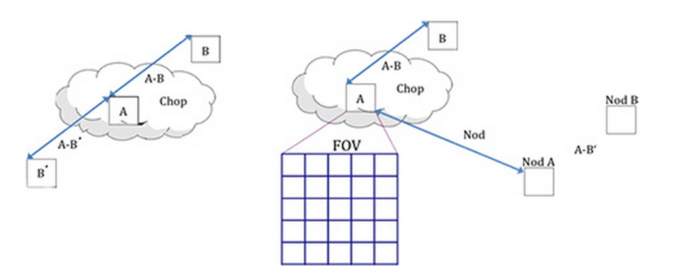
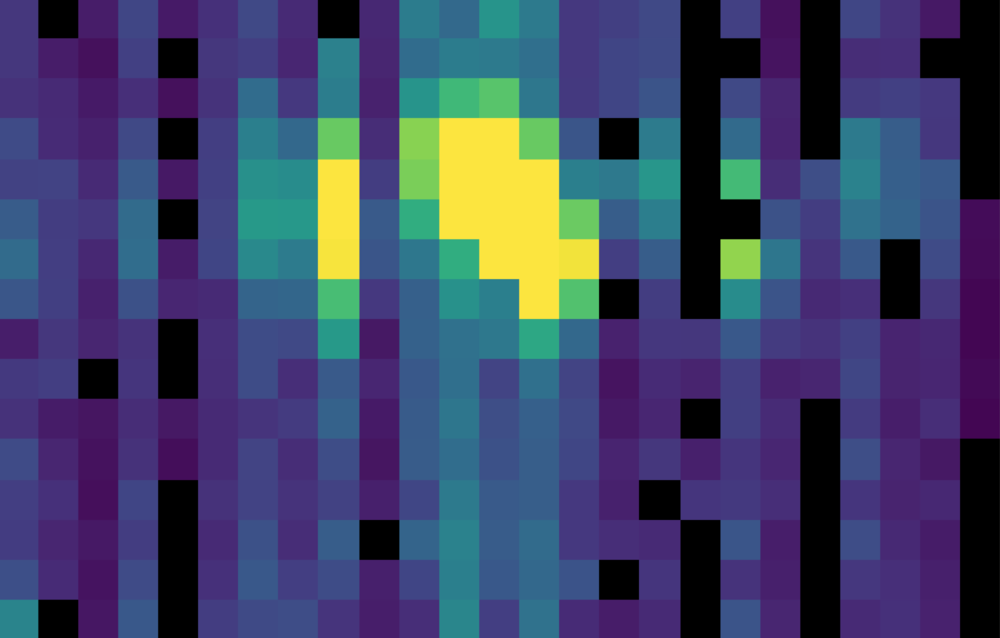
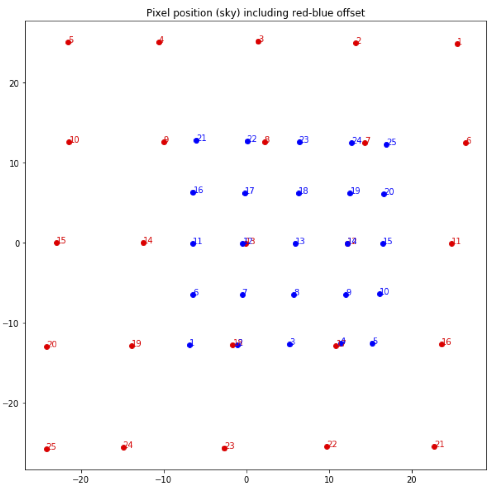
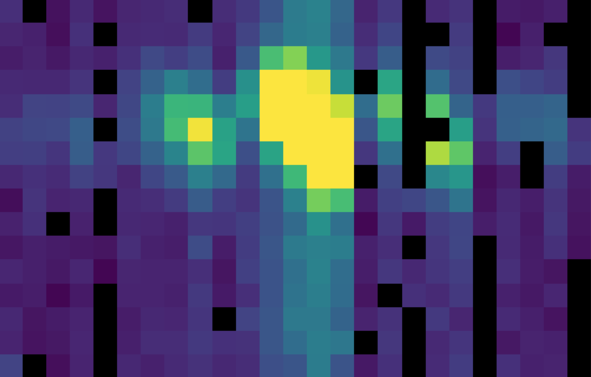
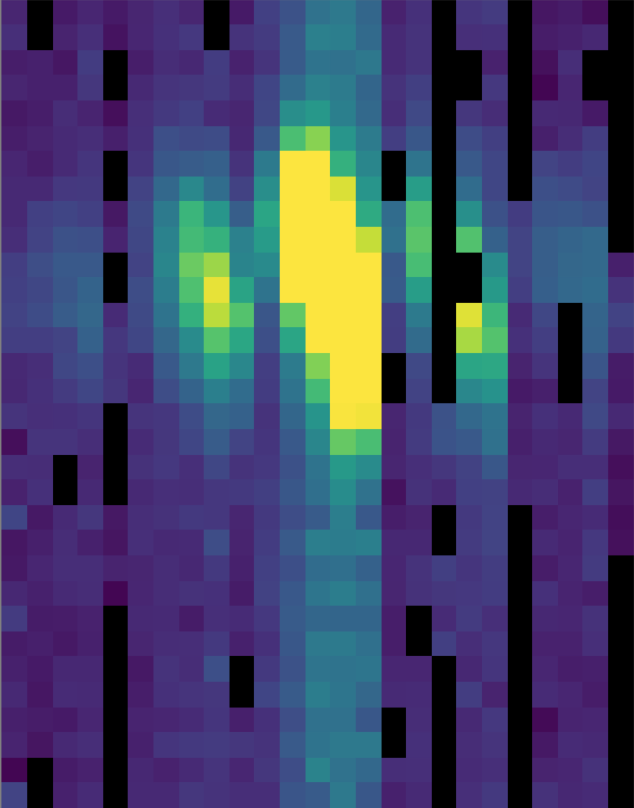
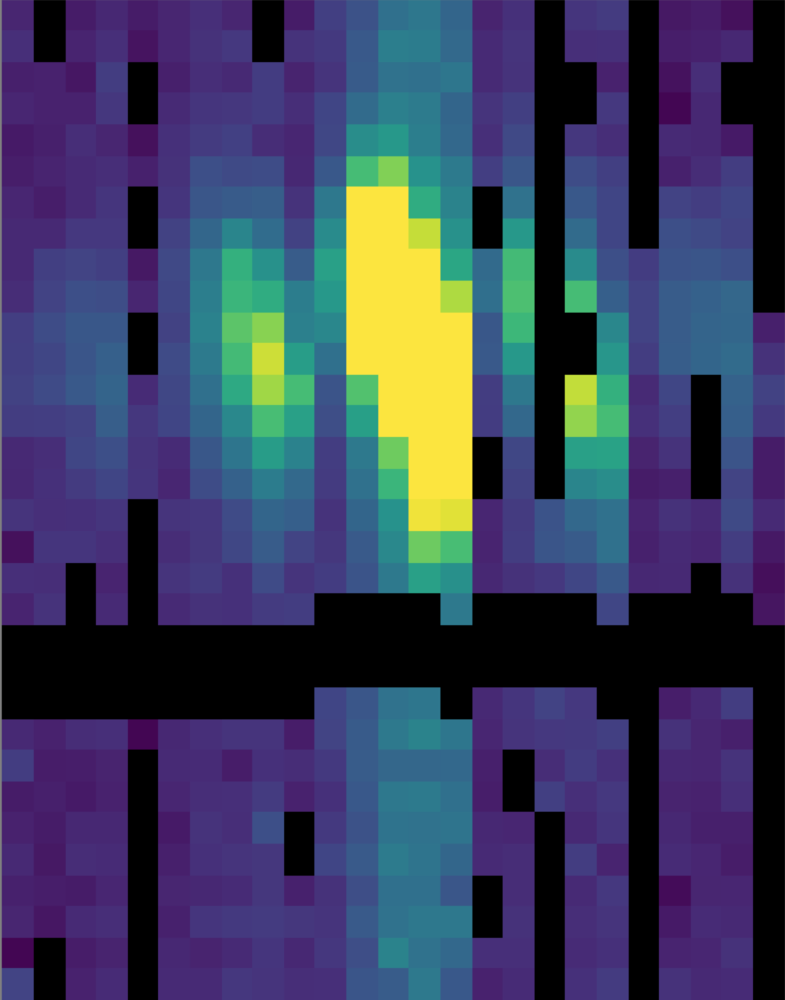
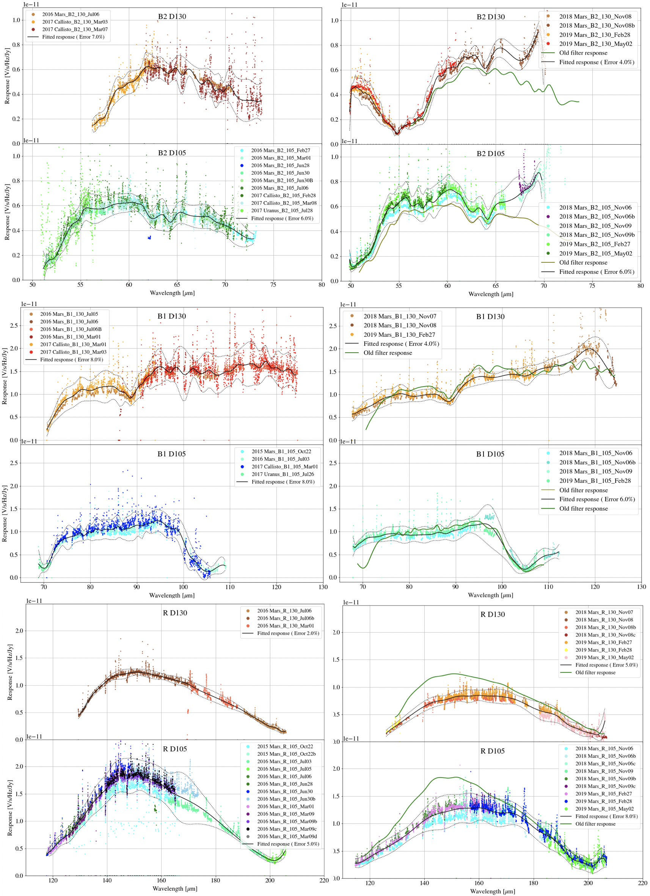

SI Observing Modes Supported
============================

FIFI-LS Instrument Information
------------------------------

FIFI-LS has two separate and independent grating spectrometers with
common fore-optics feeding two large Ge:Ga detector arrays (16 x 25
pixels each). The wavelength ranges of the two spectral channels are 42
- 110 microns and 110 - 210 microns, referred to as the BLUE and RED
channels, respectively.

.. figure:: images/fifi_ifu_by_channel.png
   :alt: IFU by channel
   :name: fifi_ifu_by_channel

   The integral field unit for each channel

Multiplexing takes place both spectrally and spatially. An image slicer
redistributes 5 x 5 pixel spatial fields-of-view (approximately
diffraction-limited in each wave band) along the 1 x 25 pixel entrance
slits of the spectrometers. Anamorphic collimator mirrors help keep the
spectrometer compact in the cross-dispersion direction. The spectrally
dispersed images of the slits are anamorphically projected onto the
detector arrays, to independently match spectral and spatial resolution
to detector size, thus enabling instantaneous coverage over a velocity
range of ~ 1500 to 3000 km/s around selected FIR spectral lines, for
each of the 25 spatial pixels ("spaxels").

The detectors are read out with integrating amplifiers: at each pixel a
current proportional to the incident flux charges a capacitor. The
resulting voltage is sampled at about 256Hz. After a certain number of
read-outs (the ramp length), the capacitors are reset to prevent
saturation. Thus, the data consist of linearly rising ramps for which
the slope is proportional to the flux. See :numref:`fifi_readout_sequence`
for an illustration of the read-out sequence.

   FIFI-LS readout sequence

FIFI-LS Observing Modes
-----------------------

Symmetric chop mode, also known as nod-match-chop mode, is the most
common observing mode. In this mode, the telescope chops
symmetrically to its optical axis, with a matched telescope nod to
remove background. A typical observation sequence will cycle through the
A nod position and the B nod position in an ABBA pattern.

Most observations will be taken using symmetric chop mode. However, if
the object is very bright, the efficiency is improved by observing in an
asymmetric chopping mode. This mode typically consists of two map
positions and one off-position per nod-cycle (an AAB pattern, where the
B position contains only empty sky). Asymmetric chopping may also be
used if an object's size requires a larger chop throw than is possible
with symmetric chopping.

   The geometry of chopping and nodding in the symmetric chop
   mode (left) and the asymmetric mode (right).

Occasionally, for very bright targets, it may be advantageous to take
data with no chopping at all. This mode, called total power mode, may be
taken with either symmetric or asymmetric nodding for sky subtraction,
or with no nods at all.

For extended targets, total power observations may also be taken
in on-the-fly (OTF) scanning mode.  In this mode, the telescope is
continuously scanned across the target, at a speed calculated for minimal
smearing within a single ramp.  Each ramp is then treated as if it were
a separate observation (A nod), with its own position coordinates.
The sky position (B nod) may be observed separately, before or after the
OTF scan, similar to the asymmetric nodding method.  The sky position is
not scanned.

At each chop and nod position (on- and off-position), it is common to
step the grating through a number of positions before each telescope move.
These additional grating scans effectively increase the wavelength
coverage of the observation.  Note, however, that grating scans are not
used with the OTF mode, due to the continuous telescope motion.

Algorithm Description
=====================

Overview of Data Reduction Steps
--------------------------------

This section will describe, in general terms, the major algorithms used
to reduce a FIFI-LS observation. See :numref:`fifi_flowchart` for a flow chart
showing how these algorithms fit together.

.. figure:: images/fifi_flowchart.png
   :alt: Reduction flowchart
   :name: fifi_flowchart

   Processing steps for FIFI-LS data. The blue box describes an
   overview of the steps and the white box contains the actual steps
   carried out.

Reduction Algorithms
--------------------

The following subsections detail each of the data reduction pipeline
steps outlined in the flowchart above.

Split Grating and Chop
~~~~~~~~~~~~~~~~~~~~~~

A single FIFI-LS raw FITS file contains the data from both chop
positions (on and off) for each grating step used in a single nod
position. FIFI-LS records its grating positions in "inductosyn" units.
These are long integer values that are used to convert the data to a
micron scale in the wavelength calibrate step.

The raw FIFI-LS data consist of a header (metadata describing the
observation) and a table of voltage readings from the detector pixels.
Each data section contains one frame, i.e. simultaneous readouts of all
detector pixels and grating values.

The data header is sent before each frame. The following 8 unsigned
16-bit words contain the header information.

-  Word 0: The word #8000 marks the start of the header.

-  Word 1: The low word of the 32-bit frame counter.

-  Word 2: The high word of the 32-bit frame counter.

-  Word 3: The flag word. Bit 0 is the chopper signal. Bit 1 is the
   detector (0=red, 1=blue). Unused bits are fixed to 1 to recognize
   this flag word.

-  Word 4: The sample count as defined in the timing diagrams (see
   :numref:`fifi_readout_sequence`). This count gets advanced at every sync pulse and
   reset at every long sync pulse.

-  Word 5: The ramp count as defined in the timing diagrams. This
   counter gets advanced with a long sync pulse and reset by RCRES.

-  Word 6: The scan index

-  Word 7: A spare word (for now used as "end of header": #7FFF).

Only columns 3, 4, and 5 are used in the split grating/chop step. The
following shows example header values for a raw RED FIFI-LS file::

    columns:
      0     1     2     3     4     5     6     7
    -----------------------------------------------
    32768 28160  15     1     0     0    89   32767
    32768 28161  15     1     1     0    89   32767
    32768 28162  15     1     2     0    89   32767
    32768 28163  15     1     3     0    89   32767
    32768 28164  15     1     4     0    89   32767
    32768 28165  15     1     5     0    89   32767
    32768 28166  15     1     6     0    89   32767
    32768 28167  15     1     7     0    89   32767
    32768 28168  15     1     8     0    89   32767
    32768 28169  15     1     9     0    89   32767
    32768 28170  15     1    10     0    89   32767
    32768 28171  15     1    11     0    89   32767
    ...

Column 3 is all ones, indicating that the data is for the RED
channel, column 4 counts the readouts from 0 to 31, and
column 5 indicates the ramp number.

Where each chop and grating position starts and stops in the raw data
table is determined using the header keywords RAMPLN\_[B,R],
C\_CYC\_[B,R], C\_CHOPLN, G\_PSUP\_[B,R], G\_PSDN\_[B,R] keywords. A RED
data example is as follows::

    RAMPLN_R= 32 / number of readouts per red ramp
    C_CHOPLN= 64 / number of readouts per chop position
    G_PSUP_R= 5  / number of grating position up in one cycle
    G_PSDN_R= 0  / number of grating position down in one cycle

Here, C\_CHOPLN / RAMPLN\_R is 64 / 32 = 2; therefore, there are 2 ramps
per chop.

Each chop switch index is determined using the 5\ :sup:`th` column in
the header. It is chop 0 if the value is odd and chop 1 if the value is
even. Grating scan information determines how that chop phase is split
up into separate extensions using the following formula:

.. math:: binsize = (nreadout * ramplength) / (nstep * choplength)

where *nreadout* is the total number of readouts (frames) in the file,
*ramplength* is determined by the appropriate RAMPLN keyword, *nstep* is
the number of grating steps (G\_PSDN + G\_PSUP), and *choplength* is the
number of readouts per chop position (C\_CHOPLN).

The binary data section is comprised of 468 signed 16-bit words: one
each for 25 spaxels, plus one control value, times 18 spectral channels
("spexels"). The spaxels are read out one spectral channel at a time.
Spectral channel zero of all 25 pixels are read out, and then a grating
value (analog readout from the grating mechanism) is recorded; then the
next channel of all the pixels is read out, and then the next grating
value, and so on, through all the spectral channels. The grating values
may be during pipeline processing to discard samples with inconsistent
grating positions, but are then discarded for further processing. Of the
18 spectral channels, channel 0 is the CRE resistor row and row 17 is
the empty CRE row ("dummy channel"). The empty row may be used during
processing, to help remove correlated noise from a spaxel. These two channels
are then discarded; the other 16 channels are considered valid spexels.

The first step in the data reduction pipeline is to split out the data
from each grating scan position into separate FITS image extensions, and to
save all grating positions from a single chop position into a common file.
For example, if there are five grating scans per chop, and two chop
positions, then a single one-extension input raw FITS file will be
reorganized into two files (chop 0 and chop 1) with 5 extensions each.
For total power mode, there is only one chop position, so there will be
one output file, with one extension for each grating step. Each
extension in the output FITS files contains the data array corresponding
to the grating position recorded in its header (keyword INDPOS).
Hereafter, in the pipeline, until the Combine Grating Scans step, each
grating scan is handled separately.

For OTF mode data, an additional binary table is attached to the FITS file,
recording the telescope position at each readout sample.  These positions
are calculated from the telescope speed keywords in the FITS header
(OBSLAMV and OBSBETV, for RA and Dec speeds in arcsec/s, respectively).
Readouts taken before and after the telescope scanning motion are also
identified using the OTFSTART and TRK_DRTN header keywords.  These
readouts are flagged in the SCANPOS table for removal from consideration
in later pipeline steps.

Fit Ramps
~~~~~~~~~

The flux measured in each spatial and spectral pixel is reconstructed
from the readout frames by fitting a line to the voltage ramps. The
slope of the line corresponds to the flux value.

Before fitting a line to a ramp, some likely bad frames are removed from
the data. The grating values (in the 26\ :sup:`th` spaxel position), the
first ramp from each spaxel, the first 2-3 readouts per ramp, and
the last readout per ramp are all removed before fitting.

Optionally, the flux in the first (empty) spectral pixel may be subtracted
from all other spexels in its associated spaxel, as a correction for
detector readout bias.  The dummy channels in the first and last spectral
pixels are then removed from the flux array; they are not propagated
through the rest of the pipeline.

Additionally, the grating values in the spare spaxel may be used to
identify ramps for which the grating deviated from the expected position.
The grating values are averaged over a ramp, and compared to the expected
value.  If they do not fall within a threshold of the expected position,
the ramp is flagged for rejection.

A ramp may be marked as saturated if
it does not have its highest peak in the last readout of the ramp. If
this occurs, the readout before the highest peak is removed before
fitting, along with any readouts after it. This ensures that the slope
is not contaminated by any non-linearity near the saturation point.

Typically, multiple ramps are taken at each chop position. After the
slope of each ramp is derived, the slopes are combined with a robust
weighted mean. This final averaged value is recorded as the flux for the
pixel and the error on the mean is recorded as the error on the flux for
that pixel. After this pipeline step, there is a flux value for each
spatial and spectral pixel, recorded in a 25 x 16 data array in a
separate FITS image extension for each grating scan. The error values
are recorded in a separate 25 x 16 array, in another FITS image
extension.  The extensions are named with a suffix indicating the grating
scan number.  For example, for two grating scans, the output will have
extensions FLUX_G0, STDDEV_G0, FLUX_G1, and STDDEV_G1.

For OTF data, each ramp represents a different sky position, so separate ramps
are not averaged together, but are propagated through the pipeline as a data
cube.  The flux and error data arrays have dimension 25 x 16 x N\ :sub:`ramp`,
where N\ :sub:`ramp` is the number of ramps for which the telescope motion was
nominal.  In the SCANPOS table attached to the FITS file, the telescope
positions for each ramp are calculated from an average over the positions
for the readouts in the ramp, and propagated forward for later use in spatial
calibration.

Some pixels in the data array may be set to not-a-number (NaN). These
are either known bad detector pixels, or pixels for which the ramp fits
did not have sufficient signal-to-noise. These pixels will be ignored in
all further reduction steps.

.. Data source: flight 280, folder 1, file 547-548 lw
   Full reduction set (for resample) is 471-578

.. figure:: images/fifi_ramps_fit.png
   :alt: Ramps fit
   :name: fifi_ramps_fit

   The flux array from a single grating scan in the RED channel, at the chop 0
   position in nod A after fitting ramps, flattened into a 25 x 16 array.
   The spectral dimension runs along the y-axis. The data was taken in
   symmetric chopping mode.

Subtract Chops
~~~~~~~~~~~~~~

To remove instrument and sky background emission, the data from the two
chop positions must be subtracted. For A nods in symmetric mode, chop 1
is subtracted from chop 0. For B nods in symmetric mode, chop 0 is
subtracted from chop 1. All resulting source flux in the symmetric chop-subtracted
data should therefore be positive, so that the nods are combined only by
addition. In asymmetric mode, chop 1 is subtracted from chop 0 regardless
of nod position.

This pipeline step produces one output file for each pair of input chop
files. In total power mode, no chop subtraction is performed.

   The same flux array as in :numref:`fifi_ramps_fit`, with the
   corresponding chop 1 subtracted.

Combine Nods
~~~~~~~~~~~~

After the chops are subtracted, the nods must be combined to remove
residual background.

In symmetric chopping mode, the A nods are paired to adjacent B nods. In
order to match a given A nod, a B nod must have been taken at the same
dither position (FITS header keywords DLAM\_MAP and DBET\_MAP), and with
the same grating position (INDPOS). The B nod meeting these conditions
and taken nearest in time to the A nod (keyword DATE-OBS) is added to
the A nod.

In asymmetric mode, a single B nod may be subtracted from multiple A nods. For
example, in an AAB pattern the B nod is combined with each preceding A
nod. The B nods in this mode need not have been taken at the same dither
position as the A nods, but the grating position must still match. The
matching B nod taken nearest in time is subtracted from each A nod.

Optionally, in asymmetric mode, the nearest B nods before and after the A
nod may be combined before subtracting from the A nod, either by averaging
them, or by linearly interpolating their values to the time of the A nod
observation.  In some cases, this may reduce background artifacts resulting
from changes in the sky background between the A and B nod observations.

This pipeline step produces an output file for each input A nod file,
containing the chop- and nod-combined flux and error values for each
grating scan.

.. figure:: images/fifi_nods_combined.png
   :alt: Nods combined
   :name: fifi_nods_combined

   The chop-subtracted symmetric mode nod A flux array, with the
   corresponding nod B added.

Wavelength Calibrate
~~~~~~~~~~~~~~~~~~~~

The wavelength calibrate step calculates wavelength values in microns
for each of the spectral pixels in each grating scan, based on the known
grating position, a model of the optical geometry of the instrument, and
measurements of the positions of known spectral lines. The optics within
FIFI-LS tend to drift with time and therefore the FIFI-LS team updates
the wavelength solution every year. The wavelength equation (below) is
stored in a script, while all relevant constants are stored in a
reference table, with an associated date of applicability.

The wavelength (:math:`\lambda`) for the pixel at spatial position *i* and spectral
position *j* is calculated from the equation:

.. math:: \phi_{i} = \ 2\pi\ ISF\frac{ind + \text{ISOFF}_{i}}{2^{24}}

.. math:: \delta_{j} = \ \left\lbrack j - 8.5 \right\rbrack*PS + sign\left\lbrack j - QOFF \right\rbrack*\left\lbrack j - QOFF \right\rbrack^{2}*QS

.. math:: g_{i} = g_{0}*\cos\left( \frac{\text{SlitPos}_{i} - NP}{a} \right)

.. math:: \lambda_{\text{ij}} = 1000\frac{g_{i}}{m}\left\lbrack \sin\left( \phi_{i} - \gamma \right) + \sin\left( \phi_{i} + \gamma + \delta_{j} \right) \right\rbrack

where:

    :math:`ind`: the input inductosyn position

    :math:`m`: the spectral order of the observation (1 or 2)

are inputs that depend on the observation settings, and

    :math:`ISF`: inductosyn scaling factor

    :math:`PS`: pixel scale, in radians

    :math:`QOFF`: offset of quadratic pixel scale part from the "zero" pixel,
    in pixels

    :math:`QS`: quadratic pixel scale correcting factor, in
    radians/pixel\ :sup:`2`

    :math:`g_0`: grating constant

    :math:`NP`: slit position offset

    :math:`a`: slit position scale factor

    :math:`\gamma`: offset from Littrow angle

are constants determined by the FIFI-LS team, and

    :math:`ISOFF_i`: offset of the home position from grating normal
    in inductosyn units for the *i*\ th spaxel

    :math:`SlitPos_i`: slit position of the *i*\ th spaxel

are values that depend on the spatial position of the pixel, also
determined by the FIFI-LS team. The spaxels are ordered from 1 to 25
spatially as follows:

+------+------+------+------+------+
| 1    | 2    | 3    | 4    | 5    |
+------+------+------+------+------+
| 6    | 7    | 8    | 9    | 10   |
+------+------+------+------+------+
| 11   | 12   | 13   | 14   | 15   |
+------+------+------+------+------+
| 16   | 17   | 18   | 19   | 20   |
+------+------+------+------+------+
| 21   | 22   | 23   | 24   | 25   |
+------+------+------+------+------+

with corresponding slit position:

+-----------------+----------+
| Slit position   | Spaxel   |
+=================+==========+
| 1               | 21       |
+-----------------+----------+
| 2               | 22       |
+-----------------+----------+
| 3               | 23       |
+-----------------+----------+
| 4               | 24       |
+-----------------+----------+
| 5               | 25       |
+-----------------+----------+
| 6               |          |
+-----------------+----------+
| 7               | 16       |
+-----------------+----------+
| 8               | 17       |
+-----------------+----------+
| 9               | 18       |
+-----------------+----------+
| 10              | 19       |
+-----------------+----------+
| 11              | 20       |
+-----------------+----------+
| 12              |          |
+-----------------+----------+
| 13              | 11       |
+-----------------+----------+
| 14              | 12       |
+-----------------+----------+
| 15              | 13       |
+-----------------+----------+
| 16              | 14       |
+-----------------+----------+
| 17              | 15       |
+-----------------+----------+
| 18              |          |
+-----------------+----------+
| 19              | 6        |
+-----------------+----------+
| 20              | 7        |
+-----------------+----------+
| 21              | 8        |
+-----------------+----------+
| 22              | 9        |
+-----------------+----------+
| 23              | 10       |
+-----------------+----------+
| 24              |          |
+-----------------+----------+
| 25              | 1        |
+-----------------+----------+
| 26              | 2        |
+-----------------+----------+
| 27              | 3        |
+-----------------+----------+
| 28              | 4        |
+-----------------+----------+
| 29              | 5        |
+-----------------+----------+

Note that each spectral pixel has a different associated wavelength, but
it also has a different effective spectral width. This width (:math:`d\lambda / dp`)
is calculated from the following equation:

.. math:: d\lambda_{ij}/dp = 1000\frac{g_{i}}{m}\left\lbrack PS + 2*sign\left\lbrack j - QOFF \right\rbrack*\left( j - QOFF \right)*QS \right\rbrack\left\lbrack \cos\left( \phi_{i} + \gamma + \delta_{j} \right) \right\rbrack

where all variables and constants are defined above.

In order to propagate consistent values throughout the pipeline,
all flux values are now divided by the spectral bin width in frequency
units:

.. math:: d\nu_{ij}/dp = (c / \lambda^2) (d\lambda_{ij}/dp)

The resulting flux density values (units :math:`ADU/sec/Hz`) are propagated
throughout the rest of the pipeline.

The wavelength values calculated by the pipeline for each pixel are stored in
a new 25 x 16 array in an image extension for each grating scan (extension name
LAMBDA_G\ *i* for grating scan *i*).

Spatial Calibrate
~~~~~~~~~~~~~~~~~

The locations of the spaxels are not uniform across the detector, due to
the optics not being perfectly aligned. See
:numref:`fifi_spaxel_position` for a plot of the
average of the center of each spaxel location, as measured in the lab.
This location is slightly different at each wavelength. These spaxel
positions are determined by the FIFI-LS team and recorded in a look-up
table.

   Average fitted spaxel positions in arcsecond offsets from the
   center of the detector.  The red dots indicate the positions for the
   RED channel; blue dots indicate the BLUE channel.

For a particular observation in standard chop-nod modes, the recorded
dither offsets in arcseconds are used to calculate the x and y coordinates
for the pixel in the *i*\ th spatial position and the *j*\ th spectral
position using the following formulae:

.. math:: x_{ij} = ps (xpos_{ij} + dx) + d\lambda cos(\theta) - d\beta sin(\theta)

.. math:: y_{ij} = ps (ypos_{ij} + dy) + d\lambda sin(\theta) + d\beta cos(\theta)

where *ps* is the plate scale in arcseconds/mm (FITS header keyword
PLATSCAL), :math:`d\lambda` is the right ascension dither offset in arcseconds
(keyword DLAM\_MAP), :math:`d\beta` is the declination dither offset in arcseconds
(keyword DBET\_MAP), :math:`\theta` is the detector angle, :math:`xpos_{ij}` and
:math:`ypos_{ij}` are the fitted spaxel positions in mm for pixel *i,j*,
and *dx* and *dy* are the spatial offsets between the primary array
(usually BLUE), used for telescope pointing, and the secondary array
(usually RED). The *dx* and *dy* offsets also take into account a small
offset between the instrument boresight and the telescope boresight, for
both the primary and secondary arrays. By default, the coordinates are
then rotated by the detector angle (minus 180 degrees), and the
y-coordinates are inverted in order to set North up and East left in the
final coordinate system:

.. math:: x'_{ij} = -x_{ij} cos(\theta) + y_{ij} sin(\theta)
.. math:: y'_{ij} =  x_{ij} sin(\theta) + y_{ij} cos(\theta)

The pipeline stores these calculated x and y coordinates for each spaxel
in two 25 element arrays for each grating scan (extensions XS_G\ *i* and
YS_G\ *i* for grating scan *i*).

In addition, the pipeline uses the base position for the observation and the
computed offsets to derive true sky coordinates for each spaxel, in RA
(decimal hours) and Dec (decimal degrees).  These positions are also stored
in the output file in separate image extensions for each grating scan
(RA_G\ *i* and DEC_G\ *i* for grating scan *i*), with array dimensions
matching the corresponding XS and YS extensions.

For OTF data, the process is the same as described above, except that each
ramp in the input data has its own DLAM_MAP and DBET_MAP value, recorded in
the SCANPOS table, rather than in the primary FITS header.  The output
spatial coordinates match the number of spaxels and ramps in the flux data,
which has dimensions 25 x 16 x N\ :sub:`ramp`, such that the XS_G\ *i*,
YS_G\ *i*, RA_G\ *i*, and DEC_G\ *i*, extensions have dimensions
25 x 1 x N\ :sub:`ramp`.

Apply Flat
~~~~~~~~~~

In order to correct for variations in response among the individual
pixels, the FIFI-LS team has generated flat field data that correct
for the differences in spatial and spectral response across the
detector. There is a normalized spatial flat field for each of the RED
and BLUE channels, which specifies the correction for each spaxel.  This
correction may vary over time.  There is also a set of spectral flat
fields, for each channel, order, and dichroic, over the full wavelength
range for the mode, which specifies the correction for each spexel.

In order to apply the flat fields to the data, the pipeline interpolates
the appropriate spectral flat onto the wavelengths of the observation, for
each spexel, then multiplies the value by the appropriate spatial flat.
The flux is then divided by this correction value.  The updated flux and
associated error values are stored in the FLUX_G\ *i* and STDDDEV_G\ *i*
extensions.

   The flat-corrected flux array.

Combine Grating Scans
~~~~~~~~~~~~~~~~~~~~~

Up until this point, all processing has been done on each grating scan
separately. The pipeline now combines the data from all
grating scans, in order to fill in the wavelength coverage of the
observation.

Due to slight variations in the readout electronics, there may
be additive offsets in the overall flux level recorded in each
grating scan. To correct for this bias offset, the pipeline calculates
the mean value of all pixels in the overlapping wavelength regions for
each grating scan. This value, minus the mean over all scans, is
subtracted from each grating scan, in order to set all extensions to a
common bias level.

For standard chop/nod modes, the pipeline sorts the data from all
grating scans by their associated wavelength values in microns, and stores
the result in a single data array with dimensions 25 x (16 \* N\ :sub:`scan`),
where N\ :sub:`scan` is the total number of grating scans in the input file. Note
that the wavelengths are still irregularly sampled at this point, due to the
differing wavelength solutions for each grating scan and spatial pixel.
All arrays in the output FITS file (FLUX, STDDEV, LAMBDA, XS, YS, RA, and DEC)
now have dimensions 25 x (16 \* N\ :sub:`scan`).

For the OTF mode, only a single grating scan exists. The output FLUX,
STDDEV, XS, YS, RA, and DEC arrays for this mode have dimensions 25 x 16 x N\ :sub:`ramp`.
Since the wavelength solution does not depend on the sky position, the LAMBDA
array has dimensions 25 x 16.

.. figure:: images/fifi_bias_correction.png
   :alt: Bias correction
   :name: fifi_bias_correction

   Example spectral flux from the center spaxel for a single dither
   position.  The red circles and green diamonds represents two different
   grating scans.  The gray line indicates the combined flux array,
   after bias correction.

   The full 25 x 32 flux array, after combining two grating scans.

Telluric Correct
~~~~~~~~~~~~~~~~

Telluric correction is the process of attempting to correct an observed
spectrum for absorption by molecules in the earth's atmosphere, in order
to recover the intrinsic ("exo-atmospheric") spectrum of the source. The
atmospheric molecular components (primarily water, ozone, CO2) can
produce both broad absorption features that are well resolved by FIFI-LS
and narrow, unresolved features. The strongest absorption features are
expected to be due to water. Because SOFIA travels quite large distances
during even short observing legs, the water vapor content along the line
of sight through the atmosphere can vary substantially on fairly short
timescales during an observation. Therefore, observing a "telluric
standard," as is usually done for ground-based observations, will not
necessarily provide an accurate absorption correction spectrum. For this
reason, telluric corrections of FIFI-LS data rely on models of the
atmospheric absorption, as provided by codes such as ATRAN, in
combination with the estimated line-of-sight water vapor content
(precipitable water vapor, PWV) provided by the water vapor monitor
(WVM) aboard SOFIA. Currently, the WVM does not generate PWV values that
are inserted into the FITS headers of the FIFI-LS data files. It is
expected that these values may become available in the future, and
at that point the PWV values will be used to generate telluric
correction spectra.

Currently, correction spectra are generated using
PWV values derived from observations of telluric lines made with FIFI-LS
during the set-up period at the start of observing legs and after changes
of altitude. Experience has shown that these provide better corrections
than simply using the expected value for the flight altitude and airmass,
particularly in regions with deep, sharp features (e.g. near 63 microns).
However, changes of PWV during flight legs are not monitored and this may
cause inaccuracies if the value changes rapidly. Furthermore, accurate
correction of spectral lines in the vicinity of narrow telluric absorption
features is problematic even with the use of good atmospheric models and
knowledge of the PWV. This is due to the fact that the observed spectrum is
the result of a multiplication of the intrinsic spectrum by the telluric
absorption spectrum, and then a convolution of the product with the
instrumental profile, whereas the correction derived from a model is the
result of the convolution of the theoretical telluric absorption
spectrum with the instrumental profile. The division of the former by
the latter does not necessarily yield the correct results, and the
output spectrum may retain telluric artifacts after telluric correction.

A set of ATRAN models appropriate for a range of altitudes, zenith
angles, and PWV values has been generated for pipeline use. In the
telluric correction step, the pipeline selects the model closest to the
observed altitude, zenith angle, and PWV value and smooths the transmission
model to the resolution of the observed spectrum, interpolates the transmission
data to the observed wavelength at each spexel, and
then divides the data by the transmission model. Very low transmission
values result in poor corrections, so any pixel for which the transmission
is less than 60% (by default) is set to NaN. For reference, the smoothed,
binned transmission data is attached to the FITS file as a 25 x (16 \*
N\ :sub:`scan`) data array (extension ATRAN).  The original unsmoothed data is
attached as well, in the extension UNSMOOTHED_ATRAN.

Since the telluric correction may introduce artifacts, or may, at some
wavelength settings, produce flux cubes for which all pixels are set to
NaN, the pipeline also propagates the uncorrected flux cube through the
remaining reduction steps. The telluric-corrected cube and its
associated error are stored in the FLUX and STDDEV extensions.
The uncorrected cube and its associated error are stored in the
UNCORRECTED\_FLUX and UNCORRECTED\_STDDEV extensions.

   The telluric-corrected flux array. Some pixels are set to NaN due to
   poor atmospheric transmission at those wavelengths.  The cutoff
   level was set to 80% for this observation, for illustrative purposes.

Flux Calibrate
~~~~~~~~~~~~~~

Flux calibration of FIFI-LS data is carried out via the division of the
instrumental response, as recorded in response files appropriate for
each grating setting, wavelength range, and dichroic. The response
values have units of ADU/s/Hz/Jy and are derived from observations of "flux
standards." At the wavelengths at which FIFI-LS operates, there are very
few stars bright enough to yield high signal-to-noise data useful for
flux calibration purposes. Therefore, observations of asteroids,
planets, and planetary moons are used, along with models of such
objects, to derive the response curves. Since the observed fluxes of
such solar system objects vary with time, the models must be generated
for the time of each specific observation. To date, observations of Mars
have been used as the primary flux calibration source. Predicted total
fluxes for Mars across the FIFI-LS passband at the specific UT dates of
the observations have been generated using the model of Lellouch and
Amri. [#fn_fifi_mars]_ Predicted fluxes at several frequencies have been computed
and these have then been fit with blackbody curves to derive values at a
large number of wavelength points. The deviations of the fits from the
input predictions are much less than 1%. After the models have been
generated, the telluric-corrected spectra of the standards, in units of
ADU/s/Hz, are divided by the theoretical spectra, in Jy. The results are
smoothed and then fit with a polynomial to derive response functions
(ADU/s/Hz/Jy) that can then used to flux calibrate the telluric-corrected
spectra of other astronomical sources (see :numref:`fifi_response`).

.. [#fn_fifi_mars]
   See http://www.lesia.obspm.fr/perso/emmanuel-lellouch/mars/index.php

The pipeline stores a set of response functions for each channel and
dichroic value. To perform flux calibration, it selects the correct
response function for each input observation, interpolates the response
onto the wavelengths of each spexel, and divides the flux by the
response value to convert it to physical units (Jy/pixel). From this point on,
the data products are considered to be Level 3 (FITS keyword
PROCSTAT=LEVEL\_3). For reference, the resampled response data is
attached to the FITS file as a 25 x (16 \* N\ :sub:`scan`) data table in the
first FITS extension (column RESPONSE). Flux calibration is applied to
both the telluric-corrected cube and the uncorrected cube. The estimated
systematic error in the flux calibration is recorded in the CALERR
keyword in the FITS header, as an average fractional error. At this
time, flux calibration is expected to be good to within about 5-10%
(CALERR :math:`\leq` 0.1). [#fn_fifi_calerr]_

.. [#fn_fifi_calerr]
   Earlier versions of this pipeline (prior to v1.3.2) propagated
   the systematic error on the flux calibration in the STDDEV
   and ERROR arrays in the output products.  As of v1.3.2, the
   calibration error is only propagated in the FITS header keyword
   CALERR.

   Response fits overplotted on telluric-corrected data, with model
   spectra divided out.  Data shown was taken in 2015-2019 for
   the blue channel order 2, blue channel order 1, and red channel.
   Plots on the left are from an older filter set;
   plots on the right are for data taken with an updated
   filter set.

Correct Wave Shift
~~~~~~~~~~~~~~~~~~

Due to the motion of the Earth with respect to the barycenter of the solar
system, the wavelengths of features in the spectra of astronomical sources
will appear to be slightly shifted, by different amounts on different
observation dates. In order to avoid introducing a broadening of
spectral features when multiple observations obtained over different
nights are combined, the wavelength calibration of FIFI-LS observations
must be adjusted to remove the barycentric wavelength shift. This shift
is calculated as an expected wavelength shift (:math:`d\lambda / \lambda`),
from the radial velocity of the earth with respect to the solar barycenter
on the observation date, toward the RA and Dec of the observed target.
This shift is recorded in the header keyword BARYSHFT, and applied to the
wavelength calibration in the LAMBDA extension as:

.. math:: \lambda' = \lambda + \lambda(d\lambda/\lambda)

Since the telluric absorption lines do not change with the motion of the
earth, the barycentric wavelength shift cannot be applied to
non-telluric-corrected data. Doing so would result in a spectrum in
which both the intrinsic features and the telluric lines are shifted.
Therefore, the unshifted wavelength calibration is also propagated in
the output file, in the extension UNCORRECTED\_LAMBDA.

It is possible to apply an additional wavelength shift to correct for the
solar system's velocity with respect to the local standard of rest (LSR).
This shift is calculated and stored in the header keyword LSRSHFT, but it
is not applied to the wavelength calibration. [#fn_fifi_waveshift]_

.. [#fn_fifi_waveshift]
   Earlier versions of this pipeline (prior to v2.4.0) applied both the
   barycentric shift and the shift to LSR to the wavelength calibration.
   The summed barycentric and LSR radial velocity was stored as the
   BARYSHFT value.

Resample
~~~~~~~~

Finally, the pipeline resamples the flux for each spatial and spectral pixel
onto a regular 3D grid (right ascension, declination, and wavelength).
This step combines the spatial information from all input
nod-combined dither positions into a single output map.  See
:numref:`fifi_resample_algorithm` for an overview of the resampling algorithm.

.. figure:: images/fifi_resample_algorithm.png
   :alt: Resampling algorithm
   :name: fifi_resample_algorithm

   Overview of the resampling algorithm.  Given a cloud of irregularly
   spaced data points, the algorithm assigns values to voxels of a
   regular grid by fitting data points in a local cloud with a low-order
   polynomial function.

Grid Size
^^^^^^^^^

The pipeline first determines the maximum and minimum wavelengths and spatial
offsets present in all input files by projecting all dither positions for the
observation into a common world coordinate system (WCS) reference frame.
For OTF data, the scan positions for each ramp in each input
file are also considered.  The full range of sky positions and wavelengths
observed sets the range of the output grid.

The spacing of the output grid in the wavelength dimension (dw) is set
by the desired oversampling. By default, in the wavelength dimension, the
pipeline samples the average expected spectral FWHM for the observation
(:numref:`fifi_spatial_res`) with 8 output pixels.

The spacing in the spatial dimensions (dx) is fixed for each channel
at 1.5 arcseconds in the BLUE and 3.0 arcseconds in the RED. These values
are chosen to ensure an oversampling of the spatial FWHM by at least a
factor of three.

For example, for the RED observation in the figures above, the expected
spectral FWHM at the central wavelength is 0.13 um, so sampling this FWHM
with 8 pixels creates a grid with a spectral width of 0.016 um. Given a
min and max wavelength of 157.27 um and 158.48 um, the output grid will
sample the full range of wavelengths with 76 spectral pixels. Since it is
a RED channel observation, the spatial scale will be 3.0 arcseconds. If
the range of x offsets is -41.0 to 57.74 and the range of y offsets is
-43.9 to 36.9, then the output spatial grid will have dimensions 33 x 27,
with an oversampling of the FWHM (using the interpolated value at
157.876 um of 15.6 arcseconds) of 5.2. The full output cube then is
33 x 27 x 76 (nx x ny x nw).

In the spatial dimensions, the flux in each pixel represents an integrated
flux over the area of the pixel.  Since the pixel width changes
after resampling, the output flux must be corrected for flux conservation.
To do so, the resampled flux is multiplied by the
area of the new pixel (*dx*\ :sup:`2`\ ), divided by the intrinsic area of
the spaxel (approximately 36 arcseconds\ :sup:`2` for BLUE, 144
arcseconds\ :sup:`2` for RED).

.. _fifi_spatial_res:
.. table:: Spectral and spatial resolution by central wavelength
   :width: 20%

   +---------------+------------+----------------------------+--------------------+
   | Channel/Order | Wavelength | Spectral Resolution        | Spatial Resolution |
   |               | (um)       | (:math:`d\lambda/\lambda`) | (arcsec)           |
   +===============+============+============================+====================+
   | Blue Order 1  |   70       |     545                    |  6.9               |
   +---------------+------------+----------------------------+--------------------+
   | Blue Order 1  |   80       |     570                    |  7.9               |
   +---------------+------------+----------------------------+--------------------+
   | Blue Order 1  |   90       |     628                    |  8.9               |
   +---------------+------------+----------------------------+--------------------+
   | Blue Order 1  |   100      |     720                    |  9.9               |
   +---------------+------------+----------------------------+--------------------+
   | Blue Order 1  |   110      |     846                    |  11.0              |
   +---------------+------------+----------------------------+--------------------+
   | Blue Order 1  |   120      |     1005                   |  12.0              |
   +---------------+------------+----------------------------+--------------------+
   | Blue Order 2  |   45       |     947                    |  5.9               |
   +---------------+------------+----------------------------+--------------------+
   | Blue Order 2  |   50       |     920                    |  6.2               |
   +---------------+------------+----------------------------+--------------------+
   | Blue Order 2  |   65       |     1415                   |  7.3               |
   +---------------+------------+----------------------------+--------------------+
   | Blue Order 2  |   70       |     1772                   |  7.7               |
   +---------------+------------+----------------------------+--------------------+
   | Red           |   120      |     747                    |  11.9              |
   +---------------+------------+----------------------------+--------------------+
   | Red           |   140      |     939                    |  13.9              |
   +---------------+------------+----------------------------+--------------------+
   | Red           |   160      |     1180                   |  15.8              |
   +---------------+------------+----------------------------+--------------------+
   | Red           |   180      |     1471                   |  17.7              |
   +---------------+------------+----------------------------+--------------------+
   | Red           |   200      |     1813                   |  19.6              |
   +---------------+------------+----------------------------+--------------------+

Algorithm
^^^^^^^^^
For each pixel in the 3D output grid, the resampling algorithm finds
all flux values with assigned wavelengths and spatial positions
within a fitting window, typically 0.5 times the spectral
FWHM in the wavelength dimension, and 3 times the spatial FWHM in the
spatial dimensions. For the spatial grid, a larger fit window is typically
necessary than for the spectral grid, since the observation setup
usually allows more oversampling in wavelength than in space.

Then, a low-order 3D polynomial surface is fit to all the good data
points within the window.  The fit is weighted by the error on the flux,
as calculated by the pipeline, and a Gaussian function of the distance
of the input data value from the grid location. The distance weighting
function may be held constant for each output pixel, or it may optionally
be allowed to vary in scale and shape in response to the input data
characteristics.  This adaptive smoothing kernel may help in preserving
peak flux values for bright, compact flux regions, but may over-fit the input
data in some sparsely sampled observations
(see :numref:`fifi_resample_comparison`).

The output flux value for this algorithm is the value of the fit
polynomial surface, evaluated at the grid location, and the associated error
is the error on the fit (see :numref:`fifi_flux_slice`).

Output grid locations for which there was insufficient input data for
stable polynomial fits are set to NaN.  The threshold for how much output
data is considered invalid is a tunable parameter, but it is typically
set to eliminate most edge effect artifacts from the final output cube.

For some types of observations, especially undithered observations of
point sources for which the spatial FWHM is undersampled, the
polynomial surface fits may not return good results. In these cases, it
is beneficial to use an alternate resampling algorithm. In this
algorithm, the master grid is determined as above, but each
input file is resampled with polynomial fits in the wavelength dimension only.
Then, for each wavelength plane, the spatial data is interpolated
onto the grid, using radial basis function interpolation. Areas of the spatial
grid for which there is no data in the input file are set to NaN. The
interpolated cubes are then mean-combined, ignoring any NaNs, to produce
the final output cube.

For either algorithm, the pipeline also generates an exposure map cube
indicating the number of observations of the source that were taken at
each pixel (see :numref:`fifi_exposure_map`). These exposure counts
correspond to the sum over the projection of the detector field of view
for each input observation onto the output grid.  The exposure map may
not exactly match the valid data locations in the flux cube, since additional
flagging and pixel rejection occurs during the resampling algorithms.

Uncorrected Flux Cube
^^^^^^^^^^^^^^^^^^^^^
Both the telluric-corrected and the uncorrected flux cubes are resampled
in this step, onto the same 3D grid. However, the
telluric-corrected cube is resampled using the wavelengths corrected for
barycentric motion, and the uncorrected cube is resampled using the
original wavelength calibration. The spectra from the uncorrected cube
will appear slightly shifted with respect to the spectra from the
telluric-corrected cube.

Detector Coordinates
^^^^^^^^^^^^^^^^^^^^
For most observations, the output grid is determined from projected sky
coordinates for each input data point, for the most accurate astrometry
in the output map.  However, this is undesirable for nonsidereal data, for
which the sky coordinates of the target change over the course of the
observation.  For nonsidereal sources, the detector offsets
(from input XS and YS extensions) are used instead
of the sky coordinates (from RA and DEC extensions) to generate the output grid.
For all other sources, detector coordinates may optionally be used instead of
sky coordinates if desired.

Additional Scan Processing
^^^^^^^^^^^^^^^^^^^^^^^^^^
For OTF data, the standard sky subtraction and flat correction algorithms
may not be sufficient to remove residual sky and detector noise.  In this
mode, temporal variations frequently result in artifacts like striping along
the scan direction, or residual sky backgrounds that overwhelm diffuse
emission.

In this case, it may be beneficial to apply an iterative correction to the
detector gain and noise.  For OTF data, the FIFI-LS pipeline provides this
correction as an optional scan reduction step, just prior to resampling.
The iterative scan reduction algorithm is described at length in the
`HAWC+ pipeline user's manual <https://sofia-usra.github.io/sofia_redux/manuals/hawc/users/users.html#scan-reduction-algorithms>`__
and in the software documentation for the
`sofia_redux.scan module <https://sofia-usra.github.io/sofia_redux/sofia_redux/scan/index.html>`__.

At this time, this feature should be considered experimental.  The scan
algorithms have a number of complex, interlinked parameters that have not
yet been fully tested and optimized for FIFI-LS data.

Output Data
^^^^^^^^^^^
The pipeline stores the resampled data as a 3D FITS image extension
with extension name FLUX. The associated error is stored in a
separate extension, with the name ERROR. The non-telluric-corrected
cubes are stored in UNCORRECTED\_FLUX and UNCORRECTED\_ERROR extensions,
respectively. The output wavelengths, x and y offsets, and RA and Dec
coordinates are stored in WAVELENGTH, X, Y, RA---TAN, and DEC--TAN
extensions.

For reference, a model of the atmospheric
transmission spectrum, smoothed to the resolution of the observation,
and the instrumental response curve used in flux calibration are also
attached to the FITS file in 1D extensions called TRANSMISSION and
RESPONSE.

Finally, an unsmoothed transmission spectrum is attached in a 2D
image extension called UNSMOOTHED\_TRANSMISSION. This extension will have size
N\ :sub:`trans` x 2, where N\ :sub:`trans` is the number of data points in the
spectrum, the first row is the wavelength array, and the second row is
the transmission fraction. This spectrum may be useful for further analysis
of the data (e.g. for determining the total flux in an emission line).

The final output from the pipeline is a FITS file with 11 image
extensions:

-  FLUX: The *nx* x *ny* x *nw* cube of flux values.

-  ERROR: The associated error values on the flux (also *nx* x *ny* x
   *nw*).

-  UNCORRECTED\_FLUX: The *nx* x *ny* x *nw* cube of flux values that
   have not been corrected for atmospheric transmission.

-  UNCORRECTED\_ERROR: The associated error values on the uncorrected
   flux (also *nx* x *ny* x *nw*).

-  WAVELENGTH: The wavelength values associated with each plane of the
   cube (*nw*).

-  X: The x-coordinates of the data, in arcsecond offsets from the base
   position (*nx*).

-  Y: The y-coordinates of the data, in arcsecond offsets from the base
   position (*ny*).

-  RA---TAN: The right ascension coordinates of the data, in decimal hours, in
   a tangent projection from the base position.

-  DEC--TAN: The declination coordinates of the data, in decimal degrees, in
   a tangent projection from the base position.

-  TRANSMISSION: The atmospheric transmission model (*nw*).

-  RESPONSE: The instrumental response curve (*nw*).

-  EXPOSURE\_MAP: The exposure map (*nx* x *ny* x *nw*).

-  UNSMOOTHED\_TRANSMISSION: The unsmoothed atmospheric transmission
   model (N\ :sub:`trans` x 2).

.. figure:: images/fifi_resample_comparison.png
   :alt: Adaptive spatial smoothing comparison
   :name: fifi_resample_comparison

   Comparison of a non-adaptive (left), adaptively scaled (middle),
   and adaptively shaped and scaled (right) smoothing kernel for the above
   target, using a baseline smoothing radius corresponding to the
   spatial beam size.  The top row shows the spatial slice at
   wavelength 157.83 um, locked to a common display scale.
   The bottom row shows the distance weights used by the resampling
   algorithm at the wavelength slice shown, also locked to a common
   display scale. Distance weights correlate with the size of the kernel
   used and the number of input pixels within the fit window.
   The plot below compares the spectral slice at pixel x,y = 14, 15 for
   the three resampled versions: green is non-adaptive, blue is adaptively
   scaled, and purple is adaptively shaped and scaled.

.. figure:: images/fifi_flux_slice.png
   :alt: Spatial and spectral slices of flux cube
   :name: fifi_flux_slice

   The final output flux cube.  The image on the left is a spatial slice at
   wavelength 157.83 um.  The plot on the right is a spectral slice at
   pixel x,y = 14, 15, near the peak of the source.

.. figure:: images/fifi_exposure_map.png
   :alt: Exposure map
   :name: fifi_exposure_map
   :height: 300

   Exposure map of input dither positions, corresponding to the above
   flux cube.  Values range from 0 (purple,
   near the edges) to 108 (yellow, near the center).

.. raw:: latex

    \clearpage

Data products
=============

Filenames
---------

FIFI-LS output files from Redux are named according to the convention:

*FILENAME = F####\_FI\_IFS\_AOR-ID\_CHANNEL\_Type\_FN1[-FN2].fits*,

where #### is the four-digit SOFIA flight number, FI is the instrument
identifier, IFS specifies that it is integral field spectroscopy data,
AOR-ID is the AOR identifier for the observation, CHANNEL is
either BLU or RED, Type is three letters identifying the product type
(listed in the table below), and FN1 is the file number corresponding to
the input file. FN1-FN2 is used if there are multiple input files for a
single output file, where FN1 is the file number of the first input file
and FN2 is the file number of the last input file.

Pipeline Products
-----------------

The following table lists all intermediate products generated by Redux
for FIFI-LS, in the order in which they are produced. The product type
is stored in the primary FITS header of the file, under the keyword
PRODTYPE. By default, the *scan\_combined*, *flux\_calibrated,* and
and *resampled* products are saved. [#fn_fifi_dataprod]_

As a final step, the pipeline additionally produces an image in PNG
format, intended to provide a quick-look preview of the data contained in
the final product.  These auxiliary products may be distributed to observers
separately from the FITS file products.

.. [#fn_fifi_dataprod]
   Earlier versions of this pipeline (prior to v2.3.0) stored intermediate
   data as binary FITS tables, rather than image extensions.  Refer to
   earlier revisions of this manual for more information.

.. table:: Final and intermediate data products
    :class: longtable
    :widths: 12 22 12 8 8 38

    +-------------+---------------------------+------------------+---------------+-----------+-------------------------------------------+
    | **Step**    | **Product Type**          | **Proc. status** | **File code** | **Saved** | **Extensions**                            |
    +=============+===========================+==================+===============+===========+===========================================+
    ||  Split     || *grating\_chop\_split*   || LEVEL\_2        || CP0,         || N        || N\ :sub:`scan` image extensions:         |
    ||  Grating / |                           |                  || CP1          |           || FLUX_G\ *i*                              |
    ||  Chop      |                           |                  |               |           || for *i*\ =0...N\ :sub:`scan`-1           |
    +-------------+---------------------------+------------------+---------------+-----------+-------------------------------------------+
    || Fit        || *ramps\_fit*             || LEVEL\_2        || RP0,         || N        || 2 N\ :sub:`scan` image extensions:       |
    || Ramps      |                           |                  || RP1          |           || FLUX_G\ *i*, STDDEV_G\ *i*               |
    |             |                           |                  |               |           || for *i*\ =0...N\ :sub:`scan`-1           |
    +-------------+---------------------------+------------------+---------------+-----------+-------------------------------------------+
    || Subtract   || *chop\_subtracted*       || LEVEL\_2        || CSB          || N        || 2 N\ :sub:`scan` image extensions:       |
    || Chops      |                           |                  |               |           || FLUX_G\ *i*, STDDEV_G\ *i*               |
    |             |                           |                  |               |           || for *i*\ =0...N\ :sub:`scan`-1           |
    +-------------+---------------------------+------------------+---------------+-----------+-------------------------------------------+
    || Combine    || *nod\_combined*          || LEVEL\_2        || NCM          || N        || 2 N\ :sub:`scan` image extensions:       |
    || Nods       |                           |                  |               |           || FLUX_G\ *i*, STDDEV_G\ *i*               |
    |             |                           |                  |               |           || for *i*\ =0...N\ :sub:`scan`-1           |
    +-------------+---------------------------+------------------+---------------+-----------+-------------------------------------------+
    || Lambda     || *wavelength\_calibrated* || LEVEL\_2        || WAV          || N        || 3 N\ :sub:`scan` image extensions:       |
    || Calibrate  |                           |                  |               |           || FLUX_G\ *i*, STDDEV_G\ *i*, LAMBDA_G\ *i*|
    |             |                           |                  |               |           || for *i*\ =0...N\ :sub:`scan`-1           |
    +-------------+---------------------------+------------------+---------------+-----------+-------------------------------------------+
    || Spatial    || *spatial\_calibrated*    || LEVEL\_2        || XYC          || N        || 5 N\ :sub:`scan` image extensions:       |
    || Calibrate  |                           |                  |               |           || FLUX_G\ *i*, STDDEV_G\ *i*, LAMBDA_G\ *i*|
    |             |                           |                  |               |           || XS_G\ *i*, YS_G\ *i*,                    |
    |             |                           |                  |               |           || RA_G\ *i*, DEC_G\ *i*                    |
    |             |                           |                  |               |           || for *i*\ =0...N\ :sub:`scan`-1           |
    +-------------+---------------------------+------------------+---------------+-----------+-------------------------------------------+
    || Apply      || *flat\_fielded*          || LEVEL\_2        || FLF          || N        || 7 N\ :sub:`scan` image extensions:       |
    || Flat       |                           |                  |               |           || FLUX_G\ *i*, STDDEV_G\ *i*, LAMBDA_G\ *i*|
    |             |                           |                  |               |           || XS_G\ *i*, YS_G\ *i*,                    |
    |             |                           |                  |               |           || RA_G\ *i*, DEC_G\ *i*, FLAT_G\ *i*,      |
    |             |                           |                  |               |           || FLATERR_G\ *i*                           |
    |             |                           |                  |               |           || for *i*\ =0...N\ :sub:`scan`-1           |
    +-------------+---------------------------+------------------+---------------+-----------+-------------------------------------------+
    || Combine    || *scan\_combined*         || LEVEL\_2        || SCM          || Y        || 7 image extensions:                      |
    || Scans      |                           |                  |               |           || FLUX, STDDEV, LAMBDA, XS, YS, RA, DEC    |
    +-------------+---------------------------+------------------+---------------+-----------+-------------------------------------------+
    || Telluric   || *telluric\_corrected*    || LEVEL\_2        || TEL          || N        || 11 image extensions:                     |
    || Correct    |                           |                  |               |           || FLUX, STDDEV, UNCORRECTED\_FLUX,         |
    |             |                           |                  |               |           || UNCORRECTED\_STDDEV,                     |
    |             |                           |                  |               |           || LAMBDA, XS, YS, RA, DEC,                 |
    |             |                           |                  |               |           || ATRAN, UNSMOOTHED_ATRAN                  |
    +-------------+---------------------------+------------------+---------------+-----------+-------------------------------------------+
    || Flux       || *flux\_calibrated*       || LEVEL\_3        || CAL          || Y        || 12 image extensions:                     |
    || Calibrate  |                           |                  |               |           || FLUX, STDDEV, UNCORRECTED\_FLUX,         |
    |             |                           |                  |               |           || UNCORRECTED\_STDDEV,                     |
    |             |                           |                  |               |           || LAMBDA, XS, YS, RA, DEC, ATRAN,          |
    |             |                           |                  |               |           || RESPONSE, UNSMOOTHED_ATRAN               |
    +-------------+---------------------------+------------------+---------------+-----------+-------------------------------------------+
    || Correct    || *wavelength\_shifted*    || LEVEL\_3        || WSH          || N        || 13 image extensions:                     |
    || Wave       |                           |                  |               |           || FLUX, STDDEV, UNCORRECTED\_FLUX,         |
    || Shift      |                           |                  |               |           || UNCORRECTED\_STDDEV,                     |
    |             |                           |                  |               |           || LAMBDA, UNCORRECTED_LAMBDA,              |
    |             |                           |                  |               |           || XS, YS, RA, DEC, ATRAN,                  |
    |             |                           |                  |               |           || RESPONSE, UNSMOOTHED_ATRAN               |
    +-------------+---------------------------+------------------+---------------+-----------+-------------------------------------------+
    || Spatial    || *resampled*              || LEVEL\_4        || WXY          || Y        || 13 image extensions:                     |
    || Resample   |                           |                  |               |           || FLUX, ERROR,                             |
    |             |                           |                  |               |           || UNCORRECTED\_FLUX, UNCORRECTED\_ERROR,   |
    |             |                           |                  |               |           || WAVELENGTH, X, Y, RA---TAN, DEC--TAN,    |
    |             |                           |                  |               |           || TRANSMISSION, RESPONSE, EXPOSURE\_MAP,   |
    |             |                           |                  |               |           || UNSMOOTHED\_TRANSMISSION                 |
    +-------------+---------------------------+------------------+---------------+-----------+-------------------------------------------+

Data Format
-----------

All files produced by the pipeline are multi-extension FITS files, for
which the primary HDU contains only the primary header, and all data is
contained in separate extensions.

For standard chop/nod modes, all output extensions are FITS image
extensions. Pipeline steps prior to the Combine Scans step output one
extension of each type for each of N\ :sub:`scan` grating scans performed.
Intermediate flux and error data for all steps after the Fit Ramps step are 2D
arrays (spaxel x spexel); the final product contains 3D spectral cubes
(RA x Dec x wavelength).

For the OTF mode, intermediate data files produced by pipeline steps prior to
the Spatial Calibrate step additionally contain a binary table holding
sky position data for each scan position (extension SCANPOS_G0). Intermediate
flux and error data in this mode are 3D cubes (spaxel x spexel x scan position).
The final product is identical to other modes.
