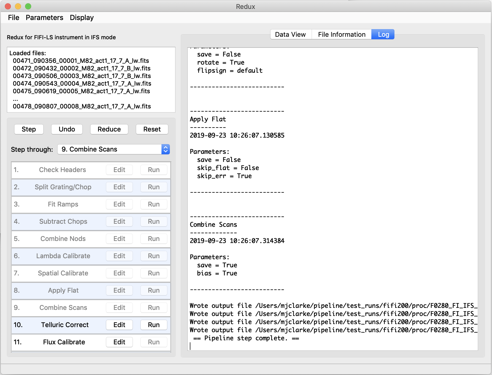
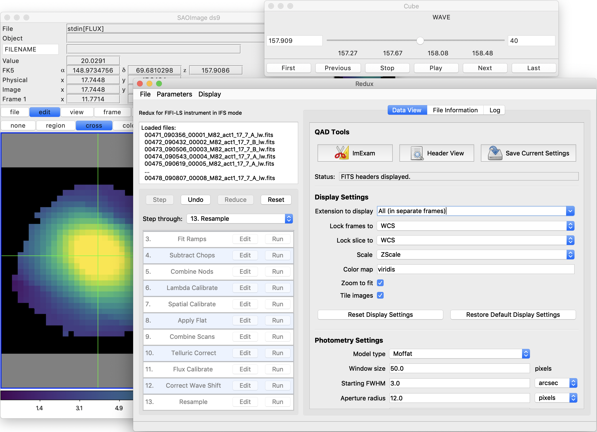
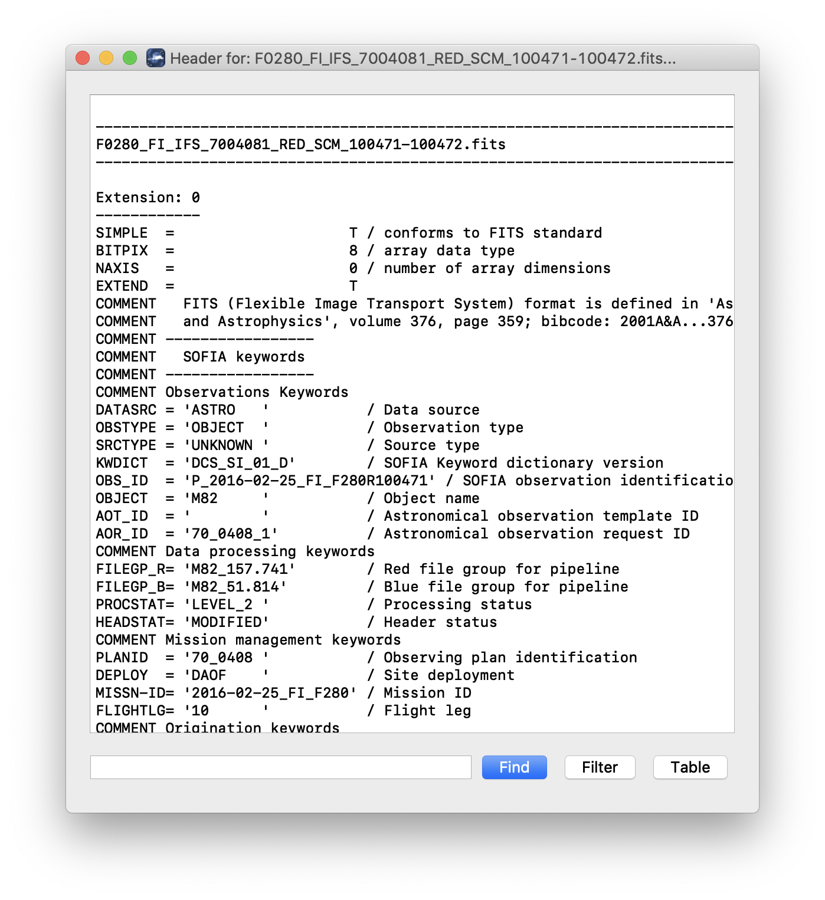

Grouping LEVEL\_1 data for processing
=====================================

FIFI-LS observations of a single object may dither in wavelength and/or
in space. It is common to use a set of FIFI-LS observations to map out
large regions of diffuse emission in a few small wavelength regions, but
it is also common to use FIFI-LS to take a set of observations of a
compact source over a wide range of wavelengths. As such, observations
cannot simply be split on the central wavelength, or the base positions
of the observation. Grouping relies on a keyword, FILEGPID, which
defines a set of observations that should be reduced together to produce
one final spectral map. In addition, however, observations must always
be separated by detector channel, dichroic setting, nodding style
(symmetric vs. asymmetric), observation type (source vs. sky flat), and
the observational program ID. It may also be desirable to group file by
the observation ID (AOR-ID), but this is considered optional. This is
due to the fact that, because FIFI-LS incorporates a dichroic, different
AORs can have the same grating setting for one of the two detectors. In
such cases, the data sets with the same settings should be combined even
though the AORs are different. All of these requirements together define
a set of FITS keywords that must match in order for a group of input
files to be reduced together (see :numref:`fifi_grouping`).

.. _fifi_grouping:
.. table:: Grouping criteria

    +-------------------------+-------------------+-------------------------+
    | **Keyword**             | **Data Type**     | **Match Criterion**     |
    +=========================+===================+=========================+
    | **OBSTYPE**             | STR               | Exact                   |
    +-------------------------+-------------------+-------------------------+
    | **DETCHAN**             | STR               | Exact                   |
    +-------------------------+-------------------+-------------------------+
    | **DICHROIC**            | INT               | Exact                   |
    +-------------------------+-------------------+-------------------------+
    | **NODSTYLE**            | STR               | Exact                   |
    +-------------------------+-------------------+-------------------------+
    | **PLANID**              | STR               | Exact                   |
    +-------------------------+-------------------+-------------------------+
    | **FILEGPID**            | STR               | Exact                   |
    +-------------------------+-------------------+-------------------------+
    | **AOR-ID (optional)**   | STR               | Exact                   |
    +-------------------------+-------------------+-------------------------+

Configuration and execution
===========================

Installation
------------

The FIFI-LS pipeline is written entirely in Python.  The pipeline is
platform independent, but has been tested only on Linux and Mac OS X
operating systems.  Running the pipeline requires a minimum of 16GB RAM,
or equivalent-sized swap file.

The pipeline is primarily comprised of four modules within the `sofia_redux`
package: `sofia_redux.instruments.fifi_ls`, `sofia_redux.pipeline`,
`sofia_redux.spectroscopy`, and `sofia_redux.toolkit`. Additional optional
features are provided by the `sofia_redux.calibration` and `sofia_redux.scan`
modules.

The `fifi_ls` module provides the data processing
algorithms, with supporting libraries from the `toolkit` and `spectroscopy`
modules.  The `pipeline` module provides interactive and batch interfaces
to the pipeline algorithms.  The `calibration` module is used to provide
interactive photometry routines in the interactive interface.  The `scan`
module provides support for additional processing tasks specific to on-the-fly
mapping modes.

External Requirements
~~~~~~~~~~~~~~~~~~~~~

To run the pipeline for any mode, Python 3.8 or
higher is required, as well as the following packages: numpy, scipy,
matplotlib, pandas, astropy, configobj, numba, bottleneck, joblib,
and astropy-helpers.
Some display functions for the graphical user interface (GUI)
additionally require the PyQt5, pyds9, photutils, and dill packages.
All required external packages are available to install via the
pip or conda package managers.  See the Anaconda environment file
(environment.yml), or the pip requirements file (requirements.txt)
distributed with `sofia_redux` for specific version requirements.

Running the pipeline interactively also requires an installation of
SAO DS9 for FITS image display. See http://ds9.si.edu/ for download
and installation instructions.  The *ds9* executable
must be available in the PATH environment variable for the pyds9
interface to be able to find and control it.

Source Code Installation
~~~~~~~~~~~~~~~~~~~~~~~~

The source code for the FIFI-LS pipeline maintained by the SOFIA Data
Processing Systems (DPS) team can be obtained directly from the
DPS, or from the external `GitHub repository <https://github.com/SOFIA-USRA/sofia_redux>`__.
This repository contains all needed configuration
files, auxiliary files, and Python code to run the pipeline on FIFI-LS
data in any observation mode.

After obtaining the source code, install the four Python libraries with
the command::

    python setup.py install

from the top-level directory.

Alternately, a development installation may be performed from inside the
directory with the command::

    pip install -e .

After installation, the top-level pipeline interface commands should
be available in the PATH.  Typing::

    redux

from the command line should launch the GUI interface, and::

    redux_pipe -h

should display a brief help message for the command line interface.

Configuration
-------------

For FIFI-LS algorithms, default parameter values are defined by the
Redux object that interfaces to them. These values may be overridden
manually for each step, while running in interactive mode. They may also
be overridden by an input parameter file, in INI format, in either
interactive or automatic mode. See Appendix A for an example of an input
parameter file, which contains the current defaults for all parameters.

Requirements for input header keywords are also specified in a
configuration file, called *headerdef.dat*, located in the *fifi_ls/data*
package directory. This table lists the keyword name, whether it is a
value required to be present in the input headers, its default value,
the data type of the value, and any requirements on the value range
(minimum value, maximum value, or enumerated value). The table also
defines how keywords from multiple input files should be combined for a
single output file (e.g. take the first value, take the sum,
string-concatenate, etc.). A sample of this configuration file is also
given in Appendix A. All keywords present in the table will be written
to output files produced by the FIFI-LS Redux pipeline.

Input data
----------

Redux takes as input raw FIFI-LS FITS data files, which contain unsigned
tables. The number of frames per raw data cube depends on the readout
mode used to acquire the data. The FITS headers contain data acquisition
and observation parameters and, combined with the pipeline configuration
files, comprise the information necessary to complete all steps of the
data reduction process. Some critical keywords are required to be
present in the raw data in order to perform a successful grouping,
reduction, and ingestion into the SOFIA archive (see Appendix A).

It is assumed that the input data have been successfully grouped before
beginning reduction: Redux considers all input files in a reduction to
be science files that are part of a single homogeneous reduction group,
to be reduced together with the same parameters.

Auxiliary Files
~~~~~~~~~~~~~~~

In order to complete a standard reduction, the pipeline requires a number
of auxiliary files to be on disk, in standard locations within the
*fifi_ls/data* package directory.  These files may be overridden in custom
reductions, using input parameters for the relevant pipeline steps.  See
:numref:`fifi_auxfiles` for a table of all commonly used types of auxiliary
files.

.. _fifi_auxfiles:
.. table:: Auxiliary files used by FIFI-LS reductions

   +------------------------+------------+-----------------------------+-----------------------------------------------------------------------------+
   | Auxiliary File         | File Type  | Pipe Step                   | Comments                                                                    |
   +========================+============+=============================+=============================================================================+
   | Bad Pixel              | ASCII      | Fit Ramps                   | Contains a list of known bad pixels                                         |
   +------------------------+------------+-----------------------------+-----------------------------------------------------------------------------+
   | Wavelength Calibration | CSV        | Lambda Calibrate            | Contains wavelength calibration constants, by date                          |
   +------------------------+------------+-----------------------------+-----------------------------------------------------------------------------+
   | Spatial Calibration    | ASCII      | Spatial Calibrate           | Contains spaxel position values, by date                                    |
   +------------------------+------------+-----------------------------+-----------------------------------------------------------------------------+
   | Spatial Flat           | ASCII      | Apply Flat                  | Contains flat correction values for all 25 spaxels, by date                 |
   +------------------------+------------+-----------------------------+-----------------------------------------------------------------------------+
   | Spectral Flat          | FITS       | Apply Flat                  | Contains flat correction values for all spexels at all possible wavelengths |
   +------------------------+------------+-----------------------------+-----------------------------------------------------------------------------+
   | Resolution             | ASCII      | Telluric Correct, Resample  | Contains the expected spatial and spectral resolution for all modes         |
   +------------------------+------------+-----------------------------+-----------------------------------------------------------------------------+
   | ATRAN                  | FITS       | Telluric Correct            | Contains an unsmoothed atmospheric transmission model spectrum              |
   +------------------------+------------+-----------------------------+-----------------------------------------------------------------------------+
   | Response               | FITS       | Flux Calibrate              | Contains an instrumental response spectrum                                  |
   +------------------------+------------+-----------------------------+-----------------------------------------------------------------------------+

.. redux usage section

.. |ref_startup| replace:: :numref:`fifi_ls_startup`

.. |ref_open_new| replace:: :numref:`fifi_ls_open_new`

.. |ref_reduction_steps| replace:: :numref:`fifi_ls_reduction_steps`

.. |ref_parameters| replace:: :numref:`fifi_ls_parameters`

.. |ref_file_info| replace:: :numref:`fifi_ls_file_info`

.. |ref_data_view| replace:: :numref:`fifi_ls_data_view`

.. |ref_headers| replace:: :numref:`fifi_ls_headers`

.. include:: ../../../sofia_redux/pipeline/usage/startup.rst

.. figure:: images/startup.png
   :name: fifi_ls_startup
   :alt: Startup screen showing an outline of an airplane with an open
         telescope door on a blue background showing faint spiral arms
         and stylized stars.

   Redux GUI startup.

.. include:: ../../../sofia_redux/pipeline/usage/open.rst

.. figure:: images/open_new.png
   :name: fifi_ls_open_new
   :alt: File system dialog window showing selected filenames.

   Open new reduction.

         A log window is displayed with text messages from a reduction.

   Sample reduction steps. Log output from the pipeline is
   displayed in the **Log** tab.

.. include:: ../../../sofia_redux/pipeline/usage/params.rst

.. figure:: images/parameters.png
   :name: fifi_ls_parameters
   :alt: An Edit Parameters dialog window, showing various selection
         widgets.

   Sample parameter editor for a pipeline step.

.. include:: ../../../sofia_redux/pipeline/usage/info.rst

.. figure:: images/file_info.png
   :name: fifi_ls_file_info
   :alt: A table display showing filenames and FITS keyword values.

   File information table.

.. include:: ../../../sofia_redux/pipeline/usage/view.rst

         display parameters and analysis tools.

   Data viewer settings and tools.

.. include:: ../../../sofia_redux/pipeline/usage/headers.rst

   QAD FITS header viewer.

FIFI-LS Reduction
-----------------

FIFI-LS data reduction with Redux follows the data reduction flowchart
given in :numref:`fifi_flowchart`. At each step, Redux attempts to determine
automatically the correct action, given the input data and default
parameters, but each step can be customized as needed.

Some key parameters to note are listed below.

-  **Check Headers**

   -  *Abort reduction for invalid headers*: By default, Redux will halt the
      reduction if the input header keywords do not meet requirements.
      Uncheck this box to attempt the reduction anyway.

-  **Fit Ramps**

   -  *Signal-to-noise threshold*: This value defines the
      signal-to-noise cut-off to flag a ramp as bad and ignore it. Set
      to -1 to skip the signal-to-noise cut.

   -  *Combination threshold (sigma)*: This value defines the
      rejection threshold for the robust mean combination of the ramp
      slopes. Set higher to reject fewer ramps, lower to reject more.

   -  *Bad pixel file*: By default, the pipeline looks
      up a bad pixel mask in *fifi-ls/data/badpix\_files*. To override
      the default mask, use this parameter to select a different text
      file. The file must be an ASCII table with two columns: the spaxel
      number (1-25, numbered left to right in displayed array), and the
      spexel number (1-16, numbered bottom to top in displayed array).
      This option may be used to block a bad spaxel for a particular
      observation, by entering a bad pixel for every spexel index in a
      particular spaxel.

   -  *Remove 1st 2 ramps*: Select to remove the first two ramps. This is
      on by default.  This option has no effect if there
      are fewer than three ramps per chop.

   - *Subtract bias*: If set, the value from the open zeroth
     spexel will be subtracted before fitting.

   - *Threshold for grating instability*: Threshold in sigma for
     allowed ramp-averaged deviation from the expected grating position.
     Set to -1 to turn off filtering.

-  **Combine Nods**

   -  *Method for combining off-beam images*: For C2NC2 only: 'nearest'
      takes the closest B nod in time, 'average' will mean-combine before
      and after B nods, and 'interpolate' will linearly interpolate before
      and after B nods to the A nod time.  For OTF mode data, the B nods
      are interpolated to the time of each scan position.

   -  *Propagate off-beam image instead of on-beam*: If selected, B beams
      will be treated as if they were A beams for all subsequent
      reductions. That is, the map will be produced at the B position
      instead of the A. All other filenames and header settings will
      remain the same, so use with caution.  This option is mostly
      used for testing purposes.

-  **Spatial Calibrate**

   -  *Rotate by detector angle*: By default, Redux rotates the data by
      the detector angle to set North up and East to the left in the
      final map. Deselect this box to keep the final map in detector
      coordinates.

   -  *Flip RA/Dec sign convention (+, -, or default)*: For most data, the
      sign convention of the DLAM\_MAP and DBET\_MAP header keywords,
      which define the dither offsets, is determined automatically
      (parameter value "default"). Occasionally, for particular
      observations, these keywords may need their signs flipped,
      or used as is (no flip). This is usually determined by inspection of
      the results of the Resample step.

-  **Apply Flat**

   -  *Skip flat correction*: Select this option to skip flat-fielding the
      data. This option is mostly used for testing purposes.

   -  *Skip flat error propagation*: Deselect this option to propagate
      the systematic flat correction error in the flux error plane. This
      option is not currently recommended: the systematic error is stored
      in the CALERR keyword instead.

-  **Combine Scans**

   -  *Correct bias offset*: Select this option to subtract an
      overall bias offset between the individual grating scans.

-  **Telluric Correct**

   -  *Skip telluric correction*: Select to skip correcting the data for
      telluric absorption. This option is mostly used for testing.

   -  *ATRAN directory*: Use this option to select a directory containing
      ATRAN FITS files.  This must be set in order to use water vapor
      values for telluric correction.

   -  *Cutoff value*: Modify to adjust the transmission
      fraction below which the telluric-corrected data will be set to NaN.

   -  *Use WV values*: Select to use water vapor values from the header
      (keyword WVZ\_OBS) to select the ATRAN file to apply.  This option
      will have no effect unless the ATRAN directory is set to a location
      containing ATRAN files derived for different PWV values.

-  **Flux Calibrate**

   -  *Skip flux calibration*: Select to skip flux calibration of the
      data. The flux will remain in instrumental units (ADU/sec), with
      PROCSTAT=LEVEL\_2.  This option is mostly used for testing.

   -  *Response file*: Use this option to select a FITS
      file containing an instrumental response spectrum to use in place
      of the default file on disk.

-  **Correct Wave Shift**

   -  *Skip wavelength shift correction*: Select to skip applying the
      correction to the wavelength calibration due to barycentric
      velocity. In this case, both telluric-corrected and uncorrected
      cubes will be resampled onto the original wavelengths.
      This option is mostly used for testing.

-  **Resample**

   - General parameters

      -  *Use parallel processing*: If not set, data will be processed
         serially.  This will likely result in longer processing times,
         but smaller memory footprint during processing.

      -  *Maximum cores to use*: Specify the maximum cores to use, in the
         case of parallel processing.  If not specified, the maximum is
         the number of available cores, minus 1.

      -  *Check memory use during resampling*: If set, memory availability
         will be checked before processing, and the number of processes will
         be modified if necessary.  If not set, processing is attempted with
         the maximum number of cores specified.  Use with caution: in some
         conditions, unsetting this option may result in software or computer
         crashes.

      -  *Skip coadd*: If selected, a separate flux cube will be made from
         each input file, using the interpolation algorithm.
         This option is useful for identifying bad input files.

      -  *Interpolate instead of fit*: If set, an alternate resampling
         algorithm will be used, rather than the local polynomial surface
         fits. This option may be preferable for data with small dither
         offsets; it is not recommended for large maps.

      -  *Weight by errors*: If set, local fits will be weighted by the
         flux errors, as calculated by the pipeline.

      -  *Fit rejection threshold (sigma)*: If the fit value is more than this
         number times the standard deviation away from the weighted mean,
         the weighted mean is used instead of the fit value. This parameter
         is used to reject bad fit values.  Set to -1 to turn off.

      -  *Positive outlier threshold (sigma)*: Sets the rejection threshold for the
         input data, in sigma.  Set to -1 to turn off.

      -  *Negative outlier threshold (sigma)*: If non-zero, sets a separate
         rejection threshold in sigma for negative fluxes, to be used in a
         first-pass rejection.  Set to -1 to turn off.

      -  *Append distance weights to output file*: If set, distance weights
         calculated by the resampling algorithm will be appended to the output
         FITS file. This option is primarily used for testing.

      -  *Skip computing the uncorrected flux cube*: If set, the uncorrected
         flux data will be ignored.  This option is primarily for faster
         testing and/or quicklook, when the full data product is not required.

   - Scan resampling parameters

      -  *Use scan reduction before resample*: If set, an iterative scan
         reduction will be performed to attempt to remove residual correlated
         gain and noise before resampling.

      -  *Save intermediate scan product*: If set, the scan product will be
         saved to disk as a FITS file, for diagnostic purposes.

      -  *Scan options*: Parameters to pass to the scan reduction.
         Enter as key=value pairs, space-separated.

   - Spatial resampling parameters

      -  *Create map in detector coordinates*: If set, data are combined in
         arsecond offsets from the base position, rather than in sky coordinates.
         If not set, detector coordinates are used for nonsidereal targets and
         sky coordinates otherwise.

      -  *Spatial oversample*: This parameter controls the resolution of the output
         spatial grid, with reference to the assumed FWHM at the observed wavelength.
         The value is given in terms of pixels per reference FWHM for the
         detector channel used.

      -  *Output spatial pixel size (arcsec)*: This parameter directly controls
         the resolution of the output spatial grid. If set, this
         parameter overrides the spatial oversample parameter. For BLUE data,
         the default value is 1.5 arcsec; for RED data, it is 3.0 arcsec.

      -  *Spatial surface fit order*: This parameter controls the
         order of the surface fit to the spatial data at each grid point. Higher
         orders give more fine-scale detail, but are more likely to be
         unstable. Set to zero to do a weighted mean of the nearby data.

      -  *Spatial fit window*: This parameter controls how much data to use in the
         fit at each grid point. It is given in terms of a factor times the
         average spatial FWHM. Higher values will lead to more input data being
         considered in the output solution, at the cost of longer processing time.
         Too-low values may result in missing data (holes) in the output map.

      -  *Spatial smoothing radius*: Set to the fraction
         of the fit window to use as the radius of the distance-weighting
         Gaussian. Lowering this value results in finer detail for the same
         input fit window. Too low values may result in noisy output data;
         too high values effectively negate the distance weights.

      -  *Spatial edge threshold*: Specifies the threshold for setting edge
         pixels to NaN.  Set lower to block fewer pixels.

      -  *Adaptive smoothing algorithm*: If 'scaled', the size of the smoothing
         kernel is allowed to vary, in order to optimize reconstruction of
         sharply peaked sources. If 'shaped', the kernel shape and rotation
         may also vary. If 'none', the kernel will not vary.

   - Spectral resampling parameters

      -  *Spectral oversample*: This parameter controls the resolution of the output
         spectral grid. The value is given in terms of pixels per reference
         spectral FWHM at the central wavelength of the observation.

      -  *Output spectral pixel size (um)*: This parameter directly controls
         the resolution of the output spectral grid.  If set, this
         parameter overrides the spatial oversample parameter.  It does not
         have a default value.

      -  *Spectral surface fit order*: This parameter controls the
         order of the surface fit to the spectral data at each grid point.

      -  *Spectral fit window*: This parameter controls how much data to use in the
         fit at each wavelength grid point. It is given in terms of a factor times the
         average spatial FWHM. Higher values will lead to more input data being
         considered in the output solution, at the cost of longer processing time.
         Too-low values may result in missing data (holes) in the output map.

      -  *Spectral smoothing radius*: Set to the fraction
         of the fit window to use as the radius of the distance-weighting
         Gaussian, in the wavelength dimension.

      -  *Spectral edge threshold*: Specifies the threshold for setting edge
         pixels to NaN, in the wavelength dimension.  Set lower to block
         fewer pixels.

-  **Make Spectral Map**

   -  *Skip making the preview image*: If set, no preview image (PNG file)
      will be produced.

   -  *Extension to map*: Extension name to display in the output image.
      This is typically 'FLUX' in the first extension, but for some
      cubes, 'UNCORRECTED\_FLUX' may be more appropriate.

   -  *Method for selecting spectral slice*: May be 'reference' or 'peak'.
      If set to 'reference', the G\_WAVE\_B or G\_WAVE\_R keys are used
      to identify the reference wavelength.  The nearest wavelength slice
      to the reference wavelength will be used as the spectral slice for the
      image.  For the 'peak' method, the flux cube
      is smoothed by a couple pixels, then the highest S/N voxel is used to
      select the spectral slice for the image.

   -  *Method for selecting spatial point*: May be 'reference' or 'peak'.
      If set to 'reference', the OBSRA and OBSDEC keys are used
      to identify the spatial point for the displayed spectrum.  For the
      'peak' method, the peak flux in the selected spectral slice is used to
      select the spatial point.

   -  *Override wavelength slice*: Manually specify the
      wavelength slice (zero-indexed) for the image.

   -  *Override spatial point*: Manually specify the
      spatial index for the spectrum, as 'x,y', zero-indexed.

   -  *Fraction of outer wavelengths to ignore*: Used with method = 'peak'.
      Set to 0 to include all wavelengths in calculating signal peak.  Set
      to a fraction less than 1 to exclude wavelengths at the beginning and
      end of the cube.

   -  *Color map*: Color map for the output PNG image.  Any valid Matplotlib
      name may be specified.

   -  *Flux scale for image*: A low and high percentile value , used for
      scaling the spectral image, e.g. [0,99].

   -  *Number of contours*: Number of contour levels to be over-plotted on
      the image.  Set to 0 to turn off contours.

   -  *Contour color*: Color for the contour lines.  Any valid Matplotlib
      color name may be specified.

   -  *Filled contours*: If set, contours will be filled instead of overlaid.

   -  *Overlay grid*: If set, a coordinate grid will be overlaid.

   -  *Beam marker*: If set, a beam marker will be added to the plot.

   -  *Overplot transmission*: If set, the atmospheric transmission spectrum
      will be displayed in the spectral plot.

   -  *Flux scale for spectral plot*: Specify a low and high percentile value
      for the spectral flux scale, e.g. [0,99].  If set to [0, 100],
      Matplotlib defaults are used.

   -  *Watermark text*: If set to a non-empty string, the text will be
      added to the lower-right of the image as a semi-transparent watermark.

Data quality assessment
=======================

After the pipeline has been run on a set of input data, the output
products should be checked to ensure that the data has been properly
reduced.  Data quality and quirks can vary widely across individual
observations, but the following general guideline gives some strategies
for approaching quality assessment for FIFI-LS data.

-  Check the output to the log file (usually called
   *redux\_[date]\_[time].log*), written to the same directory as the
   output files. Look for messages marked ERROR or WARNING. The log will
   also list every parameter used in the pipeline steps, which may help
   disambiguate the parameters as actually-run for the pipeline.

-  Check that the expected files were written to disk: there should, at
   a minimum, be a scan-combined file (*SCM*), a flux-calibrated file
   (*CAL*), and a resampled file (*WXY*).

-  Look at each plane of the reduced image in the *WXY* file. Check that
   the resampling seems to have completed successfully: there
   should not be excessive holes in the map, or bad pixels away from the
   edges of the image. If there are, the spatial resampling may need to
   be redone with modified parameters.

-  Look at the spectra for a sampling of spatial pixels in the *WXY*
   file. Check that there are no sudden dropouts or other
   discontinuities in the spectrum that are not associated with poor
   atmospheric transmission. If there are such discontinuities, the
   wavelength resampling may need to be redone with modified parameters.

Appendix A: Sample configuration files
======================================

The below is a sample FIFI-LS Redux parameter override file in INI format.
If present, the parameter value overrides the
default defined by the FIFI-LS reduction object. If not present, the
default value will be used. The parameters displayed here are the
current default values.

.. include:: include/redux_param.cfg
   :literal:

.. raw:: latex

    \clearpage

Sample FIFI-LS configuration file, located in
*fifi-ls/data/header\_info/headerdef.dat*. Values marked with a Y in the
*reqd?* column are keywords required to be present in input data. They
must meet the type and range requirements listed for grouping and data
reduction to be successful.

.. include:: include/headerdef.dat
   :literal:
