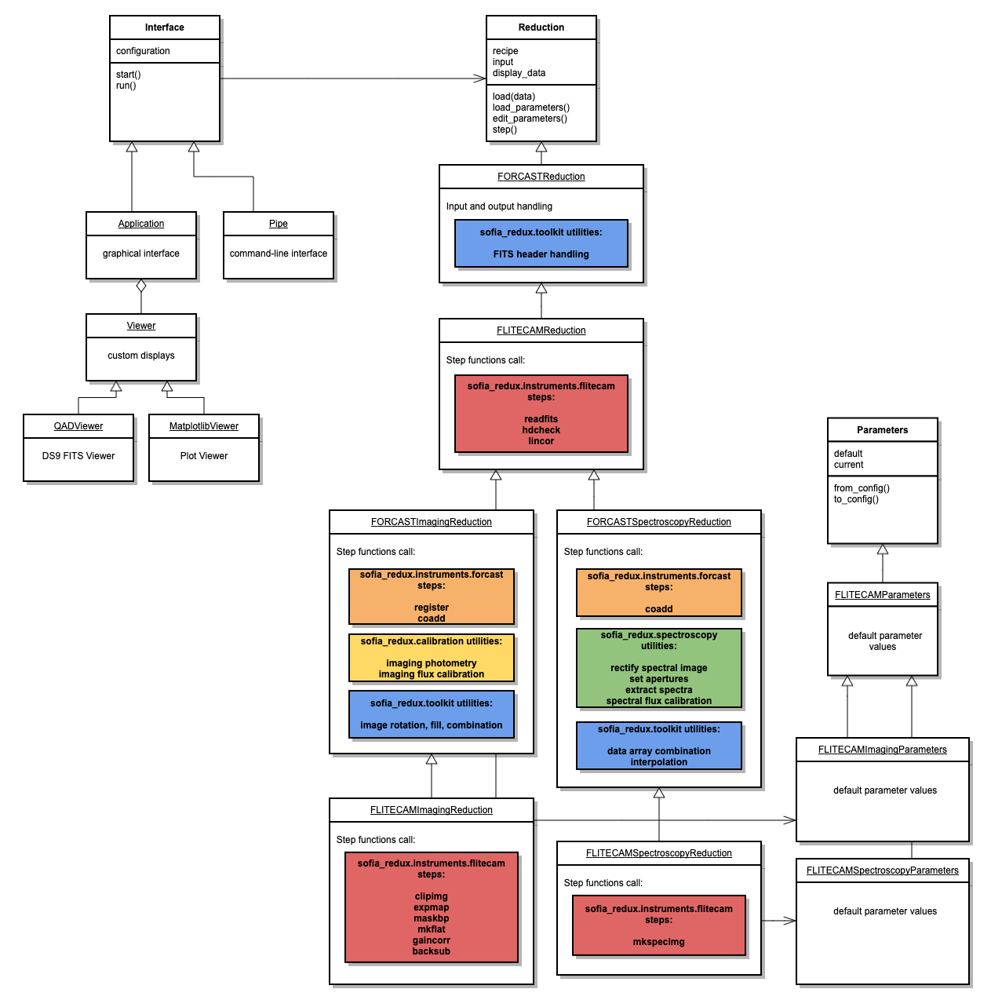

*********************************
FLITECAM Redux Developer's Manual
*********************************

.. raw:: latex

    \clearpage

Introduction
============

Document Purpose
----------------

This document is intended to provide all the information necessary to
maintain the FLITECAM Redux pipeline, used to produce
Level 2 and 3 reduced products for FLITECAM imaging and grism data, in
either manual or automatic mode. Level 2 is defined as data that has
been processed to correct for instrumental effects; Level 3 is defined
as flux-calibrated data. A more general introduction to the data
reduction procedure and the scientific justification of the algorithms
is available in the FLITECAM Redux User’s Manual.

This manual applies to FLITECAM Redux version 2.0.0.

Redux Revision History
----------------------

FLITECAM Redux was developed as a set of software modules in the
SOFIA Redux Python package:

- `sofia_redux.instruments.flitecam`: processing algorithms
  specific to the FLITECAM instrument
- `sofia_redux.instruments.forcast`: image processing
  algorithms useful to both the FORCAST and FLITECAM instrument
- `sofia_redux.calibration`: flux calibration algorithms
- `sofia_redux.spectroscopy`: spectral extraction algorithms
- `sofia_redux.pipeline`: interactive and batch mode interface tools for
  managing data reduction processes
- `sofia_redux.toolkit`: numerical algorithms and supporting utilities
- `sofia_redux.visualization`: data analysis and visualization tools

The `flitecam` module is a re-implementation of algorithms first
developed in IDL for the FLITECAM imaging pipelines, called FDRP.
`forcast`, `calibration`, and `spectroscopy` modules are based on earlier
IDL libraries called DRIP, PipeCal, and FSpextool respectively.  The
`pipeline` module also had an earlier IDL implementation, also called Redux.

FDRP was initially developed by Dr. Ralph Shuping in 2003;
its functionality was significantly improved and expanded by Dr. Sachin
Shenoy in 2012. Version 1.0.0 was originally released for use at SOFIA
in July 2013. FDRP originally contained a set of imaging reduction
functions, and a wrapper script used both as an automatic pipeline and
as a command-line interface for manual reductions.

DRIP was first developed in IDL by Dr. Luke Keller and Dr. Marc Berthoud for the
reduction of FORCAST data. Version 1.0.0 was originally released for use
at SOFIA in July 2013. DRIP originally contained a set of imaging
reduction functions, an object-oriented structure for calling these
functions, an automatic pipeline, and an interactive GUI for manual
reductions. The package also supported spectroscopic reductions with an
interface developed in parallel to the DRIP interface, called FG
(FORCAST Grism).

PipeCal was developed by the SOFIA Data Processing System (DPS) team to
provide photometry and flux calibration
algorithms that may be used to calibrate imaging data from any instrument,
given appropriate reference data. It was originally developed by Dr. Miguel
Charcos-Llorens and Dr. William Vacca as a set of IDL and shell scripts that
were run independently of the Level 2 pipeline, then was refactored by Melanie
Clarke for incorporation into the Redux pipeline. It was first
incorporated into FLITECAM Redux in version 1.0.1, which was released for
use in May 2015.

FSpextool was built on top of a pre-release version of
Spextool 4, an IDL-based package developed by Dr. Michael Cushing and Dr.
William Vacca for the reduction of data from the SpeX instrument on the
NASA Infrared Telescope Facility (IRTF). Spextool was originally released in
October 2000, and has undergone a number of major and minor revisions since
then. The last stable public release was v4.1, released January 2016. As
Spextool does not natively support automatic command-line processing,
FSpextool for SOFIA adapted the Spextool library to the SOFIA architecture
and instruments; version 1.0.0 was originally released for use at SOFIA
in July 2013.

Redux was originally developed to be a general-purpose interface to IDL data
reduction algorithms. It provided an interactive GUI and an
object-oriented structure for calling data reduction processes, but it
did not provide its own data reduction algorithms. It was developed by
Melanie Clarke, for the SOFIA DPS team, to provide a consistent
front-end to the data reduction pipelines for multiple instruments and
modes, including FLITECAM.

The SOFIA Redux package was developed as a unified Python package to
support data reduction for all facility class instruments for SOFIA,
replacing all legacy pipelines with an integrated, shared code base.
The package was developed by the SOFIA DPS team, starting in 2018.
The principal developers for SOFIA Redux prior to the FLITECAM 2.0.0
release were Daniel Perera, Dr. Rachel Vander Vliet,
and Melanie Clarke, for the SOFIA-USRA team.

Overview of Software Structure
==============================

The sofia_redux package has several sub-modules organized by functionality::

    sofia_redux
    ├── calibration
    ├── instruments
    │   ├── exes
    │   ├── fifi_ls
    │   ├── flitecam
    │   ├── forcast
    │   └── hawc
    ├── pipeline
    ├── scan
    ├── spectroscopy
    ├── toolkit
    └── visualization

The modules used in the FLITECAM pipeline are described below.

sofia_redux.calibration
-----------------------

The `sofia_redux.calibration` module contains flux calibration algorithms
used by Redux to perform photometric or flux calibration calculations on
input images and return their results. The complexity of this package is
primarily in the organization of the reference data contained in the
*data* directory. This directory contains a set of calibration data for
each supported instrument (currently FORCAST, FLITECAM, and HAWC+). For each
instrument, the configuration files are split into groups based on how
often they are expected to change, as follows.

In the *filter\_def* directory, there is a file that defines the
mean/reference wavelength, pivot wavelength, and color leak correction
factor for each filter name (SPECTEL). This may vary by date only if the
filters change, but keep the same SPECTEL name. The color leak factor is
currently 1.0 for all filters (no color correction).

In the *response* directory, there are response fit files that define
the fit coefficients for each filter, with a separate file for the
altitude fit, airmass fit, and PWV fit for each of single/dual modes.
These should also change rarely.

In the *ref\_calfctr* directory, there are files that define the average
reference calibration factors to apply to science objects, by filter,
along with the associated error value. It is expected that there will be
a different ref\_calfctr file for each flight series, produced by an
analysis of all standards taken throughout the flight series.

In the *standard\_flux* directory, there is a file that defines the flux
model characteristics for each object: the percent error on the model,
and the scale factor to apply to the model. The model error is 5% for
all stars except BetaPeg (which is 9.43%), and is 20% for all asteroids.
The scale factor is usually 1.0, with the exception of BetaUmi, which
requires scaling by 1.18 from the model output files. This file should
change rarely, if ever, except to add objects to it. Currently, the same
file is used for all data. Also in the *standard flux* directory, there
are output files from the standard models for each object, for each
applicable date if necessary. From these files, the lambda\_mean column
is read and compared to the mean wavelength in the filter\_def file. If
found, the corresponding value in the Fnu\_mean column is used as the
standard model flux. If there is a scale defined in the model\_err file,
it is applied to the flux value. These files should rarely change, but
new ones will be added for asteroids any time they are observed. They
may need to be redone if the filter wavelengths change.

To manage all these files, there is a top-level calibration
configuration file (*caldefault.txt*), which contains the filenames for
the filter definition file, the model error file, the reference cal
factor file, and the response fit files, organized by date and filter.
This table will most likely be updated once per series, when we have
generated the reference calibration factors. There is also a standards
configuration file (*stddefault.txt*) that identifies the model flux
file to use by date and mode (single/dual). For stars, the date is set
to 99999999, meaning that the models can be used for any date; asteroids
may have multiple entries - one for each date they are observed. This
file must be updated whenever there are new asteroid flux models to add,
but it should be as simple as dropping the model file in the right
directory and adding a line to the table to identify it.

sofia_redux.instruments.flitecam
--------------------------------
The `sofia_redux.instruments.flitecam` module is written in Python using
standard scientific tools and libraries.

The data reduction algorithms used by the pipeline are straight-forward
functions that generally take FITS data structure, corresponding to a single
image file, as an argument and return the processed data as a result.
Parameters for these functions are provided as keyword arguments.

The `flitecam` module also stores any reference data needed by the FLITECAM
pipeline, in either imaging or grism mode.  This includes
nonlinearity coefficients, wavelength calibration files,
atmospheric transmission spectra, spectral
standard models, and instrument response spectra.  The default files may
vary by date; these defaults are managed by the `getcalpath` function
in the `flitecam` module.  New date configurations may be added to the
caldefault.txt files in *flitecam/data/caldefault.txt* and
*flitecam/data/grism/caldefault.txt*.

sofia_redux.instruments.forcast
-------------------------------
The `sofia_redux.instruments.forcast` module is primarily used in
the FLITECAM pipeline for its implementation of image registration and
coaddition algorithms.

Similar to the `flitecam` module, `forcast` algorithms are implemented as
straight-forward functions. They generally take a data array, corresponding
to a single image file, as an argument and return the processed image array
as a result. They generally also take as secondary input a variance array
to process alongside the image, a header array to track metadata, and keyword
parameters to specify non-default settings.

sofia_redux.spectroscopy
------------------------

The `sofia_redux.spectroscopy` package contains a library of general-purpose
spectroscopic functions.  The FLITECAM pipeline uses these algorithms
for spectroscopic image rectification, aperture identification, and
spectral extraction and calibration. Most of these algorithms are simple
functions that take spectroscopic data as input and return processed data
as output.  However, the input and output values may be more complex than the
image processing algorithms in the `flitecam` package.  The Redux interface
in the `pipeline` package manages the input and output requirements for
FLITECAM data and calls each function individually.  See the
`sofia_redux.spectroscopy` API documentation for more information.

sofia_redux.toolkit
-------------------

`sofia_redux.toolkit` is a repository for classes and functions of general usefulness,
intended to support multiple SOFIA pipelines.  It contains several submodules,
for interpolation, image manipulation, multiprocessing support, numerical calculations, and
FITS handling.  Most utilities are simple functions that take input
as arguments and return output values.  Some more complicated functionality
is implemented in several related classes; see the `sofia_redux.toolkit.resampling`
documentation for more information.

sofia_redux.visualization
-------------------------

The `sofia_redux.visualization` package contains plotting and display
routines, relating to visualizing SOFIA data.  For the FLITECAM pipeline,
this package currently provides an interactive spectral viewer and a module
that supports generating quick-look preview images.

sofia_redux.pipeline
--------------------

Design
~~~~~~

.. include:: ../../../sofia_redux/pipeline/redux_architecture.rst

FLITECAM Redux
~~~~~~~~~~~~~~

To interface to the FLITECAM pipeline algorithms, Redux defines
the `FLITECAMReduction`, `FLITECAMImagingReduction`, and
`FLITECAMSpectroscopyReduction` as primary reduction classes, with associated
parameter classes `FLITECAMParameters`, `FLITECAMImagingParameters`, and
`FLITECAMSpectroscopyParameters`. [#fn_flitecam_wavecal]_  Since FLITECAM
data reduction is broadly similar to FORCAST data reduction, FLITECAM
classes all inherit significant functionality from equivalent classes
originally for FORCAST.  See :numref:`flitecam_redux_class` for a sketch of
the Redux classes used by the FLITECAM pipeline.

The `FLITECAMReduction` class holds definitions for algorithms applicable to
both imaging and spectroscopy data:

    - Check Headers: calls `sofia_redux.instruments.flitecam.hdcheck`
    - Correct Nonlinearity: calls `sofia_redux.instruments.flitecam.lincor`

The `FLITECAMImagingReduction` class inherits from the `FLITECAMReduction`
class and the `FORCASTImagingReduction` class and additionally defines
FLITECAM-specific imaging algorithms:

    - Clip Image: calls `sofia_redux.instruments.flitecam.clipimg`,
      and `sofia_redux.instruments.flitecam.maskbp`
    - Make Flat: calls `sofia_redux.instruments.flitecam.mkflat`
    - Correct Gain: calls `sofia_redux.instruments.flitecam.gaincor`
    - Subtract Sky: calls `sofia_redux.instruments.flitecam.backsub`

The final steps of the pipeline are implemented in the `FORCASTImagingReduction`
class:

    - Telluric Correct: calls `sofia_redux.calibration.pipecal_util.apply_tellcor`
      and `sofia_redux.calibration.pipecal_util.run_photometry`
    - Combine Images: calls `sofia_redux.toolkit.image.coadd`
    - Flux Calibrate: calls `sofia_redux.calibration.pipecal_util.apply_fluxcal`
      and `sofia_redux.calibration.pipecal_util.run_photometry`
    - Make Image Map: calls `sofia_redux.visualization.quicklook.make_image`

The `FLITECAMSpectroscopyReduction` class inherits from the `FLITECAMReduction`
class and the `FORCASTSpectroscopyReduction` class.  It defines two
FLITECAM-specific algorithms:

    - Make Spectral Image: `sofia_redux.instruments.flitecam.mkspecimg`
    - Calibrate Flux: calls `sofia_redux.instruments.forcast.getatran`
      and `sofia_redux.spectroscopy.fluxcal`

All other steps in the pipeline are implemented in `FORCASTSpectroscopyReduction`:

    - Stack Dithers: calls `sofia_redux.toolkit.image.combine_images`
    - Make Profiles: calls `sofia_redux.spectroscopy.rectify` and
      `sofia_redux.spectroscopy.mkspatprof`
    - Locate Apertures: calls `sofia_redux.spectroscopy.findapertures`
    - Trace Continuum: calls `sofia_redux.spectroscopy.tracespec`
    - Set Apertures: calls `sofia_redux.spectroscopy.getapertures` and
      `sofia_redux.spectroscopy.mkapmask`
    - Subtract Background: calls `sofia_redux.spectroscopy.extspec.col_subbg`
    - Extract Spectra: calls `sofia_redux.spectroscopy.extspec.extspec`
    - Combine Spectra: calls `sofia_redux.toolkit.image.coadd`
      `sofia_redux.instruments.forcast.register_datasets.get_shifts`,
      and `sofia_redux.toolkit.image.combine_images`
    - Make Response: calls `sofia_redux.instruments.forcast.getmodel`
    - Combine Response: calls `sofia_redux.toolkit.image.combine_images`
    - Make Spectral Map: calls `sofia_redux.visualization.quicklook.make_image`

The recipe attribute for the reduction class specifies the above steps
in the correct order for each pipeline mode.

If an intermediate file is loaded, its product type is
identified from the PRODTYPE keyword in its header, and the prodtype_map
attribute is used to identify the next step in the recipe.  This
allows reductions to be picked up at any point, from a saved intermediate
file.  For more information on the scientific goals and methods used in
each step, see the FLITECAM Redux User's Manual.

The FORCAST reduction classes also contains several helper functions used in
both the FORCAST and FLITECAM pipelines, that
assist in reading and writing files on disk, and identifying which
data to display in the interactive GUI.  Display is performed via
the `QADViewer` class provided by the Redux package.  Spectroscopic diagnostic
data is additionally displayed by the `MatplotlibViewer` class and the
`EyeViewer`, provided in the `sofia_redux.visualization` module.

.. [#fn_flitecam_wavecal]
    There are also three additional reduction classes used for special purposes:
    `FLITECAMWavecalReduction`, `FLITECAMSpatcalReduction`, and
    `FLITECAMSlitcorrReduction`.  These classes inherit from
    equivalent classes for FORCAST. These classes customize the spectroscopic
    reduction steps to produce reference wavelength, spatial, and slit
    correction calibration files, respectively, for use within the standard
    spectroscopic pipeline.

         FORCAST classes.

   FLITECAM Redux class diagram.

Detailed Algorithm Information
==============================
The following sections list detailed information on the functions and
procedures most likely to be of interest to the developer.

sofia_redux.instruments.flitecam
--------------------------------
.. automodapi:: sofia_redux.instruments.flitecam.backsub
   :headings: ~^
.. automodapi:: sofia_redux.instruments.flitecam.calcvar
   :headings: ~^
.. automodapi:: sofia_redux.instruments.flitecam.clipimg
   :headings: ~^
.. automodapi:: sofia_redux.instruments.flitecam.expmap
   :headings: ~^
.. automodapi:: sofia_redux.instruments.flitecam.gaincor
   :headings: ~^
.. automodapi:: sofia_redux.instruments.flitecam.getcalpath
   :headings: ~^
.. automodapi:: sofia_redux.instruments.flitecam.hdcheck
   :headings: ~^
.. automodapi:: sofia_redux.instruments.flitecam.lincor
   :headings: ~^
.. automodapi:: sofia_redux.instruments.flitecam.maskbp
   :headings: ~^
.. automodapi:: sofia_redux.instruments.flitecam.mkflat
   :headings: ~^
.. automodapi:: sofia_redux.instruments.flitecam.mkspecimg
   :headings: ~^
.. automodapi:: sofia_redux.instruments.flitecam.readfits
   :headings: ~^
.. automodapi:: sofia_redux.instruments.flitecam.split_input
   :headings: ~^

sofia_redux.instruments.forcast
-------------------------------

.. automodapi:: sofia_redux.instruments.forcast.getatran
   :headings: ~^
.. automodapi:: sofia_redux.instruments.forcast.getmodel
   :headings: ~^
.. automodapi:: sofia_redux.instruments.forcast.hdmerge
   :headings: ~^
.. automodapi:: sofia_redux.instruments.forcast.peakfind
   :no-inheritance-diagram:
   :headings: ~^
.. automodapi:: sofia_redux.instruments.forcast.register
   :headings: ~^
.. automodapi:: sofia_redux.instruments.forcast.register_datasets
   :headings: ~^

sofia_redux.toolkit
-------------------

.. automodapi:: sofia_redux.toolkit.convolve.base
   :headings: ~^
.. automodapi:: sofia_redux.toolkit.convolve.kernel
   :headings: ~^
.. automodapi:: sofia_redux.toolkit.convolve.filter
   :headings: ~^
.. automodapi:: sofia_redux.toolkit.fitting.fitpeaks1d
   :headings: ~^
.. automodapi:: sofia_redux.toolkit.fitting.polynomial
   :headings: ~^
.. automodapi:: sofia_redux.toolkit.image.adjust
   :headings: ~^
.. automodapi:: sofia_redux.toolkit.image.coadd
   :headings: ~^
.. automodapi:: sofia_redux.toolkit.image.combine
   :headings: ~^
.. automodapi:: sofia_redux.toolkit.image.fill
   :headings: ~^
.. automodapi:: sofia_redux.toolkit.image.resize
   :headings: ~^
.. automodapi:: sofia_redux.toolkit.image.smooth
   :headings: ~^
.. automodapi:: sofia_redux.toolkit.image.utilities
   :headings: ~^
.. automodapi:: sofia_redux.toolkit.image.warp
   :headings: ~^
.. automodapi:: sofia_redux.toolkit.interpolate.interpolate
   :headings: ~^
.. automodapi:: sofia_redux.toolkit.stats.stats
   :headings: ~^
.. automodapi:: sofia_redux.toolkit.utilities.base
   :headings: ~^
.. automodapi:: sofia_redux.toolkit.utilities.fits
   :headings: ~^
.. automodapi:: sofia_redux.toolkit.utilities.func
   :headings: ~^
.. automodapi:: sofia_redux.toolkit.utilities.multiprocessing
   :headings: ~^

sofia_redux.spectroscopy
------------------------

.. automodapi:: sofia_redux.spectroscopy.binspec
   :headings: ~^
.. automodapi:: sofia_redux.spectroscopy.earthvelocity
   :headings: ~^
.. automodapi:: sofia_redux.spectroscopy.extspec
   :headings: ~^
.. automodapi:: sofia_redux.spectroscopy.findapertures
   :headings: ~^
.. automodapi:: sofia_redux.spectroscopy.fluxcal
   :headings: ~^
.. automodapi:: sofia_redux.spectroscopy.getapertures
   :headings: ~^
.. automodapi:: sofia_redux.spectroscopy.getspecscale
   :headings: ~^
.. automodapi:: sofia_redux.spectroscopy.mkapmask
   :headings: ~^
.. automodapi:: sofia_redux.spectroscopy.mkspatprof
   :headings: ~^
.. automodapi:: sofia_redux.spectroscopy.radvel
   :headings: ~^
.. automodapi:: sofia_redux.spectroscopy.readflat
   :headings: ~^
.. automodapi:: sofia_redux.spectroscopy.readwavecal
   :headings: ~^
.. automodapi:: sofia_redux.spectroscopy.rectify
   :headings: ~^
.. automodapi:: sofia_redux.spectroscopy.rectifyorder
   :headings: ~^
.. automodapi:: sofia_redux.spectroscopy.smoothres
   :headings: ~^
.. automodapi:: sofia_redux.spectroscopy.tracespec
   :headings: ~^

sofia_redux.calibration
-----------------------

.. automodapi:: sofia_redux.calibration.pipecal_applyphot
   :headings: ~^
.. automodapi:: sofia_redux.calibration.pipecal_calfac
   :headings: ~^
.. automodapi:: sofia_redux.calibration.pipecal_config
   :headings: ~^
.. automodapi:: sofia_redux.calibration.pipecal_fitpeak
   :headings: ~^
.. automodapi:: sofia_redux.calibration.pipecal_photometry
   :headings: ~^
.. automodapi:: sofia_redux.calibration.pipecal_rratio
   :headings: ~^
.. automodapi:: sofia_redux.calibration.pipecal_util
   :headings: ~^
.. automodapi:: sofia_redux.calibration.pipecal_error
   :no-inheritance-diagram:
   :headings: ~^

sofia_redux.visualization
-------------------------

.. automodapi:: sofia_redux.visualization.quicklook
   :headings: ~^
.. automodapi:: sofia_redux.visualization.redux_viewer
   :headings: ~^
.. automodapi:: sofia_redux.visualization.controller
   :headings: ~^
.. automodapi:: sofia_redux.visualization.eye
   :headings: ~^

sofia_redux.pipeline
--------------------

The Redux application programming interface (API), including the FLITECAM
interface classes, are documented in the `sofia_redux.pipeline` package.

.. toctree::

   redux_doc

.. raw:: latex

    \clearpage

Appendix A: Pipeline Recipe
===========================

This JSON document is the black-box interface specification for the
FLITECAM Redux pipeline, as defined in the Pipetools-Pipeline ICD.

.. include:: include/flitecam_recipe.json
   :literal:
