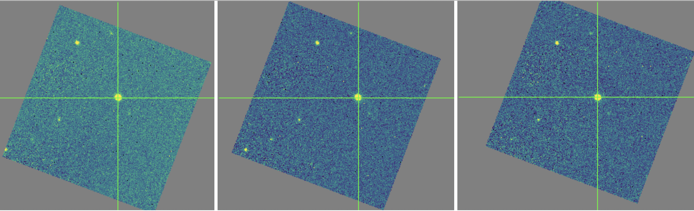

SI Observing Modes Supported
============================

FLITECAM instrument information
-------------------------------

The First Light Infrared Test Camera (FLITECAM) is an infrared camera,
operating in the 1.0 - 5.5 :math:`\mu m` range. It has a set of broadband
filters for imaging and a set of grisms and order sorting filters for medium
resolution spectroscopy.

The FLITECAM imaging mode provides seeing-limited images at 1 - 3
:math:`\mu m` and diffraction-limited images at 3 - 5.5 :math:`\mu m`
(McLean, et al. 2006). The array (InSb ALADDIN III) size is 1024 x 1024 with a
pixel scale of 0.47 arcseconds per pixel. This configuration results in a
field of view (FOV) of approximately 8.0 arcminutes,
but a circular stop and coma at the edges of the image restrict the
usable FOV to 5.6 arcminutes (see :numref:`flitecam_fov`).

FLITECAM has two filter
wheels that contain a set of broadband imaging filters, a suite of broad
order sorting filters for spectroscopy, and a few narrow-band imaging
filters. Available broadband imaging filters for FLITECAM are *J*, *H*, and
*K*. The narrow band filters are :math:`P_\alpha`, :math:`P_\alpha` *Continuum*,
:math:`3.0 \mu m` *ice*, and :math:`3.30 \mu m` *PAH*. In addition, FLITECAM
offers several filters with limited support:
:math:`H_{wide}`, :math:`K_{wide}`, :math:`K_{long}`, *L*, *nbL*, *L'*, *M*,
*nbM*, and *L+M*. Detailed information about filter
characteristics, saturation limits, sensitivities and observation
planning can be found in the FLITECAM chapter of the `SOFIA Observer's
Handbook <-https://irsa.ipac.caltech.edu/data/SOFIA/docs/sites/default/files/Other/Documents/OH-Cycle6.pdf#__WKANCHOR_3s>`__.

.. figure:: images/flitecam_fov.png
   :name: flitecam_fov
   :alt: Raw data with a large square and an oval inscribed
         around a darker area. Arrows point to small
         dark circles.

   A typical FLITECAM image obtained during a commissioning
   flight. The cyan box represents the usable portion of the array. Sources
   that fall outside of this box show too much coma for accurate PSF
   measurement. The small white dots visible in the image are hot pixels.
   The green ellipse encompasses a region of low quantum efficiency and the
   green arrows show obscurations in the optical path.

FLITECAM also has three grisms and five order-sorting filters that can
be combined in different ways in order to access the full 1 - 5 :math:`\mu m`
wavelength range. It has two slits, a narrow slit (1 arcsecond) and a wide slit
(~2 arcseconds), which allow for higher (R~2000) or lower (R~1300) resolution,
respectively. The slits are both 60 arcseconds long and are adjacent to each
other on the slit mask, such that spectra from both slits are acquired
simultaneously during an integration (see :numref:`flitecam_grism_fov`).

FLITECAM was retired from SOFIA operations, effective February 2018.
FLITECAM data is available for archival research via the
`SOFIA archive <https://irsa.ipac.caltech.edu/applications/sofia/>`__.

.. figure:: images/flitecam_grism_fov.png
   :name: flitecam_grism_fov
   :alt: Raw image with red lines flanking a bright rectangular area
         with a visible spectral trace.

   A typical FLITECAM grism observation taken with the wide slit. As
   with the raw imaging data, there are hot pixels scattered across
   the frame.  The wide-slit region is outlined in red; the
   narrow-slit region is visible to the right of the wide-slit region.
   Wavelength increases from the bottom to the top of the frame.

FLITECAM observing techniques
-----------------------------

In any given pixel on a detector, the total number of counts is given by
the sum of the counts from the dark current, telescope emission, sky
background, and the target itself. Since the sky level can vary
significantly over short timescales in the near infrared, it is typical
to take pairs of observations back-to-back and subtract them in order to
remove the dark current, telescope signal, and sky signal (to first
order). An A frame exposure of the target is immediately followed by a B
frame containing only sky at the target's position:

.. math::
   A &= dark + telescope + sky_A + target

   B &= dark + telescope + sky_B

   A - B &= target + (sky_A - sky_B)

Note that it is assumed that the sky level may vary somewhat between
frame A and frame B, but the dark current and telescope emission do not.
This residual sky emission is typically removed in the data reduction
process.

For FLITECAM imaging, there are two observing modes: stare and
nod-off-array. Both of these modes can be used with or without dithers.
Most FLITECAM observations using are performed
either in stare mode with dithers for uncrowded fields of view or
nod-off-array with dithers for crowded and extended emission fields of view.
In the first case, all dither positions are combined to produce a sky/flat
frame to correct each image. In the second case, only the sky
frames are combined to correct the on-source images.

FLITECAM grism observations offer two modes for producing A-B pairs.
In the nod-along-slit mode, the A frame is taken with the target
positioned one-third to one-quarter of the distance along the slit.
After the A frame is complete, the telescope moves to place the target
approximately the same distance from the other end of the slit. The
exposure taken in this configuration is the B frame. It is typical,
then, to repeat A-B pairs in either an A-B-A-B or A-B-B-A sequence until
the total desired integration time is achieved. In this mode, the A
frame provides the sky measurement at the target position for the B
frame, and the B frame provides the sky for the A frame. This mode is
useful as long as the target is compact, relative to the slit length.

In the second mode, nod-off-slit, the A frame is taken with the target
at the center of the slit. The B frame is taken with the target
completely off the slit, so that the exposure contains only the sky
signal. In this mode, the B frame exists only to provide the sky
measurement at the target position for the A frame, which may be useful
if the target is significantly extended. In this mode, too, either the
A-B-A-B or A-B-B-A observing sequence can be used.

Algorithm Description
=====================

Overview of data reduction steps
--------------------------------

This section will describe, in general terms, the major algorithms that
the FLITECAM Redux pipeline uses to reduce a FLITECAM observation.

The pipeline applies a number of corrections to each input file, regardless of
the observing mode used to take the data. The initial steps used for
imaging and grism modes are nearly identical. After preprocessing,
individual images or spectra of a source
must be combined to produce the final data product. This procedure depends
strongly on the instrument configuration and observation mode.

See :numref:`flitecam_flowchart_img` and :numref:`flitecam_flowchart_grism` for
flowcharts of the processing steps used by the imaging and grism pipelines.

.. figure:: images/flitecam_flowchart_img.png
   :name: flitecam_flowchart_img
   :height: 800
   :alt: Flowchart of processing steps for imaging data with cartoon
         depictions of all steps.

   Processing steps for imaging data.

.. figure:: images/flitecam_flowchart_grism.png
   :name: flitecam_flowchart_grism
   :height: 800
   :alt: Flowchart of processing steps for grism data with cartoon
         depictions of all steps.

   Processing steps for grism data.

Reduction algorithms
--------------------

The following subsections detail each of the data reduction pipeline
steps:

-  Imaging steps

   -  Correct for detector nonlinearity

   -  Clip image and clean bad pixels

   -  Correct gain

   -  Subtract background

   -  Register images

   -  Correct for atmospheric transmission (telluric correct)

   -  Coadd multiple observations

   -  Calibrate flux

-  Spectroscopy steps

   -  Correct for detector nonlinearity

   -  Pair-subtract and rotate spectral images

   -  Rectify spectral image

   -  Identify apertures

   -  Extract spectra

   -  Calibrate flux and correct for atmospheric transmission

   -  Combine multiple observations, or generate response spectra

Imaging steps
~~~~~~~~~~~~~

The following subsections detail each of the data reduction pipeline
steps outlined in the imaging flowchart (:numref:`flitecam_flowchart_img`).

.. _flitecam_nonlin:

Correct for detector nonlinearity
^^^^^^^^^^^^^^^^^^^^^^^^^^^^^^^^^

The first step of the imaging pipeline is to correct each input image for
detector nonlinearity and generate an uncertainty image that associates an
error value with each pixel in the flux image.

The nonlinearity coefficients for FLITECAM were determined by taking a
series of flat exposures with varying exposure times. The count rates at
each pixel in the flats were fit with a fourth order polynomial, and the
resulting coefficients were stored in a FITS image file as a 3D data
cube, where each plane corresponds to a different coefficient in the
polynomial fit.

Following the Spextool nonlinearity paper (Vacca et al., 2004; see the
:ref:`flitecam_resources` section), the coefficients are applied to the
raw data as follows.  First, the flat pedestal is determined from the first
plane of the linearity coefficients:

.. math::
   p_{flat} = C_0 \delta t_{flat}

where :math:`C_0` is the first coefficient plane and :math:`\delta t_{flat}`
is the readout time for the flats used as input.

The pedestal for the image to be corrected is determined iteratively.
The first estimate of the pedestal is:

.. math::
   p^{(1)} = \frac{S_{tot} \delta t}{n_r n_c \Delta t} \Big( \frac{n_r + 1}{2} - f \Big)

where :math:`S_{tot}` is the raw counts in the image, :math:`n_r` is
the number of readouts, :math:`n_c` is the number of hardware coadds,
:math:`\delta t` is the readout time, :math:`\Delta t` is the integration time,
and *f* is a fractional value indicating how long it takes for an individual
pixel to read out. Rigorously, *f* varies for each pixel, depending on its
position in the array; for FLITECAM, an average value of *f=0.5* is used for
all pixels.

Using this pedestal estimate, the signal for an individual readout is
estimated as:

.. math::
   s^{(1)} = \frac{S_{tot}}{n_r n_c} + p^{(1)}

and both pedestal and signal are corrected for nonlinearity. To
account for the pedestal value of the flats used to determine the
linearity coefficients, the coefficients are normalized by the first
coefficient plane, and the polynomial is applied to the value to
correct, minus the flat pedestal:

.. math::
   p^{(2)} = p^{(1)} \frac{C_0}{C_{nl} ( p^{(1)} - p_{flat} )}

   s^{(2)} = s^{(1)} \frac{C_0}{C_{nl} ( s^{(1)} - p_{flat} )}

where :math:`C_{nl}` is the full correction polynomial for each pixel in the
image. This process is then repeated once more, replacing :math:`S_{tot}` with

.. math::
   S_{tot}^{(2)} = n_c n_r s^{(2)} - n_c n_r p^{(2)} .

The final value for :math:`S_{tot}`, calculated from :math:`s^{(3)}` and
:math:`p^{(3)}`, is the linearity corrected image.

After linearity correction, the variance is calculated for each pixel
from:

.. math::
   V = \frac{S_{tot}}{g n_r n_c^2 \Delta t^2} \Big[1 - \frac{\delta t (n_r^2 - 1)}{3 n_r \Delta t} \Big] + \frac{2 \sigma_r^2}{g^2 n_r n_c \Delta t^2}

where *g* is the electronic gain and :math:`\sigma_r` is the read noise for the
detector (Vacca et al., 2004). This variance is propagated through all
remaining reduction steps and its square root (the uncertainty) is
recorded in all output files along with the image, as a separate extension
in the file. [#fn_flitecam_uncertainty]_

.. [#fn_flitecam_uncertainty]
   Earlier versions of this pipeline stored the uncertainty image as a
   second plane in a data cube in the output FITS files.  As of v2.0.0,
   the flux image is stored in the primary FITS extension and
   auxiliary data like the uncertainty, bad pixel mask, and exposure map
   are stored in separate extensions.

Finally, the units in the flux and uncertainty images are converted from
raw counts to counts per second by dividing by the integration time per
coadd (:math:`\Delta t`).

A bad pixel mask is also associated with the data after the nonlinearity
correction step, in a BADMASK FITS extension.  This initial mask marks any
saturated pixels, recorded before linearity correction is applied, as bad
pixels (0 = good, 1 = bad).  These pixels are replaced with NaN values so
that they do not propagate to subsequent steps.

Clip image and clean bad pixels
^^^^^^^^^^^^^^^^^^^^^^^^^^^^^^^

For the imaging pipeline, before proceeding, the linearity-corrected
images and the corresponding uncertainty images are clipped to
the size of the useful part of the detector (the cyan box in
:numref:`flitecam_fov`; see also :numref:`flitecam_clip`).

Hot and cold bad pixels are then identified in the clipped image by iteratively
searching for local outlier values.  Bad pixels are replaced with NaN
and their locations are added to the associated bad pixel mask.

.. Data source: flight 146, file 34-38

.. figure:: images/flitecam_clip.png
   :name: flitecam_clip
   :alt: Left: a raw image clipped to the
         rectangular FOV. Right: a bad pixel mask identifying scattered
         bad pixels.

   Left: a clipped image, taken as part of a stare mode observation,
   corrected for nonlinearity and with bad pixels set
   to NaN.  Right: the corresponding bad pixel mask.

Correct gain
^^^^^^^^^^^^

As with all modern near-IR detectors, raw images produced by FLITECAM
have significant pixel-to-pixel gain variations. In addition, FLITECAM's
detector has a large region of low quantum efficiency in the third quadrant
and the top of the fourth quadrant of the detector, as shown in
:numref:`flitecam_fov`. These gain variations can be corrected by dividing
by a normalized flat field image.

Imaging flats for FLITECAM are made from images of the sky. In
nod-off-array mode, dithered sky images are used to generate a flat that
is used to correct all on-source images. In stare mode, the dithered source
images themselves are used to generate the flat.  For each source image,
a different flat is created from the remaining source images in order not
to introduce correlations in the gain correction.  In either case, the
algorithm to generate the flat from the input files is the same.

First, all images are median-combined into a "draft" flat, with a sigma-clipping
outlier rejection algorithm. The draft flat is used to flat-correct
all input images. These draft images are then used to create object masks
that identify any strong sources in the frame, via an image segmentation
algorithm.  The raw images are then scaled to the median value across all
images and re-combined, ignoring any pixels identified in the object mask
for each frame.

When the final flat frame has been created, it is divided by its median
value to normalize it.  This normalization value is stored in the FITS
header in the FLATNORM keyword.  This value may optionally be used later to
correct for the sky background in the source images.

The final flat frame is divided into each source image to correct it for
gain variations (:numref:`flitecam_gaincor`).

.. figure:: images/flitecam_gaincor.png
   :name: flitecam_gaincor
   :alt: Left: corrected image flat background and sources are visible.
         Right: normalized flat with gain artifacts.

   Left: the stare mode image from :numref:`flitecam_clip`, corrected for
   gain variations.  Right: the normalized flat image used to correct the
   data, derived from the remaining dithers in the observation.

Subtract background
^^^^^^^^^^^^^^^^^^^

The sky background level must then be subtracted for each image. For
imaging frames, since the flat is made from sky image, the average
sky level is the median level of the unnormalized flat.
This sky level is subtracted from each source image. Optionally, the
median value of each individual image can be subtracted to correct for
residual sky level variations, in place of the median level from the flat.

The sky level correction is recommended for observations of diffuse sources,
for which emission fills the frame.  The median level correction is
recommended for observations in which the sky level varied significantly.

Register images
^^^^^^^^^^^^^^^

In order to combine multiple imaging observations of the same source,
each image must be registered to a reference image, so that the pixels
from each image correspond to the same location on the sky.

The registration information is typically encoded in the world coordinate
system (WCS) embedded in each FITS file header.  For most observations,
the WCS is sufficiently accurate that no change is required in the registration
step.  However, if the WCS is faulty, it may be corrected in the registration
step, using centroiding or cross-correlation between images to identify common
sources.  In this case,the first image is taken as the reference image,
and calculated offsets are applied to the WCS header keywords (CRPIX1 and
CRPIX2) in all subsequent images (:numref:`flitecam_register`). [#fn_register]_

.. [#fn_register]
   Earlier versions of this pipeline applied registration to the images
   themselves, rather than to the WCS in the FITS header, interpolating
   them into the same spatial grid.  As of v2.0.0, registration affects
   only the CRPIX1 and CRPIX2 keywords in the header.

         marking the location of the brightest source.

   Three dither positions from the stare mode observation of
   :numref:`flitecam_clip`.  The WCS was inaccurate for this observation,
   so the centroiding algorithm was used to correct the registration
   for these images. The registered images have not changed in dimension,
   but the FITS header keywords have been corrected to align them into
   a reference coordinate frame.

Correct for atmospheric transmission
^^^^^^^^^^^^^^^^^^^^^^^^^^^^^^^^^^^^

For accurate flux calibration, the pipeline must first correct for the
atmospheric opacity at the time of the observation. In order to combine
images taken in different atmospheric conditions, or at different
altitudes or zenith angles, the pipeline corrects the flux in each
individual registered file for the estimated atmospheric transmission
during the observations, based on the altitude and zenith angle at the
time when the observations were obtained, relative to that computed for
a reference altitude (41,000 feet) and reference zenith angle (45
degrees), for which the instrumental response has been calculated. The
atmospheric transmission values are derived from the ATRAN code
provided to the SOFIA program by Steve Lord. The pipeline applies the
telluric correction factor directly to the flux in the image, and
records it in the header keyword TELCORR.

After telluric correction, the pipeline performs aperture photometry on
all observations that are marked as flux
standards (FITS keyword OBSTYPE = STANDARD\_FLUX). The brightest source
in the field is fit with a Moffat profile to determine its centroid, and
then its flux is measured, using an aperture of 12 pixels and a
background region of 15-25 pixels. The aperture flux and error, as well
as the fit characteristics, are recorded in the FITS header, to be used
in the flux calibration process.

Coadd multiple observations
^^^^^^^^^^^^^^^^^^^^^^^^^^^

After registration and scaling, the pipeline coadds multiple
observations of the same source with the same instrument configuration
and observation mode. Each image is projected into the coordinate system
of the first image, using its WCS to transform input coordinates into output
coordinates.  An additional offset may be applied for non-sidereal targets
in order to correct for the motion of the target across the sky, provided
that the target position is recorded in the FITS headers (TGTRA and TGTDEC).
The projection is performed with a bilinear interpolation, then individual
images are mean- or median-combined, with optional error weighting and robust
outlier rejection.

For flux standards, photometry calculations are repeated on the coadded
image, in the same way they were performed on the individual images.

Calibrate flux
^^^^^^^^^^^^^^

For the imaging mode, flux calibration factors are typically calculated from
all standards observed within a flight series. These calibration factors are
applied directly to the flux images to produce an image calibrated to
physical units. The final Level 3 product has image units of Jy per pixel
(:numref:`flitecam_coadd`). [#fn_flitecam_flux]_

See the flux calibration section, below, for more information.

.. [#fn_flitecam_flux]
   Earlier versions of this pipeline did not produce a final
   calibrated file. Prior to v1.2.0, the final Level 3 products had image
   units of DN/sec, with the flux calibration factor (DN/sec/Jy) recorded
   in the FITS header keyword, CALFCTR. To convert these products to
   Jy/pixel, divide the flux image by the CALFCTR value.

.. figure:: images/flitecam_coadd.png
   :name: flitecam_coadd
   :alt: A rotated rectangular field, with several sources visible and
         black outer borders with no data.

   The final coadded, calibrated image for the dithered stare mode observation
   of :numref:`flitecam_clip`.  The final image is rotated into a standard
   North-up, East-left orientation.

Mosaic
^^^^^^

In some cases, it may be useful to stack together separate calibrated
observations of the same target. In order to create a deeper image of a
faint target, for example, observations taken across multiple flights
may be combined together. Large maps may also be generated by taking
separate observations, and stitching together the results. In these
cases, the pipeline may register these files and coadd them, using the
same methods as in the initial registration and coadd steps. The output
product is a LEVEL\_4 mosaic.

Spectroscopy Reduction algorithms
~~~~~~~~~~~~~~~~~~~~~~~~~~~~~~~~~

The following subsections detail each of the data reduction pipeline
steps outlined in the grism flowchart (:numref:`flitecam_flowchart_grism`).

Image Processing
^^^^^^^^^^^^^^^^

As for the FLITECAM imaging mode, the pipeline first corrects the input
images for detector nonlinearity and creates an uncertainty image, using the
algorithm described above, in the :ref:`flitecam_nonlin` section).
Then, the pipeline does A-B pair subtraction of all the input images.
It also divides by a normalized flat image, if available. The
resulting signal in the 2-D spectrum is:

.. math::
   S_{AB} = \frac{S_A - S_B}{flat}

where :math:`S_A` is the corrected counts per second in frame A, :math:`S_B` is
the corrected counts per second in frame B, and *flat* is the normalized flat image.

Alongside the image processing, the individual variances for the A
frame, B frame, and flat are combined as follows to get the total
variance for the 2-D spectrum:

.. math::
   V_{AB} = \frac{V_{A} + V_{B}}{flat^2} + \frac{V_{flat} S_{AB}^2}{flat^2}

where :math:`V_A` is the variance of frame A, :math:`V_B` is the variance of
frame B, and :math:`V_{flat}` is the variance of the normalized flat image.

Stack common dithers
^^^^^^^^^^^^^^^^^^^^
For very faint spectra, a stacking step may be optionally performed before
spectral extraction. This step identifies spectra at common dither positions
and mean- or median-combines them in order to increase signal-to-noise.
This step may be applied if spectra are too faint to automatically identify
appropriate apertures.

.. _flitecam_rectify_image:

Rectify spectral image
^^^^^^^^^^^^^^^^^^^^^^
For the spectroscopic mode, spatial and spectral distortions are
corrected for by defining calibration images that assign a wavelength
coordinate (in :math:`\mu m`) and a spatial coordinate (in *arcsec*) to each
detector pixel within the slit region of the detector
(see :numref:`flitecam_grism_fov`).  Each 2D spectral image in
an observation is clipped and resampled into a rectified spatial-spectral
grid, using these coordinates to define the output grid.  If appropriate
calibration data is available, the output from this step is an image in which
wavelength values are constant along the columns, and spatial values are
constant along the rows, correcting for any curvature in the spectral trace
(:numref:`flitecam_rectified`).

The calibration maps used in rectification are generated from identifications
of sky emission and telluric absorption lines and a polynomial fit to centroids
of those features in pixel space for each row (i.e. along the dispersion
direction). The derivation of a wavelength calibration is an interactive process,
but application of the derived wavelength calibration is an automatic part
of the data reduction pipeline. The default wavelength calibration is
expected to be good to within approximately one pixel in the output
spectrum.

For some observational cycles, sufficient calibration data may not be available,
resulting in some residual spectral curvature, or minor wavelength calibration
inaccuracies.  The spectral curvature can be compensated for, in sources
with strong continuum emission, by tracing the continuum center during
spectral extraction (see next section).  For other sources, a wider
aperture may be set, at the cost of decreased signal-to-noise.

Additionally, a correction that accounts
for spatial variations in the instrumental throughput may be applied to the
rectified image. This "slit correction function" is a function of the position
of the science target spectrum along the slit relative to that used for
the standard stars.  The slit function image is produced in a separate
calibration process, from wavelength-rectified, averaged sky frames.

.. Data source: flight 147, file 371-372

.. figure:: images/flitecam_rectified.png
   :name: flitecam_rectified
   :alt: Top: full square array with two traces. Bottom:
         smaller rectangle containing only the slit region of the detector.

   A nod-along-slit spectral image after pair-subtraction, before (top)
   and after (bottom) rectification.  Black spots indicate NaN values,
   marking saturated pixels identified during the nonlinearity correction
   step.  Further bad pixels will be identified and ignored later in the
   extraction process.

.. _flitecam_set_apertures:

Identify apertures
^^^^^^^^^^^^^^^^^^
In order to aid in spectral extraction, the pipeline constructs a smoothed
model of the relative intensity of the target spectrum at each spatial
position, for each wavelength. This spatial profile is used to compute
the weights in optimal extraction or to fix bad pixels in standard
extraction (see next section). Also, the pipeline uses the median profile,
collapsed along the wavelength axis, to define the extraction
parameters.

To construct the spatial profile, the pipeline first subtracts the median
signal from each column in the rectified spectral image to remove the residual
background.  The intensity in this image in column *i* and row *j* is given by

   :math:`O_{ij} = f_{i}P_{ij}`

where :math:`f_i` is the total intensity of the spectrum at
wavelength *i*, and :math:`P_{ij}` is the spatial profile at column *i*
and row *j*. To get the spatial profile :math:`P_{ij}`, we must
approximate the intensity :math:`f_i`. To do so, the pipeline computes a
median over the wavelength dimension (columns) of the order image to get a
first-order approximation of the median spatial profile at each row
:math:`P_j`. Assuming that

   :math:`O_{ij} \approx c_{i}P_{j}`,

the pipeline uses a linear least-squares algorithm to fit :math:`P_j` to
:math:`O_{ij}` and thereby determine the coefficients :math:`c_i`. These
coefficients are then used as the first-order approximation to :math:`f_i`:
the resampled order image :math:`O_{ij}` is divided by :math:`f_i` to derive
:math:`P_{ij}`.  The pipeline then fits a low-order polynomial along the
columns at each spatial point *s* in order to smooth the profile and
thereby increase its signal-to-noise. The coefficients of these fits can
then be used to determine the value of :math:`P_{ij}` at any column *i* and
spatial point *j* (see :numref:`flitecam_profile`, left). The median of :math:`P_{ij}`
along the wavelength axis generates the median spatial profile, :math:`P_j`
(see :numref:`flitecam_profile`, right).

.. Plot source code:

   from astropy.io import fits
   import numpy as np
   from matplotlib import pyplot as plt

   hdul = fits.open('F0147_FC_GRI_850003101_FLTB3J_RIM_0371-0372.fits')
   smap = hdul[5].data
   sprof = hdul[6].data
   x, y = np.meshgrid(np.arange(smap.shape[1]), np.arange(smap.shape[0]))

   fig = plt.figure()

   ax = fig.add_subplot(1, 2, 1, projection='3d')
   surf = ax.plot_surface(x, y, smap, cmap='viridis',
                          antialiased=False, linewidth=0)
   ax.set_xlabel('Wavelength\n(column pixels)', fontsize='small')
   ax.set_ylabel('Slit position\n(row pixels)', fontsize='small')
   ax.set_zlabel('Relative flux', fontsize='small')
   ax.tick_params(axis='both', which='major', labelsize=8)
   plt.gca().invert_xaxis()

   ax = fig.add_subplot(1, 2, 2)
   surf = ax.plot(sprof, color='#298289')
   ax.set_xlabel('Slit position (row pixels)')
   ax.set_ylabel('Relative flux')

   fig.suptitle('Spatial Map and Median Profile')

   fig.tight_layout()
   plt.show()

.. figure:: images/flitecam_profile.png
   :name: flitecam_profile
   :alt: Left: 3D surface in slit position vs. wavelength
         vs. flux.  Right: 1D plot of slit position vs.
         flux.

   Spatial model and median spatial profile, for the image in
   :numref:`flitecam_rectified`.  The spatial model image here
   is rotated for comparison with the profile plot: the y-axis is
   along the bottom of the surface plot; the x-axis is along the left.

The pipeline then uses the median spatial profile to identify extraction
apertures for the source. The aperture centers can be identified
automatically by iteratively finding local maxima in the absolute value
of the spatial profile, or can be specified directly by the user.  By
default, a single aperture is expected and defined for nod-off-slit mode;
two apertures are expected for nod-along-slit mode.

The true position of the aperture center may vary somewhat
with wavelength, as a result of small optical effects or atmospheric
dispersion. To account for this variation, the pipeline attempts to
trace the spectrum across the array. It fits a Gaussian in the spatial
direction, centered at the specified position, at regular intervals in
wavelength. The centers of these fits are themselves fitted with a
low-order polynomial; the coefficients of these fits give the trace
coefficients that identify the center of the spectral aperture at each
wavelength. For extended sources, the continuum cannot generally be
directly traced. Instead, the pipeline fixes the aperture center to a
single spatial value.

Besides the aperture centers, the pipeline also specifies a PSF radius,
corresponding to the distance from the center at which the flux from the
source falls to zero. By default, this value is automatically determined from the
width of a Gaussian fit to the peak in the median spatial profile, as

  :math:`R_{psf} = 2.15 \cdot \text{FWHM}`.

For optimal extraction, the pipeline also identifies a smaller aperture
radius, to be used as the integration region:

  :math:`R_{ap} = 0.7 \cdot \text{FWHM}`.

This value should give close to optimal signal-to-noise for a Moffat or
Gaussian profile.  The pipeline also attempts to specify background regions
outside of any extraction apertures, for fitting and removing the residual
sky signal.  All aperture parameters may be optionally overridden by the
pipeline user.

Spectral extraction and merging
^^^^^^^^^^^^^^^^^^^^^^^^^^^^^^^

The spectral extraction algorithms used by the pipeline offer two
different extraction methods, depending on the nature of the target
source. For point sources, the pipeline uses an optimal extraction
algorithm, described at length in the Spextool paper (see the
:ref:`flitecam_resources` section, below, for a reference).
For extended sources, the pipeline uses a standard summing extraction.

In either method, before extracting a spectrum, the pipeline first uses
any identified background regions to find the residual sky background
level. For each column in the 2D image, it fits a low-order
polynomial to the values in the specified regions, as a function of
slit position. This polynomial determines the wavelength-dependent
sky level (:math:`B_{ij}`) to be subtracted from the spectrum
(:math:`D_{ij}`).

The standard extraction method uses values from the spatial profile image
(:math:`P_{ij}`) to replace bad pixels and outliers, then sums the flux
from all pixels contained within the PSF radius. The flux at column
*i* is then:

   :math:`f_{i,\text{sum}} = \sum_{j=j_1}^{j_2}(D_{ij} - B_{ij})`

where :math:`j_1` and :math:`j_2` are the upper and lower limits of the extraction
aperture (in pixels):

   :math:`j_1 = t_i - R_{PSF}`

   :math:`j_2 = t_i + R_{PSF}`

given the aperture trace center (:math:`t_i`) at
that column. This extraction method is the only algorithm available
for extended sources.

Point sources may occasionally benefit from using standard extraction,
but optimal extraction generally produces higher signal-to-noise ratios
for these targets. This method works by weighting each pixel in the
extraction aperture by how much of the target’s flux it contains.
The pipeline first normalizes the spatial profile by the sum of the spatial
profile within the PSF radius defined by the user:

   :math:`P_{ij}^{'} = P_{ij} \Big/ \sum_{j=j_1}^{j_2}P_{ij}`.

:math:`P_{ij}^{'}` now represents the fraction of the total flux from
the target that is contained within pixel *(i,j)*, so that
:math:`(D_{ij} - B_{ij}) / P_{ij}^{'}` is a set of *j* independent
estimates of the total flux at column *i*. The pipeline does a weighted
average of these estimates, where the weight depends on the pixel's
variance and the normalized profile value. Then, the flux at column *i* is:

   :math:`f_{i,\text{opt}} = \frac{\sum_{j=j_3}^{j_4}{M_{ij}P_{ij}^{'}(D_{ij} - B_{ij}) \big/ (V_{D_{ij}} + V_{B_{ij}})}}{\sum_{j=j_3}^{j_4}{M_{ij}{P_{ij}^{'}}^{2} \big/ (V_{D_{ij}} + V_{B_{ij}})}}`

where :math:`M_{ij}` is a bad pixel mask and :math:`j_3`
and :math:`j_4` are the upper and lower limits given by the aperture radius:

   :math:`j_3 = t_i - R_{ap}`

   :math:`j_4 = t_i + R_{ap}`

Note that bad pixels are simply ignored, and outliers will have little
effect on the average because of the weighting scheme.

The variance for the standard spectroscopic extraction is a simple sum of the
variances in each pixel within the aperture. For the optimal extraction
algorithm, the variance on the *i*\ th pixel in the extracted spectrum
is calculated as:

.. math::
    V_{i} = \sum_{j=j_3}^{j_4} \frac{M_{ij}}{{P_{ij}^{'}}^2 V_{ij}}

where :math:`P_{ij}^{'}` is the scaled spatial profile, :math:`M_{ij}` is
a bad pixel mask, :math:`V_{ij}` is the variance at each background-subtracted
pixel, and the sum is over all spatial pixels :math:`j` within the aperture
radius. The error spectrum for 1D spectra is the square root of the
variance.

.. _flitecam_spectral_calibration:

Calibrate flux and correct for atmospheric transmission
^^^^^^^^^^^^^^^^^^^^^^^^^^^^^^^^^^^^^^^^^^^^^^^^^^^^^^^

Extracted spectra are corrected individually for instrumental
response and atmospheric transmission, a process that yields a
flux-calibrated spectrum in units of Jy per pixel. See the
section on flux calibration, below, for more detailed information.

The rectified spectral images are also corrected for atmospheric transmission,
and calibrated to physical units in the same manner.  Each row of the image
is divided by the same correction as the 1D extracted spectrum.  This image
is suitable for custom extractions of extended fields: a sum over any number of
rows in the image produces a flux-calibrated spectrum of that region,
in the same units as the spectrum produced directly by the pipeline.

Note that the FITS header for the primary extension for this product
(PRODTYPE = 'calibrated_spectrum')
contains a full spatial and spectral WCS that can be used to identify
the coordinates of any spectra so extracted.  The primary WCS identifies
the spatial direction as arcseconds up the slit, but a secondary WCS
with key = 'A' identifies the RA, Dec, and wavelength of every pixel
in the image. [#fn_flitecam_wcs]_  Either can be extracted and used for pixel identification
with standard WCS manipulation packages, such as the
`astropy WCS package <http://docs.astropy.org/en/stable/wcs/>`__\ .

After telluric correction, it is possible to apply a correction to the
calibrated wavelengths for the motion of the Earth relative to the solar
system barycenter at the time of the observation.  For FLITECAM resolutions,
we expect this wavelength shift to be a small fraction of a pixel, well within
the wavelength calibration error, so we do not directly apply it to the data.
The shift (as :math:`d\lambda / \lambda`) is calculated and stored in the
header in the BARYSHFT keyword.  An additional wavelength correction to the
local standard of rest (LSR) from the barycentric velocity is also stored in
the header, in the LSRSHFT keyword.

.. [#fn_flitecam_wcs]
   The overall accuracy of the FLITECAM WCS in spectroscopic mode has
   not been studied in detail.  In particular, for nod-along-slit data,
   no attempt has been made to co-align positive and negative spectral
   traces in the 2D spectral image.  The reference position for the
   WCS may refer to one or neither of the spectral positions in the
   rectified 2D image.

Combine multiple observations
^^^^^^^^^^^^^^^^^^^^^^^^^^^^^

The final pipeline step for most grism observation modes is
coaddition of multiple spectra of the same
source with the same instrument configuration and observation mode. The
individual extracted 1D spectra are combined with a robust weighted
mean, by default.  The 2D spectral images are also coadded, using the same
algorithm as for imaging coaddition, and the spatial/spectral WCS to project
the data into a common coordinate system.

Reductions of flux standards have an alternate final product
(see :ref:`flitecam_response`, below).

.. _flitecam_response:

Response spectra
^^^^^^^^^^^^^^^^

The final product of pipeline processing of telluric standards is not a
calibrated, combined spectrum, but rather an instrumental response
spectrum that may be used to calibrate science target spectra.  These
response spectra are generated from individual observations of
calibration sources by dividing the observed spectra by a model of the
source multiplied by an atmospheric model.  The resulting response
curves may then be combined with other response spectra from a flight
series to generate a final instrument response spectrum that is used in
calibrating science spectra.  See the flux calibration section, below,
for more information.

.. _flitecam_resources:

Other Resources
---------------

For more information on the instrument itself, see the FLITECAM paper:

   `FLITECAM: a 1-5 micron camera and spectrometer for
   SOFIA <http://adsabs.harvard.edu/abs/2006SPIE.6269E.168M>`__\ *, Ian
   S.* McLean, et al. (2006, SPIE 6269E, 168).

For more information on the algorithms used in spectroscopic
data reduction, see the Spextool papers:

   `Spextool: A Spectral Extraction Package for SpeX, a 0.8-5.5 Micron
   Cross-Dispersed
   Spectrograph <http://irtfweb.ifa.hawaii.edu/~spex/Spextool.pdf>`__\ *,*
   Michael C. Cushing, William D. Vacca and John T. Rayner (2004, PASP
   116, 362).

   `A Method of Correcting Near-Infrared Spectra for Telluric
   Absorption <http://irtfweb.ifa.hawaii.edu/~spex/Telluric.pdf>`__\ *,*
   William D. Vacca, Michael C. Cushing and John T. Rayner (2003, PASP
   115, 389).

   `Nonlinearity Corrections and Statistical Uncertainties Associated
   with Near-Infrared
   Arrays <http://irtfweb.ifa.hawaii.edu/~spex/Nonlinearity.pdf>`__\ *,*
   William D. Vacca, Michael C. Cushing and John T. Rayner  (2004, PASP
   116, 352).

Flux calibration
================

Imaging Flux Calibration
------------------------

The reduction process, up through image coaddition, generates Level 2
images with data values in units of counts per second (ct/s).
After Level 2 imaging products are generated, the pipeline derives the
flux calibration factors (in units of ct/s/Jy) and applies them to
each image. The calibration factors are derived for each FLITECAM filter
configuration from observations of calibrator stars.

After the calibration factors have been derived, the coadded flux
is divided by the appropriate factor to produce the Level 3 calibrated
data file, with flux in units of Jy/pixel.  The value used is stored in
the FITS keyword CALFCTR.

Reduction steps
~~~~~~~~~~~~~~~

The calibration is carried out in several steps. The first step consists
of measuring the photometry of all the standard stars for a specific
mission or flight series, after the images have been corrected for the
atmospheric transmission relative to that for a reference altitude and
zenith angle [#fn_flitecam_atran]_. The pipeline performs aperture photometry on the
reduced Level 2 images of the standard stars after the registration
stage using a photometric aperture radius of 12 pixels. The telluric-corrected
photometry of the standard star is related to the measured photometry of the star via

.. math:: N_{e}^{std,corr} = N_{e}^{std} \frac{R_{\lambda}^{ref}}{R_{\lambda}^{std}}

where the ratio :math:`R_{\lambda}^{ref} / R_{\lambda}^{std}`
accounts for differences in system response (atmospheric transmission)
between the actual observations and those for the reference altitude of
41000 feet and a telescope elevation of 45\ :math:`^\circ`. Similarly, for the science
target, we have

.. math:: N_{e}^{obj,corr} = N_{e}^{obj} \frac{R_{\lambda}^{ref}}{R_{\lambda}^{obj}}

Calibration factors (in ct/s/Jy) for each filter are then derived from
the measured photometry (in ct/s) and the known fluxes of the standards
(in Jy) in each filter. These predicted fluxes were computed by
multiplying a model stellar spectrum by the overall filter + instrument
+ telescope + atmosphere (at the reference altitude and zenith angle)
response curve and integrating over the filter passband to compute the
mean flux in the band. The adopted filter throughput curves are those
provided by the vendor. The instrument throughput is calculated by
multiplying an estimate of the instrumental optics transmission(0.80)
and the detector quantum efficiency (0.56). The FLITECAM overall
throughput is (0.285). The telescope throughput value is assumed to be
constant (0.85) across the entire FLITECAM wavelength range.

Photometric standards for FLITECAM have been chosen from three
sources: (1) bright stars with spectral classifications of A0V as
listed in SIMBAD; (2) Landolt SA stars (K giants and A0-4 main sequence
stars) listed as 'supertemplate' stars in Cohen et al. (2003); K giant stars
listed as 'spectral template' stars in Cohen et al. (1999). For all of these
objects, models are either available (from the Cohen papers) or
derivable (from a model of Vega for the A0V stars). Use of the A0V stars
requires scaling the Vega model to the observed magnitudes of the target
and reddening the model to match the observed color excess of the target.
It should be noted that A0V stars should be used to calibrate the Pa alpha
filter, as these objects have a strong absorption feature in this band.
The models of the spectral template K giants listed
in Cohen et al. (1999) extend down only to 1.2 microns, and therefore
cannot be used to calibrate the J band filter.

The calibration factor, *C*, is computed from

.. math:: C = \frac{N_e^{std,corr}}{F_{\nu}^{nom,std}(\lambda_{ref})} = \frac{N_e^{std,corr}}{\langle F_{\nu}^{std} \rangle} \frac{\lambda^2_{piv}}{\langle \lambda \rangle \lambda_{ref}}

with an uncertainty given by

.. math:: \bigg( \frac{\sigma_C}{C} \bigg)^2 = \bigg( \frac{\sigma_{N_e^{std}}}{N_e^{std}} \bigg)^2 + \bigg( \frac{\sigma_{\langle F_{\nu}^{std} \rangle}}{\langle F_{\nu}^{std} \rangle} \bigg)^2 .

Here, :math:`\lambda_{piv}` is the pivot wavelength of the filter, and :math:`\langle \lambda \rangle` is
the mean wavelength of the filter. The calibration factor refers to a
nominal flat spectrum source at the reference
wavelength :math:`\lambda_{ref}`.

The calibration factors derived from each standard for each filter are
then averaged. The pipeline inserts this value and its associated
uncertainty into the headers of the Level 2 data files for the flux
standards, and uses the value to produce calibrated flux standards.
The final step involves examining the calibration values and
ensuring that the values are consistent. Outlier values may come from
bad observations of a standard star; these values are removed to produce
a robust average of the calibration factor across the flight series. The
resulting average values are then used to calibrate the observations of
the science targets.

Using the telluric-corrected photometry of the standard,
:math:`N_e^{std,corr}` (in ct/s), and the predicted mean fluxes
of the standards in each filter, :math:`\langle F_{\nu}^{std} \rangle`
(in Jy), the flux of a target object is given by

.. math:: F_{\nu}^{nom,obj}(\lambda_{ref}) = \frac{N_e^{obj,corr}}{C}

where :math:`N_e^{obj,corr}` is the telluric-corrected count
rate in ct/s detected from the source, :math:`C` is the
calibration factor (ct/s/Jy), and
:math:`F_{\nu}^{nom,obj}(\lambda_{ref})` is the flux in Jy of a
nominal, flat spectrum source (for which :math:`F_{\nu} \sim \nu^{-1}`)
at a reference wavelength :math:`\lambda_{ref}`.

The values of :math:`C`, :math:`\sigma_C`, and :math:`\lambda_{ref}` are written into
the headers of the calibrated (PROCSTAT=LEVEL_3 ) data as the keywords CALFCTR, ERRCALF, and
LAMREF, respectively. The reference wavelength :math:`\lambda_{ref}` for these
observations was taken to be the mean wavelengths of the filters,
:math:`\langle \lambda \rangle`.

Note that :math:`\sigma_C`, as stored in the ERRCALF value,
is derived from the standard deviation of the calibration factors
across multiple flights.  These values are typically on the order of
about 6%.  There is an additional systematic
uncertainty on the stellar models, which is on the order of
3-6%.

.. [#fn_flitecam_atran]
   The atmospheric transmission in each filter has been computed using
   the ATRAN code (Lord 1992) for a range of observatory altitudes
   (corresponding to a range of overhead precipitable water vapor
   values) and telescope elevations. The ratio of the transmission at
   each altitude and zenith angle relative to that at the reference
   altitude (41000 feet) and zenith angle (45 degrees) has been
   calculated for each filter and fit with a low order polynomial. The
   ratio appropriate for the altitude and zenith angle of each
   observation is calculated and applied to each image.

Color corrections
~~~~~~~~~~~~~~~~~

An observer often wishes to determine the true flux of an object at the
reference wavelength, :math:`F_{\nu}^{obj}(\lambda_{ref})`, rather
than the flux of an equivalent nominal, flat spectrum source. To do
this, we define a color correction *K* such that

.. math:: K = \frac{F_{\nu}^{nom,obj}(\lambda_{ref})}{F_{\nu}^{obj}(\lambda_{ref})}

where :math:`F_{\nu}^{nom,obj}(\lambda_{ref})` is the flux density
obtained by measurement on a data product. Divide the measured
values by *K* to obtain the "true" flux density. In terms of the
wavelengths defined above,

.. math:: K = \frac{\langle \lambda \rangle \lambda_{ref}}{\lambda_{piv}^2}\frac{\langle F_{\nu}^{obj} \rangle}{F_{\nu}^{obj}(\lambda_{ref})} .

For most filters and spectral shapes, the color corrections are small
(<10%). Tables listing *K* values and filter wavelengths are available
from the `SOFIA website <https://irsa.ipac.caltech.edu/data/SOFIA/docs/data/data-processing/>`__\ .

Spectrophotometric Flux Calibration
-----------------------------------

The common approach to characterizing atmospheric transmission for
ground-based infrared spectroscopy is to obtain, for every science
target, similar observations of a spectroscopic standard source with as
close a match as possible in both airmass and time. Such an approach is
not practical for airborne observations, as it imposes too heavy a
burden on flight planning and lowers the efficiency of science
observations. Therefore, we employ a calibration plan that incorporates
a few observations of a calibration star per flight and a model of the
atmospheric absorption for the approximate altitude and airmass (and
precipitable water vapor, if known) at which the science objects were
observed.

Instrumental response curves are generated from the extracted spectra of
calibrator targets, typically A0V stars with stellar models constructed
from a model of Vega. The
extracted spectra are corrected for telluric absorption using the ATRAN
models corresponding to the altitude and zenith angle of the calibrator
observations, smoothed to the nominal resolution for the grism/slit
combination, and sampled at the observed spectral binning. The
telluric-corrected spectra are then divided by the appropriate models to
generate response curves (with units of ct/s/Jy at each wavelength) for
each grism passband. The response curves
derived from the various calibrators for each instrumental combination
are then combined and smoothed to generate a set of master instrumental
response curves. The statistical uncertainties on these response curves
are on the order of 5-10%.

Flux calibration of FLITECAM grism data for a science target is
currently carried out in a two-step process:

1. For any given observation of a science target, the closest telluric
   model (in terms of altitude and airmass of the target observations)
   is selected and then smoothed to the observed resolution and sampled
   at the observed spectral binning. The observed spectrum is then
   divided by the smoothed and re-sampled telluric model.

2. The telluric-corrected spectrum is then divided by a response
   function corresponding to the observed instrument mode to convert
   DN/s to Jy at each pixel.

In order to account for any wavelength shifts between the models and
the observations, an optimal shift is estimated by minimizing the
residuals of the corrected spectrum, with respect to small relative
wavelength shifts between the observed data and the telluric
spectrum.  This wavelength shift is applied to the data before dividing
by the telluric model and response function.

Based on our experience with FORCAST calibration, and with using A0V
stars to calibrate near-infrared data, we expect the overall error in
the flux calibration to be about 10-20%. However, the uncertainty on the
slope of the calibrated spectrum should be substantially less than that,
on the order of a few percent (see e.g., Cushing et al. 2005; Rayner et
al. 2009). The Level 3 data product for any grism includes the
calibrated spectrum and an error spectrum that incorporates these RMS
values. The adopted telluric absorption model and the
instrumental response functions are also provided in the output product.

As for any slit spectrograph, highly accurate absolute flux levels from
FLITECAM grism observations (for absolute spectrophotometry, for
example) require additional photometric observations to correct the
calibrated spectra for slit losses that can be variable (due to varying
image quality) between the spectroscopic observations of the science
target and the calibration standard.

Data products
=============

Filenames
---------

FLITECAM output files from Redux are named according to the convention:

    FILENAME = *F\[flight\]\_FC\_IMA\|GRI\_AOR-ID\_SPECTEL1\_Type\_FN1\[-FN2\]*.fits

where flight is the SOFIA flight number, FC is the instrument
identifier, IMA or GRI specifies that it is an imaging or grism file,
AOR-ID is the AOR identifier for the observation, SPECTEL1 is the
keywords specifying the filter or grism used,
Type is three letters identifying the product type (listed in
:numref:`flitecam_img_prod` and :numref:`flitecam_gri_prod` below),
and FN1 is the file number corresponding to the input file.
FN1-FN2 is used if there are multiple input files for a single output
file, where FN1 is the file number of the first input file and FN2 is
the file number of the last input file.

Pipeline Products
-----------------

The following tables list all intermediate products generated by
the pipeline for imaging and grism modes, in the order in which they
are produced. [#fn_flitecam_pipeprod]_  The product type
is stored in the FITS headers under the keyword PRODTYPE. By default,
for imaging, the *flat*, *telluric\_corrected*, *coadded*, and *calibrated*
products are saved. For spectroscopy, the *spectral\_image*,
*rectified_image*, *spectra*, *spectra_1d*, *calibrated_spectrum*,
*coadded_spectrum*, and *combined_spectrum* products are saved.

The final grism mode output product from the Combine Spectra or Combine Response
steps are dependent on the input data: for OBSTYPE=STANDARD\_TELLURIC, the
*instrument\_response* is produced instead of a *coadded\_spectrum* and *combined\_spectrum*.

For most observation modes, the pipeline additionally produces an image in PNG
format, intended to provide a quick-look preview of the data contained in
the final product.  These auxiliary products may be distributed to observers
separately from the FITS file products.

.. [#fn_flitecam_pipeprod]
    Earlier versions of this pipeline (before v2.0.0) produced different
    sets of default products.  Refer to earlier revisions of this manual
    for complete information.

.. table:: Intermediate and final data products for imaging reductions
   :name: flitecam_img_prod
   :class: longtable
   :widths: 20 14 18 18 10 12 26

   +------------------------+-----------------+-----------------------+----------------+------------+------------+------------------------+
   || **Step**              || **Data type**  || **PRODTYPE**         || **PROCSTAT**  || **Code**  || **Saved** || **Extensions**        |
   +========================+=================+=======================+================+============+============+========================+
   || Correct Nonlinearity  || 2D image       || linearized           || LEVEL\_2      || LNZ       || N         || FLUX, ERROR, BADMASK  |
   +------------------------+-----------------+-----------------------+----------------+------------+------------+------------------------+
   || Clip Image            || 2D image       || clipped              || LEVEL\_2      || CLP       || N         || FLUX, ERROR,          |
   ||                       ||                ||                      ||               ||           ||           || BADMASK, EXPOSURE     |
   +------------------------+-----------------+-----------------------+----------------+------------+------------+------------------------+
   || Make Flat             || 2D image       || flat                 || LEVEL\_2      || FLT       || Y         || FLUX, ERROR,          |
   ||                       ||                ||                      ||               ||           ||           || BADMASK, EXPOSURE     |
   ||                       ||                ||                      ||               ||           ||           || FLAT, FLAT_ERROR,     |
   ||                       ||                ||                      ||               ||           ||           || FLAT_BADMASK          |
   +------------------------+-----------------+-----------------------+----------------+------------+------------+------------------------+
   || Correct Gain          || 2D image       || gain\_               || LEVEL\_2      || GCR       || N         || FLUX, ERROR,          |
   ||                       ||                || corrected            ||               ||           ||           || BADMASK, EXPOSURE     |
   +------------------------+-----------------+-----------------------+----------------+------------+------------+------------------------+
   || Subtract Sky          || 2D image       || background\_         || LEVEL\_2      || BGS       || N         || FLUX, ERROR,          |
   ||                       ||                || subtracted           ||               ||           ||           || BADMASK, EXPOSURE     |
   +------------------------+-----------------+-----------------------+----------------+------------+------------+------------------------+
   || Register              || 2D image       || registered           || LEVEL\_2      || REG       || N         || FLUX, ERROR,          |
   ||                       ||                ||                      ||               ||           ||           || BADMASK, EXPOSURE     |
   +------------------------+-----------------+-----------------------+----------------+------------+------------+------------------------+
   || Telluric Correct      || 2D image       || telluric\_           || LEVEL\_2      || TEL       || Y         || FLUX, ERROR,          |
   |                        |                 || corrected            |                |            |            || BADMASK, EXPOSURE     |
   +------------------------+-----------------+-----------------------+----------------+------------+------------+------------------------+
   || Coadd                 || 2D image       || coadded              || LEVEL\_2      || COA       || Y         || FLUX, ERROR, EXPOSURE |
   +------------------------+-----------------+-----------------------+----------------+------------+------------+------------------------+
   || Flux Calibrate        || 2D image       || calibrated           || LEVEL\_3      || CAL       || Y         || FLUX, ERROR, EXPOSURE |
   +------------------------+-----------------+-----------------------+----------------+------------+------------+------------------------+
   || Mosaic                || 2D image       || mosaic               || LEVEL\_4      || MOS       || Y         || FLUX, ERROR, EXPOSURE |
   +------------------------+-----------------+-----------------------+----------------+------------+------------+------------------------+

.. table:: Intermediate and final data products for spectroscopy reduction
   :name: flitecam_gri_prod
   :class: longtable
   :widths: 20 14 18 18 10 12 27

   +------------------------+-----------------+------------------+----------------+------------+-------------+-----------------------+
   || **Step**              || **Data type**  || **PRODTYPE**    || **PROCSTAT**  || **Code**  || **Saved**  || **Extensions**       |
   +========================+=================+==================+================+============+=============+=======================+
   || Correct Nonlinearity  || 2D spectral    || linearized      || LEVEL\_2      || LNZ       || N          || FLUX, ERROR, BADMASK |
   |                        || image          |                  |                |            |             |                       |
   +------------------------+-----------------+------------------+----------------+------------+-------------+-----------------------+
   || Make Spectral Image   || 2D spectral    || spectral\_      || LEVEL\_2      || IMG       || Y          || FLUX, ERROR          |
   |                        || image          || image           |                |            |             |                       |
   +------------------------+-----------------+------------------+----------------+------------+-------------+-----------------------+
   || Stack Dithers         || 2D spectral    || dithers\_       || LEVEL\_2      || SKD       || N          || FLUX, ERROR          |
   |                        || image          || stacked         |                |            |             |                       |
   +------------------------+-----------------+------------------+----------------+------------+-------------+-----------------------+
   || Make Profiles         || 2D spectral    || rectified\_     || LEVEL\_2      || RIM       || Y          || FLUX, ERROR, BADMASK,|
   |                        || image          || image           |                |            |             || WAVEPOS, SLITPOS,    |
   |                        |                 |                  |                |            |             || SPATIAL_MAP,         |
   |                        |                 |                  |                |            |             || SPATIAL_PROFILE      |
   +------------------------+-----------------+------------------+----------------+------------+-------------+-----------------------+
   || Locate Apertures      || 2D spectral    || apertures\_     || LEVEL\_2      || LOC       || N          || FLUX, ERROR, BADMASK,|
   |                        || image          || located         |                |            |             || WAVEPOS, SLITPOS,    |
   |                        |                 |                  |                |            |             || SPATIAL_MAP,         |
   |                        |                 |                  |                |            |             || SPATIAL_PROFILE      |
   +------------------------+-----------------+------------------+----------------+------------+-------------+-----------------------+
   || Trace Continuum       || 2D spectral    || continuum\_     || LEVEL\_2      || TRC       || N          || FLUX, ERROR, BADMASK,|
   |                        || image          || traced          |                |            |             || WAVEPOS, SLITPOS,    |
   |                        |                 |                  |                |            |             || SPATIAL_MAP,         |
   |                        |                 |                  |                |            |             || SPATIAL_PROFILE,     |
   |                        |                 |                  |                |            |             || APERTURE_TRACE       |
   +------------------------+-----------------+------------------+----------------+------------+-------------+-----------------------+
   || Set Apertures         || 2D spectral    || apertures_set   || LEVEL\_2      || APS       || N          || FLUX, ERROR, BADMASK,|
   |                        || image          |                  |                |            |             || WAVEPOS, SLITPOS,    |
   |                        |                 |                  |                |            |             || SPATIAL_MAP,         |
   |                        |                 |                  |                |            |             || SPATIAL_PROFILE,     |
   |                        |                 |                  |                |            |             || APERTURE_TRACE,      |
   |                        |                 |                  |                |            |             || APERTURE_MASK        |
   +------------------------+-----------------+------------------+----------------+------------+-------------+-----------------------+
   || Subtract              || 2D spectral    || background\_    || LEVEL\_2      || BGS       || N          || FLUX, ERROR, BADMASK,|
   || Background            || image          || subtracted      |                |            |             || WAVEPOS, SLITPOS,    |
   |                        |                 |                  |                |            |             || SPATIAL_MAP,         |
   |                        |                 |                  |                |            |             || SPATIAL_PROFILE,     |
   |                        |                 |                  |                |            |             || APERTURE_TRACE,      |
   |                        |                 |                  |                |            |             || APERTURE_MASK        |
   +------------------------+-----------------+------------------+----------------+------------+-------------+-----------------------+
   || Extract Spectra       || 2D spectral    || spectra         || LEVEL\_2      || SPM       || Y          || FLUX, ERROR, BADMASK,|
   |                        || image;         |                  |                |            |             || WAVEPOS, SLITPOS,    |
   |                        || 1D spectrum    |                  |                |            |             || SPATIAL_MAP,         |
   |                        |                 |                  |                |            |             || SPATIAL_PROFILE,     |
   |                        |                 |                  |                |            |             || APERTURE_TRACE,      |
   |                        |                 |                  |                |            |             || APERTURE_MASK,       |
   |                        |                 |                  |                |            |             || SPECTRAL_FLUX,       |
   |                        |                 |                  |                |            |             || SPECTRAL_ERROR,      |
   |                        |                 |                  |                |            |             || TRANSMISSION         |
   +------------------------+-----------------+------------------+----------------+------------+-------------+-----------------------+
   || Extract Spectra       || 1D spectrum    || spectra_1d      || LEVEL\_3      || SPC       || Y          || FLUX                 |
   |                        |                 |                  |                |            |             |                       |
   |                        |                 |                  |                |            |             |                       |
   |                        |                 |                  |                |            |             |                       |
   +------------------------+-----------------+------------------+----------------+------------+-------------+-----------------------+
   || Calibrate Flux        || 2D spectral    || calibrated\_    || LEVEL\_3      || CRM       || Y          || FLUX, ERROR, BADMASK,|
   |                        || image;         || spectrum        |                |            |             || WAVEPOS, SLITPOS,    |
   |                        || 1D spectrum    |                  |                |            |             || SPATIAL_MAP,         |
   |                        |                 |                  |                |            |             || SPATIAL_PROFILE,     |
   |                        |                 |                  |                |            |             || APERTURE_TRACE,      |
   |                        |                 |                  |                |            |             || APERTURE_MASK,       |
   |                        |                 |                  |                |            |             || SPECTRAL_FLUX,       |
   |                        |                 |                  |                |            |             || SPECTRAL_ERROR       |
   |                        |                 |                  |                |            |             || TRANSMISSION,        |
   |                        |                 |                  |                |            |             || RESPONSE,            |
   |                        |                 |                  |                |            |             || RESPONSE_ERROR       |
   +------------------------+-----------------+------------------+----------------+------------+-------------+-----------------------+
   || Combine Spectra       || 2D spectral    || coadded\_       || LEVEL\_3      || COA       || Y          || FLUX, ERROR,         |
   |                        || image;         || spectrum        |                |            |             || EXPOSURE, WAVEPOS,   |
   |                        || 1D spectrum    |                  |                |            |             || SPECTRAL_FLUX,       |
   |                        |                 |                  |                |            |             || SPECTRAL_ERROR       |
   |                        |                 |                  |                |            |             || TRANSMISSION,        |
   |                        |                 |                  |                |            |             || RESPONSE             |
   +------------------------+-----------------+------------------+----------------+------------+-------------+-----------------------+
   || Combine Spectra       || 1D spectrum    || combined\_      || LEVEL\_3      || CMB       || Y          || FLUX                 |
   |                        |                 || spectrum        |                |            |             |                       |
   |                        |                 |                  |                |            |             |                       |
   |                        |                 |                  |                |            |             |                       |
   +------------------------+-----------------+------------------+----------------+------------+-------------+-----------------------+
   || Make Response         || 1D response    || response\_      || LEVEL\_3      || RSP       || Y          || FLUX                 |
   |                        || spectrum       || spectrum        |                |            |             |                       |
   |                        |                 |                  |                |            |             |                       |
   |                        |                 |                  |                |            |             |                       |
   +------------------------+-----------------+------------------+----------------+------------+-------------+-----------------------+
   || Combine Response      || 1D response    || instrument\_    || LEVEL\_4      || IRS       || Y          || FLUX                 |
   |                        || spectrum       || response        |                |            |             |                       |
   |                        |                 |                  |                |            |             |                       |
   |                        |                 |                  |                |            |             |                       |
   +------------------------+-----------------+------------------+----------------+------------+-------------+-----------------------+

Data Format
-----------

All files produced by the pipeline are multi-extension FITS
files (except for the *combined_spectrum*, *response_spectrum*, and
*instrument_response* products: see below). [#fn_flitecam_dataprod]_
The flux image is stored in the primary
header-data unit (HDU); its associated error image is stored in extension
1, with EXTNAME=ERROR.

Imaging products may additionally contain an extension with EXTNAME=EXPOSURE,
which contains the nominal exposure time at each pixel, in seconds.  This
extension has the same meaning for the spectroscopic *coadded_spectrum* product.

In spectroscopic products, the SLITPOS and WAVEPOS extensions give the
spatial (rows) and spectral (columns) coordinates, respectively, for
rectified images.  These coordinates may also be derived from the WCS
in the primary header.  WAVEPOS also indicates the wavelength coordinates
for 1D extracted spectra.

Intermediate spectral products may contain SPATIAL_MAP and SPATIAL_PROFILE
extensions.  These contain the spatial map and median spatial profile,
described in the :ref:`flitecam_rectify_image` section, above.  They may also contain
APERTURE_TRACE and APERTURE_MASK extensions.  These contain the spectral aperture
definitions, as described in the :ref:`flitecam_set_apertures` section.

Final spectral products contain SPECTRAL_FLUX and SPECTRAL_ERROR extensions:
these are the extracted 1D spectrum and associated uncertainty.  They
also contain TRANSMISSION and RESPONSE extensions, containing the atmospheric
transmission and instrumental response spectra used to calibrate the spectrum
(see the :ref:`flitecam_spectral_calibration` section).

The *combined_spectrum*, *response_spectrum*, and *instrument_response*
are one-dimensional spectra, stored in Spextool format, as rows of data in
the primary extension.

For the *combined_spectrum*, the first row is the wavelength (um), the second
is the flux (Jy), the third is the error (Jy), the fourth is
the estimated fractional atmospheric transmission spectrum, and the fifth
is the instrumental response curve used in flux calibration (ct/s/Jy).
These rows correspond directly to the WAVEPOS, SPECTRAL_FLUX, SPECTRAL_ERROR,
TRANSMISSION, and RESPONSE extensions in the *coadded_spectrum* product.

For the *response_spectrum*, generated from telluric standard observations,
the first row is the wavelength (um), the second is the response spectrum
(ct/s/Jy), the third is the error on the response (ct/s/Jy),
the fourth is the atmospheric transmission spectrum (unitless), and the
fifth is the standard model used to derive the response (Jy).
The *instrument_reponse* spectrum, generated from combined
*response_spectrum* files, similarly has wavelength (um), response (ct/s/Jy),
error (ct/s/Jy), and transmission (unitless) rows.

The final uncertainties in calibrated images and spectra contain
only the estimated statistical uncertainties due to the noise in the
image or the extracted spectrum. The systematic uncertainties due to the
calibration process are recorded in header keywords. For imaging data,
the error on the calibration factor is recorded in the keyword ERRCALF.
For grism data, the estimated overall fractional error on the flux is
recorded in the keyword CALERR. [#fn_flitecam_calerr]_

.. [#fn_flitecam_dataprod]
   In earlier versions of this pipeline (prior to 2.0.0), all image products
   were 3D arrays of data, where the first plane was the image and the
   second plane was the error associated with
   each pixel in the image. An optional third plane was the bad pixel mask,
   indicating the location of bad pixels.  All spectral products were
   in the Spextool format described above for the *combined_spectrum* product.

.. [#fn_flitecam_calerr]
   Earlier versions of this pipeline (prior to 2.0.0) may have stored the
   systematic calibration error in the error spectrum or variance image,
   added in quadrature with the statistical error. Check PIPEVERS and
   compare the error estimates for the calibrated products to earlier
   products to ensure correct interpretation of the error estimates.
