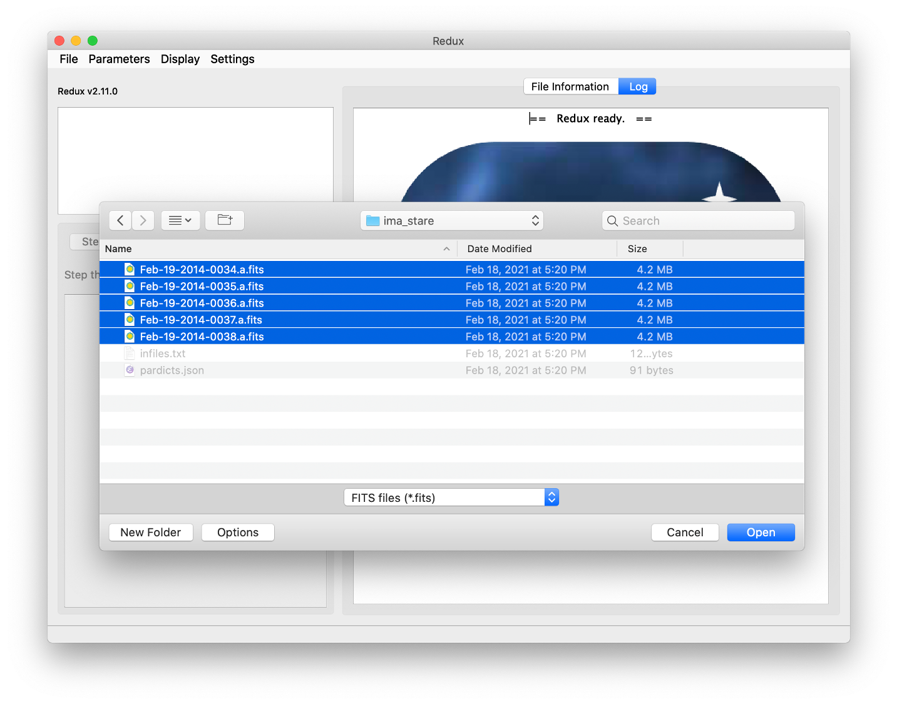
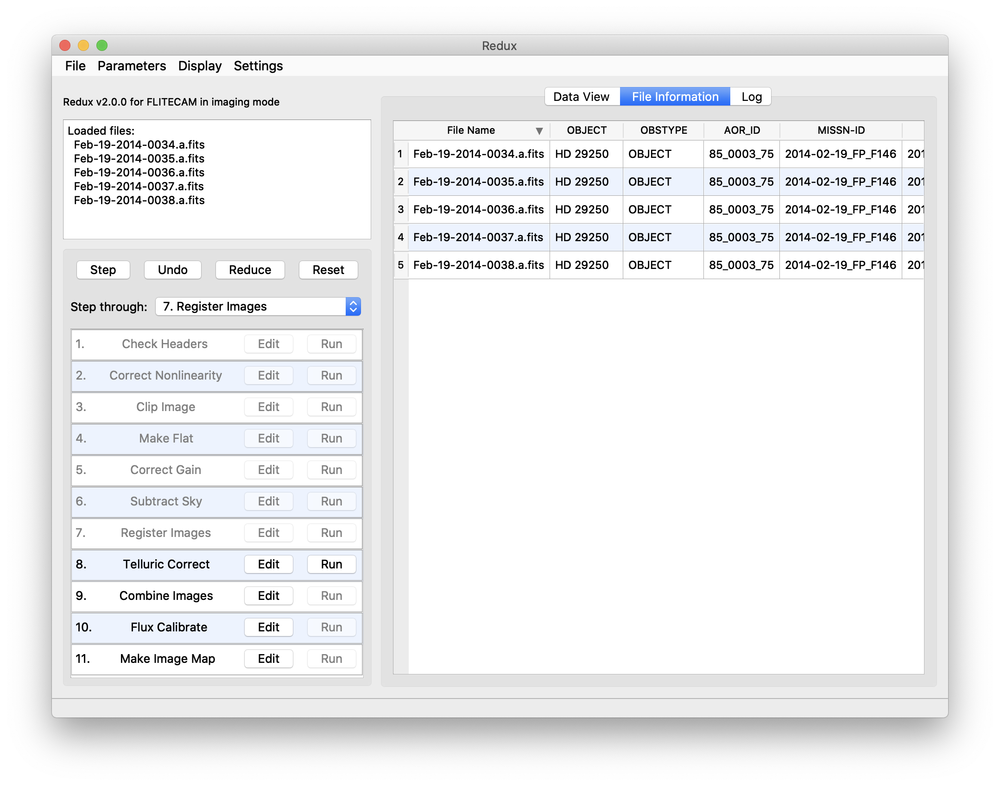
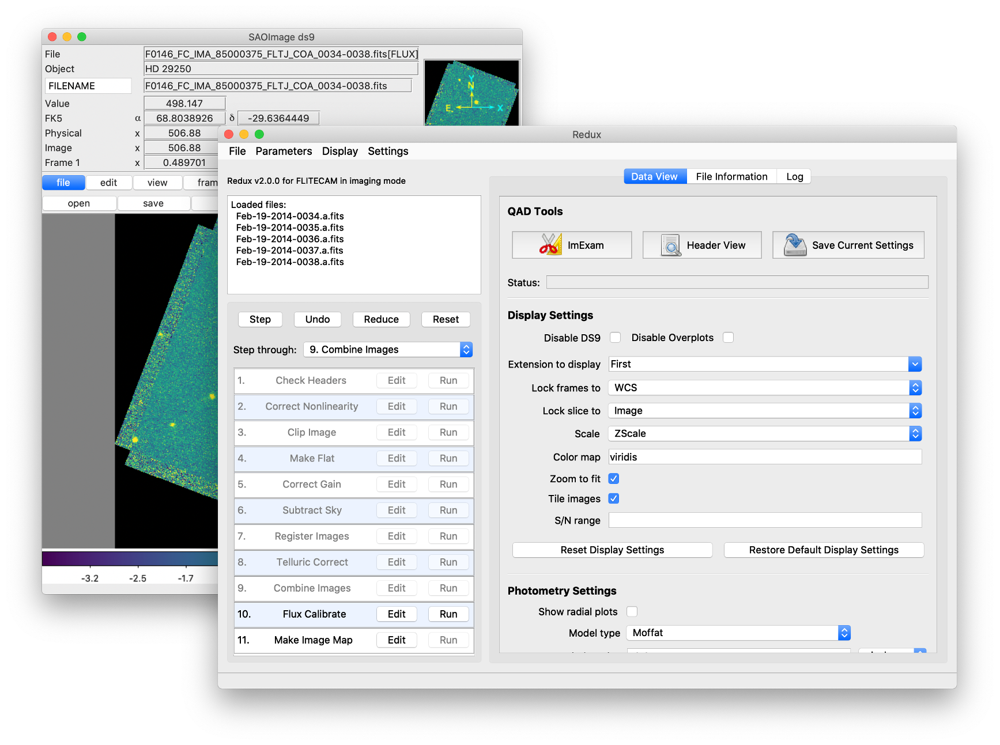
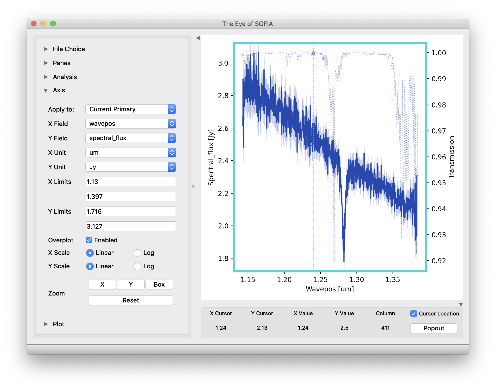
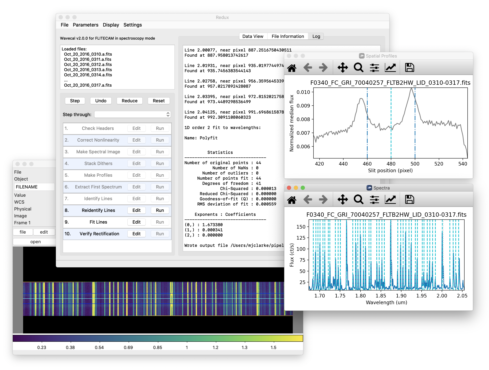
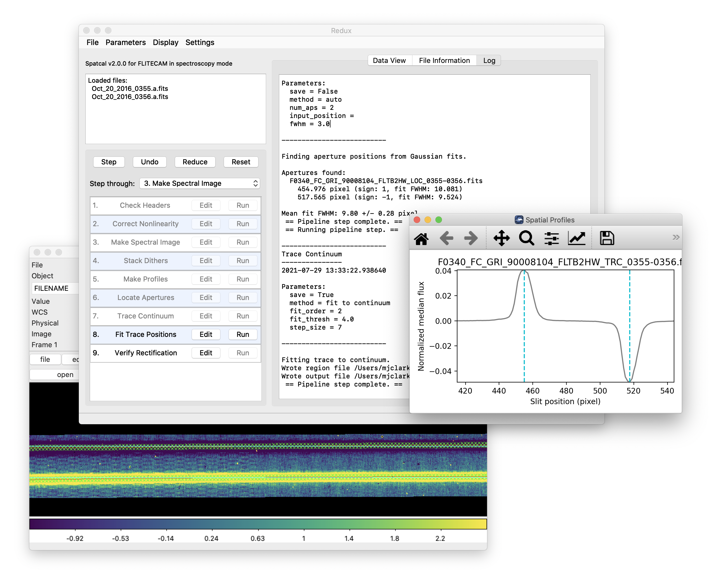
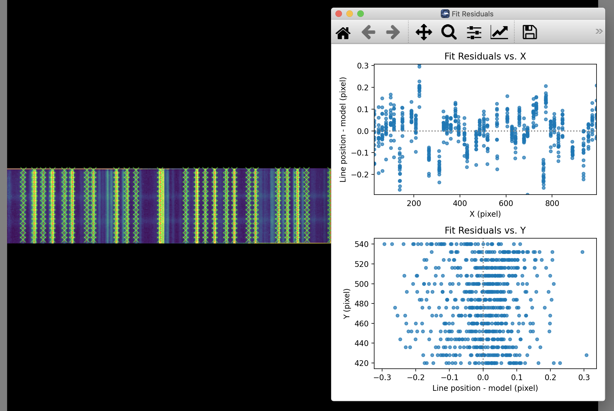

Grouping LEVEL_1 data for processing
====================================

For both imaging and grism mode for FLITECAM, there are two possible
kinds of input data: sky frames and sources. Sky frames have OBSTYPE = SKY,
while source frames may have OBSTYPE = OBJECT, STANDARD\_FLUX, or
STANDARD\_TELLURIC.  The sky frames and source frames should all share
the same instrument configuration and filters.  Optionally, it may also be
useful to separate out data files taken from different missions,
observation plans, or AOR-IDs.

These grouping requirements translate into a set of FITS keywords that
must match in order for a set of data to be grouped together. These
relationships are summarized in the tables below.

Note that data grouping must be carried out before the pipeline is run.
The pipeline expects all inputs to be reduced together as a single data
set.

.. table:: Grouping Criteria: Imaging
   :name: flitecam_img_group

   +-----------------------------+-------------------+-------------------------+
   | **Keyword**                 | **Data Type**     | **Match Criterion**     |
   +=============================+===================+=========================+
   | **OBSTYPE**                 | STR               | Exact (unless SKY)      |
   +-----------------------------+-------------------+-------------------------+
   | **OBJECT**                  | STR               | Exact                   |
   +-----------------------------+-------------------+-------------------------+
   | **INSTCFG**                 | STR               | Exact                   |
   +-----------------------------+-------------------+-------------------------+
   | **INSTMODE**                | STR               | Exact                   |
   +-----------------------------+-------------------+-------------------------+
   | **SPECTEL1**                | STR               | Exact                   |
   +-----------------------------+-------------------+-------------------------+
   | **MISSN-ID (optional)**     | STR               | Exact                   |
   +-----------------------------+-------------------+-------------------------+
   | **PLANID (optional)**       | STR               | Exact                   |
   +-----------------------------+-------------------+-------------------------+
   | **AOR\_ID (optional)**      | STR               | Exact                   |
   +-----------------------------+-------------------+-------------------------+

.. table:: Grouping Criteria: Spectroscopy
   :name: flitecam_spec_group

   +-----------------------------+-------------------+-------------------------+
   | **Keyword**                 | **Data Type**     | **Match Criterion**     |
   +=============================+===================+=========================+
   | **OBSTYPE**                 | STR               | Exact (unless SKY)      |
   +-----------------------------+-------------------+-------------------------+
   | **OBJECT**                  | STR               | Exact                   |
   +-----------------------------+-------------------+-------------------------+
   | **INSTCFG**                 | STR               | Exact                   |
   +-----------------------------+-------------------+-------------------------+
   | **INSTMODE**                | STR               | Exact                   |
   +-----------------------------+-------------------+-------------------------+
   | **SPECTEL1**                | STR               | Exact                   |
   +-----------------------------+-------------------+-------------------------+
   | **SPECTEL2**                | STR               | Exact                   |
   +-----------------------------+-------------------+-------------------------+
   | **MISSN-ID (optional)**     | STR               | Exact                   |
   +-----------------------------+-------------------+-------------------------+
   | **PLANID (optional)**       | STR               | Exact                   |
   +-----------------------------+-------------------+-------------------------+
   | **AOR\_ID (optional)**      | STR               | Exact                   |
   +-----------------------------+-------------------+-------------------------+

Configuration and execution
===========================

Installation
------------

The FLITECAM pipeline is written entirely in Python.  The pipeline is
platform independent and has been tested on Linux, Mac OS X, and Windows
operating systems.  Running the pipeline requires a minimum of 16GB RAM,
or equivalent-sized swap file.

The pipeline is comprised of six modules within the `sofia_redux` package:
`sofia_redux.instruments.flitecam`, `sofia_redux.instruments.forcast`,
`sofia_redux.pipeline`, `sofia_redux.calibration`, `sofia_redux.spectroscopy`,
`sofia_redux.toolkit`, and `sofia_redux.visualization`.
The `flitecam` module provides the data processing
algorithms specific to FLITECAM, with supporting libraries from the
`forcast`, `toolkit`, `calibration`, `spectroscopy`, and `visualization`
modules.  The `pipeline` module provides interactive and batch interfaces
to the pipeline algorithms.

External Requirements
~~~~~~~~~~~~~~~~~~~~~

To run the pipeline for any mode, Python 3.7 or
higher is required, as well as the following packages: numpy, scipy,
matplotlib, pandas, astropy, configobj, numba, bottleneck, joblib,
and photutils.
Some display functions for the graphical user interface (GUI)
additionally require the PyQt5, pyds9, and regions packages.
All required external packages are available to install via the
pip or conda package managers.  See the Anaconda environment file
(environment.yml), or the pip requirements file (requirements.txt)
distributed with `sofia_redux` for up-to-date version requirements.

Running the pipeline interactively also requires an installation of
SAO DS9 for FITS image display. See http://ds9.si.edu/ for download
and installation instructions.  The *ds9* executable
must be available in the PATH environment variable for the pyds9
interface to be able to find and control it.  Please note that pyds9
is not available on the Windows platform.

Source Code Installation
~~~~~~~~~~~~~~~~~~~~~~~~

The source code for the FLITECAM pipeline maintained by the SOFIA Data
Processing Systems (DPS) team can be obtained directly from the
DPS, or from the external `GitHub repository <https://github.com/SOFIA-USRA/sofia_redux>`__.
This repository contains all needed configuration
files, auxiliary files, and Python code to run the pipeline on FLITECAM
data in any observation mode.

After obtaining the source code, install the package with
the command::

    python setup.py install

from the top-level directory.

Alternately, a development installation may be performed from inside the
directory with the command::

    pip install -e .

After installation, the top-level pipeline interface commands should
be available in the PATH.  Typing::

    redux

from the command line should launch the GUI interface, and::

    redux_pipe -h

should display a brief help message for the command line interface.

Configuration
-------------

For FLITECAM algorithms, default parameter values are defined by the
Redux object that interfaces to them. These values may be overridden
manually for each step, while running in interactive mode. They may also
be overridden by an input parameter file, in INI format, in either
interactive or automatic mode. See Appendix A for an example of an input
parameter file, which contains the current defaults for all parameters.

Input data
----------

Redux takes as input raw FLITECAM FITS data files containing 1024x1024
pixel image arrays. The FITS headers contain data acquisition and
observation parameters and, combined with the pipeline configuration
files, comprise the information necessary to complete all steps of the
data reduction process. Some critical keywords are required to be
present in the raw data in order to perform a successful grouping,
reduction, and ingestion into the SOFIA archive. See Appendix B for a
description of these keywords.

It is assumed that the input data have been successfully grouped before
beginning reduction: Redux considers all input files in a reduction to
be part of a single homogeneous reduction group, to be reduced together
with the same parameters. As such, when the
pipeline reads a raw FLITECAM data file, it uses the first input file to
identify the observing mode used. Given this information, it identifies
a set of auxiliary and calibration data files to be used in the
reduction (:numref:`flitecam_auxiliary`). The default files to be used are defined in a
lookup table that reads the DATE-OBS keyword from the raw file, and then
chooses the appropriate calibrations for that date.

.. table:: Auxiliary files
   :name: flitecam_auxiliary

   +-----------------------------------------------+---------------+----------------------------------------------------------------------------------------------------------------------+
   | **Auxiliary data file**                       | **Data type** | **Comments**                                                                                                         |
   +===============================================+===============+======================================================================================================================+
   | Keyword definition file                       | INI           | Contains the definition of required keywords, with allowed value ranges                                              |
   |                                               |               |                                                                                                                      |
   | (e.g. header_req_ima.cfg)                     |               |                                                                                                                      |
   +-----------------------------------------------+---------------+----------------------------------------------------------------------------------------------------------------------+
   | Linearity coefficients file                   | FITS          | FITS file containing linearity correction coefficients for all pixels in the raw data array                          |
   |                                               |               |                                                                                                                      |
   | (e.g. lc_coeffs_20140325.fits)                |               |                                                                                                                      |
   +-----------------------------------------------+---------------+----------------------------------------------------------------------------------------------------------------------+
   | Reference flux calibration table              | ASCII         | Flux calibration factors (imaging only)                                                                              |
   |                                               |               |                                                                                                                      |
   | (e.g. refcalfac_20171007.txt)                 |               |                                                                                                                      |
   +-----------------------------------------------+---------------+----------------------------------------------------------------------------------------------------------------------+
   | Spectral order definition file                | FITS          | Image file containing flat data and an edge mask for a spectral order (grism only)                                   |
   |                                               |               |                                                                                                                      |
   | (e.g. flat_kla_multinight.fits)               |               |                                                                                                                      |
   +-----------------------------------------------+---------------+----------------------------------------------------------------------------------------------------------------------+
   | Wavelength calibration map                    | FITS          | Two-frame image associating a wavelength value and a spatial distance across the slit with each pixel (grism only)   |
   |                                               |               |                                                                                                                      |
   | (e.g. kla_map_arcs.fits)                      |               |                                                                                                                      |
   +-----------------------------------------------+---------------+----------------------------------------------------------------------------------------------------------------------+
   | Atmospheric transmission curve                | FITS          | A FITS image with wavelength and transmission values for a particular altitude and zenith angle (grism only)         |
   |                                               |               |                                                                                                                      |
   | (e.g. atran\_41K\_45deg\_1-6mum.fits)         |               |                                                                                                                      |
   +-----------------------------------------------+---------------+----------------------------------------------------------------------------------------------------------------------+
   | Instrumental response curve                   | FITS          | FITS image containing the response at each wavelength for a particular grism/slit mode (grism only)                  |
   |                                               |               |                                                                                                                      |
   | (e.g. FC\_GRI\_A2KL\_SS20\_RSP.fits)          |               |                                                                                                                      |
   +-----------------------------------------------+---------------+----------------------------------------------------------------------------------------------------------------------+

.. redux usage section

.. |ref_startup| replace:: :numref:`flitecam_startup`

.. |ref_open_new| replace:: :numref:`flitecam_open_new`

.. |ref_reduction_steps| replace:: :numref:`flitecam_reduction_steps`

.. |ref_parameters| replace:: :numref:`flitecam_parameters`

.. |ref_file_info| replace:: :numref:`flitecam_file_info`

.. |ref_data_view| replace:: :numref:`flitecam_data_view`

.. |ref_headers| replace:: :numref:`flitecam_headers`

.. include:: ../../../sofia_redux/pipeline/usage/startup.rst

.. figure:: images/startup.png
   :name: flitecam_startup
   :alt: Startup screen showing an outline of an airplane with an open
         telescope door on a blue background showing faint spiral arms
         and stylized stars.

   Redux GUI startup.

.. include:: ../../../sofia_redux/pipeline/usage/open.rst

   Open new reduction.

.. figure:: images/reduction_steps.png
   :name: flitecam_reduction_steps
   :alt: GUI window showing reduction steps with Edit and Run buttons.
         A log window is displayed with text messages from a reduction.

   Sample reduction steps. Log output from the pipeline is
   displayed in the **Log** tab.

.. include:: ../../../sofia_redux/pipeline/usage/params.rst

.. figure:: images/parameters.png
   :name: flitecam_parameters
   :alt: An Edit Parameters dialog window, showing various selection
         widgets.

   Sample parameter editor for a pipeline step.

.. include:: ../../../sofia_redux/pipeline/usage/info.rst

   File information table.

.. include:: ../../../sofia_redux/pipeline/usage/view.rst

         display parameters and analysis tools.

   Data viewer settings and tools.

.. include:: ../../../sofia_redux/pipeline/usage/headers.rst

.. figure:: images/headers.png
   :name: flitecam_headers
   :alt: A dialog window showing a sample FITS header in plain text.

   QAD FITS header viewer.

FLITECAM Reduction
------------------

Imaging Reduction
~~~~~~~~~~~~~~~~~

FLITECAM imaging reduction with Redux is straightforward. The
processing steps follow the flowchart of :numref:`flitecam_flowchart_img`.
At each step, Redux attempts to determine automatically the correct
action, given the input data and default parameters, but each step
can be customized as needed.

Useful Parameters
^^^^^^^^^^^^^^^^^

Some key parameters to note are listed below.

In addition to the specified parameters, the output from each step may
be optionally saved by selecting the 'save' parameter.

-  **Check Headers**

   -  *Abort reduction for invalid headers*: By default, Redux will halt the
      reduction if the input header keywords do not meet requirements.
      Uncheck this box to attempt the reduction anyway.

-  **Correct Nonlinearity:**

   -  *Linearity correction file*: The default linearity correction file
      on disk is automatically loaded. Set to a valid FITS file path to
      override the default coefficients file with a new one.

   -  *Saturation level*: Pixels with raw flux values greater than this
      value, divided by the DIVISOR, are marked as bad pixels.  Set to
      blank to propagate all pixels, regardless of value.

-  **Clip Image:**

   -  *Skip clean*: If selected, bad pixels will not be identified in
      the clipped image.

   -  *Data to clip to*: Enter a pixel range to use as the data section.
      Values should be entered as xmin, xmax, ymin, ymax,
      with index values starting at 0. Max values are not included.

-  **Make Flat:**

   -  *Override flat file*: If specified, the provided FITS
      file will be used in place of generating a flat field from the
      input data.  The provided file must have a FLAT extension.
      If FLAT_ERROR is also present, the errors will be propagated
      in the gain correction step.

   -  *Skip gain correction*: If selected, no flat will be generated, and
      any file specified as an override will be ignored.
      Data will not be gain corrected.

-  **Subtract Sky:**

   -  *Override sky file*: If specified, the provided FITS
      file will be used as a sky image to subtract, in place of using
      the method parameter.  The provided file must have a FLUX extension.
      If an ERROR extension is also present, the errors will be propagated.

   -  *Skip sky subtraction*: If selected, no sky values will be subtracted.

   -  *Method for deriving sky value*: If 'Use image median', the background
      will be determined from the median of each frame.  If 'Use flat
      normalization value', the value in the FITS keyword FLATNORM will be
      subtracted.  This is only appropriate if the flat was generated from
      sky data close in time to the observation (e.g the input data itself).

-  **Register Images**

   -  *Registration algorithm*: The default for all data is to
      use the WCS as is for registration. Centroiding is
      may be useful for bright, compact objects; cross-correlation
      may be useful for bright, diffuse fields. Registration via the
      'Header shifts' method may be useful for older data, for which the
      relative WCS is not very accurate. The 'Use first WCS' option
      will treat all images as pre-registered: the data will be coadded
      directly without shifts.

   -  *Override offsets for all images*: If registration offsets are
      known a priori, they may be directly entered here. Specify
      semi-colon separated offsets, as x,y. For example, for three
      input images, specify '0,0;2,0;0,2' to leave the first as is,
      shift the second two pixels to the right in x,
      and shift the third two pixels up in y.

   -  *Expected FWHM for centroiding*: Specify the expected FWHM in pixels,
      for the centroiding algorithm.  This may be useful in registering
      bright compact sources that are not point sources.

   -  *Maximum shift for cross-correlation*: Specify the maximum allowed
      shift in pixels for the cross-correlation algorithm.  This limit is
      applied for shifts in both x- and y-direction.

-  **Combine images**

   -  *Skip coaddition*: If selected, each input registered file will be
      saved as a separate file of type 'coadded' rather than combined
      together into a single output file.

   -  *Reference coordinate system*: If set to 'First image', all
      images will be referenced to the sky position in the first image
      file. If set to 'Target position', the
      TGTRA/TGTDEC keywords in the FITS header will be used to apply
      an additional offset for registering non-sidereal targets.  If
      these keywords are not present, or if their value is constant,
      the algorithm defaults to the 'First image' behavior.
      'Target position' is on by default; 'First image' is recommended only
      if the TGTRA/TGTDEC keywords are known to have bad values.

   -  *Combination method*: Median is the default; mean may also be useful
      for some input data.  The resample option may project data more
      accurately, and allows an additional smoothing option, but takes
      much longer to complete.

   -  *Use weighted mean*: If set, the average of the data will be
      weighted by the variance. Ignored for method=median.

   -  *Robust combination*: If set, data will be sigma-clipped before
      combination for mean or median methods.

   -  *Outlier rejection threshold (sigma)*: The sigma-clipping threshold
      for robust combination methods, in units of sigma (standard deviation).

   -  *Gaussian width for smoothing (pixels)*: If method=resample, a smoothing
      may be applied to the output averages.  Specify the Gaussian width in
      pixels.  Set smaller (but non-zero) for less smoothing; higher for
      more smoothing.

-  **Flux Calibrate**

   -  *Re-run photometry for standards*: If selected, and observation is
      a flux standard, photometric fits and aperture measurements on the
      brightest source will be recalculated, using the input parameters
      below.

   -  *Source position*: Enter the approximate position (x,y) of the
      source to measure. If not specified, the SRCPOSX/SRCPOSY keywords
      in the FITS header will be used as the first estimate of the
      source position.

   -  *Photometry fit size*: Smaller subimages may sometimes
      be necessary for faint sources and/or variable background.

   -  *Initial FWHM*: Specify in pixels. This parameter
      should be modified only if the PSF of the source is significantly
      larger or smaller than usual.

   -  *Profile type*: Moffat fits are the default, as they generally
      give a more reliable FWHM value. However, Gaussian fits may
      sometimes be more stable, and therefore preferable if the Moffat
      fit fails.

-  **Make Image Map**

   -  *Color map*: Color map for the output PNG image.  Any valid Matplotlib
      name may be specified.

   -  *Flux scale for image*: A low and high percentile value , used for
      scaling the image, e.g. [0,99].

   -  *Number of contours*: Number of contour levels to be over-plotted on
      the image.  Set to 0 to turn off contours.

   -  *Contour color*: Color for the contour lines.  Any valid Matplotlib
      color name may be specified.

   -  *Filled contours*: If set, contours will be filled instead of overlaid.

   -  *Overlay grid*: If set, a coordinate grid will be overlaid.

   -  *Beam marker*: If set, a beam marker will be added to the plot.

   -  *Watermark text*: If set to a non-empty string, the text will be
      added to the lower-right of the image as a semi-transparent watermark.

   -  *Crop NaN border*: If set, any remaining NaN or zero-valued border
      will be cropped out of plot.

Grism Reduction
~~~~~~~~~~~~~~~

.. |ref_profile| replace:: :numref:`flitecam_profile_plot`

.. |ref_spectral| replace:: :numref:`flitecam_spectral_plot`

.. |ref_eye_controls| replace:: :numref:`flitecam_eye_controls_image`

.. include::  ../../forcast/users/spectral_extraction.rst

.. figure:: images/profile_plot.png
   :name: flitecam_profile_plot
   :alt: A display window with a profile plot and lines marking the aperture.

   Aperture location automatically identified and over-plotted
   on the spatial profile.  The cyan line indicates the aperture center.
   Green lines indicate the integration aperture for optimal extraction,
   dark blue lines indicate the PSF radius (the point at which the flux
   goes to zero), and red lines indicate background regions.

.. figure:: images/spectral_plot.png
   :name: flitecam_spectral_plot
   :alt: A GUI window showing a spectral trace plot, in Wavepos (um)
         vs. Spectral_flux (Jy).

   Final extracted spectrum, displayed in an interactive plot window.

         widgets to control the plot display.

   Control panels for the spectral viewer are located to the left and
   below the plot window.  Click the arrow icons to show or collapse
   them.

Useful Parameters
^^^^^^^^^^^^^^^^^

Below are listed some key parameters for the grism processing steps.
Note that the Check Headers and Correct Nonlinearity steps are identical to
those used for the imaging data: their parameters are listed above.
In addition to the specified parameters, the output from each step may
be optionally saved by selecting the 'save' parameter.

-  **Make Spectral Image:**

   -  *Subtract pairs*: If checked, files will be pair-subtracted in the
      order they were taken, according to the DATE-OBS keyword in their
      headers.  Mismatched pairs will be dropped from the reduction.

   -  *Flat file*: If provided, data will be divided by the image in
      the first extension of the FITS file.  Set blank to skip flat
      correction.  The default order mask is automatically loaded for this
      purpose, but most of the masks provided have flat values set to
      1.0, so there is no effective flat correction.

-  **Stack Dithers**

   -  *Skip dither stacking*: If set, common dither positions will not be
      stacked.  This is the default: dither stacking is only recommended
      for faint spectra that cannot otherwise be automatically extracted.

   -  *Ignore dither information from header*: If set, all input files are
      stacked regardless of dither position.

   -  *Combination method*: Mean is the default; median may also be useful
      for some input data.

   -  *Use weighted mean*: If set, the average of the data will be
      weighted by the variance. Ignored for method=median.

   -  *Robust combination*: If set, data will be sigma-clipped before
      combination.

   -  *Outlier rejection threshold (sigma)*: The sigma-clipping threshold
      for robust combination methods, in units of sigma (standard deviation).

-  **Make Profiles**

   -  *Wave/space calibration file*: The default calibration
      file is automatically loaded. Set to a valid FITS file path to
      override the default calibration map with a new one.

   -  *Slit correction file*: The default slit correction
      file is automatically loaded, if available. If blank, no slit
      correction will be applied. Set to a valid FITS file path to
      override the default file with a new one.

   -  *Row fit order*: Typically a third-order polynomial fit is used
      to calculate the smooth spatial profile. Occasionally, a higher or
      lower order fit may give better results.

   -  *Subtract median background*: If set, then the
      median level of the smoothed spatial profile will be subtracted
      out to remove residual background from the total extracted flux.
      If the SRCTYPE is EXTENDED\_SOURCE this option will be off by default.
      For other data, this option is appropriate as long as the slit is
      dominated by background, rather than source flux. If the spatial profile
      dips below zero at any point (other than for a negative spectrum), this
      option should be deselected.

   -  *Atmospheric transmission threshold*: Transmission values below this
      threshold are not considered when making the spatial profile.
      Values are 0-1.

   -  *Simulate calibrations*: Simulate calibration values instead of using
      the wave/space calibration file.  This option is primarily used for
      testing.

-  **Locate Apertures**

   -  *Aperture location method*: If 'auto', the strongest Gaussian peak(s) in the
      spatial profile will be selected, with an optional starting guess
      (*Aperture position*, below).  If 'fix to input', the value in the
      *Aperture position* parameter will be used without refinement.
      If 'fix to center', the center of the slit will be used.  'Fix to center'
      is default for EXTENDED_SOURCE; otherwise 'auto' is default.

   -  *Number of auto apertures*: Set this parameter
      to 1 to automatically find the single brightest source, or 2 to find the
      two brightest sources, etc. Sources may be positive or negative.

   -  *Aperture position*: Enter a guess value for the aperture to use as a
      starting point for method = 'auto', or a fixed value to use as the
      aperture center for method = 'fix to input'. Values are in arcseconds
      up the slit (refer to the spatial profile). Separate multiple
      apertures for a single file by commas;
      separate values for multiple files by semi-colons. For example,
      *3,8;2,7* will look for two apertures in each of two files, near
      3" and 8" in the first image and 2" and 7" in the second image. If
      there are multiple files loaded, but only one aperture list is
      given, the aperture parameters will be used for all images.

   -  *Expected aperture FWHM (arcsec)*: Gaussian FWHM estimate for spatial
      profile fits, to determine peaks.

-  **Trace Continuum**

   -  *Trace method*: If 'fit to continuum' is selected, points along the
      continuum will be fit with a Gaussian to determine the trace
      center at each location, and then the positions will be fit with a
      low-order polynomial. If 'fix to aperture position' is selected,
      no fit will be attempted, and the default slit curvature defined
      by the edge definition file will be used as the aperture location.
      By default, the trace will be fixed for EXTENDED_SOURCE,
      but a fit will be attempted for all other data types.

   -  *Trace fit order*: Polynomial fit order for the aperture center,
      along the spectral dimension.

   -  *Trace fit threshold*: Sigma value to use for rejecting discrepant
      trace fits.

   -  *Fit position step size (pixels)*: Step size along the trace for
      fit positions.

-  **Set Apertures**

   -  *Extract the full slit*: If set, all other parameters are ignored,
      and the PSF radius will be set to include the full slit.

   -  *Refit apertures for FWHM*: The spatial FWHM for the aperture is used
      to determine the aperture and PSF radii, unless they are directly
      specified.  If this parameter is set, the profile will be re-fit with
      a Gaussian to determine the FWHM.  If it is not set, the value
      determined or set in the Locate Apertures step is used (stored
      as APFWHM01 in the FITS header).

   -  *Aperture sign*: Enter either 1 or -1 to skip the
      automatic determination of the aperture sign from the spatial
      profile. If the value is -1, the spectrum will be multiplied by
      -1. Separate multiple apertures by commas; separate values for
      multiple files by semi-colons. If a single value is specified,
      it will be applied to all apertures.

   -  *Aperture radius*: Enter a radius in arcsec to skip the
      automatic determination of the aperture radius from the profile
      FWHM. Separate multiple apertures by commas; separate values for
      multiple files by semi-colons. If a single value is specified,
      it will be applied to all apertures.

   -  *PSF radius*: Enter a radius in arcsec to skip the
      automatic determination of the PSF radius from the profile
      FWHM. Separate multiple apertures by commas; separate values for
      multiple files by semi-colons. If a single value is specified,
      it will be applied to all apertures.

   -  *Background regions*: Enter a range in arcsec to use as the
      background region, skipping automatic background determination.
      For example, *0-1,8-10* will use the regions
      between 0" and 1" and between 8" and 10" to determine the
      background level to subtract in extraction. Values are for the
      full image, rather than for a particular aperture.  Separate
      values for multiple files with semi-colons.

-  **Subtract Background**

   -  *Skip background subtraction*: Set to skip calculating and removing
      residual background. If no background regions were set, background
      subtraction will be automatically skipped.

   -  *Background fit order*: Set to a number greater than or equal to
      zero for the polynomial order of the fit to the background
      regions.

-  **Extract Spectra**

   -  *Save extracted 1D spectra*: If set, the extracted spectra will
      be saved to disk in Spextool format.  This option is normally used only
      for diagnostic purposes.

   -  *Extraction method*: The default is to use
      standard extraction for EXTENDED_SOURCE and optimal
      extraction otherwise. Standard extraction may be necessary for
      some faint sources.

   -  *Use median profile instead of spatial map*: By default, the pipeline uses a
      wavelength-dependent spatial map for extraction, but this
      method may give poor results if the signal-to-noise
      in the profile is low. Set this option to use the median spatial
      profile across all wavelengths instead.

   -  *Use spatial profile to fix bad pixels*: The pipeline usually
      uses the spatial profile to attempt to fix bad pixels during
      standard extraction, and in the 2D image for either extraction
      method. Occasionally, this results in a failed extraction.
      Unset this options to extract the spectra without bad pixel correction.

   -  *Bad pixel threshold*: Enter a value for the threshold for a pixel
      to be considered a bad pixel. This value is multiplied by the
      standard deviation of all good pixels in the aperture at each
      wavelength bin.

-  **Flux Calibrate**

   -  General Parameters

      -  *Save calibrated 1D spectra*: If set, the calibrated spectra will
         be saved to disk in Spextool format.  This option is normally used only
         for diagnostic purposes.

      -  *Skip flux calibration*: If set, no telluric correction or flux
         calibration will be applied.

      -  *Response file*: The default instrumental response file on disk
         is automatically loaded. If blank, no response correction will
         be applied, but transmission correction will still occur. Set to a
         valid FITS file path to override the default response file with a
         new one.

      -  *Spectral resolution*: Expected resolution for the grism mode, used
         to smooth the ATRAN model.  This value should match that of the
         response file, and should only need modification if the response
         file is modified from the default.

   -  Telluric Correction Parameters

      -  *ATRAN directory*: This parameter specifies the location of the
         library of ATRAN FITS files to use.  If blank, the default files
         provided with the pipeline will be used.

      -  *ATRAN file*: This parameter is used to override the ATRAN file
         to use for telluric correction. If blank, the default ATRAN
         file on disk will be used. Set to a valid FITS file path to override the
         default ATRAN file with a new one.

   -  Wavelength Shift Parameters

      -  *Auto shift wavelength to telluric spectrum*: If set, the data will be
         shifted to match the telluric spectrum.  The optimum shift chosen
         is the one that minimizes residuals in the corrected spectrum,
         when fit with a low order polynomial. All values within the range
         of the maximum shift are tested, at a resolution of 0.1 pixels.
         Auto shift will not be attempted for the FOR\_G111 grism.

      -  *Maximum auto wavelength shift to apply*: The maximum shift allowable
         for auto-shifts, in pixels.

      -  *Wavelength shift to apply*: Set to specify a manual shift in pixels
         along the wavelength axis to apply to the science spectrum. If
         non-zero, the auto-shift parameter will be ignored.

      -  *Polynomial order for continuum*: The fit order for the spectrum,
         used to determine the optimum wavelength shift.

      -  *S/N threshold for auto-shift*: If the median S/N for a spectrum
         is below this threshold, auto shift will not be attempted.

-  **Combine Spectra**

   -  General Parameters

      -  *Registration method*: If set to 'Use WCS as is', all
         images will be referenced to the sky position in the first image
         file. If set to 'Correct to target position', the
         TGTRA/TGTDEC keywords in the FITS header will be used to apply
         an additional offset for registering non-sidereal targets.  If
         these keywords are not present, or if their value is constant,
         the algorithm defaults to the 'Use WCS as is' behavior.
         'Correct to target position' is on by default; the other options
         are recommended only if the TGTRA/TGTDEC or WCS keywords are known to
         have bad values. In that case, set to 'Use header offsets' for
         non-sidereal targets or files with known bad WCS parameters;
         otherwise use 'Use WCS as is'.

      -  *Combination method*: Mean is the default; median may also be
         useful for some input data. If 'spectral_cube' is set,
         the input data will be resampled into a 3D spatial/spectral cube
         instead of coadding 1D spectra and 2D images.

      -  *Weight by errors*: If set, the average of the data will be
         weighted by the errors. Ignored for method=median.

   -  1-2D Combination Parameters

      -  *Combine apertures*: If multiple apertures have been extracted,
         set this option to combine them into a single 1D spectrum.  The
         2D image will not attempt to co-align the spectral traces.

      -  *Robust combination*: If set, data will be sigma-clipped before
         combination for mean or median methods.

      -  *Outlier rejection threshold (sigma)*: The sigma-clipping threshold
         for robust combination methods, in units of sigma (standard deviation).

   -  3D Resample Parameters

      -  *Spatial surface fit order*: This parameter controls the polynomial
         order of the surface fit to the data at each grid point. Higher
         orders give more fine-scale detail, but are more likely to be
         unstable. Set to zero to do a weighted mean of the nearby data.

      -  *Spatial fit window*: Spatial window (pixels) for consideration in local
         data fits.  Set higher to fit to more pixels.

      -  *Spatial smoothing radius*: Gaussian width (pixels) for smoothing radius in
         distance weights for local data fits.  Set higher to smooth over
         more pixels.

      -  *Spatial edge threshold*: A value between 0 and 1 that determines how
         much of the image edge is set to NaN.  Set higher to set more pixels
         to NaN.

      -  *Adaptive smoothing algorithm*: If 'scaled', the size of the smoothing
         kernel is allowed to vary, in order to optimize reconstruction of
         sharply peaked sources. If 'shaped', the kernel shape and rotation
         may also vary. If 'none', the kernel will not vary.

-  **Make Spectral Map**

   -  *Color map*: Color map for the output PNG image.  Any valid Matplotlib
      name may be specified.

   -  *Flux scale for image*: A low and high percentile value , used for
      scaling the spectral image, e.g. [0,99].

   -  *Number of contours*: Number of contour levels to be over-plotted on
      the image.  Set to 0 to turn off contours.

   -  *Contour color*: Color for the contour lines.  Any valid Matplotlib
      color name may be specified.

   -  *Filled contours*: If set, contours will be filled instead of overlaid.

   -  *Overlay grid*: If set, a coordinate grid will be overlaid.

   -  *Watermark text*: If set to a non-empty string, the text will be
      added to the lower-right of the image as a semi-transparent watermark.

   -  *Fraction of outer wavelengths to ignore*:  Used to block edge effects
      for noisy spectral orders. Set to 0 to include all wavelengths in
      the plot.

   -  *Overplot transmission*: If set, the atmospheric transmission spectrum
      will be displayed in the spectral plot.

   -  *Flux scale for spectral plot*: Specify a low and high percentile value
      for the spectral flux scale, e.g. [0,99].  If set to [0, 100],
      Matplotlib defaults are used.

-  **Make Response**

   -  *Standard model file*: If blank, a model file will be searched for
      in the default data directory.  Set to a valid FITS file to override.

Data quality assessment
=======================

After the pipeline has been run on a set of input data, the output
products should be checked to ensure that the data has been properly
reduced.  Data quality and quirks can vary widely across individual
observations, but the following general guideline gives some strategies
for approaching quality assessment (QA) for FLITECAM data.

-  Check for QA comments in the FITS header HISTORY.  These comments may
   make suggestions for files to exclude from final reductions, or
   for non-default parameters to set for optimal reductions.

-  Check the output to the log file (usually called
   *redux\_[date]\_[time].log*), written to the same directory as the
   output files. Look for messages marked ERROR or WARNING. The log will
   also list every parameter used in the pipeline steps, which may help
   disambiguate the parameters as actually-run for the pipeline.

-  Check that the expected files were written to disk: there should, at
   a minimum, be a calibrated file (*CAL*) for imaging data and a combined
   spectrum (*CMB*) for grism data. Check the data product
   tables (:numref:`flitecam_img_prod` and :numref:`flitecam_gri_prod`)
   for other expected data products for each mode.

- For imaging data:

    -  Check the flat frame in the FLT file by comparing it with the raw image. All
       instrumental artifacts (areas of low quantum efficiency, obscurations
       in the optical path, and other systematics) that are present in the
       raw frame should be present in the flat. Sources in the raw image
       should not appear in the flat. Also check that the gain-corrected image
       does not contain any residual artifacts.

    -  Check for excessive hot or cold pixels in the coadded image. Bad
       pixels should be ignored in the coadding process.

    -  Check that the background was correctly subtracted. The counts in
       regions containing no sources should be zero, within the standard
       deviation.

    -  Check that the registration process calculated offsets correctly:
       compare all the registered images to verify that all sources appear
       at the same location in the WCS.

- For grism data:

   -  Display the spatial profile with apertures overlaid. Verify that
      apertures look well placed and the spatial profile does not dip
      below zero (except for negative spectral traces).

   -  Display the rectified image, and overlay the locations of the
      extracted apertures. Verify that the apertures lie on top of any
      visible spectral traces.

   -  Display the intermediate spectra, and verify that all spectra
      of the same target look similar.

   -  Display the final spectrum (*CMB*) and overplot the expected atmospheric
      transmission. Check that the calibrated spectrum does not include
      residual artifacts from the telluric absorption features. If it
      does, the assumed resolution for the grism, or the wavelength
      calibration of the observation, may need updating.

   -  Overlay a model spectrum on the calibrated spectra of flux
      standards. Verify that the observed spectrum matches the
      theoretical spectrum, within the error bars of the observation. If
      it does not, the instrumental response file may need updating.

Appendix A: Sample configuration files
======================================

Below are sample FLITECAM Redux parameter override files in INI format.
If present, the parameter value overrides the
default defined by the FLITECAM reduction object. If not present, the
default value will be used.

.. include:: include/redux_param_img.cfg
   :literal:

.. raw:: latex

    \clearpage

.. include:: include/redux_param_spec.cfg
   :literal:

.. raw:: latex

    \clearpage

Appendix B: Required input keywords
===================================

The files below define all keywords that the FLITECAM pipeline checks for
validity before proceeding. They are normally located in the pipeline distribution
distribution at *sofia_redux/instruments/flitecam/data/keyword_files*.

.. include:: include/header_req_ima.cfg
   :literal:

.. include:: include/header_req_gri.cfg
   :literal:

Appendix C: Calibration Data Generation
=======================================

The FLITECAM Redux pipeline requires several kinds of auxiliary reference
calibration files, listed in :numref:`flitecam_auxiliary`.  Some of these
are produced by tools packaged with the pipeline.  This section describes the
procedures used to produce these auxiliary files.

.. |ref_wavecal_plots| replace:: :numref:`flitecam_wavecal_plots`

.. |ref_spatcal_plots| replace:: :numref:`flitecam_spatcal_plots`

.. |ref_wavecal_residuals| replace:: :numref:`flitecam_wavecal_residuals`

.. |ref_spatcal_residuals| replace:: :numref:`flitecam_spatcal_residuals`

.. include::  ../../forcast/users/spectral_calibration.rst

         and a DS9 window showing a spectral image.

   Wavecal mode reduction and diagnostic plots.

   Spatcal mode reduction and diagnostic plots.

         showing fit residuals in X and Y.

   Wavecal mode fit surface and residuals.

.. figure:: images/spatcal_residuals.png
   :name: flitecam_spatcal_residuals
   :alt: An image marked with positions and horizontal fit lines and a plot window
         showing fit residuals in X and Y.

   Spatcal mode fit surface and residuals.
