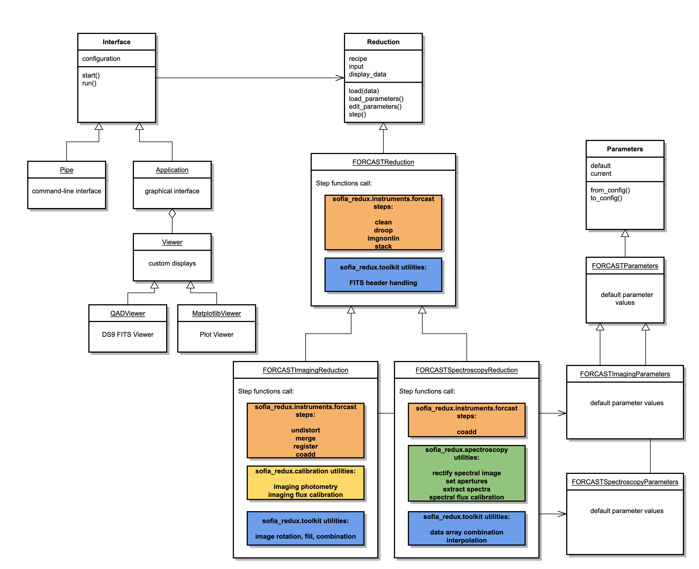

********************************
FORCAST Redux Developer's Manual
********************************

.. raw:: latex

    \clearpage

Introduction
============

Document Purpose
----------------

This document is intended to provide all the information necessary to
maintain the FORCAST Redux pipeline, used to produce
Level 2, 3, and 4 reduced products for FORCAST imaging and grism data, in
either manual or automatic mode. Level 2 is defined as data that has
been processed to correct for instrumental effects; Level 3 is defined
as flux-calibrated data; Level 4 is any higher data product.
A more general introduction to the data
reduction procedure and the scientific justification of the algorithms
is available in the FORCAST Redux User's Manual.

This manual applies to FORCAST Redux version 2.7.0.

Redux Revision History
----------------------

FORCAST Redux was developed as five separate software packages: DRIP,
which provides the FORCAST-specific processing algorithms; PypeUtils,
which provides general-purpose scientific algorithms; PySpextool, which
provides spectroscopic data reduction algorithms; PypeCal, which provides
photometry and flux calibration algorithms; and Redux,
which provides the interactive GUI, the automatic pipeline wrapper,
and the supporting structure to call the FORCAST algorithms.

DRIP is a Python translation of an IDL package developed
in IDL by Dr. Luke Keller and Dr. Marc Berthoud for the
reduction of FORCAST data. Version 1.0.0 was originally released for use
at SOFIA in July 2013. DRIP originally contained a set of imaging
reduction functions, an object-oriented structure for calling these
functions, an automatic pipeline, and an interactive GUI for manual
reductions. The package also supported spectroscopic reductions with an
interface developed in parallel to the DRIP interface, called FG
(FORCAST Grism). DRIP v2.0.0 was developed in 2019 and 2020, by Daniel
Perera and Melanie Clarke, as a full reimplementation in Python.
This version translates only the imaging algorithms from DRIP,
replacing the other functionality with PySpextool algorithms and Redux
structures.

PypeUtils was developed as a shared code base for SOFIA Python pipelines,
primarily by Daniel Perera for USRA/SOFIA.  It contains any algorithms
or utilities likely to be of general use for data reduction pipelines.
From this package, the FORCAST pipeline uses some FITS handling utilities,
multiprocessing tools, image manipulation algorithms,
and interpolation and resampling functions.

Like DRIP, PySpextool is a translation of an earlier SOFIA IDL library,
called FSpextool.  FSpextool was built on top of a pre-release version of
Spextool 4, an IDL-based package developed by Dr. Michael Cushing and Dr.
William Vacca for the reduction of data from the SpeX instrument on the
NASA Infrared Telescope Facility (IRTF). Spextool was originally released in
October 2000, and has undergone a number of major and minor revisions since
then. The last stable public release was v4.1, released January 2016. As
Spextool does not natively support automatic command-line processing,
FSpextool for SOFIA adapted the Spextool library to the SOFIA architecture
and instruments; version 1.0.0 was originally released for use at SOFIA
in July 2013. PySpextool is a Python translation of the core algorithms in
this package, developed by Daniel Perera and Melanie Clarke, and first
released at SOFIA for use in the FIFI-LS pipeline in October 2019.

PypeCal is a Python translation of the IDL PipeCal package,
developed by the SOFIA DPS team, to provide photometry and flux calibration
algorithms that may be used to calibrate imaging data from any instrument,
given appropriate reference data. It was originally developed by Dr. Miguel
Charcos-Llorens and Dr. William Vacca as a set of IDL and shell scripts that
were run independently of the Level 2 pipeline, then was refactored by Melanie
Clarke for incorporation into the Redux pipeline. It was first
incorporated into FORCAST Redux in version 1.0.4, which was released for
use in May 2015.  PypeCal is a full translation of this package, developed
by Dr. Rachel Vander Vliet and Melanie Clarke, and first
released for use at SOFIA with the HAWC+ pipeline in February 2019.

Redux was originally developed to be a general-purpose interface to IDL data
reduction algorithms. It provided an interactive GUI and an
object-oriented structure for calling data reduction processes, but it
did not provide its own data reduction algorithms. It was developed by
Melanie Clarke, for the SOFIA DPS team, to provide a consistent
front-end to the data reduction pipelines for multiple instruments and
modes, including FORCAST.  It was redesigned and reimplemented in Python,
with similar functionality, to support Python pipelines for SOFIA.  The
first release of the IDL version was in December 2013; the Python version
was first released to support the HAWC+ pipeline in September 2018.

In 2020, all SOFIA pipeline packages were unified into a single package,
called `sofia_redux`.  The interface package (Redux) was renamed to
`sofia_redux.pipeline`, PypeUtils was renamed to `sofia_redux.toolkit`,
PypeCal was renamed to `sofia_redux.calibration`,
PySpextool was renamed to `sofia_redux.spectroscopy`, and the DRIP
package was renamed to `sofia_redux.instruments.forcast`.  An additional
package, to support data visualization, was added as
`sofia_redux.visualization`.

Overview of Software Structure
==============================

The sofia_redux package has several sub-modules organized by functionality::

    sofia_redux
    ├── calibration
    ├── instruments
    │   ├── exes
    │   ├── fifi_ls
    │   ├── flitecam
    │   ├── forcast
    │   └── hawc
    ├── pipeline
    ├── scan
    ├── spectroscopy
    ├── toolkit
    └── visualization

The modules used in the FORCAST pipeline are described below.

sofia_redux.instruments.forcast
-------------------------------
The `sofia_redux.instruments.forcast` package is written in Python using
standard scientific tools and libraries.

The data reduction algorithms used by the pipeline are straight-forward
functions that generally take a data array, corresponding to a single
image file, as an argument and return the processed image array as a result.
They generally also take as secondary input a variance array to process
alongside the image, a header array to track metadata, and keyword
parameters to specify non-default settings. Parameters for these functions
may also be provided via a configuration file packaged along with the
software (*dripconf.txt*) that gets read into a global variable.
Redux manipulates this global variable as necessary in order to provide
non-default parameters to the data processing functions.

The `forcast` module also stores any reference data needed by the FORCAST
pipeline, in either imaging or grism mode.  This includes bad pixel masks,
nonlinearity coefficients, pinhole masks for imaging distortion correction,
wavelength calibration files, atmospheric transmission spectra, spectral
standard models, and instrument response spectra.  The default files may
vary by date; these defaults are managed by the `getcalpath` function
in the `forcast` module.  New date configurations may be added to the
caldefault.txt files in *forcast/data/caldefault.txt* and
*forcast/data/grism/caldefault.txt*.

sofia_redux.toolkit
-------------------

`sofia_redux.toolkit` is a repository for classes and functions of general usefulness,
intended to support multiple SOFIA pipelines.  It contains several submodules,
for interpolation, image manipulation, multiprocessing support, numerical calculations, and
FITS handling.  Most utilities are simple functions that take input
as arguments and return output values.  Some more complicated functionality
is implemented in several related classes; see the `sofia_redux.toolkit.resampling`
documentation for more information.

sofia_redux.spectroscopy
------------------------

The `sofia_redux.spectroscopy` package contains a library of general-purpose
spectroscopic functions.  The FORCAST pipeline uses these algorithms
for spectroscopic image rectification, aperture identification, and
spectral extraction and calibration. Most of these algorithms are simple
functions that take spectroscopic data as input and return processed data
as output.  However, the input and output values may be more complex than the
image processing algorithms in the `forcast` package.  The Redux interface
in the `pipeline` package manages the input and output requirements for
FORCAST data and calls each function individually.  See the
`sofia_redux.spectroscopy` API documentation for more information.

sofia_redux.calibration
-----------------------

The `sofia_redux.calibration` package contains flux calibration algorithms
used by Redux perform photometric or flux calibration calculations on
input images and return their results. The complexity of this package is
primarily in the organization of the reference data contained in the
*data* directory. This directory contains a set of calibration data for
each supported instrument (currently FORCAST and HAWC+). For each
instrument, the configuration files are split into groups based on how
often they are expected to change, as follows.

In the *filter\_def* directory, there is a file that defines the
mean/reference wavelength, pivot wavelength, and color leak correction
factor for each filter name (SPECTEL). This may vary by date only if the
filters change, but keep the same SPECTEL name. The color leak factor is
currently 1.0 for all filters (no color correction).

In the *response* directory, there are response fit files that define
the fit coefficients for each filter, with a separate file for the
altitude fit, airmass fit, and PWV fit for each of single/dual modes.
These should also change rarely.

In the *ref\_calfctr* directory, there are files that define the average
reference calibration factors to apply to science objects, by filter,
along with the associated error value. It is expected that there will be
a different ref\_calfctr file for each flight series, produced by an
analysis of all standards taken throughout the flight series.

In the *standard\_flux* directory, there is a file that defines the flux
model characteristics for each object: the percent error on the model,
and the scale factor to apply to the model. The model error is 5% for
all stars except BetaPeg (which is 9.43%), and is 20% for all asteroids.
The scale factor is usually 1.0, with the exception of BetaUmi, which
requires scaling by 1.18 from the model output files. This file should
change rarely, if ever, except to add objects to it. Currently, the same
file is used for all data. Also in the *standard flux* directory, there
are output files from the standard models for each object, for each
applicable date if necessary. From these files, the lambda\_mean column
is read and compared to the mean wavelength in the filter\_def file. If
found, the corresponding value in the Fnu\_mean column is used as the
standard model flux. If there is a scale defined in the model\_err file,
it is applied to the flux value. These files should rarely change, but
new ones will be added for asteroids any time they are observed. They
may need to be redone if the filter wavelengths change.

To manage all these files, there is a top-level calibration
configuration file (*caldefault.txt*), which contains the filenames for
the filter definition file, the model error file, the reference cal
factor file, and the response fit files, organized by date and filter.
This table will most likely be updated once per series, when we have
generated the reference calibration factors. There is also a standards
configuration file (*stddefault.txt*) that identifies the model flux
file to use by date and mode (single/dual). For stars, the date is set
to 99999999, meaning that the models can be used for any date; asteroids
may have multiple entries - one for each date they are observed. This
file must be updated whenever there are new asteroid flux models to add,
but it should be as simple as dropping the model file in the right
directory and adding a line to the table to identify it.

sofia_redux.visualization
-------------------------

The `sofia_redux.visualization` package contains plotting and display
routines, relating to visualizing SOFIA data.  For the FORCAST pipeline,
this package currently provides an interactive spectral viewer and a module
that supports generating quick-look preview images.

sofia_redux.pipeline
--------------------

Design
~~~~~~

.. include:: ../../../sofia_redux/pipeline/redux_architecture.rst

FORCAST Redux
~~~~~~~~~~~~~

To interface to the FORCAST pipeline algorithms, Redux defines
the `FORCASTReduction`, `FORCASTImagingReduction`, and
`FORCASTSpectroscopyReduction` as primary reduction classes, with associated
parameter classes `FORCASTParameters`, `FORCASTImagingParameters`, and
`FORCASTSpectroscopyParameters`. [#fn_forcast_wavecal]_
See :numref:`forcast_redux_class` for a sketch of
the Redux classes used by the FORCAST pipeline.

The `FORCASTReduction` class holds definitions for algorithms applicable to
both imaging and spectroscopy data:

    - Check Headers: calls `sofia_redux.instruments.forcast.hdcheck`
    - Clean Images: calls `sofia_redux.instruments.forcast.clean` and
      `sofia_redux.instruments.forcast.check_readout_shift`
    - Correct Droop: calls `sofia_redux.instruments.forcast.droop`
    - Correct Nonlinearity: calls `sofia_redux.instruments.forcast.imgnonlin`
      and `sofia_redux.instruments.forcast.background`
    - Stack Chops/Nods: calls `sofia_redux.instruments.forcast.stack`

The `FORCASTImagingReduction` class inherits from the `FORCASTReduction`
class and additionally defines imaging-specific algorithms:

    - Correct Distortion: calls `sofia_redux.instruments.forcast.undistort`
    - Merge Chops/Nods: calls `sofia_redux.instruments.forcast.merge`
    - Register Images: calls `sofia_redux.instruments.forcast.register_datasets`
    - Telluric Correct: calls `sofia_redux.calibration.pipecal_util.apply_tellcor`
      and `sofia_redux.calibration.pipecal_util.run_photometry`
    - Coadd: calls `sofia_redux.toolkit.image.coadd`
    - Flux Calibrate: calls `sofia_redux.calibration.pipecal_util.apply_fluxcal`
      and `sofia_redux.calibration.pipecal_util.run_photometry`
    - Make Image Map: calls `sofia_redux.visualization.quicklook.make_image`

The `FORCASTSpectroscopyReduction` class inherits from the `FORCASTReduction`
class and additionally defines spectroscopy-specific algorithms:

    - Stack Dithers: calls `sofia_redux.toolkit.image.combine_images`
    - Make Profiles: calls `sofia_redux.spectroscopy.rectify` and
      `sofia_redux.spectroscopy.mkspatprof`
    - Locate Apertures: calls `sofia_redux.spectroscopy.findapertures`
    - Trace Continuum: calls `sofia_redux.spectroscopy.tracespec`
    - Set Apertures: calls `sofia_redux.spectroscopy.getapertures` and
      `sofia_redux.spectroscopy.mkapmask`
    - Subtract Background: calls `sofia_redux.spectroscopy.extspec.col_subbg`
    - Extract Spectra: calls `sofia_redux.spectroscopy.extspec.extspec`
    - Merge Apertures: calls `sofia_redux.spectroscopy.getspecscale`
      and `sofia_redux.toolkit.image.combine_images`
    - Calibrate Flux: calls `sofia_redux.instruments.forcast.getatran`
      and `sofia_redux.spectroscopy.fluxcal`
    - Combine Spectra: calls `sofia_redux.toolkit.image.coadd`
      `sofia_redux.instruments.forcast.register_datasets.get_shifts`,
      and `sofia_redux.toolkit.image.combine_images`
    - Make Response: calls `sofia_redux.instruments.forcast.getmodel`
    - Combine Response: calls `sofia_redux.toolkit.image.combine_images`
    - Make Spectral Map: calls `sofia_redux.visualization.quicklook.make_image`

The recipe attribute for the reduction class specifies the above steps,
in the order given, with general FORCAST algorithms preceding the
imaging or spectroscopy ones.

If an intermediate file is loaded, its product type is
identified from the PRODTYPE keyword in its header, and the prodtype_map
attribute is used to identify the next step in the recipe.  This
allows reductions to be picked up at any point, from a saved intermediate
file.  For more information on the scientific goals and methods used in
each step, see the FORCAST Redux User's Manual.

The FORCAST reduction classes also contains several helper functions, that
assist in reading and writing files on disk, and identifying which
data to display in the interactive GUI.  Display is performed via
the `QADViewer` class provided by the Redux package.  Spectroscopic diagnostic
data is additionally displayed by the `MatplotlibViewer` class.

.. [#fn_forcast_wavecal]
    There are also three additional reduction classes used for special purposes:
    `FORCASTWavecalReduction`, `FORCASTSpatcalReduction`, and
    `FORCASTSlitcorrReduction`.  These classes inherit from
    `FORCASTSpectroscopyReduction`, but customize the reduction
    steps to produce reference wavelength, spatial, and slit correction
    calibration files, respectively, for use within the standard FORCAST
    spectroscopy pipeline.

   FORCAST Redux class diagram.

Detailed Algorithm Information
==============================
The following sections list detailed information on the functions and
procedures most likely to be of interest to the developer.

sofia_redux.instruments.forcast
-------------------------------

.. automodapi:: sofia_redux.instruments.forcast.background
   :headings: ~^
.. automodapi:: sofia_redux.instruments.forcast.calcvar
   :headings: ~^
.. automodapi:: sofia_redux.instruments.forcast.check_readout_shift
   :headings: ~^
.. automodapi:: sofia_redux.instruments.forcast.chopnod_properties
   :headings: ~^
.. automodapi:: sofia_redux.instruments.forcast.clean
   :headings: ~^
.. automodapi:: sofia_redux.instruments.forcast.configuration
   :headings: ~^
.. automodapi:: sofia_redux.instruments.forcast.distcorr_model
   :headings: ~^
.. automodapi:: sofia_redux.instruments.forcast.droop
   :headings: ~^
.. automodapi:: sofia_redux.instruments.forcast.getatran
   :headings: ~^
.. automodapi:: sofia_redux.instruments.forcast.getcalpath
   :headings: ~^
.. automodapi:: sofia_redux.instruments.forcast.getdetchan
   :headings: ~^
.. automodapi:: sofia_redux.instruments.forcast.getmodel
   :headings: ~^
.. automodapi:: sofia_redux.instruments.forcast.getpar
   :headings: ~^
.. automodapi:: sofia_redux.instruments.forcast.hdcheck
   :headings: ~^
.. automodapi:: sofia_redux.instruments.forcast.hdmerge
   :headings: ~^
.. automodapi:: sofia_redux.instruments.forcast.hdrequirements
   :headings: ~^
.. automodapi:: sofia_redux.instruments.forcast.imgnonlin
   :headings: ~^
.. automodapi:: sofia_redux.instruments.forcast.imgshift_header
   :headings: ~^
.. automodapi:: sofia_redux.instruments.forcast.jbclean
   :headings: ~^
.. automodapi:: sofia_redux.instruments.forcast.merge
   :headings: ~^
.. automodapi:: sofia_redux.instruments.forcast.merge_centroid
   :headings: ~^
.. automodapi:: sofia_redux.instruments.forcast.merge_correlation
   :headings: ~^
.. automodapi:: sofia_redux.instruments.forcast.merge_shift
   :headings: ~^
.. automodapi:: sofia_redux.instruments.forcast.peakfind
   :no-inheritance-diagram:
   :headings: ~^
.. automodapi:: sofia_redux.instruments.forcast.read_section
   :headings: ~^
.. automodapi:: sofia_redux.instruments.forcast.readfits
   :headings: ~^
.. automodapi:: sofia_redux.instruments.forcast.readmode
   :headings: ~^
.. automodapi:: sofia_redux.instruments.forcast.register
   :headings: ~^
.. automodapi:: sofia_redux.instruments.forcast.register_datasets
   :headings: ~^
.. automodapi:: sofia_redux.instruments.forcast.rotate
   :headings: ~^
.. automodapi:: sofia_redux.instruments.forcast.shift
   :headings: ~^
.. automodapi:: sofia_redux.instruments.forcast.stack
   :headings: ~^
.. automodapi:: sofia_redux.instruments.forcast.undistort
   :headings: ~^

sofia_redux.toolkit
-------------------
.. automodapi:: sofia_redux.toolkit.convolve.base
   :headings: ~^
.. automodapi:: sofia_redux.toolkit.convolve.kernel
   :headings: ~^
.. automodapi:: sofia_redux.toolkit.convolve.filter
   :headings: ~^
.. automodapi:: sofia_redux.toolkit.fitting.fitpeaks1d
   :headings: ~^
.. automodapi:: sofia_redux.toolkit.fitting.polynomial
   :headings: ~^
.. automodapi:: sofia_redux.toolkit.image.adjust
   :headings: ~^
.. automodapi:: sofia_redux.toolkit.image.coadd
   :headings: ~^
.. automodapi:: sofia_redux.toolkit.image.combine
   :headings: ~^
.. automodapi:: sofia_redux.toolkit.image.fill
   :headings: ~^
.. automodapi:: sofia_redux.toolkit.image.resize
   :headings: ~^
.. automodapi:: sofia_redux.toolkit.image.smooth
   :headings: ~^
.. automodapi:: sofia_redux.toolkit.image.utilities
   :headings: ~^
.. automodapi:: sofia_redux.toolkit.image.warp
   :headings: ~^
.. automodapi:: sofia_redux.toolkit.interpolate.interpolate
   :headings: ~^
.. automodapi:: sofia_redux.toolkit.resampling
   :headings: ~^
.. automodapi:: sofia_redux.toolkit.stats.stats
   :headings: ~^
.. automodapi:: sofia_redux.toolkit.utilities.base
   :headings: ~^
.. automodapi:: sofia_redux.toolkit.utilities.fits
   :headings: ~^
.. automodapi:: sofia_redux.toolkit.utilities.func
   :headings: ~^
.. automodapi:: sofia_redux.toolkit.utilities.multiprocessing
   :headings: ~^

sofia_redux.spectroscopy
------------------------

.. automodapi:: sofia_redux.spectroscopy.binspec
   :headings: ~^
.. automodapi:: sofia_redux.spectroscopy.earthvelocity
   :headings: ~^
.. automodapi:: sofia_redux.spectroscopy.extspec
   :headings: ~^
.. automodapi:: sofia_redux.spectroscopy.findapertures
   :headings: ~^
.. automodapi:: sofia_redux.spectroscopy.fluxcal
   :headings: ~^
.. automodapi:: sofia_redux.spectroscopy.getapertures
   :headings: ~^
.. automodapi:: sofia_redux.spectroscopy.getspecscale
   :headings: ~^
.. automodapi:: sofia_redux.spectroscopy.mkapmask
   :headings: ~^
.. automodapi:: sofia_redux.spectroscopy.mkspatprof
   :headings: ~^
.. automodapi:: sofia_redux.spectroscopy.radvel
   :headings: ~^
.. automodapi:: sofia_redux.spectroscopy.readflat
   :headings: ~^
.. automodapi:: sofia_redux.spectroscopy.readwavecal
   :headings: ~^
.. automodapi:: sofia_redux.spectroscopy.rectify
   :headings: ~^
.. automodapi:: sofia_redux.spectroscopy.rectifyorder
   :headings: ~^
.. automodapi:: sofia_redux.spectroscopy.smoothres
   :headings: ~^
.. automodapi:: sofia_redux.spectroscopy.tracespec
   :headings: ~^

sofia_redux.calibration
-----------------------

.. automodapi:: sofia_redux.calibration.pipecal_applyphot
   :headings: ~^
.. automodapi:: sofia_redux.calibration.pipecal_calfac
   :headings: ~^
.. automodapi:: sofia_redux.calibration.pipecal_config
   :headings: ~^
.. automodapi:: sofia_redux.calibration.pipecal_fitpeak
   :headings: ~^
.. automodapi:: sofia_redux.calibration.pipecal_photometry
   :headings: ~^
.. automodapi:: sofia_redux.calibration.pipecal_rratio
   :headings: ~^
.. automodapi:: sofia_redux.calibration.pipecal_util
   :headings: ~^
.. automodapi:: sofia_redux.calibration.pipecal_error
   :no-inheritance-diagram:
   :headings: ~^

sofia_redux.visualization
-------------------------

.. automodapi:: sofia_redux.visualization.quicklook
   :headings: ~^
.. automodapi:: sofia_redux.visualization.redux_viewer
   :headings: ~^
.. automodapi:: sofia_redux.visualization.controller
   :headings: ~^
.. automodapi:: sofia_redux.visualization.eye
   :headings: ~^

sofia_redux.pipeline
--------------------

The Redux application programming interface (API), including the FORCAST
interface classes, are documented in the `sofia_redux.pipeline` package.

.. toctree::

   redux_doc

.. raw:: latex

    \clearpage

Appendix A: Pipeline Recipe
===========================

This JSON document is the black-box interface specification for the
FORCAST Redux pipeline, as defined in the Pipetools-Pipeline ICD.

.. include:: include/forcast_recipe.json
   :literal:
