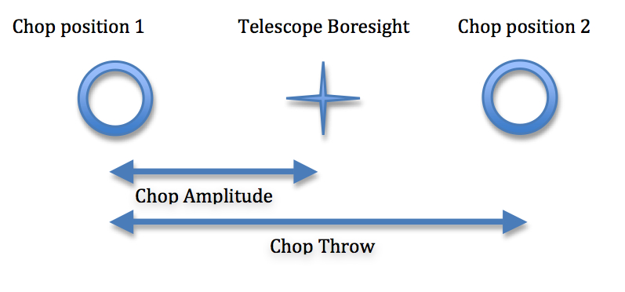
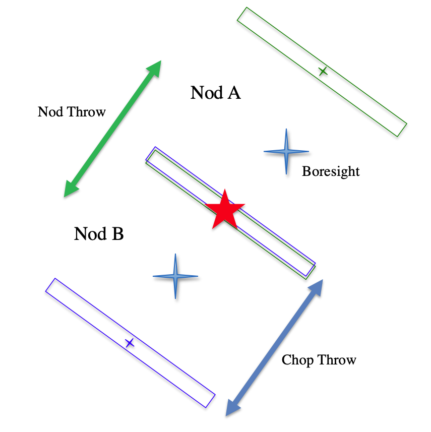
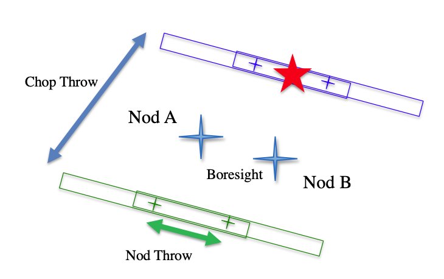
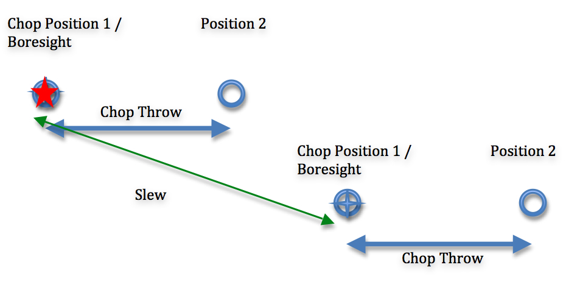
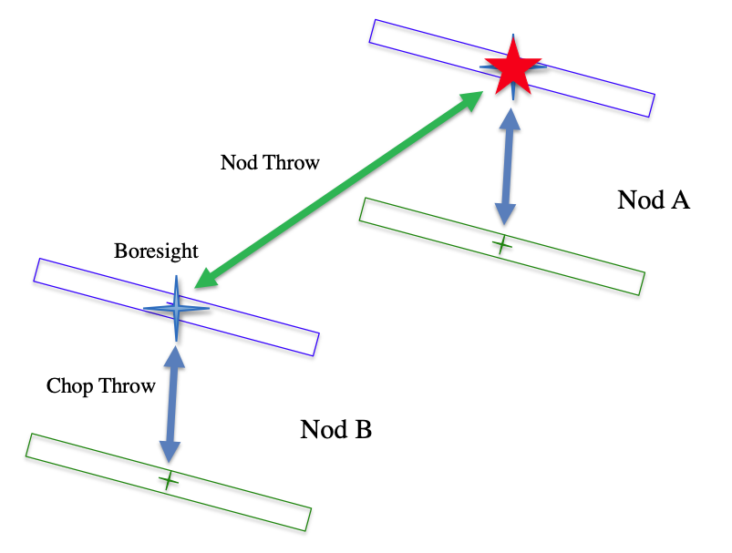
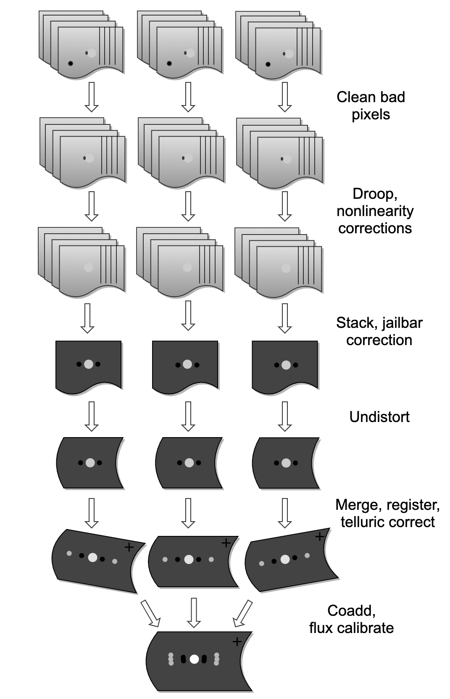
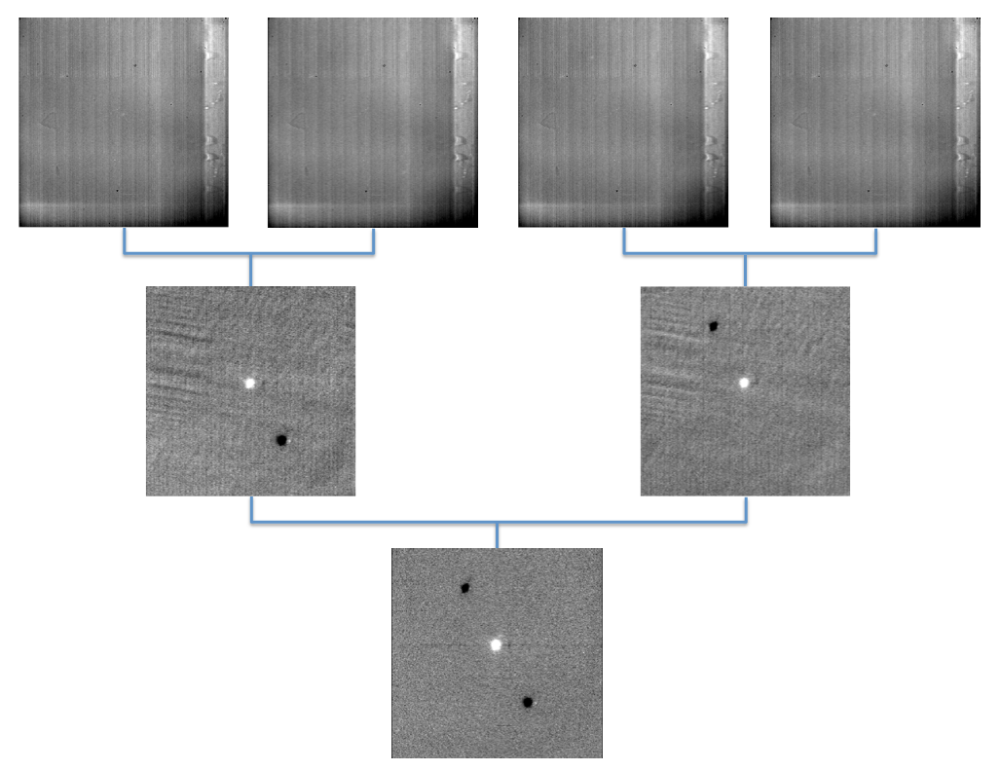
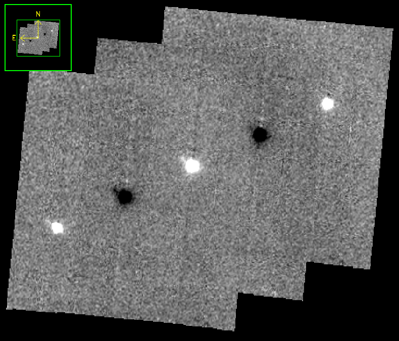

SI Observing Modes Supported
============================

FORCAST observing techniques
----------------------------

Because the sky is so bright in the mid-infrared (MIR) relative to
astronomical sources, the way in which observations are made in the MIR
is considerably different from the more familiar way they are made in
the optical. Any raw image of a region in the MIR is overwhelmed by the
background sky emission. The situation is similar to trying to observe
in the optical during the day: the bright daylight sky swamps the
detector and makes it impossible to see astronomical sources in the raw
images.

In order to remove the background from the MIR image and detect the
faint astronomical sources, observations of another region (free of
sources) are made and the two images are subtracted. However, the MIR is
highly variable, both spatially and temporally. It
would take far too long (on the order of seconds) to reposition a large
telescope to observe this sky background region: by the time the
telescope had moved and settled at the new location, the sky background
level would have changed so much that the subtraction of the two images
would be useless. In order to avoid this problem, the secondary mirror
of the telescope (which is considerably smaller than the primary mirror)
is tilted, rather than moving the entire telescope. This allows
observers to look at two different sky positions very quickly (on the
order of a few to ten times per second), because tilting the secondary
by an angle :math:`\theta` moves the center of the field imaged
by the detector by :math:`\theta`
on the sky. Tilting the secondary between two positions is known as
"chopping". FORCAST observations are typically made with a chopping
frequency of 4 Hz. That is, every 0.25 sec, the secondary is moved
between the two observing positions.

Chopping can be done either symmetrically or asymmetrically. Symmetric
chopping means that the secondary mirror is tilted symmetrically about
the telescope optical axis (also known as the boresight) in the two chop
positions. The distance between the two chop positions is known as the
chop throw. The distance between the boresight and either chop position
is known as the chop amplitude and is equal to half the chop throw
(see :numref:`symmetric_chop`).

         position in the middle, chop 1 to the left,
         chop 2 to the right.

   Symmetric Chop

Asymmetric chopping means that the secondary is aligned with the
telescope boresight in one position, but is tilted away from the
boresight in the chop position. The chop amplitude is equal to the chop
throw in this case (see :numref:`asymmetric_chop`).

.. figure:: images/asym_chop.png
   :name: asymmetric_chop
   :alt: Sky positions for asymmetric chop.
         Boresight co-located with chop 1 on the left, chop 2 to the right.

   Asymmetric Chop

Unfortunately, moving the secondary mirror causes the telescope to be
slightly misaligned, which introduces optical distortions (notably the
optical aberration known as coma) and additional background emission
from the telescope (considerably smaller than the sky emission but
present nonetheless) in the images. The optical distortions can be
minimized by tilting the secondary only tiny fractions of a degree. The
additional telescopic background can be removed by moving the entire
telescope to a new position and then chopping the secondary again
between two positions. Subtracting the two chop images at this new
telescope position will remove the sky emission but leave the additional
telescopic background due to the misalignment; subtracting the result
from the chop-subtracted image at the first telescope position will then
remove the background. Since the process of moving to a new position is
needed to remove the additional background from the telescope, not the
sky, it can be done on a much longer timescale. The variation in the
telescopic backgrounds occurs on timescales on the order of tens of
seconds to minutes, much slower than the variation in the sky emission.

This movement of the entire telescope, on a much longer timescale than
chopping, is known as nodding. The two nod positions are usually
referred to as nod A and nod B. The distance between the two nod
positions is known as the nod throw or the nod amplitude. For FORCAST
observations, nods are done every 5 to 30 seconds. The chop-subtracted
images at nod position B are then subtracted from the chop-subtracted
images at nod position A. The result will be an image of the region,
without the sky background emission or the additional emission resulting
from tilting the secondary during the chopping process. The sequence of
chopping in one telescope position, nodding, and chopping again in a
second position is known as a chop/nod cycle.

Again, because the MIR sky is so bright, deep images of a region cannot
be obtained (as they are in the optical) by simply observing the region
for a long time with the detector collecting photons continuously. As
stated above, the observations require chopping and nodding at fairly
frequent intervals. Hence, deep observations are made by "stacking" a
series of chop/nod images. Furthermore, MIR detectors are not perfect,
and often have bad pixels or flaws. In order to avoid these defects on
the arrays, and prevent them from marring the final images, observers
employ a technique known as "dithering." Dithering entails moving the
position of the telescope slightly with respect to the center of the
region observed each time a new chop/nod cycle is begun, or after
several chop/nod cycles. When the images are processed, the observed
region will appear in a slightly different place on the detector. This
means that the bad pixels do not appear in the same place relative to
the observed region. The individual images can then be registered and
averaged or median-combined, a process that will eliminate (in theory)
the bad pixels from the final image.

Available chopping modes
------------------------

Symmetric chopping modes: C2N and C2ND
~~~~~~~~~~~~~~~~~~~~~~~~~~~~~~~~~~~~~~

FORCAST acquires astronomical observations in two symmetric chopping
modes: two-position chopping with no nodding (C2) and two-position
chopping with nodding (C2N). Dithering can be implemented for either
mode; two-position chopping with nodding and dithering is referred to as
C2ND. The most common observing methods used are C2N and C2ND. C2ND is
conceptually very similar to the C2N mode: the only difference is a slight
movement of the telescope position after each chop/nod cycle.

FORCAST can make two types of C2N observations: Nod Match Chop (NMC) and
Nod Perpendicular to Chop (NPC). The positions of the telescope
boresight, the two chop positions, and the two nod positions for these
observing types are shown below (:numref:`nmc` through :numref:`npc_nas`).

C2N: Nod Match Chop (NMC)
^^^^^^^^^^^^^^^^^^^^^^^^^

In the NMC mode, the telescope is pointed at a position half of the chop
throw distance away from the object to be observed, and the secondary
chops between two positions, one of which is centered on the object. The
nod throw has the same magnitude as the chop throw, and is in a
direction exactly 180 degrees from that of the chop direction. The final
image is generated by subtracting the images obtained for the two chop
positions at nod A and those at nod B, and then subtracting the results.
This will produce three images of the star, one positive and two
negative, with the positive being twice as bright as the negatives.

.. figure:: images/nmc.png
   :name: nmc
   :alt: Sky positions for NMC.  Nod throw is
         centered on the source; chop throw is centered on the boresight.

   Nod Match Chop mode

For grism observations, the chop and nod angles can be set relative to
the sky or the array (slit). There are two special angles
when using the array coordinate system: parallel to (along; :numref:`nmc_para`), and
orthogonal (perpendicular; :numref:`nmc_perp`) to the slit. Dithers should be done along the slit.

.. figure:: images/nmc_spec_parallel.png
   :name: nmc_para
   :alt: Sky positions for NMC parallel mode. Chop and
         nod throw fall along a single line, aligned with the slit.

   Nod Match Chop Parallel to Slit

         Chop/nod throw are parallel to each other, perpendicular
         to the slit.

   Nod Match Chop Perpendicular to Slit

C2N: Nod Perpendicular to Chop (NPC)
^^^^^^^^^^^^^^^^^^^^^^^^^^^^^^^^^^^^

In the NPC mode, the telescope is offset by half the nod throw from the
target in a direction perpendicular to the chop direction, and the
secondary chops between two positions. The nod throw usually (but not
necessarily) has the same magnitude as the chop, but it is in a
direction perpendicular to the chop direction. The final image is
generated by subtracting the images obtained for the two chop positions
at nod A and those at nod B, and then subtracting the results. This will
produce four images of the star in a rectangular pattern, with the image
values alternating positive and negative.

.. figure:: images/npc.png
   :name: npc
   :alt: Sky positions for NPC mode.  Nod throw
         and chop throw centered on the source, perpendicular
         to each other.

   Nod Perpendicular to Chop mode

For grism observations, there are two types of NPC observations: Chop
Along Slit and Nod Along Slit.  For Chop Along Slit
(:numref:`npc_cas`), the telescope is pointed at the object and the
secondary chops between two positions on either side of the
object. The chop throw is oriented such that both positions are
aligned with the angle of the slit on the sky.  For Nod Along Slit,
(:numref:`npc_nas`) the telescope is pointed at a position half of the
chop throw distance away from the object to be observed, and the
secondary chops between two positions, one of which is centered on the
object. The nod throw is oriented such that both nod positions are
aligned with the angle of the slit on the sky.

.. figure:: images/c2n_chop_along_slit.png
   :name: npc_cas
   :width: 500px
   :alt: Sky positions for NPC-CAS mode. Chop
         throw is along the slit; nod throw is perpendicular to it.

   Nod Perpendicular to Chop, Chop Along Slit

         throw is along the slit; chop throw is perpendicular to it.

   Nod Perpendicular to Chop, Nod Along Slit

Asymmetrical chopping modes: C2NC2 and NXCAC
~~~~~~~~~~~~~~~~~~~~~~~~~~~~~~~~~~~~~~~~~~~~

FORCAST also has an asymmetrical chop mode, known as C2NC2. In this
mode, the telescope is first pointed at the target (position A). In this
first position, the secondary is aligned with the boresight for one
observation and then is tilted some amount (often 180-480 arcseconds)
for the second (asymmetrically chopped) observation. This is an
asymmetric C2 mode observation. The telescope is then slewed some
distance from the target, to a sky region without sources (position
B), and the asymmetric chop pattern is repeated. The time between slews
is typically 30 seconds.

         at source and sky positions, connected by a telescope slew.

   C2NC2 mode

There is an additional asymmetric mode chopping mode, called NXCAC
(nod not related to chop/asymmetrical chop; :numref:`nxcac`).
This mode replaces the C2NC2 mode when the GI wants to use an asymmetrical
chop for a grism observation.
This mode is taken with an ABBA nod pattern, like the C2N mode
(not ABA, like C2NC2). The nods
are packaged together, so data from this mode will reduce just like the
C2N mode. The reason for adding this mode stems from the need to define
our large chops and nods in ERF (equatorial reference frame), and dither
in SIRF (science instrument reference frame) along the slit.

         at source and sky positions, perpendicular
         to the slit.

   NXCAC mode

Spectral imaging mode: SLITSCAN
~~~~~~~~~~~~~~~~~~~~~~~~~~~~~~~

Similar to the C2ND mode for imaging, the SLITSCAN mode for grism
observations allows a combination of chopping and nodding with
telescope moves to place the spectral extraction slit at different
locations in the sky.

In slit-scan observations, a chop/nod cycle is taken at a series of
positions, moving the slit slowly across an extended target after
each cycle.  In this mode, the different telescope positions may be used to
generate both extracted spectra at each position and a spatial/spectral
cube that combines all the observations together into a spectral map
of the source.

Algorithm Description
=====================

Overview of data reduction steps
--------------------------------

This section will describe, in general terms, the major algorithms that
the FORCAST Redux pipeline uses to reduce a FORCAST observation.

The pipeline applies a number of corrections to each input file, regardless of
the chop/nod mode used to take the data. The initial steps used for
imaging and grism modes are nearly identical; points where the results
or the procedure differ for either mode are noted in the descriptions
below. After preprocessing, individual images or spectra of a source
must be combined to produce the final data product. This procedure depends
strongly on the instrument configuration and chop/nod mode.

See :numref:`flowchart_img` and :numref:`flowchart_grism` for
flowcharts of the processing steps used by the imaging and grism pipelines.

         versions of each step.

   Processing steps for imaging data.

.. figure:: images/flowchart_grism.png
   :name: flowchart_grism
   :height: 800
   :alt: Flowchart of processing steps for grism data with cartoon
         versions of each step.

   Processing steps for grism data.

Reduction algorithms
--------------------

The following subsections detail each of the data reduction pipeline
steps:

-  Steps common to imaging and spectroscopy modes

   -  Identify/clean bad pixels

   -  Correct droop effect

   -  Correct for detector nonlinearity

   -  Subtract background (stack chops/nods)

   -  Remove jailbars (correct for crosstalk)

-  Imaging-specific steps

   -  Correct for optical distortion

   -  Merge chopped/nodded images

   -  Register images

   -  Correct for atmospheric transmission (telluric correct)

   -  Coadd multiple observations

   -  Calibrate flux

-  Spectroscopy-specific steps

   -  Stack common dithers

   -  Rectify spectral image

   -  Identify apertures

   -  Extract spectra

   -  Merge apertures

   -  Calibrate flux and correct for atmospheric transmission

   -  Combine multiple observations, or generate response spectra

Steps common to imaging and spectroscopy modes
~~~~~~~~~~~~~~~~~~~~~~~~~~~~~~~~~~~~~~~~~~~~~~

Identify bad pixels
^^^^^^^^^^^^^^^^^^^

Bad pixels in the FORCAST arrays take the form of hot pixels (with
extreme dark current) or pixels with very different response (usually
much lower) than the surrounding pixels. The pipeline minimizes the
effects of bad pixels by using a bad pixel mask to identify their
locations and then replacing the bad pixels with NaN values.  Optionally,
the bad pixels may instead be interpolated over, using nearby good values
as input.

The bad pixel map for both FORCAST channels is currently produced
manually, independent of the pipeline. The mask is a 256x256 image with
pixel value = 0 for bad pixels and pixel value = 1 otherwise.

Correct droop effect
^^^^^^^^^^^^^^^^^^^^

The FORCAST arrays and readout electronics exhibit a linear response
offset caused by the presence of a signal on the array. This effect is
called 'droop' since the result is a reduced signal. Droop results in
each pixel having a reduced signal that is proportional to the total
signal in the 15 other pixels in the row read from the multiplexer
simultaneously with that pixel. The effect, illustrated in :numref:`droop`, is
an image with periodic spurious sources spread across the array rows. The
droop correction removes the droop offset by multiplying each pixel by a
value derived from the sum of every 16th pixel in the same row all
multiplied by an empirically determined offset fraction: droopfrac =
0.0035. This value is a configurable parameter, as some data may require
a smaller droop fraction to avoid over-correction of the effect.
Over-correction may look like an elongated smear along the horizontal
axis, near a bright source (see :numref:`droop_overcor`). Note that while droop
correction typically removes the effect near the source, there may be
lingering artifacts in other areas of the image if the source was very
bright, as in :numref:`droop`.

.. figure:: images/droop.png
   :name: droop
   :alt: Left: bright source with irregular negative blob and ringing artifacts.
         Right: corrected image with no blob.

   Background-subtracted FORCAST images of a bright star with droop
   effect (left) and with the droop correction applied (right).

.. figure:: images/droop_overcor.png
   :name: droop_overcor
   :alt: Droop effect after over-correction. Contours show an
         elongated PSF on the left side of the source.

   Overcorrected droop effect, appearing as an elongated smear on
   the bright central source.

Correct for detector nonlinearity
^^^^^^^^^^^^^^^^^^^^^^^^^^^^^^^^^

In principle, the response of each of the pixels in the FORCAST detector
arrays should be linear with incident flux. In practice, the degree to
which the detector is linear depends on the level of charge in the wells
relative to the saturation level. Empirical tests optimizing
signal-to-noise indicate that signal levels in the neighborhood of 60%
of full well for a given detector capacitance in the FORCAST arrays have
minimal departures from linear response and optimal signal-to-noise. For
a given background level we can keep signal levels near optimal by
adjusting the detector readout frame rate and detector capacitance.
Since keeping signals near 60% of saturation level is not always
possible or practical, we have measured response curves (response in
analog-to-digital units (ADU) as a function of well depth for varying
background levels) that yield linearity correction factors. These
multiplicative correction factors linearize the response for a much
larger range of well depths (about 15% - 90% of saturation). The linearity
correction is applied globally to FORCAST images prior to background
subtraction. The pipeline first calculates the background level for a
sub-image, and then uses this level to calculate the linearity
correction factor. The pipeline then applies the correction factor to
the entire image.

Subtract background (stack chops/nods)
^^^^^^^^^^^^^^^^^^^^^^^^^^^^^^^^^^^^^^

Background subtraction is accomplished by subtracting chopped image
pairs and then subtracting nodded image pairs.

For C2N/NPC imaging mode
with chop/nod on-chip (i.e. chop throws smaller than the FORCAST field
of view), the four chop/nod images in the raw data file are reduced to a
single stacked image frame with a pattern of four background-subtracted
images of the source, two positive and two negative. For chop/nod larger than the
FORCAST field of view the raw files are reduced to a single frame with
one background-subtracted image of the source.

For the C2N/NPC
spectroscopic mode, either the chop or the nod is always off the slit,
so there will be two traces in the subtracted image: one positive and
one negative. If the chop or nod throw is larger than the field of view,
there will be a single trace in the image.

In the case of the C2N/NMC mode for either imaging or spectroscopy, the
nod direction is the same as the chop direction with the same throw so
that the subtracted image frame contains three background-subtracted
images of the source. The central image or trace is positive and the two
outlying images are negative. If the chop/nod throw is larger than the
FORCAST field of view, there will be a single image or trace in the
image.

         images, and chop-nod corrected image.

   Images at two stages of background subtraction in imaging NMC mode:
   raw frames (upper row), chop-subtracted (middle row),
   chop/nod-subtracted (lower row). Four raw frames produce a single
   stacked image.

C2NC2 raw data sets for imaging or spectroscopy consist of a set of 5
FITS files, each with 4 image planes containing the chop pairs for both
the on-source position (position A) and the blank sky position (position
B). The four planes can be reduced in the same manner as any C2N image
by first subtracting chopped image pairs for both and then subtracting
nodded image pairs. The nod sequence for C2NC2 is
:math:`A_1 B_1 A_2 A_3 B_2 A_4 A_5 B_3`, where the
off-source B nods are shared between some of the files
(shared B beams shown in bold):

    File 1 = :math:`A_1 \boldsymbol{B_1}`

    File 2 = :math:`\boldsymbol{B_1} A_2`

    File 3 = :math:`A_3 \boldsymbol{B_2}`

    File 4 = :math:`\boldsymbol{B_2} A_4`

    File 5 = :math:`A_5 \boldsymbol{B_3}`

The last step in the stack pipeline step is to convert pixel
data from analog-to-digital units (ADU) per frame to mega-electrons per
second (Me/s) using the gain and frame rate used for the
observation.

At this point, the background in the chop/nod-subtracted stack should be
zero, but if there is a slight mismatch between the background levels in
the individual frames, there may still remain some small residual
background level. After stacking, the pipeline estimates this residual
background by taking the mode or median of the image data in a central section of
the image, and then subtracts this level from the stacked image.  This
correction is typically not applied for grism data, as the spectroscopic
pipeline has other methods for removing residual background.

Remove jailbars (correct for crosstalk)
^^^^^^^^^^^^^^^^^^^^^^^^^^^^^^^^^^^^^^^

The FORCAST array readout circuitry has a residual, or latent, signal
that persists when pixels have high contrast relative to the surrounding
pixels. This can occur for bad pixels or for bright point sources. This
residual is present not only in the affected pixels, but is correlated
between all pixels read by the same one of sixteen multiplexer channels.
This results in a linear pattern of bars, spaced by 16 pixels, known as
"jailbars" in the background-subtracted (stacked) images
(see :numref:`jailbar`). Jailbars can interfere with subsequent efforts to
register multiple images since the pattern can dominate the cross-correlation
algorithm sometimes used in image registration. The jailbars can also
interfere with photometry in images and with spectral flux in
spectroscopy frames.

The pipeline attempts to remove jailbar patterns from the
background-subtracted images by replacing pixel values by the median
value of pixels in that row that are read by the same multiplexer
channel (i.e. every 16th pixel in that row starting with the pixel being
corrected). The jailbar pattern is located by subtracting a
1-dimensional (along rows) median filtered image from the raw image.

.. figure:: images/jailbar.png
   :name: jailbar
   :alt: Images with regular vertical striping due to the jailbar effect.

   Crosstalk correction for a bright point source (left), and
   faint source (right). Images on the top are before correction; images
   on the bottom are after correction.

Imaging-specific steps
~~~~~~~~~~~~~~~~~~~~~~

Correct for optical distortion
^^^^^^^^^^^^^^^^^^^^^^^^^^^^^^

The FORCAST optical system introduces anamorphic magnification and
barrel distortion in the images. The distortion correction uses pixel
coordinate offsets for a grid of pinholes imaged in the lab and a 2D
polynomial warping function to resample the 256x256 pixels to an
undistorted grid. The resulting image is 262x247 pixels with image scale
of 0.768"/pixel for a corrected field of view of 3.4x3.2 arcminutes.
Pixels outside of the detector area are set to NaN to distinguish them
from real data values.

Merge chopped/nodded images
^^^^^^^^^^^^^^^^^^^^^^^^^^^

The stack step of the pipeline in imaging mode may produce images with
multiple positive and negative source images, depending on the chop/nod
mode used for data acquisition. These positive and negative sources may
be merged by copying, shifting, and re-combining the image in order to
increase the signal-to-noise of the observation. The final image is then
rotated by the nominal sky angle, so that North is up and East
is left in the final image (see :numref:`merge`).

The merge pipeline step makes a number of copies of the stacked image,
shifts them by the chop and nod throws used in data acquisition, and
adds or subtracts them (depending on whether the image is a positive or
negative background-subtracted image). The pipeline can use two
different methods for registration in the merge process: chop/nod offset
data from the FITS header, or centroid of the brightest point source in
the stacked images.

The default for flux standards is to use centroiding, as it is usually
the most precise method. If merging is desired for science images that
do not contain a bright, compact source, the header data method is
usually the most reliable. After the shifting and adding, the final
merged image consists of a positive image of the source surrounded by a
number of positive and negative residual source images left over from
the merging process. The central image is the source to use for science.

For the NPC imaging mode with chop/nod amplitude smaller than the field
of view, the stack step produces a single stacked image frame with a
pattern of four background-subtracted images of the source, two of them
negative. The merge step makes four copies of the stacked frame, then
shifts each using the selected algorithm. It adds or subtracts each
copy, depending on whether the source is positive or negative.

For the NMC imaging mode with chop/nod amplitude smaller than the field
of view, the stacked image contains three background-subtracted sources,
two negative, and one positive (see :numref:`stack`). The positive source has
double the flux of the negative ones, since the source falls in the same
place on the detector for two of the chop/nod positions. The merge step
for this mode makes three copies of the image, shifts the two negative
sources on top of the positive one, and then subtracts them
(see :numref:`merge`). Pixels with no data are set to NaN.

         negative sources, and 2 fainter positive sources
         to the sides.

   The NMC observation of :numref:`stack`, after merging. Only the
   central source should be used for science; the other images are
   artifacts of the stacking and merging procedure. Note that the merged
   image is rotated to place North up and East left.

While performing the merge, the locations of overlap for the shifted
images are recorded. For NPC mode, the final merged image is normalized
by dividing by the number of overlapping images at each pixel. For NMC
mode, because the source is doubled in the stacking step, the final
merged image is divided by the number of overlapping images, plus one.
In the nominal case, if all positive and negative sources were found and
coadded, the signal in the central source, in either mode, should now be
the average of four observations of the source. If the chop or nod was
relatively wide, however, and one or more of the extra sources were not
found on the array, then the central source may be an average of fewer
observations.

For either NPC or NMC imaging modes, with chop/nod amplitude greater
than half of the array, there is no merging to be done, as the extra
sources are off the detector. However, for NMC mode, the data is still
divided by 2 to account for the doubled central source. For C2NC2 mode,
the chops and telescope moves-to-sky are always larger than the FORCAST
field of view; merging is never required for this mode. It may also be
desirable to skip the merging stage for crowded fields-of-view and extended
sources, as the merge artifacts may be confused with real sources.

In all imaging cases, whether or not the shifting-and-adding is performed,
the merged image is rotated by the sky angle at the end of the merge step.

Register images
^^^^^^^^^^^^^^^

In order to combine multiple imaging observations of the same source,
each image must be registered to a reference image, so that the pixels
from each image correspond to the same location on the sky.

The registration information is typically encoded in the world coordinate
system (WCS) embedded in each FITS file header.  For most observations,
the WCS is sufficiently accurate that no change is required in the registration
step.  However, if the WCS is faulty, it may be corrected in the registration
step, using centroiding or cross-correlation between images to identify common
sources, or using header information about the dither offsets used.  In this
case,the first image is taken as the reference image, and calculated offsets
are applied to the WCS header keywords (CRPIX1 and CRPIX2) in all
subsequent images. [#fn_register]_

.. [#fn_register]
   Earlier versions of this pipeline applied registration to the images
   themselves, rather than to the WCS in the FITS header, interpolating
   them into the same spatial grid.  As of v2.0.0, registration affects
   only the CRPIX1 and CRPIX2 keywords in the header.

Correct for atmospheric transmission
^^^^^^^^^^^^^^^^^^^^^^^^^^^^^^^^^^^^

For accurate flux calibration, the pipeline must first correct for the
atmospheric opacity at the time of the observation. In order to combine
images taken in different atmospheric conditions, or at different
altitudes or zenith angles, the pipeline corrects the flux in each
individual registered file for the estimated atmospheric transmission
during the observations, based on the altitude and zenith angle at the
time when the observations were obtained, relative to that computed for
a reference altitude (41,000 feet) and reference zenith angle (45
degrees), for which the instrumental response has been calculated. The
atmospheric transmission values are derived from the ATRAN code
provided to the SOFIA program by Steve Lord. The pipeline applies the
telluric correction factor directly to the flux in the image, and
records it in the header keyword TELCORR.

After telluric correction, the pipeline performs aperture photometry on
all observations that are marked as flux
standards (FITS keyword OBSTYPE = STANDARD\_FLUX). The brightest source
in the field is fit with a Moffat profile to determine its centroid, and
then its flux is measured, using an aperture of 12 pixels and a
background region of 15-25 pixels. The aperture flux and error, as well
as the fit characteristics, are recorded in the FITS header, to be used
in the flux calibration process.

Coadd multiple observations
^^^^^^^^^^^^^^^^^^^^^^^^^^^

After registration and scaling, the pipeline coadds multiple
observations of the same source with the same instrument configuration
and observation mode. Each image is projected into the coordinate system
of the first image, using its WCS to transform input coordinates into output
coordinates.  An additional offset may be applied for non-sidereal targets
in order to correct for the motion of the target across the sky, provided
that the target position is recorded in the FITS headers (TGTRA and TGTDEC).
The projection is performed with a bilinear interpolation, then individual
images are mean- or median-combined, with optional error weighting and robust
outlier rejection.

For flux standards, photometry calculations are repeated on the coadded
image, in the same way they were performed on the individual images.

Calibrate flux
^^^^^^^^^^^^^^

For the imaging mode, flux calibration factors are typically calculated from
all standards observed within a flight series. These calibration factors are
applied directly to the flux images to produce an image calibrated to
physical units. The final Level 3 product has image units of Jy per pixel.
[#fn_flux]_

See the flux calibration section, below, for more information.

.. [#fn_flux]
   Earlier versions of this pipeline did not produce a final
   calibrated file. Prior to v1.1.0, the final Level 3 products had image
   units of Me/sec, with the flux calibration factor (Me/sec/Jy) recorded
   in the FITS header keyword, CALFCTR. To convert these products to
   Jy/pixel, divide the flux image by the CALFCTR value.

Mosaic
^^^^^^

In some cases, it may be useful to stack together separate calibrated
observations of the same target. In order to create a deeper image of a
faint target, for example, observations taken across multiple flights
may be combined together. Large maps may also be generated by taking
separate observations, and stitching together the results. In these
cases, the pipeline may register these files and coadd them, using the
same methods as in the initial registration and coadd steps. The output
product is a LEVEL\_4 mosaic.

Spectroscopy-specific steps
~~~~~~~~~~~~~~~~~~~~~~~~~~~

Stack common dithers
^^^^^^^^^^^^^^^^^^^^
For very faint spectra, a second stacking step may be optionally performed.
This step identifies spectra at common dither positions and mean- or
median-combines them in order to increase signal-to-noise.  This step
may be applied if spectra are too faint to automatically identify appropriate
apertures.

.. _rectify_image:

Rectify spectral image
^^^^^^^^^^^^^^^^^^^^^^
For the spectroscopic mode, spatial and spectral distortions are
corrected for by defining calibration images that assign a wavelength
coordinate (in :math:`\mu m`) and a spatial coordinate (in *arcsec*) to each
detector pixel, for each grism available.  Each 2D spectral image in
an observation is resampled into a rectified spatial-spectral grid, using
these coordinates to define the output grid.
If appropriate calibration data is available, the output from this step is an
image in which wavelength values are constant along the columns, and spatial
values are constant along the rows, correcting for any curvature in the
spectral trace (:numref:`forcast_rectified`).

These calibration maps are generated from identifications of sky emission
and telluric absorption lines and a polynomial fit to centroids of those
features in pixel space for each row (i.e. along the dispersion direction).
The derivation of a wavelength calibration is an interactive process, but
application of the derived wavelength calibration is an automatic part
of the data reduction pipeline. The default wavelength calibration is
expected to be good to within approximately one pixel in the output
spectrum.

For some observational cycles, sufficient calibration data may not be available,
resulting in some residual spectral curvature, or minor wavelength calibration
inaccuracies.  The spectral curvature can be compensated for, in sources
with strong continuum emission, by tracing the continuum center during
spectral extraction (see next section).  For other sources, a wider
aperture may be set, at the cost of decreased signal-to-noise.

For NMC observations, the central spectrum is doubled in flux after stacking,
as for imaging NMC modes.  After the rectified image is generated, it is
divided by 2 for NMC mode data, in order to normalize the flux value.
[#fn_rectify]_

Additionally, a correction that accounts
for spatial variations in the instrumental throughput may be applied to the
rectified image. This "slit correction function" is a function of the position
of the science target spectrum along the slit relative to that used for
the standard stars.  The slit function image is produced in a separate
calibration process, from observations of sources taken at varying places
on the slit.

.. figure:: images/rectified.png
   :name: forcast_rectified
   :alt: Central positive trace and two negative
         traces.  Left: spatial curvature.  Right: straigter trace.

   A NMC spectral image, before (left) and after (right) rectification. The
   black spots indicate bad pixels, identified with NaN values.  Bad pixel
   influence grows during the resampling process in rectification.

.. [#fn_rectify]
   Earlier versions of this pipeline deferred this normalization to later
   steps.  In pipeline versions prior to v1.4.0, the 'rectimg' product
   (\*RIM\*.fits) was not normalized for NMC data: it should be divided
   by 2 before being used for spectral extractions.

.. _set_apertures:

Identify apertures
^^^^^^^^^^^^^^^^^^
In order to aid in spectral extraction, the pipeline constructs a smoothed
model of the relative intensity of the target spectrum at each spatial
position, for each wavelength. This spatial profile is used to compute
the weights in optimal extraction or to fix bad pixels in standard
extraction (see next section). Also, the pipeline uses the median profile,
collapsed along the wavelength axis, to define the extraction
parameters.

To construct the spatial profile, the pipeline first subtracts the median
signal from each column in the rectified spectral image to remove the residual
background.  The intensity in this image in column *i* and row *j* is given by

   :math:`O_{ij} = f_{i}P_{ij}`

where :math:`f_i` is the total intensity of the spectrum at
wavelength *i*, and :math:`P_{ij}` is the spatial profile at column *i*
and row *j*. To get the spatial profile :math:`P_{ij}`, we must
approximate the intensity :math:`f_i`. To do so, the pipeline computes a
median over the wavelength dimension (columns) of the order image to get a
first-order approximation of the median spatial profile at each row
:math:`P_j`. Assuming that

   :math:`O_{ij} \approx c_{i}P_{j}`,

the pipeline uses a linear least-squares algorithm to fit :math:`P_j` to
:math:`O_{ij}` and thereby determine the coefficients :math:`c_i`. These
coefficients are then used as the first-order approximation to :math:`f_i`:
the resampled order image :math:`O_{ij}` is divided by :math:`f_i` to derive
:math:`P_{ij}`.  The pipeline then fits a low-order polynomial along the
columns at each spatial point *s* in order to smooth the profile and
thereby increase its signal-to-noise. The coefficients of these fits can
then be used to determine the value of :math:`P_{ij}` at any column *i* and
spatial point *j* (see :numref:`forcast_profile`, left). The median of :math:`P_{ij}`
along the wavelength axis generates the median spatial profile, :math:`P_j`
(see :numref:`forcast_profile`, right).

.. figure:: images/profile.png
   :name: forcast_profile
   :alt: Left: 3D surface in slit position vs. wavelength
         vs. flux.  Right: 1D plot of slit position vs.
         flux.

   Spatial model and median spatial profile, for the image in
   :numref:`forcast_rectified`.  The spatial model image here
   is rotated for comparison with the profile plot: the y-axis is
   along the bottom of the surface plot; the x-axis is along the left.

The pipeline then uses the median spatial profile to identify extraction
apertures for the source. The aperture centers can be identified
automatically by iteratively finding local maxima in the absolute value
of the spatial profile, or can be specified directly by the user.  By
default, a single aperture is expected and defined by the pipeline,
but additional apertures may also be defined (e.g. for NMC or NPC
spectra with chopping or nodding on-slit, as in :numref:`forcast_rectified`).

The true position of the aperture center may vary somewhat
with wavelength, as a result of small optical effects or atmospheric
dispersion. To account for this variation, the pipeline attempts to
trace the spectrum across the array. It fits a Gaussian in the spatial
direction, centered at the specified position, at regular intervals in
wavelength. The centers of these fits are themselves fitted with a
low-order polynomial; the coefficients of these fits give the trace
coefficients that identify the center of the spectral aperture at each
wavelength. For extended sources, the continuum cannot generally be
directly traced. Instead, the pipeline fixes the aperture center to a
single spatial value.

Besides the aperture centers, the pipeline also specifies a PSF radius,
corresponding to the distance from the center at which the flux from the
source falls to zero. This value is automatically determined from the
width of a Gaussian fit to the peak in the median spatial profile, as

  :math:`R_{psf} = 2.15 \cdot \text{FWHM}`.

For optimal extraction, the pipeline also identifies a smaller aperture
radius, to be used as the integration region:

  :math:`R_{ap} = 0.7 \cdot \text{FWHM}`.

This value should give close to optimal signal-to-noise for a Moffat or
Gaussian profile.  The pipeline also attempts to specify background regions
outside of any extraction apertures, for fitting and removing the residual
sky signal.  All aperture parameters may be optionally overridden by the
pipeline user.

Spectral extraction and merging
^^^^^^^^^^^^^^^^^^^^^^^^^^^^^^^

The spectral extraction algorithms used by the pipeline offer two
different extraction methods, depending on the nature of the target
source. For point sources, the pipeline uses an optimal extraction
algorithm, described at length in the Spextool paper (see the
:ref:`forcast_resources` section, below, for a reference).
For extended sources, the pipeline uses a standard summing extraction.

In either method, before extracting a spectrum, the pipeline first uses
any identified background regions to find the residual sky background
level. For each column in the 2D image, it fits a low-order
polynomial to the values in the specified regions, as a function of
slit position. This polynomial determines the wavelength-dependent
sky level (:math:`B_{ij}`) to be subtracted from the spectrum
(:math:`D_{ij}`).

The standard extraction method uses values from the spatial profile image
(:math:`P_{ij}`) to replace bad pixels and outliers, then sums the flux
from all pixels contained within the PSF radius. The flux at column
*i* is then:

   :math:`f_{i,\text{sum}} = \sum_{j=j_1}^{j_2}(D_{ij} - B_{ij})`

where :math:`j_1` and :math:`j_2` are the upper and lower limits of the extraction
aperture (in pixels):

   :math:`j_1 = t_i - R_{PSF}`

   :math:`j_2 = t_i + R_{PSF}`

given the aperture trace center (:math:`t_i`) at
that column. This extraction method is the only algorithm available
for extended sources.

Point sources may occasionally benefit from using standard extraction,
but optimal extraction generally produces higher signal-to-noise ratios
for these targets. This method works by weighting each pixel in the
extraction aperture by how much of the target’s flux it contains.
The pipeline first normalizes the spatial profile by the sum of the spatial
profile within the PSF radius defined by the user:

   :math:`P_{ij}^{'} = P_{ij} \Big/ \sum_{j=j_1}^{j_2}P_{ij}`.

:math:`P_{ij}^{'}` now represents the fraction of the total flux from
the target that is contained within pixel *(i,j)*, so that
:math:`(D_{ij} - B_{ij}) / P_{ij}^{'}` is a set of *j* independent
estimates of the total flux at column *i*. The pipeline does a weighted
average of these estimates, where the weight depends on the pixel's
variance and the normalized profile value. Then, the flux at column *i* is:

   :math:`f_{i,\text{opt}} = \frac{\sum_{j=j_3}^{j_4}{M_{ij}P_{ij}^{'}(D_{ij} - B_{ij}) \big/ (V_{D_{ij}} + V_{B_{ij}})}}{\sum_{j=j_3}^{j_4}{M_{ij}{P_{ij}^{'}}^{2} \big/ (V_{D_{ij}} + V_{B_{ij}})}}`

where :math:`M_{ij}` is a bad pixel mask and :math:`j_3`
and :math:`j_4` are the upper and lower limits given by the aperture radius:

   :math:`j_3 = t_i - R_{ap}`

   :math:`j_4 = t_i + R_{ap}`

Note that bad pixels are simply ignored, and outliers will have little
effect on the average because of the weighting scheme.

After extraction, spectra from separate apertures (e.g. for NMC mode,
with chopping on-slit) may be merged together to increase the
signal-to-noise of the final product. The default combination statistic
is a robust weighted mean.

.. _spectral_calibration:

Calibrate flux and correct for atmospheric transmission
^^^^^^^^^^^^^^^^^^^^^^^^^^^^^^^^^^^^^^^^^^^^^^^^^^^^^^^

Extracted spectra are corrected individually for instrumental
response and atmospheric transmission, a process that yields a
flux-calibrated spectrum in units of Jy per pixel. See the
section on flux calibration, below, for more detailed information.

The rectified spectral images are also corrected for atmospheric transmission,
and calibrated to physical units in the same manner.  Each row of the image
is divided by the same correction as the 1D extracted spectrum.  This image
is suitable for custom extractions of extended fields: a sum over any number of
rows in the image produces a flux-calibrated spectrum of that region,
in the same units as the spectrum produced directly by the pipeline.

Note that the FITS header for the primary extension for this product
(PRODTYPE = 'calibrated_spectrum') [#fn_calrectimg]_
contains a full spatial and spectral WCS that can be used to identify
the coordinates of any spectra so extracted.  The primary WCS identifies
the spatial direction as arcseconds up the slit, but a secondary WCS
with key = 'A' identifies the RA, Dec, and wavelength of every pixel
in the image.  Either can be extracted and used for pixel identification
with standard WCS manipulation packages, such as the
`astropy WCS package <http://docs.astropy.org/en/stable/wcs/>`__\ .

.. [#fn_calrectimg]
   In early versions of the pipeline (before v1.4.0), the calibrated
   rectified image was not produced.  For versions 1.4.0 to 1.5.0, the
   product type was PRODTYPE = 'calrectimg', and it contained only the
   calibrated image.  For version 2.0.0 and higher, the product type is
   'calibrated_spectrum', and the calibrated image and associated WCS are
   contained in the primary extension.  Subsequent extensions also contain
   the calibrated extracted spectra and reference atmospheric transmission
   and response spectra.

After telluric correction, it is possible to apply a correction to the
calibrated wavelengths for the motion of the Earth relative to the solar
system barycenter at the time of the observation.  For FORCAST resolutions,
we expect this wavelength shift to be a small fraction of a pixel, well within
the wavelength calibration error, so we do not directly apply it to the data.
The shift (as :math:`d\lambda / \lambda`) is calculated and stored in the
header in the BARYSHFT keyword.  An additional wavelength correction to the
local standard of rest (LSR) from the barycentric velocity is also stored in
the header, in the LSRSHFT keyword.

Combine multiple observations
^^^^^^^^^^^^^^^^^^^^^^^^^^^^^

The final pipeline step for most grism observation modes is
coaddition of multiple spectra of the same
source with the same instrument configuration and observation mode. The
individual extracted 1D spectra are combined with a robust weighted
mean, by default.  The 2D spectral images are also coadded, using the same
algorithm as for imaging coaddition, and the spatial/spectral WCS to project
the data into a common coordinate system.

Reductions of flux standards have an alternate final product
(see :ref:`response`, below).  Slit-scan observations also
produce an alternate final product instead of directly coadding
spectra (see :ref:`speccube`, below).

.. _response:

Response spectra
^^^^^^^^^^^^^^^^

The final product of pipeline processing of telluric standards is not a
calibrated, combined spectrum, but rather an instrumental response
spectrum that may be used to calibrate science target spectra.  These
response spectra are generated from individual observations of
calibration sources by dividing the observed spectra by a model of the
source multiplied by an atmospheric model.  The resulting response
curves may then be combined with other response spectra from a flight
series to generate a master instrument response spectrum that is used in
calibrating science spectra.  See the flux calibration section, below,
for more information.

.. _speccube:

Spectral cubes
^^^^^^^^^^^^^^

For slit-scan observations, the calibrated, rectified images produced
at the flux calibration step are resampled together into a
spatial/spectral cube.

Since the pipeline rectifies all images onto
the same wavelength grid, each column in the image corresponds to the same
wavelength in all rectified images from the same grism. The pipeline
uses the WCS in the headers to assign a spatial position to each pixel in
each input image, then steps through the wavelength values, resampling the
spatial values into a common grid.

The resampling algorithm proceeds as follows.  At each wavelength value,
the algorithm loops over the output spatial grid, finding values within
a local fitting window.  Values within the window are
fit with a low-order polynomial surface fit.  These fits are weighted
by the error on the flux, as propagated by the pipeline, and by
a Gaussian function of the distance from the data point to the grid
location.  The output flux at each pixel is the value of the surface
polynomial, evaluated at the grid location.  The associated error
value is the error on the fit.  Grid locations for which there was
insufficient input data are set to NaN.  An exposure map cube indicating
the number of observations input at each pixel is also generated and
attached to the output FITS file.

Uncertainties
-------------

The pipeline calculates the expected uncertainties for raw FORCAST data as an
error image associated with the flux data.  FORCAST raw data is
recorded in units of ADU per coadded frame. The
variance associated with the *(i,j)*\ th pixel in this raw data is
calculated as:

.. math:: V_{ij} = \frac{N_{ij} \beta_g}{\text{FR} \cdot t \cdot g} + \frac{\text{RN}^2}{\text{FR} \cdot t \cdot g^2}

where :math:`N` is the raw ADU per frame in each pixel, :math:`\beta_g` is the
excess noise factor, :math:`FR` is the frame rate, :math:`t` is the integration
time, :math:`g` is the gain, and :math:`RN` is the read noise in electrons. The
first term corresponds to the Poisson noise, and the second to the read
noise. Since FORCAST data are expected to be background-limited, the
Poisson noise term should dominate the read noise term.  The error image
is the square root of :math:`V_{ij}` for all pixels.

For all image processing steps and spectroscopy steps involving spectral images,
the pipeline propagates this calculated error image alongside the flux in
the standard manner. The error image is written to disk as an extra
extension in all FITS files produced at intermediate steps. [#fn_variance]_

The variance for the standard spectroscopic extraction is a simple sum of the
variances in each pixel within the aperture. For the optimal extraction
algorithm, the variance on the *i*\ th pixel in the extracted spectrum
is calculated as:

.. math::
    V_{i} = \sum_{j=j_3}^{j_4} \frac{M_{ij}}{{P_{ij}^{'}}^2 V_{ij}}

where :math:`P_{ij}^{'}` is the scaled spatial profile, :math:`M_{ij}` is
a bad pixel mask, :math:`V_{ij}` is the variance at each background-subtracted
pixel, and the sum is over all spatial pixels :math:`j` within the aperture
radius. This equation comes from the Spextool paper, describing optimal
extraction.  The error spectrum for 1D spectra is the square root of the
variance.

.. [#fn_variance]
   In pipeline versions prior to v2.0.0, the error was stored as a variance
   image, as a second plane in the primary FITS image extension. In versions
   2.0.0 and later, each FITS image extension has a distinct scientific
   meaning: flux and error images are stored as 2D data arrays, in separate
   extensions.  Refer to the BUNIT keyword for the physical units of the
   data stored in each extension.

.. _forcast_resources:

Other Resources
---------------

For more information about the pipeline software architecture and
implementation, see the FORCAST Redux Developer's Manual.

For more information on the spectroscopic reduction algorithms
used in the pipeline, see the Spextool papers:

`Spextool: A Spectral Extraction Package for SpeX, a 0.8-5.5 micron
Cross-Dispersed
Spectrograph <http://irtfweb.ifa.hawaii.edu/~spex/Spextool.pdf>`__\

Michael C. Cushing, William D. Vacca and John T. Rayner
(2004, PASP 116,
362).

`A Method of Correcting Near-Infrared Spectra for Telluric
Absorption <http://irtfweb.ifa.hawaii.edu/~spex/Telluric.pdf>`__\

William D. Vacca, Michael C. Cushing and John T. Rayner
(2003, PASP 115,
389).

`Nonlinearity Corrections and Statistical Uncertainties Associated
with Near-Infrared
Arrays <http://irtfweb.ifa.hawaii.edu/~spex/Nonlinearity.pdf>`__\

William D. Vacca, Michael C. Cushing and John T. Rayner
(2004, PASP 116,
352).

Flux calibration
================

Imaging Flux Calibration
------------------------

The reduction process, up through image coaddition, generates Level 2
images with data values in units of mega-electrons per second (Me/s).
After Level 2 imaging products are generated, the pipeline derives the
flux calibration factors (in units of Me/s/Jy) and applies them to each
image. The calibration factors are derived for each FORCAST filter
configuration (filter and dichroic) from observations of calibrator
stars.

After the calibration factors have been derived, the coadded flux
is divided by the appropriate factor to produce the Level 3 calibrated
data file, with flux in units of Jy/pixel.  The value used is stored in
the FITS keyword CALFCTR.

Reduction steps
~~~~~~~~~~~~~~~

The calibration is carried out in several steps. The first step consists
of measuring the photometry of all the standard stars for a specific
mission or flight series, after the images have been corrected for the
atmospheric transmission relative to that for a reference altitude and
zenith angle [#fn_atran]_. The pipeline performs aperture photometry on the
reduced Level 2 images of the standard stars after the registration
stage using a photometric aperture radius of 12 pixels (about 9.2" for
FORCAST). The telluric-corrected photometry of the standard star is
related to the measured photometry of the star via

.. math:: N_{e}^{std,corr} = N_{e}^{std} \frac{R_{\lambda}^{ref}}{R_{\lambda}^{std}}

where the ratio :math:`R_{\lambda}^{ref} / R_{\lambda}^{std}`
accounts for differences in system response (atmospheric transmission)
between the actual observations and those for the reference altitude of
41000 feet and a telescope elevation of 45\ :math:`^\circ`. Similarly, for the science
target, we have

.. math:: N_{e}^{obj,corr} = N_{e}^{obj} \frac{R_{\lambda}^{ref}}{R_{\lambda}^{obj}}

Calibration factors (in Me/s/Jy) for each filter are then derived from
the measured photometry (in Me/s) and the known fluxes of the standards
(in Jy) in each filter. These predicted fluxes were computed by
multiplying a model stellar spectrum by the overall filter + instrument
+ telescope + atmosphere (at the reference altitude and zenith angle)
response curve and integrating over the filter passband to compute the
mean flux in the band. The adopted filter throughput curves are those
provided by the vendor or measured by the FORCAST team, modified to
remove regions (around 6-7 microns and 15 microns) where the values were
contaminated by noise. The instrument throughput is calculated by
multiplying the transmission curves of the entrance window, dichroic,
internal blockers, and mirrors, and the detector quantum efficiency. The
telescope throughput value is assumed to be constant (85%) across the
entire FORCAST wavelength range.

For most of the standard stars, the adopted stellar models were obtained
from the *Herschel* calibration group and consist of high-resolution
theoretical spectra, generated from the MARCS models (Gustafsson et al.
1975, Plez et al. 1992), scaled to match absolutely calibrated
observational fluxes (Dehaes et al. 2011). For :math:`\beta` UMi, the model
was scaled by a factor of 1.18 in agreement with the results of the *Herschel*
calibration group (J. Blommaert, private communication; the newer
version of the model from the *Herschel* group has incorporated this
factor).

The calibration factor, *C*, is computed from

.. math:: C = \frac{N_e^{std,corr}}{F_{\nu}^{nom,std}(\lambda_{ref})} = \frac{N_e^{std,corr}}{\langle F_{\nu}^{std} \rangle} \frac{\lambda^2_{piv}}{\langle \lambda \rangle \lambda_{ref}}

with an uncertainty given by

.. math:: \bigg( \frac{\sigma_C}{C} \bigg)^2 = \bigg( \frac{\sigma_{N_e^{std}}}{N_e^{std}} \bigg)^2 + \bigg( \frac{\sigma_{\langle F_{\nu}^{std} \rangle}}{\langle F_{\nu}^{std} \rangle} \bigg)^2 .

Here, :math:`\lambda_{piv}` is the pivot wavelength of the filter, and :math:`\langle \lambda \rangle` is
the mean wavelength of the filter. The calibration factor refers to a
nominal flat spectrum source at the reference
wavelength :math:`\lambda_{ref}`.

The calibration factors derived from each standard for each filter are
then averaged. The pipeline inserts this value and its associated
uncertainty into the headers of the Level 2 data files for the flux
standards, and uses the value to produce calibrated flux standards.
The final step involves examining the calibration values and
ensuring that the values are consistent. Outlier values may come from
bad observations of a standard star; these values are removed to produce
a robust average of the calibration factor across the flight series. The
resulting average values are then used to calibrate the observations of
the science targets.

Using the telluric-corrected photometry of the standard,
:math:`N_e^{std,corr}` (in Me/s), and the predicted mean fluxes
of the standards in each filter, :math:`\langle F_{\nu}^{std} \rangle`
(in Jy), the flux of a target object is given by

.. math:: F_{\nu}^{nom,obj}(\lambda_{ref}) = \frac{N_e^{obj,corr}}{C}

where :math:`N_e^{obj,corr}` is the telluric-corrected count
rate in Me/s detected from the source, :math:`C` is the
calibration factor (Me/s/Jy), and
:math:`F_{\nu}^{nom,obj}(\lambda_{ref})` is the flux in Jy of a
nominal, flat spectrum source (for which :math:`F_{\nu} \sim \nu^{-1}`)
at a reference wavelength :math:`\lambda_{ref}`.

The values of :math:`C`, :math:`\sigma_C`, and :math:`\lambda_{ref}` are written into
the headers of the calibrated (PROCSTAT=LEVEL_3 ) data as the keywords CALFCTR, ERRCALF, and
LAMREF, respectively. The reference wavelength :math:`\lambda_{ref}` for these
observations was taken to be the mean wavelengths of the filters,
:math:`\langle \lambda \rangle`.

Note that :math:`\sigma_C`, as stored in the ERRCALF value,
is derived from the standard deviation of the calibration factors
across multiple flights.  These values are typically on the order of
about 6% (see Herter et al. 2013).  There is an additional systematic
uncertainty on the stellar models, which is on the order of
5-10% (Dehaes et al. 2011).

.. [#fn_atran]
   The atmospheric transmission in each filter has been computed using
   the ATRAN code (Lord 1992) for a range of observatory altitudes
   (corresponding to a range of overhead precipitable water vapor
   values) and telescope elevations. The ratio of the transmission at
   each altitude and zenith angle relative to that at the reference
   altitude (41000 feet) and zenith angle (45 degrees) has been
   calculated for each filter and fit with a low order polynomial. The
   ratio appropriate for the altitude and zenith angle of each
   observation is calculated and applied to each image.

Color corrections
~~~~~~~~~~~~~~~~~

An observer often wishes to determine the true flux of an object at the
reference wavelength, :math:`F_{\nu}^{obj}(\lambda_{ref})`, rather
than the flux of an equivalent nominal, flat spectrum source. To do
this, we define a color correction *K* such that

.. math:: K = \frac{F_{\nu}^{nom,obj}(\lambda_{ref})}{F_{\nu}^{obj}(\lambda_{ref})}

where :math:`F_{\nu}^{nom,obj}(\lambda_{ref})` is the flux density
obtained by measurement on a data product. Divide the measured
values by *K* to obtain the "true" flux density. In terms of the
wavelengths defined above,

.. math:: K = \frac{\langle \lambda \rangle \lambda_{ref}}{\lambda_{piv}^2}\frac{\langle F_{\nu}^{obj} \rangle}{F_{\nu}^{obj}(\lambda_{ref})} .

For most filters and spectral shapes, the color corrections are small
(<10%). Tables listing *K* values and filter wavelengths are available
from the `SOFIA website <https://irsa.ipac.caltech.edu/data/SOFIA/docs/data/data-processing/>`__\ .

Spectrophotometric Flux Calibration
-----------------------------------

The common approach to characterizing atmospheric transmission for
ground-based infrared spectroscopy is to obtain, for every science
target, similar observations of a spectroscopic standard source with as
close a match as possible in both airmass and time. Such an approach is
not practical for airborne observations, as it imposes too heavy a
burden on flight planning and lowers the efficiency of science
observations. Therefore, we employ a calibration plan that incorporates
a few observations of a calibration star per flight and a model of the
atmospheric absorption for the approximate altitude and airmass (and
precipitable water vapor, if known) at which the science objects were
observed.

Instrumental response curves are generated from the extracted spectra of
calibrator targets. For the G063 and G111 grisms, the calibrator targets
comprise the set of standard stars and the associated stellar models
provided by the *Herschel* Calibration program and used for the FORCAST
photometric calibration. For the G227 and G329 grisms, the calibrator
targets consist of bright asteroids. Blackbodies are fit to the
calibrated broadband photometric observations of the asteroids and these
serve as models of the intrinsic asteroid spectra. In either case, the
extracted spectra are corrected for telluric absorption using the ATRAN
models corresponding to the altitude and zenith angle of the calibrator
observations, smoothed to the nominal resolution for the grism/slit
combination, and sampled at the observed spectral binning. The
telluric-corrected spectra are then divided by the appropriate models to
generate response curves (with units of Me/s/Jy at each wavelength) for
the various grism+slit+channel combinations. The response curves
derived from the various calibrators for each instrumental combination
are then combined and smoothed to generate a set of master instrumental
response curves. The statistical uncertainties on these response curves
are on the order of 5-10%.

Spectra of science targets are first divided by the appropriate
instrumental response curve, a process that yields spectra in physical
units of Jy at each wavelength.

Telluric correction of FORCAST grism data for a science target is
currently carried out in a multi-step process:

1. Telluric absorption models have been computed, using ATRAN, for the
   entire set of FORCAST grism passbands for every 1000 feet of altitude
   between 35K and 45K feet, for every 5 degrees of zenith angle between
   30 and 70 degrees, and for a set of precipitable water vapor (PWV)
   values between 1 and 50 microns. These values span the allowed ranges
   of zenith angle, typical range of observing altitudes, and the
   expected range of PWV values for SOFIA observations. The spectra have
   been smoothed to the nominal resolution for the grism and slit
   combination and are resampled to the observed spectral binning.

2. If the spectrum of the science target has a signal-to-noise ratio
   greater than 10, the
   best estimate of the telluric absorption spectrum is derived in the
   following manner: under the assumption that the intrinsic
   low-resolution MIR spectrum of most targets can be well-represented
   by a smooth, low-order polynomial, the telluric spectrum that
   minimizes :math:`\chi^2` defined as

   .. math:: \chi_j^2 = \sum\limits_i^n \Big( F_i^{obs} - P_i T_i \big(\text{PWV}_j \big) \Big)^2 \big/ \sigma_i^2

   is determined. Here :math:`F_i^{obs}` is the
   response-corrected spectrum at each of the *n* wavelength points *i*,
   :math:`\sigma_i` is the uncertainty at each point, :math:`P_i` is the
   polynomial at each point, and :math:`T_i` is the telluric
   spectrum corresponding to the precipitable water vapor value
   :math:`\text{PWV}_j`. The telluric spectra used in the calculations are
   chosen from the pre-computed library generated with ATRAN. Only the
   subset of ATRAN model spectra corresponding, as close as possible, to
   the observing altitude and zenith angle, are considered in the
   calculation. The free parameters determined in this step are the
   coefficients of the polynomial and the PWV value, which then yields
   the best telluric correction spectrum. The uncertainty on the PWV
   value is estimated to be about 1-2 microns.

3. If the spectrum of the science target has a S/N less than 10, the
   closest telluric spectrum (in terms of altitude and airmass of the
   target observations) with the default PWV value from the ATRAN model
   is selected from the pre-computed library.

4. In order to account for any wavelength shifts between the models and
   the observations, an optimal shift is estimated by minimizing the
   residuals of the corrected spectrum, with respect to small relative
   wavelength shifts between the observed data and the telluric
   spectrum.

5. The wavelength-shifted observed spectrum is then divided by the smoothed
   and re-sampled telluric model. This then yields a telluric-corrected and
   flux calibrated spectrum.

Analysis of the calibrated spectra of observed standard stars
indicates that the average RMS deviation over the G063, G227,
and G329 grism passbands between the calibrated spectra and the models
is on the order of about 5%. For the G111 grism, the average RMS deviation is
found to be on the order of about 10%; the larger deviation for this grism is
due primarily to the highly variable ozone feature at 9.6 microns, which
the ATRAN models are not able to reproduce accurately. The Level 3 data
product for any grism includes the calibrated spectrum and an error
spectrum that incorporates these RMS values. The adopted telluric
absorption model and the instrumental response functions are also
provided.

As for any slit spectrograph, highly accurate absolute flux levels from
FORCAST grism observations (for absolute spectrophotometry, for example)
require additional photometric observations to correct the calibrated
spectra for slit losses that can be variable (due to varying image
quality) between the spectroscopic observations of the science target
and the calibration standard.

Data products
=============

Filenames
---------

Output files from Redux are named according to the convention:

   *FILENAME = F[flight]\_FO\_IMA\|GRI\_AOR-ID\_SPECTEL1\|SPECTEL2\_Type\_FN1[-FN2]*.fits,

where flight is the SOFIA flight number, FO is the instrument
identifier, IMA or GRI specifies that it is an imaging or grism file,
AOR-ID is the AOR identifier for the observation,
SPECTEL1\|SPECTEL2 is the keyword specifying the filter or grism used,
Type is three letters identifying the product type (listed in
:numref:`img_data_prod` and :numref:`spec_data_prod`, below),
FN1 is the file number corresponding to the input file.
FN1-FN2 is used if there are multiple input files for a single output
file, where FN1 is the file number of the first input file and FN2 is
the file number of the last input file.

Pipeline Products
-----------------

The following tables list all intermediate products generated by the pipeline
for imaging and grism modes, in the order in which they are produced. [#fn_pipeprod]_
By default, for imaging, the *undistorted*, *merged*, *telluric\_corrected*,
*coadded*, *calibrated*, and *mosaic* products are saved; for grism, the *stacked*,
*rectified_image*, *merged_spectrum*, *calibrated_spectrum*, *coadded_spectrum*,
and *combined_spectrum* products are saved.

The final grism mode output product from the Combine Spectra or Combine Response
steps are dependent on the input data: for INSTMODE=SLITSCAN, a *spectral_cube*
product is produced instead of a *coadded_spectrum* and *combined_spectrum*;
for OBSTYPE=STANDARD_TELLURIC, the *instrument_response* is produced instead.

For most observation modes, the pipeline additionally produces an image in PNG
format, intended to provide a quick-look preview of the data contained in
the final product.  These auxiliary products may be distributed to observers
separately from the FITS file products.

.. [#fn_pipeprod]
    Earlier versions of this pipeline (before v2.0.0) produced different
    sets of default products.  Refer to earlier revisions of this manual
    for complete information.

.. table:: Intermediate data products for imaging reductions
   :name: img_data_prod
   :class: longtable
   :widths: 20 14 18 18 10 12 26

   +------------------------+-----------------+-----------------------+----------------+------------+------------+------------------------+
   || **Step**              || **Data type**  || **PRODTYPE**         || **PROCSTAT**  || **Code**  || **Saved** || **Extensions**        |
   +========================+=================+=======================+================+============+============+========================+
   || Clean Images          || 2D image       || cleaned              || LEVEL\_2      || CLN       || N         || FLUX, ERROR           |
   +------------------------+-----------------+-----------------------+----------------+------------+------------+------------------------+
   || Correct Droop         || 2D image       || drooped              || LEVEL\_2      || DRP       || N         || FLUX, ERROR           |
   +------------------------+-----------------+-----------------------+----------------+------------+------------+------------------------+
   || Correct Nonlinearity  || 2D image       || linearized           || LEVEL\_2      || LNZ       || N         || FLUX, ERROR           |
   +------------------------+-----------------+-----------------------+----------------+------------+------------+------------------------+
   || Stack Chops/Nods      || 2D image       || stacked              || LEVEL\_2      || STK       || N         || FLUX, ERROR           |
   +------------------------+-----------------+-----------------------+----------------+------------+------------+------------------------+
   || Undistort             || 2D image       || undistorted          || LEVEL\_2      || UND       || Y         || FLUX, ERROR           |
   +------------------------+-----------------+-----------------------+----------------+------------+------------+------------------------+
   || Merge                 || 2D image       || merged               || LEVEL\_2      || MRG       || Y         || FLUX, ERROR, EXPOSURE |
   +------------------------+-----------------+-----------------------+----------------+------------+------------+------------------------+
   || Register              || 2D image       || registered           || LEVEL\_2      || REG       || N         || FLUX, ERROR, EXPOSURE |
   +------------------------+-----------------+-----------------------+----------------+------------+------------+------------------------+
   || Telluric Correct      || 2D image       || telluric\_           || LEVEL\_2      || TEL       || Y         || FLUX, ERROR, EXPOSURE |
   |                        |                 || corrected            |                |            |            |                        |
   +------------------------+-----------------+-----------------------+----------------+------------+------------+------------------------+
   || Coadd                 || 2D image       || coadded              || LEVEL\_2      || COA       || Y         || FLUX, ERROR, EXPOSURE |
   +------------------------+-----------------+-----------------------+----------------+------------+------------+------------------------+
   || Flux Calibrate        || 2D image       || calibrated           || LEVEL\_3      || CAL       || Y         || FLUX, ERROR, EXPOSURE |
   +------------------------+-----------------+-----------------------+----------------+------------+------------+------------------------+
   || Mosaic                || 2D image       || mosaic               || LEVEL\_4      || MOS       || Y         || FLUX, ERROR, EXPOSURE |
   +------------------------+-----------------+-----------------------+----------------+------------+------------+------------------------+

.. table:: Intermediate data products for spectroscopy reduction
   :name: spec_data_prod
   :class: longtable
   :widths: 20 14 18 18 10 12 27

   +------------------------+-----------------+------------------+----------------+------------+-------------+-----------------------+
   || **Step**              || **Data type**  || **PRODTYPE**    || **PROCSTAT**  || **Code**  || **Saved**  || **Extensions**       |
   +========================+=================+==================+================+============+=============+=======================+
   || Clean Images          || 2D spectral    || cleaned         || LEVEL\_2      || CLN       || N          || FLUX, ERROR          |
   |                        || image          |                  |                |            |             |                       |
   +------------------------+-----------------+------------------+----------------+------------+-------------+-----------------------+
   || Correct Droop         || 2D spectral    || drooped         || LEVEL\_2      || DRP       || N          || FLUX, ERROR          |
   |                        || image          |                  |                |            |             |                       |
   +------------------------+-----------------+------------------+----------------+------------+-------------+-----------------------+
   || Correct               || 2D spectral    || linearized      || LEVEL\_2      || LNZ       || N          || FLUX, ERROR          |
   || Nonlinearity          || image          |                  |                |            |             |                       |
   +------------------------+-----------------+------------------+----------------+------------+-------------+-----------------------+
   || Stack Chops/Nods      || 2D spectral    || stacked         || LEVEL\_2      || STK       || Y          || FLUX, ERROR          |
   |                        || image          |                  |                |            |             |                       |
   +------------------------+-----------------+------------------+----------------+------------+-------------+-----------------------+
   || Make Profiles         || 2D spectral    || rectified\_     || LEVEL\_2      || RIM       || Y          || FLUX, ERROR, BADMASK,|
   |                        || image          || image           |                |            |             || WAVEPOS, SLITPOS,    |
   |                        |                 |                  |                |            |             || SPATIAL_MAP,         |
   |                        |                 |                  |                |            |             || SPATIAL_PROFILE      |
   +------------------------+-----------------+------------------+----------------+------------+-------------+-----------------------+
   || Locate Apertures      || 2D spectral    || apertures\_     || LEVEL\_2      || LOC       || N          || FLUX, ERROR, BADMASK,|
   |                        || image          || located         |                |            |             || WAVEPOS, SLITPOS,    |
   |                        |                 |                  |                |            |             || SPATIAL_MAP,         |
   |                        |                 |                  |                |            |             || SPATIAL_PROFILE      |
   +------------------------+-----------------+------------------+----------------+------------+-------------+-----------------------+
   || Trace Continuum       || 2D spectral    || continuum\_     || LEVEL\_2      || TRC       || N          || FLUX, ERROR, BADMASK,|
   |                        || image          || traced          |                |            |             || WAVEPOS, SLITPOS,    |
   |                        |                 |                  |                |            |             || SPATIAL_MAP,         |
   |                        |                 |                  |                |            |             || SPATIAL_PROFILE,     |
   |                        |                 |                  |                |            |             || APERTURE_TRACE       |
   +------------------------+-----------------+------------------+----------------+------------+-------------+-----------------------+
   || Set Apertures         || 2D spectral    || apertures_set   || LEVEL\_2      || APS       || N          || FLUX, ERROR, BADMASK,|
   |                        || image          |                  |                |            |             || WAVEPOS, SLITPOS,    |
   |                        |                 |                  |                |            |             || SPATIAL_MAP,         |
   |                        |                 |                  |                |            |             || SPATIAL_PROFILE,     |
   |                        |                 |                  |                |            |             || APERTURE_TRACE,      |
   |                        |                 |                  |                |            |             || APERTURE_MASK        |
   +------------------------+-----------------+------------------+----------------+------------+-------------+-----------------------+
   || Subtract              || 2D spectral    || background\_    || LEVEL\_2      || BGS       || N          || FLUX, ERROR, BADMASK,|
   || Background            || image          || subtracted      |                |            |             || WAVEPOS, SLITPOS,    |
   |                        |                 |                  |                |            |             || SPATIAL_MAP,         |
   |                        |                 |                  |                |            |             || SPATIAL_PROFILE,     |
   |                        |                 |                  |                |            |             || APERTURE_TRACE,      |
   |                        |                 |                  |                |            |             || APERTURE_MASK        |
   +------------------------+-----------------+------------------+----------------+------------+-------------+-----------------------+
   || Extract Spectra       || 2D spectral    || spectra         || LEVEL\_2      || SPM       || N          || FLUX, ERROR, BADMASK,|
   |                        || image;         |                  |                |            |             || WAVEPOS, SLITPOS,    |
   |                        || 1D spectrum    |                  |                |            |             || SPATIAL_MAP,         |
   |                        |                 |                  |                |            |             || SPATIAL_PROFILE,     |
   |                        |                 |                  |                |            |             || APERTURE_TRACE,      |
   |                        |                 |                  |                |            |             || APERTURE_MASK,       |
   |                        |                 |                  |                |            |             || SPECTRAL_FLUX,       |
   |                        |                 |                  |                |            |             || SPECTRAL_ERROR,      |
   |                        |                 |                  |                |            |             || TRANSMISSION         |
   +------------------------+-----------------+------------------+----------------+------------+-------------+-----------------------+
   || Merge Apertures       || 2D spectral    || merged\_        || LEVEL\_2      || MGM       || Y          || FLUX, ERROR, BADMASK,|
   |                        || image;         || spectrum        |                |            |             || WAVEPOS, SLITPOS,    |
   |                        || 1D spectrum    |                  |                |            |             || SPATIAL_MAP,         |
   |                        |                 |                  |                |            |             || SPATIAL_PROFILE,     |
   |                        |                 |                  |                |            |             || APERTURE_TRACE,      |
   |                        |                 |                  |                |            |             || APERTURE_MASK,       |
   |                        |                 |                  |                |            |             || SPECTRAL_FLUX,       |
   |                        |                 |                  |                |            |             || SPECTRAL_ERROR,      |
   |                        |                 |                  |                |            |             || TRANSMISSION         |
   +------------------------+-----------------+------------------+----------------+------------+-------------+-----------------------+
   || Calibrate Flux        || 2D spectral    || calibrated\_    || LEVEL\_3      || CRM       || Y          || FLUX, ERROR, BADMASK,|
   |                        || image;         || spectrum        |                |            |             || WAVEPOS, SLITPOS,    |
   |                        || 1D spectrum    |                  |                |            |             || SPATIAL_MAP,         |
   |                        |                 |                  |                |            |             || SPATIAL_PROFILE,     |
   |                        |                 |                  |                |            |             || APERTURE_TRACE,      |
   |                        |                 |                  |                |            |             || APERTURE_MASK,       |
   |                        |                 |                  |                |            |             || SPECTRAL_FLUX,       |
   |                        |                 |                  |                |            |             || SPECTRAL_ERROR       |
   |                        |                 |                  |                |            |             || TRANSMISSION,        |
   |                        |                 |                  |                |            |             || RESPONSE,            |
   |                        |                 |                  |                |            |             || RESPONSE_ERROR       |
   +------------------------+-----------------+------------------+----------------+------------+-------------+-----------------------+
   || Combine Spectra       || 2D spectral    || coadded\_       || LEVEL\_3      || COA       || Y          || FLUX, ERROR,         |
   |                        || image;         || spectrum        |                |            |             || EXPOSURE, WAVEPOS,   |
   |                        || 1D spectrum    |                  |                |            |             || SPECTRAL_FLUX,       |
   |                        |                 |                  |                |            |             || SPECTRAL_ERROR       |
   |                        |                 |                  |                |            |             || TRANSMISSION,        |
   |                        |                 |                  |                |            |             || RESPONSE             |
   +------------------------+-----------------+------------------+----------------+------------+-------------+-----------------------+
   || Combine Spectra       || 1D spectrum    || combined\_      || LEVEL\_3      || CMB       || Y          || FLUX                 |
   |                        |                 || spectrum        |                |            |             |                       |
   |                        |                 |                  |                |            |             |                       |
   |                        |                 |                  |                |            |             |                       |
   +------------------------+-----------------+------------------+----------------+------------+-------------+-----------------------+
   || Combine Spectra       || 3D spectral    || spectral\_      || LEVEL\_4      || SCB       || Y          || FLUX, ERROR,         |
   |                        || cube           || cube            |                |            |             || EXPOSURE, WAVEPOS,   |
   |                        |                 |                  |                |            |             || TRANSMISSION,        |
   |                        |                 |                  |                |            |             || RESPONSE             |
   +------------------------+-----------------+------------------+----------------+------------+-------------+-----------------------+
   || Make Response         || 1D response    || response\_      || LEVEL\_3      || RSP       || Y          || FLUX                 |
   |                        || spectrum       || spectrum        |                |            |             |                       |
   |                        |                 |                  |                |            |             |                       |
   |                        |                 |                  |                |            |             |                       |
   +------------------------+-----------------+------------------+----------------+------------+-------------+-----------------------+
   || Combine Response      || 1D response    || instrument\_    || LEVEL\_4      || IRS       || Y          || FLUX                 |
   |                        || spectrum       || response        |                |            |             |                       |
   |                        |                 |                  |                |            |             |                       |
   |                        |                 |                  |                |            |             |                       |
   +------------------------+-----------------+------------------+----------------+------------+-------------+-----------------------+

Data Format
-----------

All files produced by the pipeline are multi-extension FITS
files (except for the *combined_spectrum*, *response_spectrum*, and
*instrument_response* products: see below). [#fn_dataprod]_
The flux image is stored in the primary
header-data unit (HDU); its associated error image is stored in extension
1, with EXTNAME=ERROR.  For the *spectral_cube* product, these extensions
contain 3D spatial/spectral cubes instead of 2D images: each plane in the cube
represents the spatial information at a wavelength slice.

Imaging products may additionally contain an extension with EXTNAME=EXPOSURE,
which contains the nominal exposure time at each pixel, in seconds.  This
extension has the same meaning for the spectroscopic *coadded_spectrum*
and *spectral_cube* products.

In spectroscopic products, the SLITPOS and WAVEPOS extensions give the
spatial (rows) and spectral (columns) coordinates, respectively, for
rectified images.  These coordinates may also be derived from the WCS
in the primary header.  WAVEPOS also indicates the wavelength coordinates
for 1D extracted spectra.

Intermediate spectral products may contain SPATIAL_MAP and SPATIAL_PROFILE
extensions.  These contain the spatial map and median spatial profile,
described in the :ref:`rectify_image` section, above.  They may also contain
APERTURE_TRACE and APERTURE_MASK extensions.  These contain the spectral aperture
definitions, as described in the :ref:`set_apertures` section.

Final spectral products contain SPECTRAL_FLUX and SPECTRAL_ERROR extensions:
these are the extracted 1D spectrum and associated uncertainty.  They
also contain TRANSMISSION and RESPONSE extensions, containing the atmospheric
transmission and instrumental response spectra used to calibrate the spectrum
(see the :ref:`spectral_calibration` section).

The *combined_spectrum*, *response_spectrum*, and *instrument_response*
are one-dimensional spectra, stored in Spextool format, as rows of data in
the primary extension.

For the *combined_spectrum*, the first row is the wavelength (um), the second
is the flux (Jy), the third is the error (Jy), the fourth is
the estimated fractional atmospheric transmission spectrum, and the fifth
is the instrumental response curve used in flux calibration (Me/s/Jy).
These rows correspond directly to the WAVEPOS, SPECTRAL_FLUX, SPECTRAL_ERROR,
TRANSMISSION, and RESPONSE extensions in the *coadded_spectrum* product.

For the *response_spectrum*, generated from telluric standard observations,
the first row is the wavelength (um), the second is the response spectrum
(Me/s/Jy), the third is the error on the response (Me/s/Jy),
the fourth is the atmospheric transmission spectrum (unitless), and the
fifth is the standard model used to derive the response (Jy).
The *instrument_reponse* spectrum, generated from combined
*response_spectrum* files, similarly has wavelength (um), response (Me/s/Jy),
error (Me/s/Jy), and transmission (unitless) rows.

The final uncertainties in calibrated images and spectra contain
only the estimated statistical uncertainties due to the noise in the
image or the extracted spectrum. The systematic uncertainties due to the
calibration process are recorded in header keywords. For imaging data,
the error on the calibration factor is recorded in the keyword ERRCALF.
For grism data, the estimated overall fractional error on the flux is
recorded in the keyword CALERR. [#fn_calerr]_

.. [#fn_dataprod]
   In earlier versions of this pipeline (prior to 2.0.0), all image products
   were 3D arrays of data, where the first plane was the image and the
   second plane was the variance associated with
   each pixel in the image. The square root of the variance plane gives
   the uncertainty estimate associated with each pixel in the image.
   An optional third plane was the exposure map, indicating the on-source
   integration time in seconds at each pixel.  All spectral products were
   in the Spextool format described above for the *combined_spectrum* product.

.. [#fn_calerr]
   Earlier versions of this pipeline (prior to 1.2.0) may have stored the
   systematic calibration error in the error spectrum or variance image,
   added in quadrature with the statistical error. Check PIPEVERS and
   compare the error estimates for the calibrated products to earlier
   products to ensure correct interpretation of the error estimates.

Data Quality
------------
Data quality for FORCAST is recorded in the FITS keyword DATAQUAL and
can contain the following values:

- **NOMINAL:** No outstanding issues with processing, calibration,
  or observing conditions.
- **USABLE:** Minor issue(s) with processing, calibration, or conditions
  but should still be scientifically valid (perhaps with larger than
  usual uncertainties); see HISTORY records for details.
- **PROBLEM:** Significant issue(s) encountered with processing,
  calibration, or observing conditions; may not be scientifically
  useful (depending on the application); see HISTORY records for details.
  In general, these cases are addressed through manual reprocessing
  before archiving and distribution.
- **FAIL:** Data could not be processed successfully for some reason.
  These cases are rare and generally not archived or distributed to the GI.

Any issues found in the data or during flight are recorded as QA
Comments and emailed to the GI after processing and archiving.
A permanent record of these comments are also directly recorded in
the FITS files themselves.  Check the FITS headers, near the bottom of the
HISTORY section, under such titles as "Notes from quality analysis"
or "QA COMMENTS".

Other data quality keywords include CALQUAL and WCSQUAL. The CALQUAL keyword
may have the following values:

- **NOMINAL:** Calibration is within nominal historical variability of 5-10%.
- **USABLE:** Issue(s) with calibration. Variability is greater than
  nominal limits, but still within the maximum requirements (<20%).
- **PROBLEM:** Significant issue(s) with calibration variability
  (>20%), or inability to properly calibrate. Data may not be
  scientifically useful.

The keyword WCSQUAL refers to the quality of the World Coordinate System
(WCS) for astrometry. In very early FORCAST cycles, there were many issues
with astrometry, as described in the
`Known Issues <https://irsa.ipac.caltech.edu/data/SOFIA/docs/sites/default/files/USpot_DCS_DPS/Documents/DCS_Known_Issues.pdf>`__
document. Astrometry could, in the worst cases, be off by a full chop- or
nod-throw distance (up to hundreds of pixels/arcseconds). These issues
were resolved in Cycle 3 and 4. However, there still appears to be a slight
distortion of 1-2 pixels across the FORCAST Field of View (FOV)
(where one FORCAST pixel is 0.768 arcsec). Methodologies to reduce this
distortion are currently being worked on. In addition, cooling of the
telescope mirror system exposed to the Stratosphere over the course of a
night observing can also result in a pointing accuracy change on order
of 1-2 pixels. Thus, is it important in cases where very accurate
astrometry is required that FORCAST data be checked relative to other
observations. This can also affect large mosaics of regions of the sky
where, depending on the changing rotation angle on sky, overlapping
sources may be slightly misaligned due to the distortion across the FOV.
Due to these issues the majority of data is set to a WCSQUAL value of
UNKNOWN. Values for the WCSQUAL keyword are described below:

- **NOMINAL:** No issues with chop/nod position miscalculation;
  WCS matches requested coordinates to within accuracy limits.
- **PROBLEM:** The WCS reference position deviates from the
  requested coordinates by more than 1 pixel.
- **UNKNOWN:** WCS has not been confirmed, however beginning in
  Cycle 4, are expected to match requested coordinates to within
  accuracy limits.

Exposure Time
-------------

FORCAST has many keywords for time of integration with slightly different
interpretation, including EXPTIME, TOTINT, and DETITIME. Due to the
details of the setup for chop/nod observations in symmetric and asymmetric
modes, the various integration times may not appear to match what was
calculated using SOFIA Instrument Time Estimator (SITE). From Cycle 10
onwards, SITE will be updated so that all times use EXPTIME and the mode
(C2NC2, NMC, etc.) will be selectable for a better estimate of the observing
time required. See below for a comparison of the total time keywords by
observing mode.

.. table:: Integration time keywords
   :name: time_table
   :class: longtable
   :widths: 40 20 20

   +-------------------------------------+------------------+--------------------+
   | **Mode**                            | **EXPTIME**      | **TOTINT**         |
   +=====================================+==================+====================+
   | NMC (shift and add negative beams,  | 2 × DETITIME     | 2 × DETITIME       |
   | e.g. standards)                     |                  |                    |
   +-------------------------------------+------------------+--------------------+
   | NMC (no shift and add, only use     | 1 × DETITIME     | 2 × DETITIME       |
   | positive beam)                      |                  |                    |
   +-------------------------------------+------------------+--------------------+
   | C2NC2/NXCAC                         | 0.5 × DETITIME   | 0.5 × DETITIME     |
   +-------------------------------------+------------------+--------------------+

Pipeline Updates
----------------
The FORCAST data reduction pipeline software has gone through several
updates over time and is constantly improving. In particular, the recent update
to version 2.0.0 introduced some relatively large changes to the format
of the data that may require updates to any local routines used to
analyze the data.

Below is a table summarizing major changes by pipeline
version. Dates refer to approximate release dates. Check the PIPEVERS key in
FITS headers to confirm the version used to process the data, as
some early data may have been reprocessed with later pipeline versions.
More detailed change notes are available in :ref:`forcast_change_notes`.

.. table:: Pipeline change notes
   :name: pipevers_table
   :class: longtable
   :widths: 20 20 20 40

   +---------------+-------------+---------------------+-----------------------------------------------------------+
   |  **PIPEVERS** |  **DATE**   |  **Software/Cycle** |   **Comments**                                            |
   +===============+=============+=====================+===========================================================+
   | <1.0.3        |  01/23/15   |   IDL:Cycle 1,2     |  Earliest FORCAST data where some modes were still being  |
   |               |             |                     |  commissioned.                                            |
   +---------------+-------------+---------------------+-----------------------------------------------------------+
   | 1.0.5         |  05/27/15   |   IDL:Cycle 3       |  TOTINT keyword added for comparison to requested/planned |
   |               |             |                     |  value in SITE.                                           |
   +---------------+-------------+---------------------+-----------------------------------------------------------+
   | 1.1.3         |   09/20/16  |    IDL:Cycle 4/5    |  Update rotation of field to filter boresight rather than |
   |               |             |                     |  center of array; previous data may have had an offset in |
   |               |             |                     |  astrometry between different filters.                    |
   +---------------+-------------+---------------------+-----------------------------------------------------------+
   | 1.2.0         |   01/25/17  |    IDL:Cycle 4/5    |  Overall improvement to calibration. Updated to include   |
   |               |             |                     |  TEL files which are similar to REG files with telluric   |
   |               |             |                     |  corrections applied to each file. Final calibrated file  |
   |               |             |                     |  CAL file is same as COA file but with calibration factor |
   |               |             |                     |  (CALFCTR) already applied. Improved telluric correction  |
   |               |             |                     |  for FORCAST grism data.                                  |
   +---------------+-------------+---------------------+-----------------------------------------------------------+
   |  1.3.0        |   04/24/17  |    IDL:Cycle 5      |  Pipeline begins support for FORCAST LEVEL 4 Imaging      |
   |               |             |                     |  Mosaics. EXPOSURE map is now propagated in units of time |
   |               |             |                     |  (seconds) instead of number of exposures.                |
   +---------------+-------------+---------------------+-----------------------------------------------------------+
   |  2.0.0        |   5/07/20   | Python:Cycle 8/9    |  File format of FITS files for imaging updated from image |
   |               |             |                     |  cube to separate extensions. Extensions are now FLUX,    |
   |               |             |                     |  ERROR, and EXPOSURE. ERROR now represents the standard   |
   |               |             |                     |  deviation (sigma) rather than the variance (sigma^2).    |
   |               |             |                     |  Spectroscopy data formats also move to separate          |
   |               |             |                     |  extensions, with some products combining spectra and 2D  |
   |               |             |                     |  spectral images.                                         |
   +---------------+-------------+---------------------+-----------------------------------------------------------+

