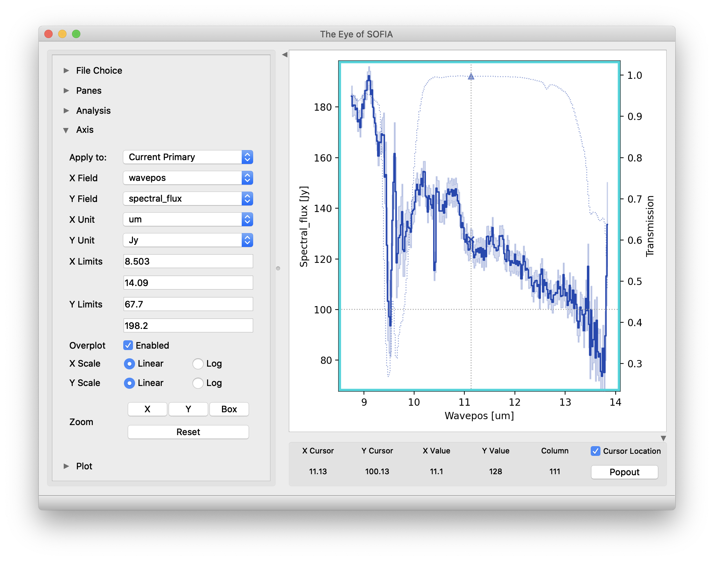

Grouping LEVEL\_1 data for processing
=====================================

In order for a group of imaging data to be reduced together usefully,
all images must have the same target object and be taken in the same
chop/nod mode. They must also have the same detector, filter, and
dichroic setting. In order to be combined together, they must also be
taken on the same mission. Optionally, it may also be useful to separate
out data files taken from different observation plans.

For spectroscopy, all the same rules hold, with the replacement of grism
element for filter, and with the additional requirement that the same
slit be used for all data files.

These requirements translate into a set of FITS header keywords that
must match in order for a set of data to be grouped together. These
keyword requirements are summarized in the tables below.

.. table:: Grouping Criteria: Imaging
   :name: img_group

   +-----------------------------+-------------------+-------------------------+
   | **Keyword**                 | **Data Type**     | **Match Criterion**     |
   +=============================+===================+=========================+
   | **OBSTYPE**                 | STR               | Exact                   |
   +-----------------------------+-------------------+-------------------------+
   | **OBJECT**                  | STR               | Exact                   |
   +-----------------------------+-------------------+-------------------------+
   | **INSTCFG**                 | STR               | Exact                   |
   +-----------------------------+-------------------+-------------------------+
   | **DETCHAN**                 | STR               | Exact                   |
   +-----------------------------+-------------------+-------------------------+
   | **SPECTEL1 / SPECTEL2\***   | STR               | Exact                   |
   +-----------------------------+-------------------+-------------------------+
   | **BORESITE**                | STR               | Exact                   |
   +-----------------------------+-------------------+-------------------------+
   | **DICHROIC**                | STR               | Exact                   |
   +-----------------------------+-------------------+-------------------------+
   | **MISSN-ID (optional)**     | STR               | Exact                   |
   +-----------------------------+-------------------+-------------------------+
   | **PLANID (optional)**       | STR               | Exact                   |
   +-----------------------------+-------------------+-------------------------+
   | **AOR\_ID (optional)**      | STR               | Exact                   |
   +-----------------------------+-------------------+-------------------------+

.. table:: Grouping Criteria: Spectroscopy
   :name: spec_group

   +-----------------------------+-------------------+-------------------------+
   | **Keyword**                 | **Data Type**     | **Match Criterion**     |
   +=============================+===================+=========================+
   | **OBSTYPE**                 | STR               | Exact                   |
   +-----------------------------+-------------------+-------------------------+
   | **OBJECT**                  | STR               | Exact                   |
   +-----------------------------+-------------------+-------------------------+
   | **INSTCFG**                 | STR               | Exact                   |
   +-----------------------------+-------------------+-------------------------+
   | **DETCHAN**                 | STR               | Exact                   |
   +-----------------------------+-------------------+-------------------------+
   | **SPECTEL1 / SPECTEL2\***   | STR               | Exact                   |
   +-----------------------------+-------------------+-------------------------+
   | **BORESITE**                | STR               | Exact                   |
   +-----------------------------+-------------------+-------------------------+
   | **DICHROIC**                | STR               | Exact                   |
   +-----------------------------+-------------------+-------------------------+
   | **SLIT\*\***                | STR               | Exact                   |
   +-----------------------------+-------------------+-------------------------+
   | **MISSN-ID (optional)**     | STR               | Exact                   |
   +-----------------------------+-------------------+-------------------------+
   | **PLANID (optional)**       | STR               | Exact                   |
   +-----------------------------+-------------------+-------------------------+
   | **AOR\_ID (optional)**      | STR               | Exact                   |
   +-----------------------------+-------------------+-------------------------+

\* SPECTEL1 is used if the detector is the SWC (DETCHAN=SW); SPECTEL2 is
used for LWC (DETCHAN=LW)

\*\* If SLIT is in use (value != "NONE" or "UNKNOWN"), **always**
include group in the grism plan, regardless of INSTCFG. This ensures
that slit images get reduced with the spectroscopic data and placed in
the same preview.

Configuration and execution
===========================

Installation
------------

The FORCAST pipeline is written entirely in Python.  The pipeline is
platform independent, but has been tested only on Linux and Mac OS X
operating systems.  Running the pipeline requires a minimum of 16GB RAM,
or equivalent-sized swap file.

The pipeline is comprised of five modules within the `sofia_redux` package:
`sofia_redux.instruments.forcast`, `sofia_redux.pipeline`,
`sofia_redux.calibration`, `sofia_redux.spectroscopy`, `sofia_redux.toolkit`.
The `forcast` module provides the data processing
algorithms specific to FORCAST, with supporting libraries from the
`toolkit`, `calibration`, and `spectroscopy` modules.  The `pipeline` module
provides interactive and batch interfaces to the pipeline algorithms.

External Requirements
~~~~~~~~~~~~~~~~~~~~~

To run the pipeline for any mode, Python 3.7 or
higher is required, as well as the following packages: numpy, scipy,
matplotlib, pandas, astropy, configobj, numba, bottleneck, joblib,
astropy-helpers, and photutils.
Some display functions for the graphical user interface (GUI)
additionally require the PyQt5, pyds9, and dill packages.
All required external packages are available to install via the
pip or conda package managers.  See the Anaconda environment file
(environment.yml), or the pip requirements file (requirements.txt)
distributed with `sofia_redux` for specific version requirements.

Running the pipeline interactively also requires an installation of
SAO DS9 for FITS image display. See http://ds9.si.edu/ for download
and installation instructions.  The *ds9* executable
must be available in the PATH environment variable for the pyds9
interface to be able to find and control it.

Source Code Installation
~~~~~~~~~~~~~~~~~~~~~~~~

The source code for the FORCAST pipeline maintained by the SOFIA Data
Processing Systems (DPS) team can be obtained directly from the
DPS, or from the external `GitHub repository <https://github.com/SOFIA-USRA/sofia_redux>`.
This repository contains all needed configuration
files, auxiliary files, and Python code to run the pipeline on FORCAST
data in any observation mode.

After obtaining the source code, install each Python library with
the command::

    python setup.py install

from the top-level directory.

Alternately, a development installation may be performed from inside the
directory with the command::

    pip install -e .

After installation, the top-level pipeline interface commands should
be available in the PATH.  Typing::

    redux

from the command line should launch the GUI interface, and::

    redux_pipe -h

should display a brief help message for the command line interface.

Configuration
-------------

For FORCAST algorithms, default parameter values are defined by the
Redux object that interfaces to them. These values may be overridden
manually for each step, while running in interactive mode. They may also
be overridden by an input parameter file, in INI format, in either
interactive or automatic mode. See Appendix A for an example of an input
parameter file, which contains the current defaults for all parameters.

Input data
----------

Redux takes as input raw FORCAST FITS data files, which contain image
cubes composed of 256x256 pixel image arrays. The number of frames per
raw data cube depends on the chop/nod mode used to acquire the data (see
:numref:`raw_format`). FITS headers contain data acquisition and observation
parameters and, combined with the pipeline configuration files, comprise
the information necessary to complete all steps of the data reduction
process. Some critical keywords are required to be present in the raw
FITS headers in order to perform a successful grouping, reduction, and
ingestion into the SOFIA archive. See Appendix B for a description of
these keywords.

.. table:: Contents of FORCAST raw data files by observing mode
    :name: raw_format

    +---------------------+------------------------+-----------------------------------------------------------------------------------------------------------------------------------------------------------+
    | **Chop/Nod Mode**   | **Number of frames**   | **Comments**                                                                                                                                              |
    +=====================+========================+===========================================================================================================================================================+
    | C2N, NMC            | 4                      | Two-Position Chop with Nod Matched in throw and parallel to the chop direction                                                                            |
    |                     |                        |                                                                                                                                                           |
    |                     |                        | 2 chop positions in each of 2 nod positions                                                                                                               |
    +---------------------+------------------------+-----------------------------------------------------------------------------------------------------------------------------------------------------------+
    | C2N, NPC            | 4                      | Two-Position Chop with Nod perpendicular to the chop direction                                                                                            |
    |                     |                        |                                                                                                                                                           |
    |                     |                        | 2 chop positions in each of 2 nod positions                                                                                                               |
    +---------------------+------------------------+-----------------------------------------------------------------------------------------------------------------------------------------------------------+
    | C2NC2               | 4                      | Extreme asymmetric chop and telescope move to blank sky: two chop positions per sky position. Typically 5 input files corresponding to ABAABAAB pattern   |
    +---------------------+------------------------+-----------------------------------------------------------------------------------------------------------------------------------------------------------+
    | N                   | 2                      | Two-position Nod only, may be used for grism spectroscopy                                                                                                 |
    +---------------------+------------------------+-----------------------------------------------------------------------------------------------------------------------------------------------------------+
    | SLITSCAN            | 4                      | Spectral map of an extended source, most likely using C2NC2 but could use C2N                                                                             |
    +---------------------+------------------------+-----------------------------------------------------------------------------------------------------------------------------------------------------------+

It is assumed that the input data have been successfully grouped before
beginning reduction: Redux considers all input files in a reduction to
be science files that are part of a single homogeneous reduction group,
to be reduced together with the same parameters. As such, when the
pipeline reads a raw FORCAST data file, it uses the first input file to
identify the observing mode used. Given this information, it identifies
a set of auxiliary and calibration data files to be used in the
reduction (:numref:`auxiliary`). The default files to be used are defined in a
lookup table that reads the DATE-OBS keyword from the raw file, and then
chooses the appropriate calibrations for that date.

.. table:: Auxiliary files
   :name: auxiliary

   +-----------------------------------------------+---------------+----------------------------------------------------------------------------------------------------------------------+
   | **Auxiliary data file**                       | **Data type** | **Comments**                                                                                                         |
   +===============================================+===============+======================================================================================================================+
   | Configuration file                            | ASCII         | Contains initial configuration of pipeline parameters and nonlinearity coefficients                                  |
   |                                               |               |                                                                                                                      |
   | (e.g. OC3\_dripconf.txt)                      |               |                                                                                                                      |
   +-----------------------------------------------+---------------+----------------------------------------------------------------------------------------------------------------------+
   | Keyword definition file                       | ASCII         | Contains the definition of required keywords, with allowed value ranges                                              |
   |                                               |               |                                                                                                                      |
   | (e.g. OC3\_keywords.txt)                      |               |                                                                                                                      |
   +-----------------------------------------------+---------------+----------------------------------------------------------------------------------------------------------------------+
   | Bad pixel mask                                | FITS          | Single 2D image containing locations of bad pixels in short wave or long wave camera                                 |
   |                                               |               |                                                                                                                      |
   | (e.g. swc\_badpix.fits)                       |               |                                                                                                                      |
   +-----------------------------------------------+---------------+----------------------------------------------------------------------------------------------------------------------+
   | Pinhole location table                        | ASCII         | Pinhole locations file for distortion correction (imaging only)                                                      |
   |                                               |               |                                                                                                                      |
   | (e.g. pinhole\_locs.txt)                      |               |                                                                                                                      |
   +-----------------------------------------------+---------------+----------------------------------------------------------------------------------------------------------------------+
   | Reference flux calibration table              | ASCII         | Flux calibration factor (imaging only)                                                                               |
   |                                               |               |                                                                                                                      |
   | (e.g. refcalfac_20191025.txt)                 |               |                                                                                                                      |
   +-----------------------------------------------+---------------+----------------------------------------------------------------------------------------------------------------------+
   | Spectral order definition file                | FITS          | Image file containing header keywords that define the edges of all orders in a 2D spectral image (grism only)        |
   |                                               |               |                                                                                                                      |
   | (e.g. G063\_LS24\_flat.fits)                  |               |                                                                                                                      |
   +-----------------------------------------------+---------------+----------------------------------------------------------------------------------------------------------------------+
   | Wavelength calibration map                    | FITS          | Two frame image associating a wavelength value and a spatial distance across the slit with each pixel (grism only)   |
   |                                               |               |                                                                                                                      |
   | (e.g. G063\_wavecal\_OC3.fits)                |               |                                                                                                                      |
   +-----------------------------------------------+---------------+----------------------------------------------------------------------------------------------------------------------+
   | Atmospheric transmission curve                | FITS          | A FITS image with wavelength and transmission values for a particular altitude and zenith angle (grism only)         |
   |                                               |               |                                                                                                                      |
   | (e.g. atran\_41K\_45deg\_4-50mum.fits)        |               |                                                                                                                      |
   +-----------------------------------------------+---------------+----------------------------------------------------------------------------------------------------------------------+
   | Instrumental response curve                   | FITS          | FITS image containing the response at each wavelength for a particular grism/slit mode (grism only)                  |
   |                                               |               |                                                                                                                      |
   | (e.g. G063\_LS24\_DB175\_response.fits)       |               |                                                                                                                      |
   +-----------------------------------------------+---------------+----------------------------------------------------------------------------------------------------------------------+
   | Slit function image                           | FITS          | FITS image containing the slit response, in rectified spectral coordinates (grism only)                              |
   |                                               |               |                                                                                                                      |
   | (e.g. G063\_LS24\_slitfn\_OC2.fits)           |               |                                                                                                                      |
   +-----------------------------------------------+---------------+----------------------------------------------------------------------------------------------------------------------+

Redux Usage
-----------

Redux usage is documented in the `sofia_redux.pipeline` package.

.. toctree::

   redux_doc

FORCAST Reduction
-----------------

Imaging Reduction
~~~~~~~~~~~~~~~~~

FORCAST imaging reduction with Redux is straightforward. The
processing steps follow the flowchart of :numref:`flowchart_img`.
At each step, Redux attempts to determine automatically the correct
action, given the input data and default parameters, but each step
can be customized as needed.

Useful Parameters
^^^^^^^^^^^^^^^^^

Some key parameters to note are listed below.

In addition to the specified parameters, the output from each step may
be optionally saved by selecting the 'save' parameter.

-  **Check Headers**

   -  *Abort reduction for invalid headers*: By default, Redux will halt the
      reduction if the input header keywords do not meet requirements.
      Uncheck this box to attempt the reduction anyway.

-  **Clean Images**

   -  *Bad pixel map*: The default bad pixel mask on disk is automatically
      loaded. Set blank to use no bad pixel map. Set to a
      valid FITS file path to override the default bad pixel mask with a
      new one.

   -  *Automatically detect readout shift*: If selected, the pipeline
      will attempt to automatically detect and correct the readout shift
      described below.

   -  *Image number to shift (if not auto)*: This option
      allows the user to fix an occasional issue where the data array is
      shifted to the right by 16 pixels. If multiple images are loaded,
      but only some are affected, the images to shift may be specified
      by their index in the list of input files, separated by
      semi-colons. For example, to shift the first and third file, enter
      '1;3'. If all input files should be shifted, enter 'all'. Leave
      blank to leave all data unshifted (the default behavior).

   -  *Interpolate over bad pixels*: By default, bad pixels are propagated
      as NaN values.  Set this option to interpolate over them instead.

-  **Correct Droop**

   -  *Droop fraction*: Lower value to decrease droop correction; set to
      zero to turn off droop correction altogether. Default value is
      currently 0.0035 for all data.

-  **Correct Nonlinearity**

   -  *Background section center*: Specify the center point of the region
      used to determine the background level in integers as 'x,y', in pixels.

   -  *Background section size*: Specify the width of the background region
      in integer pixels as 'size_x,size_y'.

-  **Stack Chops/Nods**

   -  *Add all frames instead of subtracting*: If set, the
      instrument mode will be ignored and all chops and nods will be
      added.  This option may be used to generate a sky frame, for
      debugging or calibration purposes.

   -  *Apply 'jailbar' correction*: If set, the 16-pixel jailbar pattern
      will be removed after stacking.

   -  *Scale frames to common level*: If selected, images will be
      corrected for a multiplicative offset in the background level.
      This is not commonly used.

   -  *Subtract residual background*: If selected, images will be
      corrected for an additive offset in the background level.
      This option is off by default for C2NC2 data, but on for all other
      modes.  Background differences may occasionally be overcorrected,
      in which case, this option should be deselected, or the background
      section modified.  Some C2NC2 data with sufficient background regions
      may also benefit from turning this option on.

   -  *Background section center*: Specify the center point of the region
      used to determine the background level in integers as 'x,y', in pixels.

   -  *Background section size*: Specify the width of the background region
      in integer pixels as 'size_x,size_y'.

   -  *Residual background statistic*: Select the statistic used to calculate
      the background level.  Options are median or mode.

-  **Correct Distortion**

   -  *Pinhole locations*: The default pinhole mask table is automatically
      loaded. Set to a valid text file path to override it.

   -  *Transform type*: Select the warping algorithm used to apply the
      distortion correction. The polynomial algorithm is more traditional;
      the piecewise-affine algorithm may be more accurate for central regions.

   -  *Extrapolate solution*: If not set, edges of the image beyond known
      pinhole inputs will be set to NaN.

-  **Merge Chops/Nods**

   -  *Merging algorithm*: The default for flux standard observations
      (OBSTYPE=STANDARD\_FLUX) is to shift-and-add the data, using a
      centroiding algorithm. If the centroiding algorithm fails, header
      data will be used instead. The default for science data is not to
      shift-and-add ('No shift').

-  **Register Images**

   -  *Registration algorithm*: The default for all data is to
      use the WCS as is for registration. Centroiding is
      may be useful for bright, compact objects; cross-correlation
      may be useful for bright, diffuse fields. Registration via the
      'Header shifts' method may be useful for older data, for which the
      relative WCS is not very accurate. The 'Use first WCS' option
      will treat all images as pre-registered: the data will be coadded
      directly without shifts.

   -  *Override offsets for all images*: If registration offsets are
      known a priori, they may be directly entered here. Specify
      semi-colon separated offsets, as x,y. For example, for three
      input images, specify '0,0;2,0;0,2' to leave the first as is,
      shift the second two pixels to the right in x,
      and shift the third two pixels up in y.

   -  *Expected FWHM for centroiding*: Specify the expected FWHM in pixels,
      for the centroiding algorithm.  This may be useful in registering
      bright compact sources that are not point sources.

   -  *Maximum shift for cross-correlation*: Specify the maximum allowed
      shift in pixels for the cross-correlation algorithm.  This limit is
      applied for shifts in both x- and y-direction.

-  **Coadd**

   -  *Skip coaddition*: If selected, each input registered file will be
      saved as a separate file of type 'coadded' rather than combined
      together into a single output file.

   -  *Reference coordinate system*: If set to 'First image', all
      images will be referenced to the sky position in the first image
      file. If set to 'Target position', the
      TGTRA/TGTDEC keywords in the FITS header will be used to apply
      an additional offset for registering non-sidereal targets.  If
      these keywords are not present, or if their value is constant,
      the algorithm defaults to the 'First image' behavior.
      'Target position' is on by default; 'First image' is recommended only
      if the TGTRA/TGTDEC keywords are known to have bad values.

   -  *Combination method*: Median is the default; mean may also be useful
      for some input data.  The resample option may project data more
      accurately, and allows an additional smoothing option, but takes
      much longer to complete.

   -  *Use weighted mean*: If set, the average of the data will be
      weighted by the variance. Ignored for method=median.

   -  *Robust combination*: If set, data will be sigma-clipped before
      combination for mean or median methods.

   -  *Outlier rejection threshold (sigma)*: The sigma-clipping threshold
      for robust combination methods, in units of sigma (standard deviation).

   -  *Gaussian width for smoothing (pixels)*: If method=resample, a smoothing
      may be applied to the output averages.  Specify the Gaussian width in
      pixels.  Set smaller (but non-zero) for less smoothing; higher for
      more smoothing.

-  **Flux Calibrate**

   -  *Re-run photometry for standards*: If selected, and observation is
      a flux standard, photometric fits and aperture measurements on the
      brightest source will be recalculated, using the input parameters
      below.

   -  *Source position*: Enter the approximate position (x,y) of the
      source to measure. If not specified, the SRCPOSX/SRCPOSY keywords
      in the FITS header will be used as the first estimate of the
      source position.

   -  *Photometry fit size*: Smaller subimages may sometimes
      be necessary for faint sources and/or variable background.

   -  *Initial FWHM*: Specify in pixels. This parameter
      should be modified only if the PSF of the source is significantly
      larger or smaller than usual.

   -  *Profile type*: Moffat fits are the default, as they generally
      give a more reliable FWHM value. However, Gaussian fits may
      sometimes be more stable, and therefore preferable if the Moffat
      fit fails.

- **Make Image Map**

   -  *Color map*: Color map for the output PNG image.  Any valid Matplotlib
      name may be specified.

   -  *Flux scale for image*: A low and high percentile value , used for
      scaling the image, e.g. [0,99].

   -  *Number of contours*: Number of contour levels to be over-plotted on
      the image.  Set to 0 to turn off contours.

   -  *Contour color*: Color for the contour lines.  Any valid Matplotlib
      color name may be specified.

   -  *Filled contours*: If set, contours will be filled instead of overlaid.

   -  *Overlay grid*: If set, a coordinate grid will be overlaid.

   -  *Beam marker*: If set, a beam marker will be added to the plot.

   -  *Watermark text*: If set to a non-empty string, the text will be
      added to the lower-right of the image as a semi-transparent watermark.

   -  *Crop NaN border*: If set, any remaining NaN or zero-valued border
      will be cropped out of plot.

Grism Reduction
~~~~~~~~~~~~~~~

FORCAST grism reduction with Redux is slightly more complicated than for
imaging. The GUI breaks down the spectral extraction algorithms into seven
separate reduction steps to give more control over the extraction
process. These steps are:

-  Make Profiles: Generate a smoothed model of the relative distribution
   of the flux across the slit (the spatial profile). After this step is
   run, a separate display window showing a plot of the spatial profile
   appears.

-  Locate Apertures: Use the spatial profile to identify spectra to extract.
   By default, Redux attempts to automatically identify sources, but
   they can also be manually identified by entering a guess position to
   fit near, or a fixed position, in the parameters. Aperture locations
   are plotted in the profile window.

-  Trace Continuum: Identify the location of the spectrum across the
   array, by either fitting the continuum or fixing the location to the
   aperture center.  The aperture trace is displayed as a region
   overlay in DS9.

-  Set Apertures: Identify the data to extract from the spatial profile.
   This is done automatically by default, but all aperture
   parameters can be overridden manually in the parameters for this
   step.  Aperture radii and background regions are plotted in the
   profile window (see :numref:`profile_plot`).

-  Subtract Background: Residual background is fit and removed for
   each column in the 2D image, using background regions specified
   in the Set Apertures step.

-  Extract Spectra: Extract one-dimensional spectra from the
   identified apertures. By default, Redux will perform standard
   extraction observations that are marked as extended sources
   (SRCTYPE=EXTENDED\_SOURCE) and will attempt optimal extraction for
   any other value. The method can be overridden in the parameters for
   this step.

-  Merge Spectra: All apertures are scaled to the brightest spectrum,
   then merged into a single spectrum.

Extracted spectra are displayed in an interactive plot window, for
data analysis and visualization (see :numref:`spectral_plot`).

.. figure:: images/profile_plot.png
   :name: profile_plot

   Aperture location automatically identified and over-plotted
   on the spatial profile.  The cyan line indicates the aperture center.
   Green lines indicate the integration aperture for optimal extraction,
   dark blue lines indicate the PSF radius (the point at which the flux
   goes to zero), and red lines indicate background regions.

.. figure:: images/spectral_plot.png
   :name: spectral_plot

   Final extracted spectrum, displayed in an interactive plot window.

The spectral display tool has a number of useful features and controls.
See :numref:`eye_controls_image` and :numref:`eye_controls_table` for
a quick summary.

   Control panels for the spectral viewer are located to the left and
   below the plot window.  Click the arrow icons to show or collapse
   them.

.. table:: Spectral Viewer controls
   :name: eye_controls_table
   :widths: 30 30 40

   +-----------------------------------+---------------------------+------------------------+
   | **Feature**                       | **Control**               | **Keyboard shortcut**  |
   +===================================+===========================+========================+
   | Load new FITS file                | *File Choice -> Add File* |  --                    |
   +-----------------------------------+---------------------------+------------------------+
   | Remove loaded FITS file           | *File Choice ->*          |  Press *delete* in the |
   |                                   | *Remove File*             |  *File Choice* panel   |
   +-----------------------------------+---------------------------+------------------------+
   | Plot selected file                | *File Choice ->*          |  --                    |
   |                                   | *(double-click)*          |                        |
   +-----------------------------------+---------------------------+------------------------+
   | Add a new plot window (pane)      | *Panes ->*                |  --                    |
   |                                   | *Add Pane*                |                        |
   +-----------------------------------+---------------------------+------------------------+
   | Remove a pane                     | *Panes ->*                |  Press *delete* in the |
   |                                   | *Remove Pane*             |  *Panes* panel, or in  |
   |                                   |                           |  the plot window       |
   +-----------------------------------+---------------------------+------------------------+
   | Show or hide a plot               | *Panes -> Pane # ->*      |  --                    |
   |                                   | *File name -> Enabled*,   |                        |
   |                                   | or click the *Hide all*/  |                        |
   |                                   | *Show all* button         |                        |
   +-----------------------------------+---------------------------+------------------------+
   | Display a different X or Y        | *Axis ->*                 |  --                    |
   | field (e.g. spectral error,       | *X Property* or           |                        |
   | transmission, or response)        | *Y Property*              |                        |
   +-----------------------------------+---------------------------+------------------------+
   | Overplot a different Y axis       | *Axis ->*                 |  --                    |
   | field (e.g. spectral error,       | *Overplot -> Enabled*     |                        |
   | transmission, or response)        |                           |                        |
   +-----------------------------------+---------------------------+------------------------+
   | Change X or Y units               | *Axis ->*                 |  --                    |
   |                                   | *X Unit* or               |                        |
   |                                   | *Y Unit*                  |                        |
   +-----------------------------------+---------------------------+------------------------+
   | Change X or Y scale               | *Axis ->*                 |  --                    |
   |                                   | *X Scale* or *Y Scale*    |                        |
   |                                   | *-> Linear* or *Log*      |                        |
   +-----------------------------------+---------------------------+------------------------+
   | Interactive zoom                  | *Axis -> Zoom*:           |  In the plot window,   |
   |                                   | *X*, *Y*, *Box*,          |  press *x*, *y*, or    |
   |                                   | then click in the plot    |  *z* to start zoom mode|
   |                                   | to set the limits; or     |  in x-direction,       |
   |                                   | *Reset* to reset the      |  y-direction, or box   |
   |                                   | limits to default.        |  mode, respectively.   |
   |                                   |                           |  Click twice on the    |
   |                                   |                           |  plot to set the new   |
   |                                   |                           |  limits.  Press *w*    |
   |                                   |                           |  to reset the plot     |
   |                                   |                           |  limits to defaults.   |
   +-----------------------------------+---------------------------+------------------------+
   | Fit a spectral feature            | --                        |  In the plot window,   |
   |                                   |                           |  press *f* to start    |
   |                                   |                           |  the fitting mode.     |
   |                                   |                           |  Click twice on the    |
   |                                   |                           |  plot to set the data  |
   |                                   |                           |  limits to fit.        |
   +-----------------------------------+---------------------------+------------------------+
   | Change the feature or baseline    | *Analysis -> Feature,*    |  --                    |
   | fit model                         | *Background*              |                        |
   +-----------------------------------+---------------------------+------------------------+
   | Clear zoom or fit mode            | --                        |  In the plot window,   |
   |                                   |                           |  press *c* to clear    |
   |                                   |                           |  guides and return to  |
   |                                   |                           |  default display mode. |
   +-----------------------------------+---------------------------+------------------------+
   | Change the plot color cycle       | *Plot ->                  |  --                    |
   |                                   | Color cycle ->            |                        |
   |                                   | Accessible*, *Spectral*   |                        |
   |                                   | or *Tableau*              |                        |
   +-----------------------------------+---------------------------+------------------------+
   | Change the plot type              | *Plot -> Plot type ->     |  --                    |
   |                                   | Step*, *Line*, or         |                        |
   |                                   | *Scatter*                 |                        |
   +-----------------------------------+---------------------------+------------------------+
   | Change the plot display options   | *Plot ->                  |  --                    |
   |                                   | Show markers*,            |                        |
   |                                   | *Show errors*,            |                        |
   |                                   | *Show grid*, or           |                        |
   |                                   | *Dark mode*               |                        |
   +-----------------------------------+---------------------------+------------------------+
   | Display the cursor position       | *Cursor panel* ->         |  --                    |
   |                                   | Check *Cursor Location*   |                        |
   |                                   | for a quick display or    |                        |
   |                                   | press *Popout* for full   |                        |
   |                                   | information               |                        |
   +-----------------------------------+---------------------------+------------------------+

Useful Parameters
^^^^^^^^^^^^^^^^^

Below are listed some key parameters for the grism processing steps.
Note that the Check Headers through Stack Chops/Nods steps are identical to
those used for the imaging data: their parameters are listed above.
In addition to the specified parameters, the output from each step may
be optionally saved by selecting the 'save' parameter.

-  **Stack Dithers**

   -  *Skip dither stacking*: If set, common dither positions will not be
      stacked.  This is the default: dither stacking is only recommended
      for faint spectra that cannot otherwise be automatically extracted.

   -  *Combination method*: Mean is the default; median may also be useful
      for some input data.

   -  *Use weighted mean*: If set, the average of the data will be
      weighted by the variance. Ignored for method=median.

   -  *Robust combination*: If set, data will be sigma-clipped before
      combination.

   -  *Outlier rejection threshold (sigma)*: The sigma-clipping threshold
      for robust combination methods, in units of sigma (standard deviation).

-  **Make Profiles**

   -  *Wave/space calibration file*: The default calibration
      file is automatically loaded. Set to a valid FITS file path to
      override the default calibration map with a new one.

   -  *Slit correction file*: The default slit correction
      file is automatically loaded, if available. If blank, no slit
      correction will be applied. Set to a valid FITS file path to
      override the default file with a new one.

   -  *Row fit order*: Typically a third-order polynomial fit is used
      to calculate the smooth spatial profile. Occasionally, a higher or
      lower order fit may give better results.

   -  *Subtract median background*: If set, then the
      median level of the smoothed spatial profile will be subtracted
      out to remove residual background from the total extracted flux.
      If the SRCTYPE is EXTENDED\_SOURCE or the INSTMODE is slitscan,
      this option will be off by default.  For other data,
      this option is appropriate as long as the slit is dominated by
      background, rather than source flux. If the spatial profile dips
      below zero at any point (other than for a negative spectrum), this
      option should be deselected.

   -  *Atmospheric transmission threshold*: Transmission values below this
      threshold are not considered when making the spatial profile.
      Values are 0-1.

-  **Locate Apertures**

   -  *Aperture location method*: If 'auto', the strongest Gaussian peak(s) in the
      spatial profile will be selected, with an optional starting guess
      (*Aperture position*, below).  If 'fix to input', the value in the
      *Aperture position* parameter will be used without refinement.
      If 'fix to center', the center of the slit will be used.  'Fix to center'
      is default for EXTENDED_SOURCE and SLITSCAN; otherwise 'auto' is default.

   -  *Number of auto apertures*: Set this parameter
      to 1 to automatically find the single brightest source, or 2 to find the
      two brightest sources, etc. Sources may be positive or negative.

   -  *Aperture position*: Enter a guess value for the aperture to use as a
      starting point for method = 'auto', or a fixed value to use as the
      aperture center for method = 'fix to input'. Values are in arcseconds
      up the slit (refer to the spatial profile). Separate multiple
      apertures for a single file by commas;
      separate values for multiple files by semi-colons. For example,
      *3,8;2,7* will look for two apertures in each of two files, near
      3" and 8" in the first image and 2" and 7" in the second image. If
      there are multiple files loaded, but only one aperture list is
      given, the aperture parameters will be used for all images.

   -  *Expected aperture FWHM (arcsec)*: Gaussian FWHM estimate for spatial
      profile fits, to determine peaks.

-  **Trace Continuum**

   -  *Trace method*: If 'fit to continuum' is selected, points along the
      continuum will be fit with a Gaussian to determine the trace
      center at each location, and then the positions will be fit with a
      low-order polynomial. If 'fix to aperture position' is selected,
      no fit will be attempted, and the default slit curvature defined
      by the edge definition file will be used as the aperture location.
      By default, the trace will be fixed for EXTENDED_SOURCE and SLITSCAN,
      but a fit will be attempted for all other data types.

   -  *Trace fit order*: Polynomial fit order for the aperture center,
      along the spectral dimension.

-  **Set Apertures**

   -  *Extract the full slit*: If set, all other parameters are ignored,
      and the PSF radius will be set to include the full slit.

   -  *Refit apertures for FWHM*: The spatial FWHM for the aperture is used
      to determine the aperture and PSF radii, unless they are directly
      specified.  If this parameter is set, the profile will be re-fit with
      a Gaussian to determine the FWHM.  If it is not set, the value
      determined or set in the Locate Apertures step is used (stored
      as APFWHM01 in the FITS header).

   -  *Aperture sign*: Enter either 1 or -1 to skip the
      automatic determination of the aperture sign from the spatial
      profile. If the value is -1, the spectrum will be multiplied by
      -1. Separate multiple apertures by commas; separate values for
      multiple files by semi-colons. If a single value is specified,
      it will be applied to all apertures.

   -  *Aperture radius*: Enter a radius in arcsec to skip the
      automatic determination of the aperture radius from the profile
      FWHM. Separate multiple apertures by commas; separate values for
      multiple files by semi-colons. If a single value is specified,
      it will be applied to all apertures.

   -  *PSF radius*: Enter a radius in arcsec to skip the
      automatic determination of the PSF radius from the profile
      FWHM. Separate multiple apertures by commas; separate values for
      multiple files by semi-colons. If a single value is specified,
      it will be applied to all apertures.

   -  *Background regions*: Enter a range in arcsec to use as the
      background region, skipping automatic background determination.
      For example, *0-1,8-10* will use the regions
      between 0" and 1" and between 8" and 10" to determine the
      background level to subtract in extraction. Values are for the
      full image, rather than for a particular aperture.  Separate
      values for multiple files with semi-colons.

-  **Subtract Background**

   -  *Skip background subtraction*: Set to skip calculating and removing
      residual background. If no background regions were set, background
      subtraction will be automatically skipped.

   -  *Background fit order*: Set to a number greater than or equal to
      zero for the polynomial order of the fit to the background
      regions.

-  **Extract Spectra**

   -  *Save extracted 1D spectra*: If set, the extracted spectra will
      be saved to disk in Spextool format.  This option is normally used only
      for diagnostic purposes.

   -  *Extraction method*: The default is to use
      standard extraction for EXTENDED_SOURCE and SLITSCAN and optimal
      extraction otherwise. Standard extraction may be necessary for
      some faint sources.

   -  *Use median profile instead of spatial map*: By default, the pipeline uses a
      wavelength-dependent spatial map for extraction, but this
      method may give poor results, if the signal-to-noise
      in the profile is low. Set this option to use the median spatial
      profile across all wavelengths instead.

   -  *Use spatial profile to fix bad pixels*: The pipeline usually
      uses the spatial profile to attempt to fix bad pixels during
      standard extraction, and in the 2D image for either extraction
      method. Occasionally, this results in a failed extraction.
      Unset this options to extract the spectra without bad pixel correction.

   -  *Bad pixel threshold*: Enter a value for the threshold for a pixel
      to be considered a bad pixel. This value is multiplied by the
      standard deviation of all good pixels in the aperture at each
      wavelength bin.

-  **Merge Apertures**

   -  *Save uncalibrated 1D spectra*: If set, the merged spectra will
      be saved to disk in Spextool format.  This option is normally used only
      for diagnostic purposes.

   -  *Combination method*: Mean is the default; median may also be useful
      for some input data.

   -  *Use weighted mean*: If set, the average of the data will be
      weighted by the variance. Ignored for method=median.

-  **Flux Calibrate**

   -  General Parameters

      -  *Save calibrated 1D spectra*: If set, the calibrated spectra will
         be saved to disk in Spextool format.  This option is normally used only
         for diagnostic purposes.

      -  *Skip flux calibration*: If set, no telluric correction or flux
         calibration will be applied.

      -  *Response file*: The default instrumental response file on disk
         is automatically loaded. If blank, no response correction will
         be applied, but transmission correction will still occur. Set to a
         valid FITS file path to override the default response file with a
         new one.

      -  *Spectral resolution*: Expected resolution for the grism mode, used
         to smooth the ATRAN model.  This value should match that of the
         response file, and should only need modification if the response
         file is modified from the default.

   -  Telluric Correction Parameters

      -  *Optimize ATRAN correction*: If set, the pipeline will use a
         library of ATRAN files to attempt to automatically select the best
         telluric correction. This option requires that the external
         library location be identified in the *ATRAN directory* parameter. The
         procedure may take some time to complete, and may not complete
         successfully for faint spectra, or spectra with significant
         emission features. Optimization will not be attempted for the
         FOR\_G111 grism, or for spectra with mean S/N less than the specified
         threshold.

      -  *ATRAN directory*: If the *Optimize ATRAN correction*
         parameter is set, this parameter specifies the location of the
         library of ATRAN FITS files to use.  If the directory is invalid,
         optimization will be disabled.

      -  *ATRAN file*: If the *Optimize ATRAN correction* parameter is
         not set, this parameter will be used to determine the ATRAN file
         to use for telluric correction. If blank, the default ATRAN
         file on disk will be used. Set to a valid FITS file path to override the
         default ATRAN file with a new one.

      -  *S/N threshold for optimization*: If the median S/N for a spectrum
         is below this threshold, optimization will not be attempted.

   -  Wavelength Shift Parameters

      -  *Auto shift wavelength to telluric spectrum*: If set, the data will be
         shifted to match the telluric spectrum.  The optimum shift chosen
         is the one that minimizes residuals in the corrected spectrum,
         when fit with a low order polynomial. All values within the range
         of the maximum shift are tested, at a resolution of 0.1 pixels.
         Auto shift will not be attempted for the FOR\_G111 grism.

      -  *Maximum auto wavelength shift to apply*: The maximum shift allowable
         for auto-shifts, in pixels.

      -  *Wavelength shift to apply*: Set to specify a manual shift in pixels
         along the wavelength axis to apply to the science spectrum. If
         non-zero, the auto-shift parameter will be ignored.

      -  *Polynomial order for continuum*: The fit order for the spectrum,
         used to determine the optimum wavelength shift.

-  **Combine Spectra**

   -  General Parameters

      -  *Registration method*: If set to 'Use WCS as is', all
         images will be referenced to the sky position in the first image
         file. If set to 'Correct to target position', the
         TGTRA/TGTDEC keywords in the FITS header will be used to apply
         an additional offset for registering non-sidereal targets.  If
         these keywords are not present, or if their value is constant,
         the algorithm defaults to the 'Use WCS as is' behavior.
         'Correct to target position' is on by default; the other options
         are recommended only if the TGTRA/TGTDEC or WCS keywords are known to
         have bad values. In that case, set to 'Use header offsets' for
         non-sidereal targets or files with known bad WCS parameters;
         otherwise use 'Use WCS as is'.

      -  *Combination method*: Mean is the default for all data not marked
         SLITSCAN; median may also be useful for some input data.  For
         SLITSCAN, the default is 'spectral cube'.  If this option is set,
         the input data will be resampled into a 3D spatial/spectral cube
         instead of coadding 1D spectra and 2D images.

      -  *Use weighted mean*: If set, the average of the data will be
         weighted by the variance. Ignored for method=median.

   -  1-2D Combination Parameters

      -  *Robust combination*: If set, data will be sigma-clipped before
         combination for mean or median methods.

      -  *Outlier rejection threshold (sigma)*: The sigma-clipping threshold
         for robust combination methods, in units of sigma (standard deviation).

   -  3D Resample Parameters

      -  *Spatial surface fit order*: This parameter controls the polynomial
         order of the surface fit to the data at each grid point. Higher
         orders give more fine-scale detail, but are more likely to be
         unstable. Set to zero to do a weighted mean of the nearby data.

      -  *Spatial fit window*: Spatial window (pixels) for consideration in local
         data fits.  Set higher to fit to more pixels.

      -  *Spatial smoothing radius*: Gaussian width (pixels) for smoothing radius in
         distance weights for local data fits.  Set higher to smooth over
         more pixels.

      -  *Spatial edge threshold*: A value between 0 and 1 that determines how
         much of the image edge is set to NaN.  Set higher to set more pixels
         to NaN.

      -  *Adaptive smoothing threshold*: A float value 0 or higher that determines
         how aggressively the smoothing kernel is adapted near sharp peaks.
         Set to 0 to turn off (default); 1 is optimal, values between 0 and 1 may
         produce a smoother fit.

-  **Make Response**

   -  *Standard model file*: If blank, a model file will be searched for
      in the default data directory.  Set to a valid FITS file to override.

-  **Make Spectral Map**

   -  *Color map*: Color map for the output PNG image.  Any valid Matplotlib
      name may be specified.

   -  *Flux scale for image*: A low and high percentile value , used for
      scaling the spectral image, e.g. [0,99].

   -  *Number of contours*: Number of contour levels to be over-plotted on
      the image.  Set to 0 to turn off contours.

   -  *Contour color*: Color for the contour lines.  Any valid Matplotlib
      color name may be specified.

   -  *Filled contours*: If set, contours will be filled instead of overlaid.

   -  *Overlay grid*: If set, a coordinate grid will be overlaid.

   -  *Watermark text*: If set to a non-empty string, the text will be
      added to the lower-right of the image as a semi-transparent watermark.

   -  *Fraction of outer wavelengths to ignore*:  Used to block edge effects
      for noisy spectral orders. Set to 0 to include all wavelengths in
      the plot.

   -  *Overplot transmission*: If set, the atmospheric transmission spectrum
      will be displayed in the spectral plot.

   -  *Flux scale for spectral plot*: Specify a low and high percentile value
      for the spectral flux scale, e.g. [0,99].  If set to [0, 100],
      Matplotlib defaults are used.

   -  *Override wavelength slice for spectral cube*: Manually specify the
      wavelength slice (zero-indexed) for the image.  Otherwise, the
      peak voxel in the cube is used to identify the spectral slice.

   -  *Override spatial point for spectral cube*: Manually specify the
      spatial index for the spectrum, as 'x,y', zero-indexed.  Otherwise, the
      peak voxel in the cube is used to identify the spatial point.

Data Quality Assessment
=======================

After the pipeline has been run on a set of input data, the output
products should be checked to ensure that the data has been properly
reduced.  Data quality and quirks can vary widely across individual
observations, but the following general guideline gives some strategies
for approaching quality assessment (QA) for FORCAST data.

-  Check for QA comments in the FITS header HISTORY.  These comments may
   make suggestions for files to exclude from final reductions, or
   for non-default parameters to set for optimal reductions.

-  Check the output to the log file (usually called
   *redux\_[date]\_[time].log*), written to the same directory as the
   output files. Look for messages marked ERROR or WARNING. The log will
   also list every parameter used in the pipeline steps, which may help
   disambiguate the parameters as actually-run for the pipeline.

-  Check that the expected files were written to disk: there should, at
   a minimum, be a calibrated file (*CAL*) for imaging data and a combined
   spectrum (*CMB*) for grism data. Check the data product
   tables (:numref:`img_data_prod` and :numref:`spec_data_prod`)
   for other expected data products for each mode.

-  For imaging:

   -  If shifting-and-adding was performed at the merge step, display
      all undistorted (*UND*) and merged (*MRG*) files. Check that the
      pattern of positive and negative sources looks right for the
      observation mode. Also check that the FWHM of the source is not
      worse in the merged files than it was in the undistorted files. If
      the pattern does not look right, or the FWHM is too large, the
      merge may have failed.

   -  Display all registered and telluric-corrected (*TEL*) files at
      once and check that any visible sources appear at the same WCS
      coordinates in all files.

   -  Display the final coadded (*COA*) or calibrated (*CAL*) file and check
      that the FWHM is not worse than it is in the registered files,
      which might indicate poor registration. Check for any unusual
      artifacts, such as variable background regions, or detector
      pattern noise.

   -  Compare the calculated reference calibration factors for all flux
      standards to the last known series average. Major deviations may
      indicate that the photometry failed for that observation.

-  For grism:

   -  Display the spatial profile with apertures overlaid. Verify that
      apertures look well placed and the spatial profile does not dip
      below zero (except for negative spectral traces).

   -  Display the rectified image, and overlay the locations of the
      extracted apertures. Verify that the apertures lie on top of any
      visible spectral traces.

   -  Display the final spectrum (*CMB*) and overplot the expected atmospheric
      transmission. Check that the calibrated spectrum does not include
      residual artifacts from the telluric absorption features. If it
      does, the assumed resolution for the grism, or the wavelength
      calibration of the observation, may need updating.

   -  Overlay a model spectrum on the calibrated spectra of flux
      standards. Verify that the observed spectrum matches the
      theoretical spectrum, within the error bars of the observation. If
      it does not, the instrumental response file may need updating.

Appendix A: Sample configuration files
======================================

Below are sample FORCAST Redux parameter override files in INI format.
If present, the parameter value overrides the
default defined by the FORCAST reduction object. If not present, the
default value will be used.

.. include:: include/redux_param_img.cfg
   :literal:

.. raw:: latex

    \clearpage

.. include:: include/redux_param_spec.cfg
   :literal:

.. raw:: latex

    \clearpage

Appendix B: Required input keywords
===================================

This table describes the type and expected value for all FITS keywords
used by the FORCAST pipeline.

.. table:: Required input keywords
   :class: longtable
   :widths: 15 15 70

   +--------------------------------------+---------------+--------------------------------------------------------+
   | **Keyword**                          | **Type**      | **Expected value**                                     |
   +--------------------------------------+---------------+--------------------------------------------------------+
   | ALTI\_STA                            | float         | 0-60000.                                               |
   +--------------------------------------+---------------+--------------------------------------------------------+
   | ALTI\_END                            | float         | 0-60000.                                               |
   +--------------------------------------+---------------+--------------------------------------------------------+
   | AOR\_ID                              | string        |                                                        |
   +--------------------------------------+---------------+--------------------------------------------------------+
   | DATASRC                              | string        | ASTRO, CALIBRATION, LAB, TEST, OTHER, FIRSTPOINT       |
   +--------------------------------------+---------------+--------------------------------------------------------+
   | DATE-OBS                             | string        | yyyy-mm-ddThh:mm:ss[.sss]                              |
   +--------------------------------------+---------------+--------------------------------------------------------+
   | DETCHAN                              | string        | SW, LW                                                 |
   +--------------------------------------+---------------+--------------------------------------------------------+
   | DETECTOR                             | string        | As-010, Sb-083                                         |
   +--------------------------------------+---------------+--------------------------------------------------------+
   | DETITIME                             | float         | > 0                                                    |
   +--------------------------------------+---------------+--------------------------------------------------------+
   | EPERADU                              | float         | > 1                                                    |
   +--------------------------------------+---------------+--------------------------------------------------------+
   | FRMRATE                              | float         | > 0                                                    |
   +--------------------------------------+---------------+--------------------------------------------------------+
   | ILOWCAP                              | bool          |                                                        |
   +--------------------------------------+---------------+--------------------------------------------------------+
   | INSTCFG                              | string        | IMAGING\_SWC, IMAGING\_LWC, IMAGING\_DUAL, GRISM\_XD,  |
   |                                      |               | GRISM\_SWC, GRISM\_LWC, GRISM\_DUAL, GRISM\_XD-LSV,    |
   |                                      |               | GRISM-SSV, GRISM-LSV                                   |
   +--------------------------------------+---------------+--------------------------------------------------------+
   | INSTMODE                             | string        | C2, C2N, C2NC2, N, SLITSCAN, NXCAC                     |
   +--------------------------------------+---------------+--------------------------------------------------------+
   | INSTRUME                             | string        | FORCAST                                                |
   +--------------------------------------+---------------+--------------------------------------------------------+
   | INTTIME                              | float         |                                                        |
   +--------------------------------------+---------------+--------------------------------------------------------+
   | MISSN\_ID                            | string        |                                                        |
   +--------------------------------------+---------------+--------------------------------------------------------+
   | NAXIS1                               | int           | 256                                                    |
   +--------------------------------------+---------------+--------------------------------------------------------+
   | NAXIS2                               | int           | 256                                                    |
   +--------------------------------------+---------------+--------------------------------------------------------+
   | OBJECT                               | string        |                                                        |
   +--------------------------------------+---------------+--------------------------------------------------------+
   | OBS\_ID                              | string        |                                                        |
   +--------------------------------------+---------------+--------------------------------------------------------+
   | OBSTYPE                              | string        | OBJECT, STANDARD\_FLUX, STANDARD\_TELLURIC, LAMP,      |
   |                                      |               | FLAT, DARK, BIAS, SKY, BB, GASCELL, LASER, FOCUS\_LOOP |
   +--------------------------------------+---------------+--------------------------------------------------------+
   | OTMODE                               | string        | AD, SUR                                                |
   +--------------------------------------+---------------+--------------------------------------------------------+
   | OTSTACKS                             | int           | >0                                                     |
   +--------------------------------------+---------------+--------------------------------------------------------+
   | SPECTEL1                             | string        | NONE, FOR\_F054, FOR\_F064, FOR\_F066, FOR\_F077,      |
   |                                      |               | FOR\_F111, FOR\_F113, FOR\_F197, FOR\_F253,            |
   |                                      |               | FOR\_XG063, FOR\_XG111, FOR\_G063, FOR\_G111           |
   +--------------------------------------+---------------+--------------------------------------------------------+
   | SPECTEL2                             | string        | NONE, FOR\_F086, FOR\_F113, FOR\_F118, FOR\_F254,      |
   |                                      |               | FOR\_F315, FOR\_F336, FOR\_F348, FOR\_F371, FOR\_F242, |
   |                                      |               | FOR\_G227, FOR\_G329                                   |
   +--------------------------------------+---------------+--------------------------------------------------------+
   | TELESCOP                             | string        | SOFIA                                                  |
   +--------------------------------------+---------------+--------------------------------------------------------+
   | TIME-OBS                             | string        |                                                        |
   +--------------------------------------+---------------+--------------------------------------------------------+
   | UTCSTART                             | string        |                                                        |
   +--------------------------------------+---------------+--------------------------------------------------------+
   | WAVELNTH                             | float         | 0-40.                                                  |
   +--------------------------------------+---------------+--------------------------------------------------------+
   | ZA\_START                            | float         | 0-90.                                                  |
   +--------------------------------------+---------------+--------------------------------------------------------+
   | ZA\_END                              | float         | 0-90.                                                  |
   +--------------------------------------+---------------+--------------------------------------------------------+
   | DITHER                               | bool          |                                                        |
   +--------------------------------------+---------------+--------------------------------------------------------+
   | DTHCRSYS                             | string        | SIRF, ERF                                              |
   +--------------------------------------+---------------+--------------------------------------------------------+
   | DTHINDEX                             | int           | > 0                                                    |
   +--------------------------------------+---------------+--------------------------------------------------------+
   | DITHERX                              | float         |                                                        |
   +--------------------------------------+---------------+--------------------------------------------------------+
   | DITHERY                              | float         |                                                        |
   +--------------------------------------+---------------+--------------------------------------------------------+
   | CHOPPING                             | bool          |                                                        |
   +--------------------------------------+---------------+--------------------------------------------------------+
   | CHPCRSYS                             | string        | SIRF, ERF                                              |
   +--------------------------------------+---------------+--------------------------------------------------------+
   | CHPAMP1                              | float         | :math:`geq` 0                                          |
   +--------------------------------------+---------------+--------------------------------------------------------+
   | CHPANGLR                             | float         |                                                        |
   +--------------------------------------+---------------+--------------------------------------------------------+
   | CHPANGLE                             | float         |                                                        |
   +--------------------------------------+---------------+--------------------------------------------------------+
   | CHPNPOS                              | int           | > 0                                                    |
   +--------------------------------------+---------------+--------------------------------------------------------+
   | NODDING                              | bool          |                                                        |
   +--------------------------------------+---------------+--------------------------------------------------------+
   | NODCRSYS                             | string        | SIRF, ERF                                              |
   +--------------------------------------+---------------+--------------------------------------------------------+
   | NODAMP                               | float         | :math:`geq` 0                                          |
   +--------------------------------------+---------------+--------------------------------------------------------+
   | NODANGLR                             | float         |                                                        |
   +--------------------------------------+---------------+--------------------------------------------------------+
   | NODANGLE                             | float         |                                                        |
   +--------------------------------------+---------------+--------------------------------------------------------+
   | NODBEAM                              | string        | A, B                                                   |
   +--------------------------------------+---------------+--------------------------------------------------------+
   | SKY\_ANGL                            | float         |                                                        |
   +--------------------------------------+---------------+--------------------------------------------------------+
   | SKYMODE                              | string        | C2NC2, NMC, NPC, NPCNAS, NPCCAS, SLITSCAN, NOD, NXCAC  |
   +--------------------------------------+---------------+--------------------------------------------------------+
   | SRCTYPE                              | string        | POINT\_SOURCE, EXTENDED\_SOURCE, OTHER, UNKNOWN        |
   +--------------------------------------+---------------+--------------------------------------------------------+
   | SLIT                                 | string        | FOR\_SS24, FOR\_LS24, FOR\_LS47, NONE                  |
   +--------------------------------------+---------------+--------------------------------------------------------+

Appendix C: Calibration Data Generation
=======================================

The FORCAST Redux pipeline requires several kinds of auxiliary reference
calibration files, listed in :numref:`auxiliary`.  Some of these are produced
by tools packaged with the pipeline.  This section describes the procedures
used to produce these auxiliary files.

Instrumental Response Curve
---------------------------

As described above, in the section on :ref:`response`, instrumental response
curves are automatically produced for each spectrum with
OBSTYPE = STANDARD_TELLURIC.  For use in calibrating science spectra,
response curves from multiple observations must be combined together.

For appropriate combination, input response curves must share the same
grism, slit, and detector bias setting.

Matching response curves may be scaled, to account for variations in slit
loss or model accuracy, then are generally combined together with a robust
weighted mean statistic.  The combined curve is smoothed with a Gaussian
of width 2 pixels, to reduce artificial artifacts.  Averaged response curves
for each grism and slit combination are usually produced for each
flight series, and stored for pipeline use in the standard location
(*sofia_redux/instruments/forcast/data/grism/response*).

The scaling, combination, and smoothing of instrument response curves is
implemented as a final step in the pipeline for FORCAST grism standards.
After individual *response_spectrum* files (\*RSP\*.fits) are grouped
appropriately, the final step in the pipeline can be run on each group to
produce the average *instrument_response* file (\*IRS\*.fits).

Useful Parameters
~~~~~~~~~~~~~~~~~

Below are some useful parameters for combining response spectra.

- **Combine Response**

   - Scaling Parameters

      - *Scaling method*: If 'median', all spectra are scaled to the median
        of the flux stack.  If 'highest', all spectra are scaled to the
        spectrum with the highest median value.  If 'lowest', all spectra
        are scaled to the spectrum with the lowest median value.  If
        'index', all spectra are scaled to the spectrum indicated in the
        *Index* parameter, below.  If 'none', no scaling is applied before
        combination.

      - *Index of spectrum to scale to*: If *Scaling method* is 'index', set
        this value to the index of the spectrum to scale.  Indices start
        at zero and refer to the position in the input file list.

   - Combination Parameters

      - *Combination method*: Mean is default; median may also be useful
        for some input data.

      - *Weight by errors*: If set, the average of the data will be
        weighted by the variance. Ignored for method=median.

      - *Robust combination*: If set, data will be sigma-clipped before
        combination for mean or median methods.

      - *Outlier rejection threshold (sigma)*: The sigma-clipping threshold
        for robust combination methods, in units of sigma (standard deviation).

   - Smoothing Parameters

     - *Smoothing Gaussian FWHM*: Full-width-half-max for the Gaussian
       kernel used for smoothing the final response spectrum, specified
       in pixels.

Wavelength Calibration Map
--------------------------

Calibration Principles
~~~~~~~~~~~~~~~~~~~~~~

FORCAST grism wavelength and spatial calibrations are stored together in a
single image extension in a FITS file, where the first plane is the wavelength
calibration and the second is the spatial calibration.  The images should each
be 256 x 256, assigning a wavelength value in um and a slit position
in arcsec to every raw FORCAST pixel.

These calibration files are generally derived from specialized calibration
data.  Wavelength calibration is best derived from images for which strong
emission or absorption lines fill the whole image, from top to bottom, and
evenly spaced from left to right.  Sky data may be used for this purpose
for some of the FORCAST grisms; lab data may be more appropriate for others.
Raw data should be cleaned and averaged or summed to produce an image with as
high a signal-to-noise ratio in the spectroscopic lines as possible.

After preprocessing, the spectroscopic lines must be identified with specific
wavelengths from a priori knowledge, then they must be re-identified with a
centroiding algorithm at as many places across the array as possible.  The
identified positions can then be fit with a smooth 2D surface, which provides
the wavelength value in microns at any pixel, accounting for any optical
distortions as needed.

In principle, the spatial calibration proceeds similarly.  Spatial
calibrations are best derived from identifiable spectral continuua that
fill the whole array from left to right, evenly spaced from top to bottom.
Most commonly, special observations of a spectroscopic standard are taken,
placing the source at multiple locations in the slit.  These spectroscopic
traces are identified then re-fit across the array.  The identified positions
are again fit with a smooth 2D surface to provide the spatial position in
arcseconds up the slit at any pixel.  This calibration can then be used to
correct for spatial distortions, in the same way that the wavelength
calibration is used to rectify distortions along the wavelength axis.

Pipeline Interface
~~~~~~~~~~~~~~~~~~

The input data for calibration tasks is generally raw FORCAST FITS
files, containing spectroscopic data.  In order to perform calibration steps
instead of the standard spectroscopic pipeline, the pipeline interface
requires a user-provided flag, either in an input configuration file, or
on the command line, as for example::

    redux_pipe -c wavecal=True /path/to/fits/files

for a wavelength calibration reduction or::

    redux_pipe -c spatcal=True /path/to/fits/files

for a spatial calibration reduction.

The first steps in either reduction mode are the same pre-processing steps
used in the standard pipeline reduction: identify/clean bad pixels, correct
for droop, nonlinearity, and crosstalk effects, stack chops and nods, and
stack dithers.  The stacking steps have optional parameters that allow for
the input data to be summed instead of subtracted (for calibration from
sky lines), or to be summed instead of averaged (for combining multiple
spectral traces into a single image).

Thereafter, the *wavecal* reduction performs the following steps.  Each step
has a number of tunable parameters; see below for parameter descriptions.

    - **Make Profiles**: a spatial profile is generated from the
      unrectified input image.

    - **Extract First Spectrum**: an initial spectrum is extracted from
      a single aperture, via a simple sum over a specified number of rows.

    - **Identify Lines**: spectrosopic lines specified in an input list are
      identified in the extracted spectrum, via Gaussian fits near guess
      positions derived from user input or previous wavelength calibrations.

    - **Reidentify Lines**: new spectra are extracted from the image at
      locations across the array, and lines successfully identified in the
      initial spectrum are attempted to be re-identified in each new spectrum.

    - **Fit Lines**: all input line positions and their assumed wavelength
      values are fit with a low-order polynomial surface.  The fit surface
      is saved to disk as the wavelength calibration file.

    - **Verify Rectification**: the derived wavelength calibration is applied
      to the input image, to verify that correctly rectifies the spectral
      image.

After preprocessing, the *spatcal* reduction performs similar steps:

    - **Make Profiles**: a spatial profile is generated from the
      unrectified input image.

    - **Locate Apertures**: spectral apertures are identified from the spatial
      profile, either manually or automatically.

    - **Trace Continuum**: spectrosopic continuuum positions are fit in
      steps across the array, for each identified aperture.

    - **Fit Traces**: all aperture trace positions are fit with a low-order
      polynomial surface.  The fit surface is saved to disk as the spatial
      calibration file.

    - **Verify Rectification**: the derived spatial calibration is applied
      to the input image, to verify that correctly rectifies the spectral
      image.

Intermediate data can also be saved after any of these steps, and can be
later loaded and used as a starting point for subsequent steps, just as in
the standard spectroscopic pipeline.  Parameter settings can also be saved
in a configuration file, for later re-use or batch processing.

Wavelength and spatial calibrations generally require different pre-processing
steps, or different input data altogether, so they cannot be generated at the
same time.  The pipeline interface will allow a previously generated wavelength
or spatial calibration file to be combined together with the new one in the
final input.  Optional previous spatial calibration input is provided to the
*wavecal* process in the **Fit Lines** step; optional previous wavelength
calibration input is provided to the  *spatcal* process in the **Fit Traces**
step.  If a previously generated file is not provided, the output file will
contain simulated data in the spatial or wavelength plane, as appropriate.

Reference Data
~~~~~~~~~~~~~~

Line lists for wavelength calibration are stored in the standard reference
data directory for the FORCAST pipeline
(*sofia_redux/instruments/forcast/data/grism/line_lists*).  In these lists,
commented lines (beginning with '#') are used for display only; uncommented
lines are attempted to be fit.  Initial guesses for the pixel position of
the line may be taken from a previous wavelength calibration, or from a
low-order fit to wavelength/position pairs input by the user.  Default
wavelength calibration files and line lists may be set by date, in the usual
way for the FORCAST pipeline (see
*sofia_redux/instruments/forcast/data/grism/caldefault.txt*).

Spatial calibration uses only the assumed slit height in pixels and arcsec
as input data, as stored in the reference files in
*sofia_redux/instruments/forcast/data/grism/order_mask*.  These values are not
expected to change over time.

Display Tools
~~~~~~~~~~~~~

The pipeline incorporates several display tools for diagnostic purposes.
In addition to the DS9 display of the input and intermediate FITS files,
spatial profiles and extracted spectra are displayed in separate windows,
as in the standard spectroscopic pipeline. Identified lines for *wavecal*
are marked in the spectral display window (:numref:`forcast_wavecal_plots`);
identified apertures for *spatcal* are marked in the spatial profile window
(:numref:`forcast_spatcal_plots`).  Fit positions
and lines of constant wavelength or spatial position are displayed as
DS9 regions.  These region files are
also saved to disk, for later analysis.  Finally, after the line or trace
positions have been fit, a plot of the residuals, against X and Y position
is displayed in a separate window (:numref:`forcast_wavecal_residuals`
and :numref:`forcast_spatcal_residuals`). This plot is also saved to disk,
as a PNG file.

.. figure:: images/forcast_wavecal_plots.png
   :name: forcast_wavecal_plots

   FORCAST wavecal mode reduction and diagnostic plots.

.. figure:: images/forcast_spatcal_plots.png
   :name: forcast_spatcal_plots

   FORCAST spatcal mode reduction and diagnostic plots.

.. figure:: images/forcast_wavecal_residuals.png
   :name: forcast_wavecal_residuals

   FORCAST wavecal mode fit surface and residuals.

.. figure:: images/forcast_spatcal_residuals.png
   :name: forcast_spatcal_residuals

   FORCAST spatcal mode fit surface and residuals.

Useful Parameters
~~~~~~~~~~~~~~~~~

Some key parameters used specifically for the calibration modes are listed
below.  See above for descriptions of parameters for the steps shared with
the standard pipeline.

Wavecal Mode
^^^^^^^^^^^^

-  **Stack Chops/Nods**

   -  *Add all frames instead of subtracting*: This option may be useful for
      generating a sky frame for wavelength calibration.  If set, the
      instrument mode will be ignored and all chops and nods will be
      added.

- **Stack Dithers**

   - *Ignore dither information from header*: This option allows all
     input dithers to be combined together, regardless of the dither
     information in the header.  This option may be useful in generating
     a high signal-to-noise image for wavelength identification.

- **Extract First Spectrum**

   - *Save extracted 1D spectra*: If set, a 1D spectrum is saved to disk
     in Spextool format.  This may be useful for identifying line locations
     in external interactive tools like xvspec (in the IDL Spextool package).

   - *Aperture location method*: If 'auto', the most significant peak
     in the spatial profile is selected as the initial spectrum region,
     and the aperture radius is determined from the FWHM of the peak.
     If 'fix to center', the center pixel of the slit is used as the
     aperture location.  If 'fix to input', the value specified as the
     aperture position is used as the aperture location.

   - *Polynomial order for spectrum detrend*: If set to an integer 0
     or higher, the extracted spectrum will be fit with a low order
     polynomial, and this fit will be subtracted from the spectrum.  This
     option may be useful to flatten a spectrum with a a strong trend,
     which can otherwise interfere with line fits.

- **Identify Lines**

   - *Wave/space calibration file*: A previously generated wavelength
     calibration file, to use for generating initial guesses of line
     positions.  If a significant shift is expected from the last wavelength
     calibration, the 'Guess' parameters below should be used instead.

   - *Line list*: List of wavelengths to fit in the extracted spectrum.
     Wavelengths should be listed, one per line, in microns.  If commented
     out with a '#', the line will be displayed in the spectrum as a dotted
     line, but a fit to it will not be attempted.

   - *Line type*: If 'absorption', only concave lines will be expected.  If
     'emission', only convex lines are expected.  If 'either', concave and
     convex lines may be fit.  Fit results for faint lines are generally
     better if either 'absorption' or 'emission' can be specified.

   - *Fit window*: Window (in pixels) around the guess position used as the
     fitting data.  Smaller windows may result in more robust fits for faint
     lines, if the guess positions are sufficiently accurate.

   - *Expected line width (pixel)*: FWHM expected for the fit lines.

   - *Guess wavelengths*: Comma-separated list of wavelengths for known
     lines in the extracted spectrum.  If specified, must match the list
     provided for *Guess wavelength position*, and the *Wave/space calibration
     file* will be ignored.  If two values are provided, they will be fit with
     a first-order polynomial to provide wavelength position guesses for
     fitting. Three or more values will be fit with a second-order polynomial.

   - *Guess wavelength position*: Comma-separated list of pixel positions for
     known lines in the image.  Must match the provided *Guess wavelengths*.

- **Reidentify Lines**

   - *Save extracted 1D spectra*: If set, all extracted spectra are saved to
     disk in Spextool format, for more detailed inspection and analysis.

   - *Aperture location method*: If 'step up slit', apertures will be placed
     at regular intervals up the slit, with step size specified in *Step size*
     and radius specified in *Aperture radius*.  If 'fix to input', then
     apertures will be at the locations specified by *Aperture position*
     and radius specified in *Aperture radius*.  If 'auto', apertures will
     be automatically determined from the spatial profile.

   - *Number of auto apertures*: If *Aperture location method* is 'auto',
     this many apertures will be automatically located.

   - *Aperture position*: Comma-separated list of aperture positions in pixels.
     Apertures in multiple input files may also be specified, using
     semi-colons to separate file input.
     If *Aperture location method* is 'auto', these will be used as starting
     points.  If 'fix to input', they will be used directly.

   - *Aperture radius*: Width of the extracted aperture, in pixels.  The
     radius may be larger than the step, allowing for overlapping spectra.
     This may help get higher S/N for extracted spectra in sky frames.

   - *Polynomial order for spectrum detrend*: As for the Extract First Spectrum
     step, setting this parameter to an integer 0 or higher will detrend
     it.  If detrending is used for the earlier step, it is recommended
     for this one as well.

   - *Fit window*: Window (in pixels) around the guess position used as the
     fitting data.  The guess position used is the position in the initial
     spectrum, so this window must be wide enough to allow for any curvature
     in the line.

   - *Signal-to-noise requirement*: Spectral S/N value in sigma, below
     which a fit will not be attempted at that line position in that
     extracted spectrum.

- **Fit Lines**

   - *Fit order for X*: Polynomial surface fit order in the X direction.
     Orders 2-4 are recommended.

   - *Fit order for Y*: Polynomial surface fit order in the Y direction.
     Orders 2-4 are recommended.

   - *Weight by line height*: If set, the surface fit will be weighted
     by the height of the line at the fit position.  This can be useful
     if there is a good mix of strong and weak lines across the array.
     If there is an imbalance of strong and weak lines across the array,
     this option may throw the fit off at the edges.

   - *Spatial calibration file*: If provided, the spatial calibration plane
     in the specified file will be combined with the wavelength fit to
     produce the output calibration file (\*WCL\*.fits).  The default is the
     wavelength calibration file from the previous series.  If not provided,
     a simulated flat spatial calibration will be produced and attached to
     the output calibration file.

Spatcal Mode
^^^^^^^^^^^^

Aperture location and continuum tracing follow the standard spectroscopic
method, with the exception that units are all in pixels rather than
arcseconds.  See above for descriptions of the parameters for the
Locate Apertures and Trace Continuum steps.

See the *wavecal* mode descriptions, above, for useful parameters for
the Stack and Stack Dithers steps.

- **Fit Trace Positions**

   - *Fit order for X*: Polynomial surface fit order in the X direction.
     Orders 2-4 are recommended.

   - *Fit order for Y*: Polynomial surface fit order in the Y direction.
     Orders 2-4 are recommended.

   - *Weight by profile height*: If set, the surface fit will be weighted
     by the height of the aperture in the spatial map at the fit position.

   - *Wavelength calibration file*: If provided, the wavelength calibration
     plane in the specified file will be combined with the spatial fit to
     produce the output calibration file (\*SCL\*.fits).  The default is the
     wavelength calibration file from the previous series.  If not provided,
     pixel positions will be stored in the wavelength calibration plane in
     the output file.

Slit Correction Image
---------------------

The response spectra used to flux-calibrate FORCAST spectroscopy
data encode variations in instrument response in the spectral dimension,
but do not account for variations in response in the spatial dimension. For
compact sources, spatial response variations have minimal impact on the
extracted 1D spectrum, but for extended targets or SLITSCAN observations, they
should be corrected for.

To do so, the pipeline divides out a flat field, called a slit correction
image, that contains normalized variations in response in the spatial
dimension only.

These slit correction images can be derived from wavelength-rectified
sky frames, as follows:

    1. Median spectra are extracted at regular positions across the frame.
    #. All spectra are divided by the spectrum nearest the center of
       the slit.
    #. The normalized spectra are fit with a low-order polynomial to derive
       smooth average response variations across the full array.

The fit surface is the slit correction image.  It is stored as a single
extension FITS image, and can be provided to the standard spectroscopic
pipeline at the Make Profiles step.  These images should be regenerated
whenever the wavelength and spatial calibrations are updated, since the slit
correction image matches the rectified dimensions of the spectral data,
not the raw dimensions.

Pipeline Interface
~~~~~~~~~~~~~~~~~~

Similar to the *wavecal* and *spatcal* modes described above, the pipeline
provides a *slitcorr* mode to produce slit correction images starting from
raw FORCAST FITS files.  This mode can be invoked with a configuration flag::

    redux_pipe -c slitcorr=True /path/to/fits/files

The pre-processing steps in *slitcorr* reduction mode are the same as in the
standard pipeline reduction, except that the default for the stacking steps
is to add all chop/nod frames and average all input files, to produce a
high-quality sky frame.  Rectification and spatial profile generation also
proceeds as usual, using the latest available wavelength calibration file.

Thereafter, the *slitcorr* reduction performs the following steps.  Each step
has a number of tunable parameters; see below for parameter descriptions.

    - **Locate Apertures**: a number of apertures are spaced evenly
      across the slit.

    - **Extract Median Spectra**: flux data is median-combined at each
      wavelength position for each aperture.

    - **Normalize Response**: median spectra are divided by the spectrum
      nearest the center of the slit.  The 2D flux image is similarly
      normalized, for reference.

    - **Make Slit Correction**: the normalized spectra are fit with a
      low-order polynomial to produce a smooth slit correction surface
      that matches the rectified data dimensions.

Intermediate data can also be saved after any of these steps, and can be
later loaded and used as a starting point for subsequent steps, just as in
the standard spectroscopic pipeline.  Parameter settings can also be saved
in a configuration file, for later re-use or batch processing.

Useful Parameters
~~~~~~~~~~~~~~~~~

Some key parameters used specifically for the *slitcorr* mode are listed
below.  See above for descriptions of parameters for the steps shared with
the standard pipeline.

-  **Locate Apertures**

   -  *Number of apertures*: For this mode, apertures are evenly spaced
      across the array.  Specify the desired number of apertures. The
      radius for each aperture is automatically assigned to not overlap
      with its neighbors.

- **Extract Median Spectra**

   - *Save extracted 1D spectra*: If set, all extracted spectra are saved to
     disk in a FITS file in Spextool format, for inspection.

- **Normalize Response**

   - *Save extracted 1D spectra*: Save normalized spectra to disk in
     Spextool format.

- **Make Slit Correction**

   - General Parameters

      - *Fit method*: If '2D', a single surface is fit to all the normalized
        spectral data, producing a smooth low-order polynomial surface.  If
        '1D', polynomial fits are performed in the y-direction only, at
        each wavelength position, then are smoothed in the x-direction
        with a uniform (boxcar) filter.  The 1D option may preserve
        higher-order response variations in the x-direction; the 2D option
        will produce a smoother surface.

      - *Weight by spectral error*: If set, the polynomial fits will be
        weighted by the error propagated for the normalized median spectra.

   - Parameters for 2D fit

      - *Fit order for X*: Polynomial surface fit order in the X direction.
        Orders 2-4 are recommended.

      - *Fit order for Y*: Polynomial surface fit order in the Y direction.
        Orders 2-4 are recommended.

   - Parameters for 1D fit

      - *Fit order for Y*: Polynomial fit order in the Y direction.
        Orders 2-4 are recommended.

      - *Smoothing window for X*: Boxcar width for smoothing in X direction,
        in pixels.
