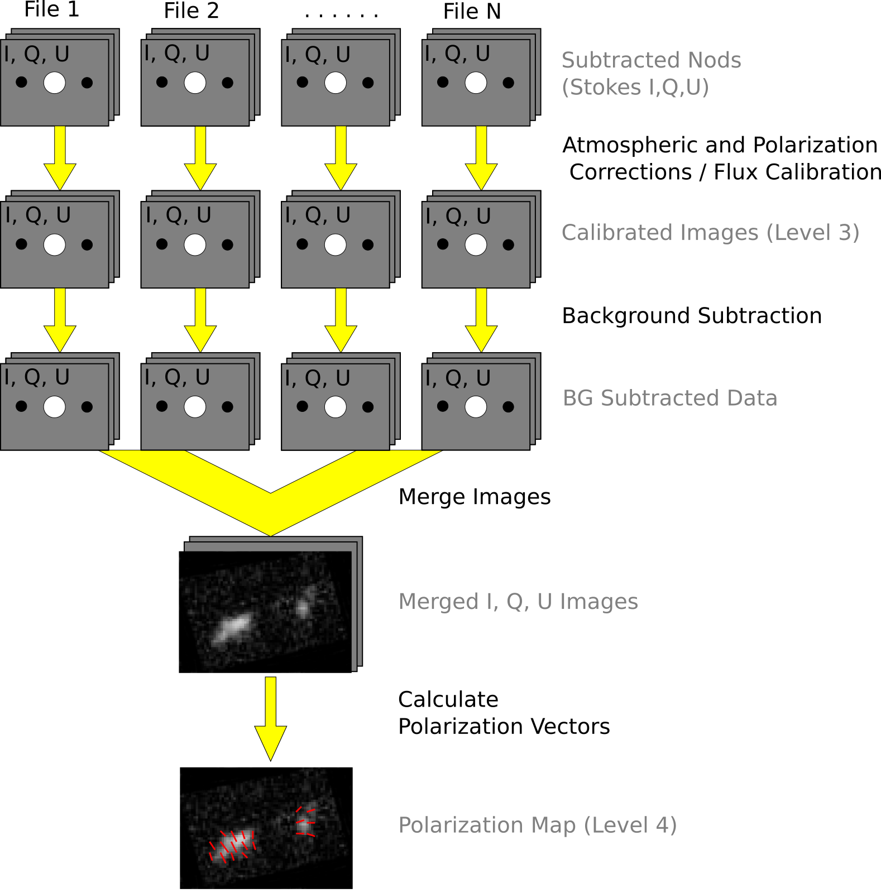
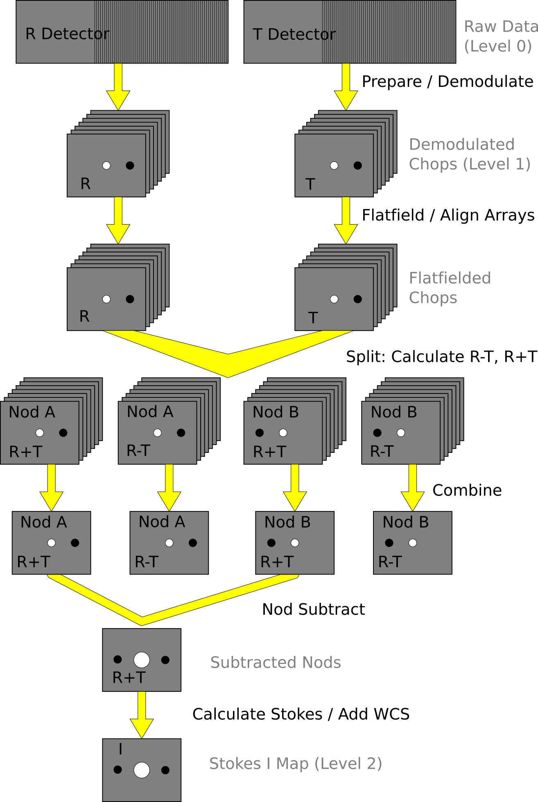
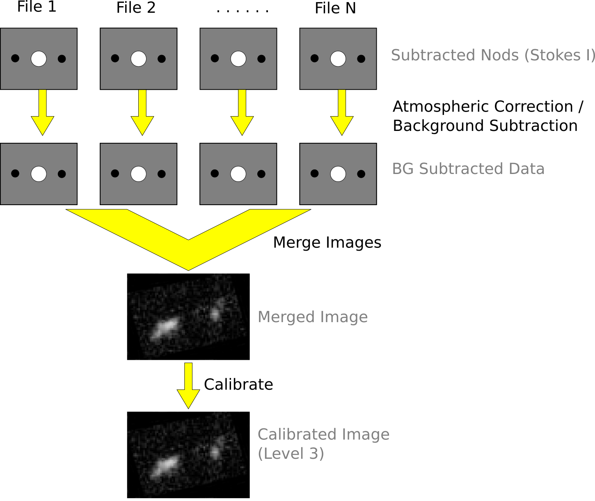
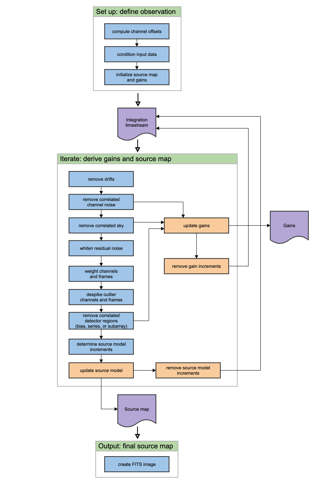

SI Observing Modes Supported
============================

HAWC+ Instrument Information
----------------------------

HAWC+ is the upgraded and redesigned incarnation of the High-Resolution
Airborne Wide-band Camera instrument (HAWC), built for SOFIA. Since the
original design never collected data for SOFIA, the instrument may be
alternately referred to as HAWC or HAWC+. HAWC+ is designed for
far-infrared imaging observations in either total intensity (imaging) or
polarimetry mode.

HAWC currently consists of dual TES BUG Detector arrays in a 64x40
rectangular format. A six-position filter wheel is populated with five
broadband filters ranging from 40 to 250 :math:`\mu`\ m and a dedicated
position for diagnostics. Another wheel holds pupil masks and rotating
half-wave plates (HWPs) for polarization observations. A polarizing beam
splitter directs the two orthogonal linear polarizations to the two
detectors (the reflected (R) array and the transmitted (T) array). Each
array was designed to have two 32x40 subarrays, for four total detectors
(R0, R1, T0, and T1), but T1 is not currently available for HAWC. Since
polarimetry requires paired R and T pixels, it is currently only
available for the R0 and T0 arrays. Total intensity observations may use
the full set of 3 subarrays.

HAWC+ Observing Modes
---------------------

The HAWC instrument has two instrument configurations, for imaging and
polarization observations. In both types of observations, removing
background flux due to the telescope and sky is a challenge that
requires one of several observational strategies. The HAWC instrument
may use the secondary mirror to chop rapidly between two positions
(source and sky), may use discrete telescope motions to nod between
different sky positions, or may use slow continuous scans of the
telescope across the desired field. In chopping and nodding strategies,
sky positions are subtracted from source positions to remove background
levels. In scanning strategies, the continuous stream of data is used to
solve for the underlying source and background structure.

The instrument has two standard observing modes for imaging: the
Chop-Nod instrument mode combines traditional chopping with nodding; the
Scan mode uses slow telescope scans without chopping. The Scan mode is
the most commonly used for total intensity observations.
Likewise, polarization observations may be taken in either Nod-Pol or
Scan-Pol mode.  Nod-Pol mode includes chopping and nodding cycles
in multiple HWP positions; Scan-Pol mode includes repeated scans at
multiple HWP positions.

All modes that include chopping or nodding may be chopped and nodded
on-chip or off-chip. Currently, only two-point chop patterns with
matching nod amplitudes (nod-match-chop) are used in either Chop-Nod or
Nod-Pol observations, and nodding is performed in an A-B-B-A pattern
only. All HAWC modes can optionally have a small dither pattern or a
larger mapping pattern, to cover regions of the sky larger than HAWC’s
fields of view. Scanning patterns may be either box rasters or Lissajous
patterns.

Algorithm Description
=====================

Chop-Nod and Nod-Pol Reduction Algorithms
-----------------------------------------

The following sections describe the major algorithms used to reduce
Chop-Nod and Nod-Pol observations. In nearly every case, Chop-Nod (total
intensity) reductions use the same methods as Nod-Pol observations, but
either apply the algorithm to the data for the single HWP angle
available, or else, if the step is specifically for polarimetry, have no
effect when called on total intensity data. Since nearly all total
intensity HAWC observations are taken with scanning mode, the following
sections will focus primarily on Nod-Pol data.

See the figures below for flow charts that illustrate the data reduction
process for Nod-Pol data (:numref:`nodpol_flowchart_1` and
:numref:`nodpol_flowchart_2`) and Chop-Nod data
(:numref:`chopnod_flowchart_1` and :numref:`chopnod_flowchart_2`).

.. figure:: images/polnod_single.png
   :alt: Nod-Pol data reduction flowchart
   :name: nodpol_flowchart_1

   Nod-Pol data reduction flowchart, up through Stokes parameter
   calculation for a single input file.

   Nod-Pol data reduction flowchart, picking up from Stokes parameter
   calculation, through combining multiple input files and calculating
   polarization vectors.

   Chop-Nod data reduction flowchart, up through Stokes parameter
   calculation for a single input file.

   Chop-Nod data reduction flowchart, picking up from Stokes parameter
   calculation, through combining multiple input files.

.. _prepare:

Prepare
~~~~~~~

The first step in the pipeline is to prepare the raw data for
processing, by rearranging and regularizing the raw input data tables,
and performing some initial calculations required by subsequent steps.

The raw (Level 0) HAWC files contain all information in FITS binary
table extensions located in two Header Data Unit (HDU) extensions. The
raw file includes the following HDUs:

-  Primary HDU: Contains the necessary FITS keywords in the header but
   no data. It contains all required keywords for SOFIA data files, plus
   all keywords required to reduce or characterize the various observing
   modes. Extra keywords (either from the SOFIA keyword dictionary or
   otherwise) have been added for human parsing.

-  CONFIGURATION HDU (EXTNAME = CONFIGURATION): Contains MCE (detector
   electronics) configuration data. This HDU is stored only in the raw
   and demodulated files; it is not stored in Level 2 or higher data
   products. Nominally, it is the first HDU but users should use EXTNAME
   to identify the correct HDUs. Note, the "HIERARCH" keyword option and
   long strings are used in this HDU. All keyword names are prefaced
   with "MCEn" where n=0,1,2,3. Only the header is used from this HDU.

-  TIMESTREAM Data HDU (EXTNAME = TIMESTREAM): Contains a binary table
   with data from all detectors, with one row for each time sample. The
   raw detector data is stored in the column "SQ1Feedback", in FITS
   (data-store) indices, i.e. 41 rows and 128 columns. Columns 0-31 are
   for subarray R0, 32-63 for R1, 64-95 for T0 and 96-127 for T1).
   Additional columns contain other important data and metadata,
   including time stamps, instrument encoder readings, chopper signals,
   and astrometry data.

In order to begin processing the data, the pipeline first splits these
input TIMESTREAM data arrays into separate R and T tables. It will also
compute nod and chop offset values from telescope data, and may also
delete, rename, or replace some input columns in order to format them as
expected by later algorithms. The output data from this step has the
same HDU structure as the input data, but the detector data is now
stored in the "R Array" and "T Array" fields, which have 41 rows and 64
columns each.

Demodulate
~~~~~~~~~~

For both Chop-Nod and Nod-Pol instrument modes, data is taken in a
two-point chop cycle. In order to combine the data from the high and low
chop positions, the pipeline demodulates the raw time stream with either
a square or sine wave-form. Throughout this step, data for each of the R
and T arrays are handled separately. The process is equivalent to
identifying matched sets of chopped images and subtracting them.

During demodulation, a number of filtering steps are performed to
identify good data. By default, the raw data is first filtered with a
box high-pass filter with a time constant of one over the chop
frequency. Then, any data taken during telescope movement (line-of-sight
rewinds, for example, or tracking errors) is flagged for removal. In
square wave demodulation, samples are then tagged as being in the
high-chop state, low-chop state, or in between (not used). For each
complete chop cycle within a single nod position at a single HWP angle,
the pipeline computes the average of the signal in the high-chop state
and subtracts it from the average of the signal in the low-chop state.
Incomplete chop cycles at the end of a nod or HWP position are
discarded. The sine-wave demodulation proceeds similarly, except that
the data are weighted by a sine wave instead of being considered either
purely high or purely low state.

During demodulation, the data is also corrected for the phase delay in
the readout of each pixel, relative to the chopper signal. For square
wave demodulation, the phase delay time is multiplied by the sample
frequency to calculate the delay in data samples for each individual
pixel. The data is then shifted by that many samples before
demodulating. For sine wave demodulation, the phase delay time is
multiplied with 2\ :math:`\pi` times the chop frequency to get the phase
shift of the demodulating wave-form in radians.

Alongside the chop-subtracted flux, the pipeline calculates the error on
the raw data during demodulation. It does so by taking the mean of all
data samples at the same chop phase, nod position, HWP angle, and
detector pixel, then calculates the variance of each raw data point with
respect to the appropriate mean. The square root of this value gives the
standard deviation of the raw flux. The pipeline will propagate these
calculated error estimates throughout the rest of the data reduction
steps.

The result of the demodulation process is a chop-subtracted,
time-averaged flux value and associated variance for each nod position,
HWP angle, and detector pixel. The output is stored in a new FITS table,
in the extension called DEMODULATED DATA, which replaces the TIMESTREAM
data extension. The CONFIGURATION extension is left unmodified.

Flat Correct
~~~~~~~~~~~~

After demodulation, the pipeline corrects the data for pixel-to-pixel
gain variations by applying a flat field correction. Flat files are
generated on the fly from internal calibrator files (CALMODE=INT\_CAL),
taken before and after each set of science data. Flat files contain
normalized gains for the R and T array, so that they are corrected to
the same level. Flat files also contain associated variances and a bad
pixel mask, with zero values indicating good pixels and any other value
indicating a bad pixel. Pixels marked as bad are set to NaN in the gain
data. To apply the gain correction and mark bad pixels, the pipeline
multiplies the R and T array data by the appropriate flat data. Since
the T1 subarray is not available, all pixels in the right half of the T
array are marked bad at this stage. The flat variance values are also
propagated into the data variance planes.

The output from this step contains FITS images in addition to the data
tables. The R array data is stored as an image in the primary HDU; the R
array variance, T array data, T array variance, R bad pixel mask, and T
bad pixel mask are stored as images in extensions 1 (EXTNAME="R ARRAY
VAR"), 2 (EXTNAME="T ARRAY"), 3 (EXTNAME="T ARRAY VAR"), 4 (EXTNAME="R
BAD PIXEL MASK"), and 5 (EXTNAME="T BAD PIXEL MASK"), respectively. The
DEMODULATED DATA table is attached unmodified as extension 6. The R and
T data and variance images are 3D cubes, with dimension
64x41xN\ :math:`_{frame}`, where N\ :math:`_{frame}` is the number of
nod positions in the observation, times the number of HWP positions.

Align Arrays
~~~~~~~~~~~~

In order to correctly pair R and T pixels for calculating polarization,
and to spatially align all subarrays, the pipeline must reorder the
pixels in the raw images. The last row is removed, R1 and T1 subarray
images (columns 32-64) are rotated 180 degrees, and then all images are
inverted along the y-axis. Small shifts between the R0 and T0 and R1 and
T1 subarrays may also be corrected for at this stage. The spatial gap
between the 0 and 1 subarrays is also recorded in the ALNGAPX and
ALNGAPY FITS header keywords, but is not added to the image; it is
accounted for in a later resampling of the image. The output images are
64x40xN\ :math:`_{frame}`.

Split Images
~~~~~~~~~~~~

To prepare for combining nod positions and calculating Stokes
parameters, the pipeline next splits the data into separate images for
each nod position at each HWP angle, calculates the sum and difference
of the R and T arrays, and merges the R and T array bad pixel masks. The
algorithm uses data from the DEMODULATED DATA table to distinguish the
high and low nod positions and the HWP angle. At this stage, any pixel
for which there is a good pixel in R but not in T, or vice versa, is
noted as a "widow pixel." In the sum image (R+T), each widow pixel’s
flux is multiplied by 2 to scale it to the correct total intensity. In
the merged bad pixel mask, widow pixels are marked with the value 1 (R
only) or 2 (T only), so that later steps may handle them appropriately.

The output from this step contains a large number of FITS extensions:
DATA and VAR image extensions for each of R+T and R-T for each HWP angle
and nod position, a VAR extension for uncombined R and T arrays at each
HWP angle and nod position, as well as a TABLE extension containing the
demodulated data for each HWP angle and nod position, and a single
merged BAD PIXEL MASK image. For a typical Nod-Pol observation with two
nod positions and four HWP angles, there are 8 R+T images, 8 R-T images,
32 variance images, 8 binary tables, and 1 bad pixel mask image, for 57
extensions total, including the primary HDU. The output images, other
than the bad pixel mask, are 3D cubes with dimension
64x40xN\ :math:`_{chop}`, where N\ :math:`_{chop}` is the number of chop
cycles at the given HWP angle.

Combine Images
~~~~~~~~~~~~~~

The pipeline combines all chop cycles at a given nod position and HWP
angle by computing a robust mean of all the frames in the R+T and R-T
images. The robust mean is computed at each pixel using Chauvenet’s
criterion, iteratively rejecting pixels more than 3\ :math:`\sigma` from
the mean value, by default. The associated variance values are
propagated through the mean, and the square root of the resulting value
is stored as an error image in the output.

The output from this step contains the same FITS extensions as in the
previous step, with all images now reduced to 2D images with dimensions
64x40, and the variance images for R+T and R-T replaced with ERROR
images. For the example above, with two nod positions and four HWP
angles, there are still 57 total extensions, including the primary HDU.

Subtract Beams
~~~~~~~~~~~~~~

In this pipeline step, the sky nod positions (B beams) are subtracted
from the source nod positions (A beams) at each HWP angle and for each
set of R+T and R-T, and the resulting flux is divided by two for
normalization. The errors previously calculated in the combine step are
propagated accordingly. The output contains extensions for DATA and
ERROR images for each set, as well as variance images for R and T
arrays, a table of demodulated data for each HWP angle, and the bad
pixel mask.

.. _stokes:

Compute Stokes
~~~~~~~~~~~~~~

From the R+T and R-T data for each HWP angle, the pipeline now computes
images corresponding to the Stokes I, Q, and U parameters for each
pixel.

Stokes I is computed by averaging the R+T signal over all HWP angles:

.. math:: I = \frac{1}{N} \sum_{\phi=1}^N (R+T)_{\phi},

where :math:`N` is the number of HWP angles and :math:`(R+T)_{\phi}` is
the summed R+T flux at the HWP angle :math:`\phi`. The associated
uncertainty in I is propagated from the previously calculated errors for
R+T:

.. math:: \sigma_I = \frac{1}{N} \sqrt{\sum_{\phi=1}^N \sigma_{R+T,\phi}^2}.

In the most common case of four HWP angles at 0, 45, 22.5, and 67.5
degrees, Stokes Q and U are computed as:

.. math:: Q = \frac{1}{2} [(R-T)_{0} - (R-T)_{45}]

.. math:: U = \frac{1}{2} [(R-T)_{22.5} - (R-T)_{67.5}]

where :math:`(R-T)_{\phi}` is the differential R-T flux at the HWP
angle :math:`\phi`. Uncertainties in Q and U are propagated from the
input error values on R-T:

.. math:: \sigma_Q = \frac{1}{2} \sqrt{\sigma_{R-T,0}^2 + \sigma_{R-T,45}^2}

.. math:: \sigma_U = \frac{1}{2} \sqrt{\sigma_{R-T,22.5}^2 + \sigma_{R-T,67.5}^2}.

Since Stokes I, Q, and U are derived from the same data samples, they
will have non-zero covariance. For later use in error propagation, the
pipeline now calculates the covariance between Q and I
(:math:`\sigma_{QI}`) and U and I (:math:`\sigma_{UI}`) from the
variance in R and T as follows:

.. math:: \sigma_{QI} = \frac{1}{8} [\sigma_{R,0}^2 - \sigma_{R,45}^2 - \sigma_{T,0}^2 + \sigma_{T,45}^2]

.. math:: \sigma_{UI} = \frac{1}{8} [\sigma_{R,22.5}^2 - \sigma_{R,67.5}^2 - \sigma_{T,22.5}^2 + \sigma_{T,67.5}^2]

The covariance between Q and U (:math:`\sigma_{QU}`) is zero at this
stage, since they are derived from data for different HWP angles.

The output from this step contains an extension for the flux and error
of each Stokes parameter, as well as the covariance images, bad pixel
mask, and a table of the demodulated data, with columns from each of the
HWP angles merged. The STOKES I flux image is in the primary HDU. For
Nod-Pol data, there will be 10 additional extensions (ERROR I, STOKES Q,
ERROR Q, STOKES U, ERROR U, COVAR Q I, COVAR U I, COVAR Q U, BAD PIXEL
MASK, TABLE DATA). For Chop-Nod imaging, only Stokes I is calculated, so
there are only 3 additional extensions (ERROR I, BAD PIXEL MASK, TABLE
DATA).

Update WCS
~~~~~~~~~~

To associate the pixels in the Stokes parameter image with sky
coordinates, the pipeline uses FITS header keywords describing the
telescope position to calculate the reference right ascension and
declination (CRVAL1/2), the pixel scale (CDELT1/2), and the rotation
angle (CROTA2). It may also correct for small shifts in the pixel
corresponding to the instrument boresight, depending on the filter used,
by modifying the reference pixel (CRPIX1/2). These standard FITS world
coordinate system (WCS) keywords are written to the header of the
primary HDU.

.. _ip:

Subtract Instrumental Polarization
~~~~~~~~~~~~~~~~~~~~~~~~~~~~~~~~~~

The instrument and the telescope itself may introduce some foreground
polarization to the data which must be removed to determine the
polarization from the astronomical source. The instrument team uses
measurements of the sky to characterize the introduced polarization in
reduced Stokes parameters (:math:`q=Q/I` and :math:`u=U/I`) for each
filter band at each pixel. The correction is then applied as

.. math:: Q' = Q - q' I

.. math:: U' = U - u' I

and propagated to the associated error and covariance images as

.. math:: \sigma_Q' = \sqrt{\sigma_Q^2 + (q' \sigma_I)^2 +  2q'\sigma_{QI}}

.. math:: \sigma_U' = \sqrt{\sigma_U^2 + (u' \sigma_I)^2 +  2u'\sigma_{UI}}

.. math:: \sigma_{Q'I} = \sigma_{QI} - q' \sigma_I^2

.. math:: \sigma_{U'I} = \sigma_{UI} - u' \sigma_I^2

.. math:: \sigma_{Q'U'} = -u' \sigma_{QI} - q' \sigma_{UI} + qu\sigma_I^2.

The correction is expected to be good to within :math:`Q/I < 0.6\%` and
:math:`U/I < 0.6\%`.

.. _rotate:

Rotate Polarization Coordinates
~~~~~~~~~~~~~~~~~~~~~~~~~~~~~~~

The Stokes Q and U parameters, as calculated so far, reflect
polarization angles measured in detector coordinates. After the
foreground polarization is removed, the parameters may then be rotated
into sky coordinates. The pipeline calculates a relative rotation angle,
:math:`\alpha`, that accounts for the vertical position angle of the
instrument, the initial angle of the half-wave plate position, and an
offset position that is different for each HAWC filter. It applies the
correction to the Q and U images with a standard rotation matrix, such
that:

.. math:: Q' = cos(\alpha) Q + sin(\alpha) U

.. math:: U' = sin(\alpha) Q - cos(\alpha) U.

The errors and covariances become:

.. math:: \sigma_Q' = \sqrt{(cos(\alpha)\sigma_Q)^2 + (sin(\alpha) \sigma_U)^2 +  2 cos(\alpha) sin(\alpha) \sigma_{QU}}

.. math:: \sigma_U' = \sqrt{(sin(\alpha)\sigma_Q)^2 + (cos(\alpha) \sigma_U)^2 -  2 cos(\alpha) sin(\alpha) \sigma_{QU}}

.. math:: \sigma_{Q'I} = cos(\alpha) \sigma_{QI} + sin(\alpha) \sigma_{UI}

.. math:: \sigma_{U'I} = sin(\alpha) \sigma_{QI} - cos(\alpha) \sigma_{UI}

.. math:: \sigma_{Q'U'} = cos(\alpha)sin(\alpha)(\sigma_Q^2 - \sigma_U^2) + (sin^2(\alpha) - cos^2(\alpha)) \sigma_{QU}.

.. _calibrate:

Correct for Atmospheric Opacity
~~~~~~~~~~~~~~~~~~~~~~~~~~~~~~~

In order to combine images taken under differing atmospheric conditions,
the pipeline corrects the flux in each individual file for the estimated
atmospheric transmission during the observation, based on the altitude
and zenith angle at the time when the observation was obtained.

Atmospheric transmission values in each HAWC+ filter have been computed
for a range of telescope elevations and observatory altitudes
(corresponding to a range of overhead precipitable water vapor values)
using the ATRAN atmospheric modeling code, provided to the SOFIA program
by Steve Lord. The ratio of the transmission at each altitude and zenith
angle, relative to that at the reference altitude (41,000 feet) and
reference zenith angle (45 degrees), has been calculated for each filter
and fit with a low-order polynomial. The ratio appropriate for the
altitude and zenith angle of each observation is calculated from the fit
coefficients. The pipeline applies this relative opacity correction
factor directly to the flux in the Stokes I, Q, and U images, and
propagates it into the corresponding error and covariance images.

Calibrate Flux
~~~~~~~~~~~~~~

The pipeline now converts the flux units from instrumental counts to
physical units of Jansky per pixel (Jy/pixel). For each filter band, the
instrument team determines a calibration factor in counts/Jy/pixel
appropriate to data that has been opacity-corrected to the reference
zenith angle and altitude.

The calibration factors are computed in a manner similar to that for
another SOFIA instrument (FORCAST), taking into account that HAWC+ is a
bolometer, not a photon-counting device. Measured photometry is compared
to the theoretical fluxes of objects (standards) whose spectra are
assumed to be known. The predicted fluxes in each HAWC+ passband are
computed by multiplying the model spectrum by the overall response curve
of the telescope and instrument system and integrating over the filter
passband. For HAWC+, the standards used to date include Uranus, Neptune,
Ceres, and Pallas. The models for Uranus and Neptune
were obtained from the Herschel project (see Mueller et al.
2016). Standard thermal models are used for Ceres and Pallas. All models
are scaled to match the distances of the objects at the time of the
observations. Calibration factors computed from these standards are then
corrected by a color correction factor based on the mean and pivot
wavelengths of each passband, such that the output flux in the
calibrated data product is that of a nominal, flat spectrum source at
the mean wavelength for the filter. See the FORCAST GO Handbook,
available from the `SOFIA
webpage <https://www.sofia.usra.edu/science/proposing-and-observing/data-products/data-resources>`__,
for more details on the calibration process.

Raw calibration factors are computed as above by the pipeline,
for any observation marked as a flux standard (OBSTYPE=STANDARD_FLUX),
and are stored in the FITS headers of the output data product.  The
instrument team generally combines these factors across a flight series,
to determine a robust average value for each instrument configuration
and mode. The overall calibration thus determined is expected to be good
to within about 10%.

For science observations, the series-average calibration factor is
directly applied to the flux in each of the Stokes I, Q, and U images,
and to their associated error and covariance images:

.. math:: I' = I / f
.. math:: Q' = Q / f
.. math:: U' = U / f
.. math:: \sigma_Q' = \sigma_Q / f
.. math:: \sigma_U' = \sigma_Q / f
.. math:: \sigma_{QI}' = \sigma_{QI} / f^2
.. math:: \sigma_{UI}' = \sigma_{UI} / f^2
.. math:: \sigma_{QU}' = \sigma_{QU} / f^2.

where *f* is the reference calibration factor.  The systematic
error on *f* is not propagated into the error planes, but it is
stored in the ERRCALF FITS header keyword.  The calibration
factor applied is stored in the CALFCTR keyword.

Note that for Chop-Nod imaging data, this factor is applied after
the merge step, below.

Subtract Background
~~~~~~~~~~~~~~~~~~~

After chop and nod subtraction, some residual background noise may
remain in the flux images. After flat correction, some residual gain
variation may remain as well. To remove these, the pipeline reads in all
images in a reduction group, and then iteratively performs the following
steps:

-  Smooth and combine the input Stokes I, Q, and U images

-  Compare each Stokes I image (smoothed) to the combined map to
   determine any background offset or scaling

-  Subtract the offset from the input (unsmoothed) Stokes I images;
   scale the input Stokes I, Q, and U images

-  Compare each smoothed Stokes Q and U images to the combined map to
   determine any additional background offset

-  Subtract the Q and U offsets from the input Q and U images

The final determined offsets (:math:`a_I, a_Q, a_U`) and scales
(:math:`b`) for each file are applied to the flux for each
Stokes image as follows:

.. math:: I' = (I - a_I) / b

.. math:: Q' = (Q - a_Q) / b

.. math:: U' = (U - a_U) / b

and are propagated into the associated error and covariance images
appropriately.

Rebin Images
~~~~~~~~~~~~
In polarimetry, it is sometimes useful to bin several pixels together
to increase signal-to-noise, at the cost of decreased resolution. The
chop-nod pipeline provides an optional step to perform this binning
on individual images, prior to merging them together into a single map.

The Stokes I, Q, and U images are divided into blocks of a specified bin
width, then each block is summed over.  The summed flux is scaled to
account for missing pixels within the block, by the factor:

.. math:: f' = f (n_{pix} / n_{valid})

where :math:`n_{pix}` is the number of pixels in a block, and
:math:`n_{valid}` is the number of valid pixels within the block. The
error and covariance images are propagated to match. The WCS keywords
in the FITS header are also updated to match the new data array.

By default, no binning is performed by the pipeline.  The additional
processing is generally performed only on request for particular
science cases.

.. _merge_images:

Merge Images
~~~~~~~~~~~~

All steps up until this point produce an output file for each input file
taken at each telescope dither position, without changing the
pixelization of the input data. To combine files taken at separate
locations into a single map, the pipeline resamples the flux from each
onto a common grid, defined such that North is up and East is to the
left. First, the WCS from each input file is used to determine the sky
location of all the input pixels. Then, for each pixel in the output
grid, the algorithm considers all input pixels within a given radius
that are not marked as bad pixels. It weights the input pixels by a
Gaussian function of their distance from the output grid point and,
optionally, their associated errors. The value at the output grid pixel
is the weighted average of the input pixels within the considered
window. The output grid may subsample the input pixels: by default,
there are 4 output pixels for each input pixel. For flux conservation,
the output flux is multiplied by the ratio of the output pixel area to
the input pixel area.

The error maps output by this algorithm are calculated from the input
variances for the pixels involved in each weighted average. That is, the
output fluxes from N input pixels are:

.. math:: I' =  \frac{\sum_{i}^N w_{i,I} I_i}{w_{tot,I}}

.. math:: Q' =  \frac{\sum_{i}^N w_{i,Q} Q_i}{w_{tot,Q}}

.. math:: U' =  \frac{\sum_{i}^N w_{i,U} U_i}{w_{tot,U}}

and the output errors and covariances are

.. math:: \sigma_I' = \frac{\sqrt{\sum_{i}^N (w_{i,I} \sigma_{i,I})^2}}{w_{tot,I}}

.. math:: \sigma_Q' = \frac{\sqrt{\sum_{i}^N (w_{i,Q} \sigma_{i,Q})^2}}{w_{tot,Q}}

.. math:: \sigma_U' = \frac{\sqrt{\sum_{i}^N (w_{i,U} \sigma_{i,U})^2}}{w_{tot,U}}

.. math:: \sigma_{QI}' = \frac{\sum_{i}^N w_{i,Q} w_{i,I}\sigma_{i,QI}}{w_{tot,Q}w_{tot,I}}

.. math:: \sigma_{UI}' = \frac{\sum_{i}^N w_{i,U} w_{i,I}\sigma_{i,UI}}{w_{tot,U}w_{tot,I}}

.. math:: \sigma_{QU}' = \frac{\sum_{i}^N w_{i,Q} w_{i,U}\sigma_{i,QU}}{w_{tot,Q}w_{tot,U}}

where :math:`w_i` is the pixel weight and :math:`w_{tot}` is the sum of
the weights of all input pixels.

As of HAWC DRP v2.4.0, the distance-weighted input pixels within the fit
radius may optionally be fit by a low-order polynomial surface, rather than
a weighted average. In this case, each output pixel value is the value of
the local polynomial fit, evaluated at that grid location.  Errors and
covariances are propagated similarly.

The output from this step is a single FITS file, containing a flux and
error image for each of Stokes I, Q, and U, as well as the Stokes
covariance images. An image mask is also produced, which represents how
many input pixels went into each output pixel. Because of the weighting
scheme, the values in this mask are not integers. A data table
containing demodulated data merged from all input tables is also
attached to the file with extension name MERGED DATA.

.. _vectors:

Compute Vectors
~~~~~~~~~~~~~~~

Using the Stokes I, Q, and U images, the pipeline now computes the
polarization percentage (:math:`p`) and angle (:math:`\theta`) and their
associated errors (:math:`\sigma`) in the standard way. For the
polarization angle :math:`\theta` in degrees:

.. math:: \theta = \frac{90}{\pi} arctan\Big(\frac{U}{Q}\Big)

.. math:: \sigma_\theta = \frac{90}{\pi (Q^2 + U^2)} \sqrt{(U\sigma_Q)^2 + (Q\sigma_U)^2 - 2 Q U \sigma_{QU}}.

The percent polarization (:math:`p`) and its error are calculated as

.. math:: p = 100 \sqrt{\Big(\frac{Q}{I}\Big)^2 + \Big(\frac{U}{I}\Big)^2}

.. math:: \sigma_p = \frac{100}{I} \sqrt{\frac{1}{(Q^2 + U^2)} \Big[(Q \sigma_Q)^2 + (U \sigma_U)^2 + 2 Q U \sigma_{QU}\Big] + \Big[\Big(\frac{Q}{I}\Big)^2 + \Big(\frac{U}{I}\Big)^2\Big] \sigma_I^2 - 2 \frac{Q}{I}\sigma_{QI} - 2 \frac{U}{I} \sigma_{UI}}.

The debiased polarization percentage (:math:`p'`)is also calculated, as:

.. math:: p' = \sqrt{p^2 - \sigma_p^2}.

Each of the :math:`\theta`, :math:`p`, and :math:`p'` maps and their
error images are stored as separate extensions in the output from this
step, which is the final output from the pipeline for Nod-Pol data. This
file will have 19 extensions, including the primary HDU, with extension
names, types, and numbers as follows:

-  STOKES I: primary HDU, image, extension 0

-  ERROR I: image, extension 1

-  STOKES Q: image, extension 2

-  ERROR Q: image, extension 3

-  STOKES U: image, extension 4

-  ERROR U: image, extension 5

-  IMAGE MASK: image, extension 6

-  PERCENT POL: image, extension 7

-  DEBIASED PERCENT POL: image, extension 8

-  ERROR PERCENT POL: image, extension 9

-  POL ANGLE: image, extension 10

-  ROTATED POL ANGLE: image, extension 11

-  ERROR POL ANGLE: image, extension 12

-  POL FLUX: image, extension 13

-  ERROR POL FLUX: image, extension 14

-  DEBIASED POL FLUX: image, extension 15

-  MERGED DATA: table, extension 16

-  POL DATA: table, extension 17

-  FINAL POL DATA: table, extension 18

The final two extensions contain table representations of the
polarization values for each pixel, as an alternate representation of
the :math:`\theta`, :math:`p`, and :math:`p'` maps. The FINAL POL DATA
table (extension 18) is a subset of the POL DATA table (extension 17),
with data quality cuts applied.

.. _scanmap:

Scan Reduction Algorithms
-------------------------

This section covers the main algorithms used to reduce Scan mode data.
See the flowchart in :numref:`scan_flowchart` for an overview of the
iterative process.  In this description, "channels" refer to detector
pixels, and "frames" refer to time samples read out from the detector
pixels during the scan observation.

         (2) Iterate: refine gains and source map, (3) Output: final source
         map.
   :name: scan_flowchart
   :height: 800

   Scan data reduction flowchart

Signal Structure
~~~~~~~~~~~~~~~~

Scan map reconstruction is based on the assumption that the measured
data (:math:`X_{ct}`) for detector :math:`c`, recorded at time :math:`t`,
is the superposition of various signal components and essential (not
necessarily white) noise :math:`n_{ct}`:

.. math:: X_{ct} = D_{ct} + g_{(1),c} C_{(1),t} + ... + g_{(n),c} C_{(n),t} + G_c M_{ct}^{xy} S_{xy} + n_{ct}

We can model the measured detector timestreams via a number of
appropriate parameters, such as 1/f drifts (:math:`D_{ct}`), :math:`n`
correlated noise components (:math:`C_{(1),t} ... C_{(n),t}`) and
channel responses to these (gains, :math:`g_{(1),c} ... g_{(n),c}`), and
the observed source structure (:math:`S_{xy}`). We can derive
statistically sound estimates (such as maximum-likelihood or robust
estimates) for these parameters based on the measurements themselves. As
long as our model is representative of the physical processes that
generate the signals, and sufficiently complete, our derived parameters
should be able to reproduce the measured data with the precision of the
underlying limiting noise.

Below is a summary of the assumed principal model parameters, in general:

-  :math:`X_{ct}`: The raw timestream of channel c, measured at time t.

-  :math:`D_{ct}`: The 1/f drift value of channel c at time t.

-  :math:`g_{(1),c} ... g_{(n),c}`: Channel :math:`c` gain (response) to
   correlated signals (for modes 1 through :math:`n`).

-  :math:`C_{(1),t} ... C_{(n),t}`: Correlated signals (for modes 1
   through :math:`n`) at time :math:`t`.

-  :math:`G_c`: The point source gain of channel :math:`c`

-  :math:`M_{ct}^{xy}`: Scanning pattern, mapping a sky position
   :math:`\{x,y\}` into a sample of channel :math:`c` at time :math:`t`.

-  :math:`S_{xy}`: Actual 2D source flux at position :math:`\{x,y\}`.

-  :math:`n_{ct}`: Essential limiting noise in channel c at time t.

Sequential Incremental Modeling and Iterations
~~~~~~~~~~~~~~~~~~~~~~~~~~~~~~~~~~~~~~~~~~~~~~

The pipeline's approach is to solve for each term separately, and
sequentially, rather than trying to do a brute-force matrix inversion in
a single step. Sequential modeling works on the assumption that each term
can be considered independently from one another. To a large degree this is
justified, as many of the signals produce more or less orthogonal imprints
in the data (e.g. you cannot easily mistake correlated sky response seen
by all channels with a per-channel DC offset). As such, from the point
of view of each term, the other terms represent but an increased level
of noise. As the terms all take turns in being estimated (usually from
bright to faint) this model confusion "noise" goes away, especially with
multiple iterations.

Even if the terms are not perfectly orthogonal to one another, and have
degenerate flux components, the sequential approach handles this degeneracy
naturally. Degenerate fluxes between a pair of terms will tend to end up
in the term that is estimated first. Thus, the ordering of the
estimation sequence provides a control on handling degeneracies in a
simple and intuitive manner.

A practical trick for efficient implementation is to replace the raw
timestream with the unmodeled residuals
:math:`X_{ct} \rightarrow R_{ct}` and let modeling steps produce
incremental updates to the model parameters. Every time a model
parameter is updated, its incremental imprint is removed from the
residual timestream (a process we shall refer to as synchronization).

With each iteration, the incremental changes to the parameters become
more insignificant, and the residual will approach the limiting noise of
the measurement.

Initialization and Scan Validation
~~~~~~~~~~~~~~~~~~~~~~~~~~~~~~~~~~

Prior to beginning iterative solution for the model components, the
pipeline reads in the raw FITS table, assigns positional offsets to
every detector channel, and sky coordinates to every time frame in the
scan.

The input timestream is then checked for inconsistencies.
For example, HAWC data is prone to discontinuous jumps in flux levels.
The pipeline will search the timestream for flux jumps, and flag or fix
jump-related artifacts as necessary.  The pipeline also checks for gaps in
the astrometry data in the timestream, gyro drifts over the course of
the observation,

By default, the pipeline also clips extreme scanning velocities using, by
default, a set minimum and maximum value for each instrument.
The default settings still include a broad range of speeds, so
images can sometimes be distorted by low or high speeds causing too
little or too much exposure on single pixels. To fix this, the pipeline
can optionally remove frames from the beginning or end of the observation,
or sigma-clip the telescope speeds to a tighter range.

The size of the output source map is determined from the mapped area on
the sky, and a configurable output pixel grid size.  This map is updated
on each iteration, with the derived source model.

Gains for all detector pixels are initialized with a reference gain map,
derived from earlier observations.  These initial gains serve as a starting
place for the iterative model and allow for flagging and removal of channels
known to be bad prior to iterating.

DC Offset and 1/f Drift Removal
~~~~~~~~~~~~~~~~~~~~~~~~~~~~~~~

For 1/f drifts, consider only the term:

.. math:: R_{ct} \approx \delta D_{c\tau}

where :math:`\delta D_{c\tau}` is the 1/f channel drift value for
:math:`t` between :math:`\tau` and :math:`\tau + T`, for a 1/f time
window of :math:`T` samples. That is, we simply assume that the
residuals are dominated by an unmodeled 1/f drift increment
:math:`\delta D_{c\tau}`. Note that detector DC offsets can be treated
as a special case with :math:`\tau = 0`, and :math:`T` equal to the
number of detector samples in the analysis.

We can construct a :math:`\chi^2` measure, as:

.. math:: \chi^2 = \sum_{c,t = \tau}^{t=\tau + T} w_{ct} (R_{ct} - \delta D_{ct})^2

where :math:`w_{ct} = \sigma_{ct}^{-2}` is the proper noise-weight
associated with each datum. The pipeline furthermore assumes that the noise
weight of every sample :math:`w_{ct}` can be separated into the product
of a channel weight :math:`w_c` and a time weight :math:`w_t`, i.e.
:math:`w_{ct} = w_c \cdot w_t`. This assumption is identical to that of
separable noise (:math:`\sigma_{ct} = \sigma_c \cdot \sigma_t`). Then,
by setting the :math:`\chi^2` minimizing condition
:math:`\partial \chi^2 / \partial(\delta D_{ct}) = 0`, we arrive at the
maximum-likelihood incremental update:

.. math:: \delta D_{c\tau} = \frac{\sum\limits_{t=\tau}^{\tau + T} w_t R_{ct}}{\sum\limits_{t=\tau}^{\tau + T} w_t}

Note that each sample (:math:`R_{ct}`) contributes a fraction:

.. math:: p_{ct} = w_t / \sum_{t=\tau}^{\tau + T} w_t

to the estimate of the single parameter :math:`\delta D_{c\tau}`. In
other words, this is how much that parameter is *dependent* on each data
point. Above all, :math:`p_{ct}` is a fair measure of the fractional
degrees of freedom lost from each datum, due to modeling of the 1/f
drifts. We will use this information later, when estimating proper noise
weights.

Note, also, that we may replace the maximum-likelihood estimate for the
drift parameter with any other statistically sound estimate (such as a
weighted median), and it will not really change the dependence, as we
are still measuring the same quantity, from the same data, as with the
maximum-likelihood estimate. Therefore, the dependence calculation
remains a valid and fair estimate of the degrees of freedom lost,
regardless of what statistical estimator is used.

The removal of 1/f drifts must be mirrored in the correlated signals
also if gain solutions are to be accurate.

Correlated Noise Removal and Gain Estimation
~~~~~~~~~~~~~~~~~~~~~~~~~~~~~~~~~~~~~~~~~~~~

For the correlated noise (mode :math:`i`), we shall consider only the
term with the incremental signal parameter update:

.. math:: R_{ct} = g_{(i),c} \delta C_{(i),t} + ...

Initially, we can assume :math:`C_{(i),t}` as well as
:math:`g_{(i),c} = 1`, if better values of the gain are not
independently known at the start. Accordingly, the :math:`\chi^2`
becomes:

.. math:: \chi^2 = \sum_c w_{ct}(R_{ct} - g_{(i),c} \delta C_{(i),t})^2.

Setting the :math:`\chi^2` minimizing condition with respect to
:math:`\delta C_{(i),t}` yields:

.. math:: \delta C_{(i),t} =  \frac{\sum\limits_c w_c g_{(i),c} R_{ct}}{\sum\limits_c w_c g_{(i),c}^2}.

The dependence of this parameter on :math:`R_{ct}` is:

.. math:: p_{ct} = w_c g_{(i),c}^2 / \sum_{c} w_c  g_{(i),c}^2

After we update :math:`C_{(i)}` (the correlated noise model for mode
:math:`i`) for all frames :math:`t`, we can update the gain response as
well in an analogous way, if desired. This time, consider the residuals
due to the unmodeled gain increment:

.. math:: R_{ct} = \delta g_{(i),c} C_{(i),t} + ...

and

.. math:: \chi^2 = \sum_t w_{ct}(R_{ct} - \delta g_{(i),c} C_{(i),t})^2

Minimizing it with respect to :math:`\delta g_{(i),c}` yields:

.. math:: \delta g_{(i),c} =  \frac{\sum\limits_t w_t C_{(i),t} R_{ct}}{\sum\limits_t w_t C_{(i),t}^2}

which has a parameter dependence:

.. math:: p_{ct} = w_t C_{(i),t}^2 / \sum_{t} w_t  C_{(i),t}^2

Because the signal :math:`C_t` and gain :math:`g_c` are a product in our
model, scaling :math:`C_t` by some factor :math:`X`, while dividing
:math:`g_c` by the same factor will leave the product intact. Therefore,
our solutions for :math:`C_t` and :math:`g_c` are not unique. To remove
this inherent degeneracy, it is practical to enforce a normalizing
condition on the gains, such that the mean gain :math:`\mu(g_c) = 1`, by
construct. The pipeline uses a robust mean measure for gain normalization to
produce reasonable comparisons under various pathologies, such as when
most gains are zero, or when a few gains are very large compared to the
others.

Noise Weighting
~~~~~~~~~~~~~~~

Once we model out the dominant signal components, such that the
residuals are starting to approach a reasonable level of noise, we can
turn our attention to determining proper noise weights. In its simplest
form, we can determine the weights based on the mean observed variance
of the residuals, normalized by the remaining degrees of freedom in the
data:

.. math:: w_c = \eta_c \frac{N_{(t),c} - P_c}{\sum\limits_t w_t R_{ct}^2}

where :math:`N_{(t),c}` is the number of unflagged data points (time
samples) for channel :math:`c`, and :math:`P_c` is the total number of
parameters derived from channel :math:`c`. The scalar value
:math:`\eta_c` is the overall spectral filter pass correction for
channel :math:`c`, which is 1 if the data was
not spectrally filtered, and 0 if the data was maximally filtered (i.e.
all information is removed). Thus typical :math:`\eta_c` values will
range between 0 and 1 for rejection filters, or can be greater than 1
for enhancing filters. We determine time-dependent weights as:

.. math:: w_t = \frac{N_{(c),t} - P_t}{\sum\limits_c w_c R_{ct}^2}

Similar to the above, here :math:`N_{(c),t}` is the number of unflagged
channel samples in frame :math:`t`, while :math:`P_t` is the total
number of parameters derived from frame :math:`t`. Once again, it is
practical to enforce a normalizing condition of setting the mean time
weight to unity, i.e. :math:`\mu(w_t) = 1`. This way, the channel
weights :math:`w_c` have natural physical weight units, corresponding to
:math:`w_c = 1/\sigma_c^2`.

The total number of parameters derived from each channel, and frame, are
simply the sum, over all model parameters :math:`m`, of all the
parameter dependencies :math:`p_{ct}` we calculated for them. That is,

.. math:: P_c = \sum_m \sum_t p_{(m),ct}

and

.. math:: P_t = \sum_m \sum_c p_{(m),ct}

Getting these lost-degrees-of-freedom measures right is critical for
the stability of the solutions in an iterated framework. Even slight
biases in :math:`p_{ct}` can grow exponentially with iterations, leading
to divergent solutions, which may manifest as over-flagging or as
extreme mapping artifacts.

Despiking
~~~~~~~~~

After deriving fair noise weights, we can try to identify outliers in
the data (glitches and spikes) and flag them for removal from further
analysis. By default, the pipeline uses differential deviations between
neighboring data points to identify outlier values.

Spectral Conditioning
~~~~~~~~~~~~~~~~~~~~~

Ideally, detectors would have featureless white noise spectra (at least
after the 1/f noise is treated by the drift removal). In practice, that
is rarely the case. Spectral features are bad because (a) they produce
mapping features/artifacts (such as "striping"), and because (b) they
introduce a covariant noise term between map points that is not easily
represented by the output. It is therefore desirable to "whiten" the
residual noise whenever possible, to mitigate both these effects.

Noise whitening starts with measuring the effective noise spectrum in a
temporal window, significantly shorter than the integration on which it
is measured. In the pipeline, the temporal window is designed to match the 1/f
stability timescale :math:`T` chosen for the drift removal, since the
drift removal will wipe out all features on longer timescales. With the
use of such a spectral window, we may derive a lower-resolution averaged
power-spectrum for each channel. The pipeline then identifies the white noise
level, either as the mean (RMS) scalar amplitude over a specified range
of frequencies, or automatically, over an appropriate frequency range
occupied by the point-source signal as a result of the scanning motion.

Then, the pipeline will look for significant outliers in each spectral bin,
above a specified level (and optimally below a critical level too), and
create a real-valued spectral filter profile :math:`\phi_{cf}` for each
channel :math:`c` and frequency bin :math:`f` to correct these
deviations.

There are other filters that can be applied also, such as notch filters,
or a motion filter to reject responses synchronous to the dominant
telescope motion. In the end, every one of these filters is represented
by an appropriate scalar filter profile :math:`\phi_{cf}`, so the
discussion remains unchanged.  Only the whitening filter is used by default
for HAWC data.

Once a filter profile is determined, we apply the filter by first
calculating a rejected signal:

.. math:: \varrho_{ct} = F^{-1}[(1-\phi_{cf}) \hat{R}_{cf}]

where :math:`\hat{R}_{cf}` is the Fourier transform of :math:`R_{ct}`,
using the weighting function provided by :math:`w_t`, and :math:`F^{-1}`
denotes the inverse Fourier Transform from the spectral domain back into
the timestream. The rejected signals are removed from the residuals as:

.. math:: R_{ct} \rightarrow R_{ct} - \varrho_{ct}

The overall filter pass :math:`\eta_c` for channel :math:`c`, can be
calculated as:

.. math:: \eta_c = \frac{\sum\limits_f \phi_{cf}^2}{N_f}

where :math:`N_f` is the number of spectral bins in the profile
:math:`\phi_{cf}`. The above is simply a measure of the white-noise
power fraction retained by the filter, which according to Parseval’s
theorem, is the same as the power fraction retained in the timestream,
or the scaling of the observed noise variances as a result of filtering.

Map Making
~~~~~~~~~~

The mapping algorithm for the output source model implements a nearest-pixel method,
whereby each data point is mapped entirely into the map pixel that falls
nearest to the given detector channel :math:`c`, at a given time
:math:`t`. Here,

.. math:: \delta S_{xy} = \frac{\sum\limits_{ct} M_{xy}^{ct} w_c w_t \varkappa_c G_c R_{ct}}{\sum\limits_{ct} M_{xy}^{ct} w_c w_t \varkappa_c^2 G_c^2}

where :math:`M_{xy}^{ct}` associates each sample :math:`\{c,t\}`
uniquely with a map pixel :math:`\{x,y\}`, and is effectively the
transpose of the mapping function defined earlier. :math:`\varkappa_c`
is the point-source filtering (pass) fraction of the pipeline. It can be
thought of as a single scalar version of the transfer function. Its
purpose is to measure how isolated point-source peaks respond to the
various reduction steps, and correct for it. When done correctly, point
source peaks will always stay perfectly cross-calibrated between
different reductions, regardless of what reduction steps were used in
each case. More generally, a reasonable quality of cross-calibration (to
within 10%) extends to compact and slightly extended sources (typically
up to about half of the field-of-view (FoV) in size). While corrections
for more extended structures (:math:`\geq` FoV) are possible to a
certain degree, they come at the price of steeply increasing noise at
the larger scales.

The map-making algorithm should skip over any data that is unsuitable
for quality map-making (such as too-fast scanning that may smear a
source). For formal treatment, we assume that :math:`M_{ct}^{xy} = 0`
for any troublesome data.

Calculating the precise dependence of each map point :math:`S_{xy}` on
the timestream data :math:`R_{ct}` is computationally costly to the
extreme. Instead, the pipeline gets by with the approximation:

.. math:: p_{ct} \approx N_{xy} \cdot \frac{w_t}{\sum\limits_t w_t} \cdot \frac{w_c \varkappa_c^2 G_c}{\sum\limits_c w_c \varkappa_c^2 G_c^2}

This approximation is good as long as most map points are covered with
a representative collection of pixels, and as long as the pixel
sensitivities are more or less uniformly distributed over the field of
view.

We can also calculate the flux uncertainty in the map
:math:`\sigma_{xy}` at each point :math:`\{x,y\}` as:

.. math:: \sigma_{xy}^2 = 1 / \sum_{ct} M_{xy}^{ct} w_c w_t \varkappa_c^2 G_c^2

Source models are first derived from each input scan separately. These
may be despiked and filtered, if necessary, before added to the global
increment with an appropriate noise weight (based on the observed map
noise) if source weighting is desired.

Once the global increment is complete, we can add it to the prior source
model :math:`S_{xy}^{r(0)}` and subject it to further conditioning,
especially in the intermediate iterations. Conditioning operations may
include smoothing, spatial filtering, redundancy flagging, noise or
exposure clipping, signal-to-noise blanking, or explicit source masking.
Once the model is processed into a finalized :math:`S_{xy}'`, we
synchronize the incremental change
:math:`\delta S_{xy}' = S_{xy}' - S_{xy}^{r(0)}` to the residuals:

.. math:: R_{ct} \rightarrow R_{ct} - M_{ct}^{xy} (\delta G_c S_{xy}^{r(0)} + G_c \delta S_{xy}')

Note, again, that :math:`\delta S_{xy}' \neq \delta S_{xy}`. That is,
the incremental change in the conditioned source model is not the same
as the raw increment derived above. Also, since the source gains
:math:`G_c` may have changed since the last source model update, we must
also re-synchronize the prior source model :math:`S_{xy}^{(0)}` with the
incremental source gain changes :math:`\delta G_c` (first term inside
the brackets).

The pipeline operates under the assumption that the point-source
gains :math:`G_c` of the detectors are closely related to the observed
sky-noise gains :math:`g_c` derived from the correlated noise for all
channels. Specifically, it treats the point-source gains as the
product:

.. math:: G_c = \varepsilon_c g_c g_s e^{-\tau}

where :math:`\varepsilon_c` is the point-source coupling efficiency. It
measures the ratio of point-source gains to sky-noise gains (or extended
source gains). Generally, the pipeline will assume :math:`\varepsilon_c = 1`,
unless these values are measured and loaded during the initial scan validation
sequence.

Optionally, the pipeline can also derive :math:`\varepsilon_c` from
the observed response to a source structure, provided the scan pattern
is sufficient to move significant source flux over all detectors. The
source gains also include a correction for atmospheric attenuation, for
an optical depth :math:`\tau`, in-band and in the line of sight.

Point-Source Flux Corrections
~~~~~~~~~~~~~~~~~~~~~~~~~~~~~

We mentioned point-source corrections in the section above; here, we
explain how these are calculated. First, consider drift removal. Its
effect on point source fluxes is a reduction by a factor:

.. math:: \varkappa_{D,c} \approx 1 - \frac{\tau_{pnt}}{T}

In terms of the 1/f drift removal time constant :math:`T` and the
typical point-source crossing time :math:`\tau_{pnt}`. Clearly, the
effect of 1/f drift removal is smaller the faster one scans across the
source, and becomes negligible when :math:`\tau_{pnt} \ll T`.

The effect of correlated-noise removal, over some group of channels of
mode :math:`i`, is a little more complex. It is calculated as:

.. math:: \varkappa_{(i),c} = 1 - \frac{1}{N_{(i),t}} (P_{(i),c} + \sum_k \Omega_{ck} P_{(i),k})

where :math:`\Omega_{ck}` is the overlap between channels :math:`c` and
:math:`k`. That is, :math:`\Omega_{ck}` is the fraction of the point
source peak measured by channel :math:`c` when the source is centered on
channel :math:`k`. :math:`N_{(i),t}` is the number of correlated
noise-samples that have been derived for the given mode (usually the
same as the number of time samples in the analysis). The correlated
model’s dependence on channel :math:`c` is:

.. math:: P_{(i),c} = \sum_t p_{(i),ct}

Finally, the point-source filter correction due to spectral filtering is
calculated based on the average point-source spectrum produced by the
scanning. Gaussian source profiles with spatial spread
:math:`\sigma_x \approx FWHM / 2.35` produce a typical temporal spread
:math:`\sigma_t \approx \sigma_x / \bar{v}`, in terms of the mean
scanning speed :math:`\bar{v}`. In frequency space, this translates to a
Gaussian frequency spread of :math:`\sigma_f = (2 \pi \sigma_t)^{-1}`,
and thus a point-source frequency profile of:

.. math:: \Psi_f \approx e^{-f^2 / (2\sigma_f^2)}

More generally, :math:`\Psi_f` may be complex-valued (asymmetric beam).
Accordingly, the point-source filter correction due to filtering with
:math:`\phi_f` is generally:

.. math:: \varkappa_{\phi,c} \approx \frac{\sum\limits_f Re(\phi_f \Psi_f \phi_f)}{\sum\limits_f Re(\Psi_f)}

The compound point source filtering effect from :math:`m` model
components is the product of the individual model corrections, i.e.:

.. math:: \varkappa_c = \prod_m \varkappa_{(m),c}

Scan Map Output
~~~~~~~~~~~~~~~

Since the Scan mode algorithms are iterative, there are no well-defined
intermediate products that may be written to disk. For Scan mode data,
the pipeline takes as input a set of raw Level 0 HAWC FITS files,
described in the :ref:`prepare` section, and writes as output a single FITS
file per file group, saved with PRODTYPE = *scanmap* (file name code SMP).
These files contain an image of the source map in units of detector counts,
and several other extensions.

The flux calibrated map file is saved as the *calibrate* product type
(CAL).  The primary HDU in the CAL file contains the flux image in
units of Jy/pixel. The first extension (EXTNAME = EXPOSURE)
contains an image of the nominal exposure time in seconds at each point
in the map. The second extension (EXTNAME = NOISE) holds the error image
corresponding to the flux map, and the third extension (EXTNAME = S/N)
is the signal-to-noise ratio of the flux to the error image. The fourth
and further extensions contain binary tables of data, one for each input
scan.

Scan-Pol Reduction Algorithms
-----------------------------

Scanning polarimetry reductions are a hybrid of the the Nod-Pol and Scan
reduction algorithms, described above.

Scan-Pol observations are performed in a sequence of four scans, where
each scan has a different HWP position angle in the following sequence:
5 degrees, 50 degrees, 27.5 degrees, and 72.5 degrees. This sequence is
called a 'set' hereafter. The pipeline sorts observations into sets
and runs the scan map reconstruction algorithm on each set, following the
procedure in :ref:`scanmap`. For Scan-Pol observations, the pipeline produces two images
per scan per HWP angle associated with the R and T arrays. Thus, for a
single set, 8 images are generated, one for each of R0 and T0 at each angle.
The pipeline creates all maps in the same output coordinate system and
pixel scale, so that they are all registered to each other.

Since the scan map step sets the background level independently for each
scan image from the median of the full map, there may be inconsistencies
in the zero-level between the images, if there is significant diffuse
emission across the map.  In this case, the pipeline may optionally correct
the zero-level in each image by identifying a sky region with no emission,
and subtracting the median level in this region from each image.  The same
region is used for each HWP angle and subarray, so that all images are set
independently to a common zero level.

After zero-level correction, the R and T arrays are directly added
and subtracted at each HWP angle, and combined as described above to
generate Stokes I, Q, and U images (the :ref:`stokes` step).  The output
data format is the same as for the *stokes* product for the Nod-Pol pipeline.

After Stokes calculation, the following steps are also performed,
in the way described above for the Nod-Pol pipeline:

- :ref:`ip`
- :ref:`rotate`
- :ref:`calibrate`
- :ref:`merge_images`
- :ref:`vectors`

Note that the scan map pipeline step performs opacity and background level
corrections on individual scans and resamples data into sky coordinates with
full WCS corrections, as part of its standard processing, so these
steps from the Nod-Pol pipeline are not applied.

The final output product is a polarization map, the same as is
produced by the Nod-Pol pipeline.

Other Resources
---------------

For more information on the code or algorithms used in the HAWC DRP pipeline,
see the following documents:

-  Far-infrared polarimetry analysis: `Hildebrand et. al. 2000 PASP,
   112, 1215 <http://iopscience.iop.org/article/10.1086/316613>`__

-  DRP infrastructure and image viewer: `Berthoud, M. 2013 ADASS XXII,
   475, 193 <http://adsabs.harvard.edu/abs/2013ASPC..475..193B>`__

The scan map reconstruction algorithms are based on a Java pipeline
called CRUSH.  For more information, see:

-  CRUSH paper: `Kovács, A. 2008, Proc. SPIE, 7020,
   45 <http://adsabs.harvard.edu/abs/2008SPIE.7020E..45K>`__

-  CRUSH thesis: `Kovács, A. 2006, PhD Thesis,
   Caltech <http://adsabs.harvard.edu/abs/2006PhDT........28K>`__

-  Online documentation: http://www.sigmyne.com/crush/

Data Products
=============

File names
----------

Output files from the HAWC pipeline are named according to the
convention:

    FILENAME =
    F[*flight*]\_HA\_[*mode*]\_[*aorid*]\_[*spectel*]\_[*type*]\_[\ *fn1*\ [*-fn2*]].fits

where *flight* is the SOFIA flight number, *HA* indicates the instrument
(HAWC+), and *mode* is either *IMA* for imaging observations, *POL* for
polarization observations, or *CAL* for diagnostic data. The *aorid*
indicates the SOFIA program and observation number; *spectel* indicates
the filter/band and the HWP setting. The *type* is a three-letter
identifier for the pipeline product type, and *fn1* and *fn2* are the
first and last raw file numbers that were combined to produce the output
product. For example, a polarization map data product with AOR-ID
81\_0131\_04, derived from files 5 to 6 of flight 295, taken in Band A
with HWP in the A position would have the filename
*F0295\_HA\_POL\_81013104\_HAWAHWPA\_PMP\_005-006.fits*. See the tables
below for a list of all possible values for the three-letter product
type.

Data format
-----------

Most HAWC data is stored in FITS files, conforming to the FITS standard
(Pence et al. 2010). Each FITS file contains a primary Header Data Unit
(HDU) which may contain the most appropriate image data for that
particular data reduction level. Most files have additional data stored
in HDU image or table extensions. All keywords describing the file are
in the header of the primary HDU. Each HDU also has a minimal header and
is identified by the EXTNAME header keyword. The algorithm descriptions,
above, give more information about the content of each extension.

Pipeline products
-----------------

The following tables list all intermediate and final products that may
be generated by the HAWC pipeline, in the order in which they are
produced for each mode. The product type is stored in the primary
header, under the keyword PRODTYPE. By default, for Nod-Pol mode, the
*demodulate*, *opacity*, *calibrate*, *merge*, and *polmap* products
are saved. For Chop-Nod mode, the *demodulate*, *opacity*, *merge*,
and *calibrate* products are saved. For Scan mode, the *scanmap*
and *calibrate* products are saved.  For Scan-Pol mode, the *scanmappol*,
*calibrate*, *merge*, and *polmap* products are saved.

For polarization data, the pipeline also generates two auxiliary products: a
polarization map image in PNG format, with polarization vectors plotted
over the Stokes I image, and a polarization vector file in DS9 region
format, for displaying with FITS images. These products are alternate
representations of the data in the FINAL POL DATA table in the
polarization map (PMP) FITS file. Similarly, for imaging data, a PNG
quick-look preview image is generated as a final step in the pipeline.
These auxiliary products may be distrubuted to observers separately from
the FITS file products.

Data products that contain multiple AORs or that contain observations from
multiple flights are referred to as multi-mission products. When
multi-mission data are processed and stored in the database, they replace the
corresponding single-mission/single-AOR data files. This process usually
results in fewer data files for a project.  For HAWC+, the following data
products can be multi-mission:

   - imaging: *calibrate* (CAL)
   - polarimetry: *merge* (MRG), *polmap* (PMP).

.. table:: Nod-Pol mode intermediate and final pipeline data products

   +-----------------------+---------------------------------------+----------------+------------+--------------+---------+
   | Step                  | Description                           | PRODTYPE       | PROCSTAT   | Identifier   | Saved   |
   +=======================+=======================================+================+============+==============+=========+
   | Make Flat             | Flat generated from Int. Cal file     | obsflat        | LEVEL\_2   | OFT          | Y       |
   +-----------------------+---------------------------------------+----------------+------------+--------------+---------+
   | Demodulate            | Chops subtracted                      | demodulate     | LEVEL\_1   | DMD          | Y       |
   +-----------------------+---------------------------------------+----------------+------------+--------------+---------+
   | Flat Correct          | Flat field correction applied         | flat           | LEVEL\_2   | FLA          | N       |
   +-----------------------+---------------------------------------+----------------+------------+--------------+---------+
   | Align Arrays          | R array shifted to T array            | shift          | LEVEL\_2   | SFT          | N       |
   +-----------------------+---------------------------------------+----------------+------------+--------------+---------+
   | Split Images          | Data split by nod, HWP                | split          | LEVEL\_2   | SPL          | N       |
   +-----------------------+---------------------------------------+----------------+------------+--------------+---------+
   | Combine Images        | Chop cycles combined                  | combine        | LEVEL\_2   | CMB          | N       |
   +-----------------------+---------------------------------------+----------------+------------+--------------+---------+
   | Subtract Beams        | Nod beams subtracted                  | nodpolsub      | LEVEL\_2   | NPS          | N       |
   +-----------------------+---------------------------------------+----------------+------------+--------------+---------+
   | Compute Stokes        | Stokes parameters calculated          | stokes         | LEVEL\_2   | STK          | N       |
   +-----------------------+---------------------------------------+----------------+------------+--------------+---------+
   | Update WCS            | WCS added to header                   | wcs            | LEVEL\_2   | WCS          | N       |
   +-----------------------+---------------------------------------+----------------+------------+--------------+---------+
   | Subtract IP           | Instrumental polarization removed     | ip             | LEVEL\_2   | IPS          | N       |
   +-----------------------+---------------------------------------+----------------+------------+--------------+---------+
   | Rotate Coordinates    | Polarization angle corrected to sky   | rotate         | LEVEL\_2   | ROT          | N       |
   +-----------------------+---------------------------------------+----------------+------------+--------------+---------+
   | Correct Opacity       | Corrected for atmospheric opacity     | opacity        | LEVEL\_2   | OPC          | Y       |
   +-----------------------+---------------------------------------+----------------+------------+--------------+---------+
   | Calibrate Flux        | Flux calibrated to physical units     | calibrate      | LEVEL\_3   | CAL          | Y       |
   +-----------------------+---------------------------------------+----------------+------------+--------------+---------+
   | Subtract Background   | Residual background removed           | bgsubtract     | LEVEL\_3   | BGS          | N       |
   +-----------------------+---------------------------------------+----------------+------------+--------------+---------+
   | Bin Pixels            | Pixels rebinned to increase S/N       | binpixels      | LEVEL\_3   | BIN          | N       |
   +-----------------------+---------------------------------------+----------------+------------+--------------+---------+
   | Merge Images          | Dithers merged to a single map        | merge          | LEVEL\_3   | MRG          | Y       |
   +-----------------------+---------------------------------------+----------------+------------+--------------+---------+
   | Compute Vectors       | Polarization vectors calculated       | polmap         | LEVEL\_4   | PMP          | Y       |
   +-----------------------+---------------------------------------+----------------+------------+--------------+---------+

.. _nod_products:
.. table:: Chop-Nod mode intermediate and final pipeline data products

   +-----------------------+-------------------------------------+----------------+------------+--------------+---------+
   | Step                  | Description                         | PRODTYPE       | PROCSTAT   | Identifier   | Saved   |
   +=======================+=====================================+================+============+==============+=========+
   | Make Flat             | Flat generated from Int.Cal file    | obsflat        | LEVEL\_2   | OFT          | Y       |
   +-----------------------+-------------------------------------+----------------+------------+--------------+---------+
   | Demodulate            | Chops subtracted                    | demodulate     | LEVEL\_1   | DMD          | Y       |
   +-----------------------+-------------------------------------+----------------+------------+--------------+---------+
   | Flat Correct          | Flat field correction applied       | flat           | LEVEL\_2   | FLA          | N       |
   +-----------------------+-------------------------------------+----------------+------------+--------------+---------+
   | Align Arrays          | R array shifted to T array          | shift          | LEVEL\_2   | SFT          | N       |
   +-----------------------+-------------------------------------+----------------+------------+--------------+---------+
   | Split Images          | Data split by nod, HWP              | split          | LEVEL\_2   | SPL          | N       |
   +-----------------------+-------------------------------------+----------------+------------+--------------+---------+
   | Combine Images        | Chop cycles combined                | combine        | LEVEL\_2   | CMB          | N       |
   +-----------------------+-------------------------------------+----------------+------------+--------------+---------+
   | Subtract Beams        | Nod beams subtracted                | nodpolsub      | LEVEL\_2   | NPS          | N       |
   +-----------------------+-------------------------------------+----------------+------------+--------------+---------+
   | Compute Stokes        | Stokes parameters calculated        | stokes         | LEVEL\_2   | STK          | N       |
   +-----------------------+-------------------------------------+----------------+------------+--------------+---------+
   | Update WCS            | WCS added to header                 | wcs            | LEVEL\_2   | WCS          | N       |
   +-----------------------+-------------------------------------+----------------+------------+--------------+---------+
   | Correct Opacity       | Corrected for atmospheric opacity   | opacity        | LEVEL\_2   | OPC          | Y       |
   +-----------------------+-------------------------------------+----------------+------------+--------------+---------+
   | Subtract Background   | Residual background removed         | bgsubtract     | LEVEL\_2   | BGS          | N       |
   +-----------------------+-------------------------------------+----------------+------------+--------------+---------+
   | Bin Pixels            | Pixels rebinned to increase S/N     | binpixels      | LEVEL\_2   | BIN          | N       |
   +-----------------------+-------------------------------------+----------------+------------+--------------+---------+
   | Merge Images          | Dithers merged to single map        | merge          | LEVEL\_2   | MRG          | Y       |
   +-----------------------+-------------------------------------+----------------+------------+--------------+---------+
   | Calibrate Flux        | Flux calibrated to physical units   | calibrate      | LEVEL\_3   | CAL          | Y       |
   +-----------------------+-------------------------------------+----------------+------------+--------------+---------+

.. _scan_products:
.. table:: Scan mode intermediate and final pipeline data products

   +--------------------+-----------------------------------+------------+------------+--------------+---------+
   | Step               | Description                       | PRODTYPE   | PROCSTAT   | Identifier   | Saved   |
   +====================+===================================+============+============+==============+=========+
   | Construct Scan Map | Source model iteratively derived  | scanmap    | LEVEL\_2   | SMP          | Y       |
   +--------------------+-----------------------------------+------------+------------+--------------+---------+
   | Calibrate Flux     | Flux calibrated to physical units | calibrate  | LEVEL\_3   | CAL          | Y       |
   +--------------------+-----------------------------------+------------+------------+--------------+---------+

.. _scanpol_products:
.. table:: Scan-Pol mode intermediate and final pipeline data products

   +--------------------+-------------------------------------+------------+------------+--------------+---------+
   | Step               | Description                         | PRODTYPE   | PROCSTAT   | Identifier   | Saved   |
   +====================+=====================================+============+============+==============+=========+
   | Construct Scan Map | Source model iteratively derived    | scanmappol | LEVEL\_2   | SMP          | Y       |
   +--------------------+-------------------------------------+------------+------------+--------------+---------+
   | Compute Stokes     | Stokes parameters calculated        | stokes     | LEVEL\_2   | STK          | N       |
   +--------------------+-------------------------------------+------------+------------+--------------+---------+
   | Subtract IP        | Instrumental polarization removed   | ip         | LEVEL\_2   | IPS          | N       |
   +--------------------+-------------------------------------+------------+------------+--------------+---------+
   | Rotate Coordinates | Polarization angle corrected to sky | rotate     | LEVEL\_2   | ROT          | N       |
   +--------------------+-------------------------------------+------------+------------+--------------+---------+
   | Calibrate Flux     | Flux calibrated to physical units   | calibrate  | LEVEL\_3   | CAL          | Y       |
   +--------------------+-------------------------------------+------------+------------+--------------+---------+
   | Merge Images       | HWP sets merged to single map       | merge      | LEVEL\_3   | MRG          | Y       |
   +--------------------+-------------------------------------+------------+------------+--------------+---------+
   | Compute Vectors    | Polarization vectors calculated     | polmap     | LEVEL\_4   | PMP          | Y       |
   +--------------------+-------------------------------------+------------+------------+--------------+---------+

