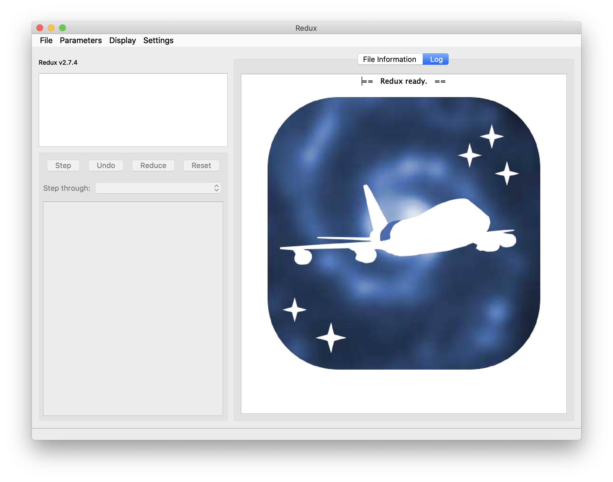
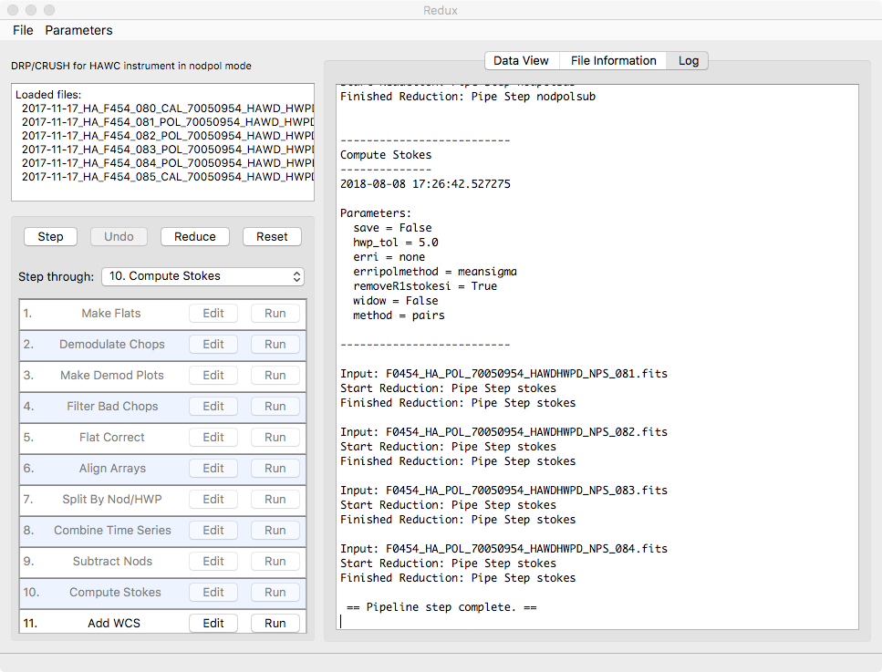
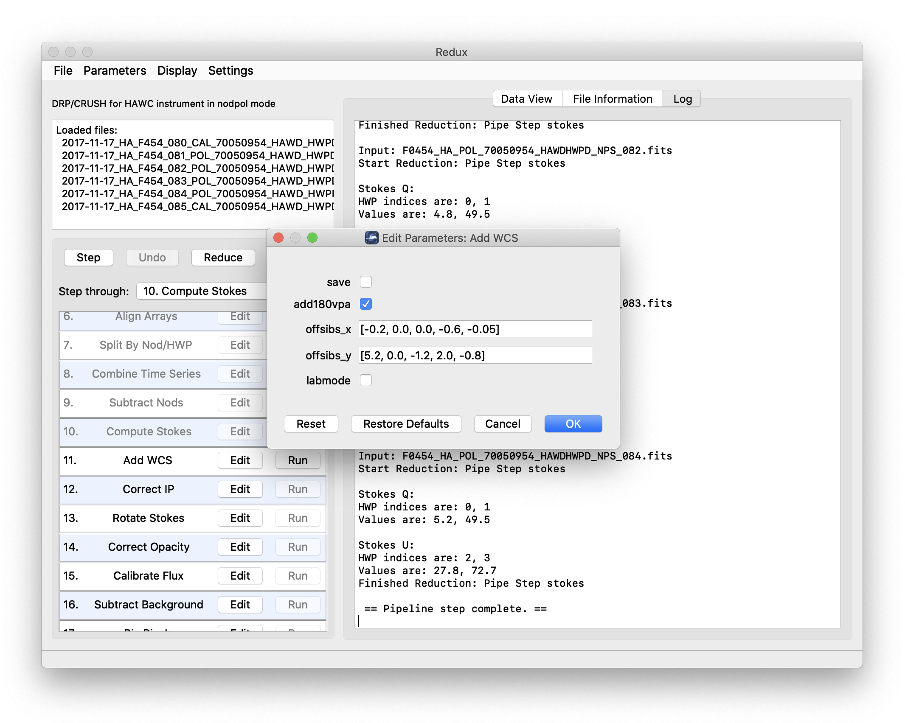
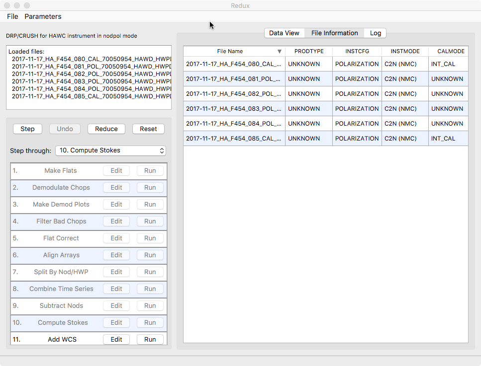

Grouping Level 0 Data for Processing
====================================

In order for the pipeline to successfully reduce a group of HAWC+ data
together, all input data must share a common instrument configuration
and observation mode, as well as target and filter band and HWP setting.
These requirements translate into a set of FITS header keywords that
must match in order for a set of data to be grouped together. These
keyword requirements are summarized in the table below, for imaging and
polarimetry data.

.. _grouping:
.. table:: Grouping Criteria for Imaging and Polarimetry Modes

   +----------------+------------+-------------+-------------------+
   | Mode           | Keyword    | Data Type   | Match Criterion   |
   +================+============+=============+===================+
   | All            | OBSTYPE    | string      | exact             |
   +----------------+------------+-------------+-------------------+
   | All            | FILEGPID   | string      | exact             |
   +----------------+------------+-------------+-------------------+
   | All            | INSTCFG    | string      | exact             |
   +----------------+------------+-------------+-------------------+
   | All            | INSTMODE   | string      | exact             |
   +----------------+------------+-------------+-------------------+
   | All            | SPECTEL1   | string      | exact             |
   +----------------+------------+-------------+-------------------+
   | All            | SPECTEL2   | string      | exact             |
   +----------------+------------+-------------+-------------------+
   | All            | PLANID     | string      | exact             |
   +----------------+------------+-------------+-------------------+
   | All            | NHWP       | float       | exact             |
   +----------------+------------+-------------+-------------------+
   | Imaging only   | SCNPATT    | string      | exact             |
   +----------------+------------+-------------+-------------------+
   | Imaging only   | CALMODE    | string      | exact             |
   +----------------+------------+-------------+-------------------+

Configuration and Execution
===========================

Installation
------------

The HAWC pipeline is written entirely in Python.  The pipeline is
platform independent and has been tested on Linux, Mac OS X, and Windows
operating systems.  Running the pipeline requires a minimum of 16GB RAM,
or equivalent-sized swap file.

The pipeline is comprised of six modules within the `sofia_redux` package:
`sofia_redux.instruments.hawc`, `sofia_redux.pipeline`,
`sofia_redux.calibration`, `sofia_redux.scan`, `sofia_redux.toolkit`, and
`sofia_redux.visualization`.
The `hawc` module provides the data processing
algorithms specific to HAWC, with supporting libraries from the
`calibration`, `scan`, `toolkit`, and `visualization`
modules.  The `pipeline` module provides interactive and batch interfaces
to the pipeline algorithms.

External Requirements
~~~~~~~~~~~~~~~~~~~~~

To run the pipeline for any mode from the Redux interface, Python 3.8 or
higher is required, as well as the following packages: astropy, astroquery,
bottleneck, configobj, cycler, dill, joblib, matplotlib, numba, numpy, pandas,
photutils, scikit-learn, and scipy.

Some display functions for the graphical user interface (GUI) additionally
require the PyQt5, pyds9, and regions packages. All required
external packages are available to install via the pip or conda package
managers.  See the Anaconda environment file
(*environment.yml*), or the pip requirements file (*requirements.txt*)
distributed with `sofia_redux` for up-to-date version requirements.

Running the pipeline's interactive display tools also requires an installation
of SAO DS9 for FITS image display. See http://ds9.si.edu/ for download
and installation instructions.  The *ds9* executable
must be available in the PATH environment variable for the pyds9
interface to be able to find and control it. Please note that pyds9
is not available on the Windows platform.

Source Code Installation
~~~~~~~~~~~~~~~~~~~~~~~~

The source code for the HAWC pipeline maintained by the SOFIA Data
Processing Systems (DPS) team can be obtained directly from the
DPS, or from the external `GitHub repository <https://github.com/SOFIA-USRA/sofia_redux>`__.
This repository contains all needed configuration
files, auxiliary files, and Python code to run the pipeline on HAWC
data in any observation mode.

After obtaining the source code, install the pipeline with
the command::

    python setup.py install

from the top-level directory.

Alternately, a development installation may be performed from inside the
directory with the command::

    pip install -e .

After installation, the top-level pipeline interface commands should
be available in the PATH.  Typing::

    redux

from the command line should launch the GUI interface, and::

    redux_pipe -h

should display a brief help message for the command line interface.

Configuration
-------------

The DRP pipeline requires a valid and complete configuration file to
run. Configuration files are written in plain text, in the INI format
readable by the configobj Python library. These files are divided into
sections, specified by brackets (e.g. [section]), each of which may
contain keyword-value pairs or subsections (e.g. [[subsection]]). The
HAWC configuration file must contain the following sections:

-  Data configuration, including specifications for input and output
   file names and formats, and specifications for metadata handling

-  Pipeline mode definitions for each supported instrument mode,
   including the FITS keywords that define the mode and the list of
   steps to run

-  Pipeline step parameter definitions (one section for each pipeline
   step defined)

The pipeline is usually run with a default configuration file
(*sofia_redux/instruments/hawc/data/config/pipeconf.cfg*),
which defines all standard
reduction steps and default parameters. It may be overridden with
date-specific default values, defined in
(*sofia_redux/instruments/hawc/data/config/date\_overrides/*), or with
user-defined parameters. Override configuration files may contain any
subset of the values in the full configuration file. See :ref:`config_appendix`
for examples of override configuration files as well as the full default
file.

The scan map reconstruction algorithm, run as a single pipeline step for
Scan and Scan-Pol mode data, also has its own separate set of configuration
files. These files are stored in the scan module, in
*sofia_redux/scan/data/configurations*. They are read from this sub-directory
in the order specified below.

Upon launch, scan map step will invoke the default configuration files
(*default.cfg*) in the following order:

#. Global defaults from *sofia_redux/scan/data/config/default.cfg*

#. Instrument overrides from *sofia_redux/scan/data/config/hawc_plus/default.cfg*

Any configuration file may invoke further (nested) configurations, which
are located and loaded in the same order as above. For example,
*hawc_plus/default.cfg* invokes *sofia/default.cfg* first,
which contains settings for SOFIA instruments not specific to HAWC.

There are also modified configurations for "faint", "deep", or "extended"
sources, when one of these flags is set while running the scan map step. For
example, the faint mode reduction parses *faint.cfg* from the above
locations, after *default.cfg* was parsed. Similarly, there are
*extended.cfg* and *deep.cfg* files specifying modified configurations for
extended and deep modes, and a *scanpol.cfg* file specifying configurations
specifically for Scan-Pol mode.

See :ref:`config_appendix` for a full listing of the default configuration
for the scan map algorithm.

Input Data
----------

The HAWC pipeline takes as input raw HAWC data files, which contain
binary tables of instrument readouts and metadata. The FITS headers
contain data acquisition and observation parameters and, combined with
the pipeline configuration files and other auxiliary files on disk,
comprise the information necessary to complete all steps of the data
reduction process. Some critical keywords are required to be present in
the raw data in order to perform a successful grouping, reduction, and
ingestion into the SOFIA archive. These are defined in the DRP pipeline
in a configuration file that describes the allowed values for each
keyword, in INI format (see :ref:`kwd_appendix`).

It is assumed that the input data have been successfully grouped before
beginning reduction. The pipeline considers all input files in a
reduction to be science files that are part of a single homogeneous
reduction group, to be reduced together with the same parameters. The
sole exception is that internal calibrator files (CALMODE=INT\_CAL) may
be loaded with their corresponding Chop-Nod or Nod-Pol science files.
They will be reduced separately first, in order to produce flat fields
used in the science reduction.

Auxiliary Files
~~~~~~~~~~~~~~~

In order to complete a standard reduction, the pipeline requires a
number of files to be on disk, with locations specified in the DRP
configuration file. Current default files described in the default
configuration are stored along with the code, typically in the
*sofia_redux/instruments/hawc/data* directory. See below for a table of
all commonly used types of auxiliary files.

.. _auxfiles:
.. table:: Auxiliary files used by DRP reductions for Chop-Nod and Nod-Pol data

   +-------------------+-------------+-----------------------------+-------------------------------------------------------------------------------+
   | Auxiliary File    | File Type   | Pipe Step                   | Comments                                                                      |
   +===================+=============+=============================+===============================================================================+
   | Jump Map          | FITS        | Flux Jump                   | Contains jump correction values per pixel                                     |
   +-------------------+-------------+-----------------------------+-------------------------------------------------------------------------------+
   | Phase             | FITS        | Demodulate                  | Contains phase delay in seconds for each pixel                                |
   +-------------------+-------------+-----------------------------+-------------------------------------------------------------------------------+
   | Reference Phase   | FITS        | Demod. Plots                | Contains reference phase angles for comparison with the current observation   |
   +-------------------+-------------+-----------------------------+-------------------------------------------------------------------------------+
   | Sky Cal           | FITS        | Make Flat                   | Contains a master sky flat for use in generating flats from INT\_CALs         |
   +-------------------+-------------+-----------------------------+-------------------------------------------------------------------------------+
   | Flat              | FITS        | Flat Correct                | Contains a back-up flat field, used if INT\_CAL files are not available       |
   +-------------------+-------------+-----------------------------+-------------------------------------------------------------------------------+
   | IP                | FITS        | Instrumental Polarization   | Contains q and u correction factors by pixel and band                         |
   +-------------------+-------------+-----------------------------+-------------------------------------------------------------------------------+

The jump map is used in a preparatory step before the pipeline begins
processing to correct raw values for a residual electronic effect that
results in discontinuous jumps in flux values. It is a FITS image that
matches the dimensions of the raw flux values (128 x 41 pixels). Pixels
for which flux jump corrections may be required have integer values
greater than zero. Pixels for which there are no corrections necessary
are zero-valued.

The phase files used in the Demodulate step should be in FITS format,
with two HDUs containing phase information for the R and T arrays,
respectively. The phases are stored as images that specify the timing
delay, in seconds, for each pixel. The reference phase file used in the
Demod Plots step is used for diagnostic purposes only: it specifies a
baseline set of phase angle values, for use in judging the quality of
internal calibrator files.

Normally, the pipeline generates the flat fields used in the Flat
Correct step from internal calibrator (INT\_CAL) files taken alongside
the data. To do so, the Make Flats step uses a Sky Cal reference file,
which has four image extensions: R Array Gain, T Array Gain, R Bad Pixel
Mask, and T Bad Pixel Mask. The image in each extension should match the
dimensions of the R and T arrays in the demodulated data (64 x 41
pixels). The Gain images should contain multiplicative floating-point
flat correction factors. The Bad Pixel Mask images should be integer
arrays, with value 0 (good), 1 (bad in R array), or 2 (bad in T array).
Bad pixels, corresponding to those marked 1 or 2 in the mask extensions,
should be set to NaN in the flat images. At a minimum, the primary FITS
header for the flat file should contain the SPECTEL1 and SPECTEL2
keywords, for matching the flat filter to the input demodulated files.

When INT\_CAL files are not available, the Flat Correct step may use a
back-up flat file. This file should have the same format as the Sky Cal
file, but the R Array Gain and T Array Gain values should be suitable
for direct multiplication with the flux values in the Flat Correct step.
There should be one back-up flat file available for each filter
passband.

In addition to these files, stored with the DRP code, the pipeline
requires several additional auxiliary files to perform flux calibration.
These are tracked in the *pipecal* package, used to support SOFIA
flux calibration for several instruments, including HAWC.  The required
files include response coefficient tables, used to correct for
atmospheric opacity, and reference calibration factor tables, used
to calibrate to physical units.

The instrumental response coefficients are stored in ASCII text files,
with at least four white-space delimited columns as follows: filter
wavelength, filter name, response reference value, and fit coefficient
constant term. Any remaining columns are further polynomial terms in the
response fit. The independent variable in the polynomial fit is
indicated by the response filename: if it contains *airmass*, the
independent variable is zenith angle (ZA); if *alt*, the independent
variable is altitude in thousands of feet; if *pwv*, the independent
variable is precipitable water vapor, in :math:`\mu m`. The reference
values for altitude, ZA, and PWV are listed in the headers of the text
files, in comment lines preceded with *#*.

Calibration factors are also stored in ASCII format, and list the
correction factor by mode and HAWC filter band, to be applied to
opacity-corrected data.

Some additional auxiliary files are used in reductions of flux
standards, to assist in deriving the flux calibration factors applied
to science observations.  These include filter definition tables
and standard flux tables, by date and source.

.. table:: Auxiliary files used for calibration (all modes)

   +--------------------+-------------+-----------------------------+-------------------------------------------------------------------+
   | Auxiliary File     | File Type   | Pipe Step                   | Comments                                                          |
   +====================+=============+=============================+===================================================================+
   | Response           | ASCII       | Opacity Correct             | Contains instrumental response coefficients by altitude, ZA       |
   +--------------------+-------------+-----------------------------+-------------------------------------------------------------------+
   | Calibration Factor | ASCII       | Calibrate                   | Contains reference calibration factors by filter band, mode       |
   +--------------------+-------------+-----------------------------+-------------------------------------------------------------------+
   | Filter definition  | ASCII       | Standard Photometry         | Contains filter wavelength band and standard aperture definitions |
   +--------------------+-------------+-----------------------------+-------------------------------------------------------------------+
   | Standard flux      | ASCII       | Standard Photometry         | Contains reference flux values for a known source, by filter band |
   +--------------------+-------------+-----------------------------+-------------------------------------------------------------------+

.. redux usage section

.. |ref_startup| replace:: :numref:`hawc_startup`

.. |ref_open_new| replace:: :numref:`hawc_open_new`

.. |ref_reduction_steps| replace:: :numref:`hawc_reduction_steps`

.. |ref_parameters| replace:: :numref:`hawc_parameters`

.. |ref_file_info| replace:: :numref:`hawc_file_info`

.. |ref_data_view| replace:: :numref:`hawc_data_view`

.. |ref_headers| replace:: :numref:`hawc_headers`

.. include:: ../../../sofia_redux/pipeline/usage/startup.rst

         telescope door on a blue background showing faint spiral arms
         and stylized stars.

   Redux GUI startup.

.. include:: ../../../sofia_redux/pipeline/usage/open.rst

.. figure:: images/open_new.png
   :name: hawc_open_new
   :alt: File system dialog window showing selected filenames.

   Open new reduction.

         A log window is displayed with text messages from a reduction.

   Sample reduction steps. Log output from the pipeline is
   displayed in the **Log** tab.

.. include:: ../../../sofia_redux/pipeline/usage/params.rst

         widgets.

   Sample parameter editor for a pipeline step.

.. include:: ../../../sofia_redux/pipeline/usage/info.rst

   File information table.

.. include:: ../../../sofia_redux/pipeline/usage/view.rst

.. figure:: images/data_view.png
   :name: hawc_data_view
   :alt: Data viewer settings with various widgets and buttons to control
         display parameters and analysis tools.

   Data viewer settings and tools.

.. include:: ../../../sofia_redux/pipeline/usage/headers.rst

.. figure:: images/headers.png
   :name: hawc_headers
   :alt: A dialog window showing a sample FITS header in plain text.

   QAD FITS header viewer.

Important Parameters
--------------------

Below are some useful parameters for HAWC reductions.
Parameters for most pipeline steps may be set directly as key/value
pairs in pipeline configuration files; most scan map parameters are
added to the *options* parameter string in pipeline configuration files.  All
parameters listed are accessible and editable from the Redux GUI
interface as well.

The pipeline steps are as named in
the configuration file, in the order they are typically run. Not all steps
are run for all modes.  Note that this list is
not exhaustive; see the HAWC+ DRP Developer's Manual or the code itself
for more information.

-  **checkhead**

   -  *abort*: Set to False to allow the pipeline to attempt to continue
      reduction despite incorrect header keywords. Default is True.

-  **demodulate**

   -  *phasefile*: Set to a FITS file for per-pixel phase shifts, or to
      a floating point number to apply the same phase shift to all
      pixels (in seconds of delay). Default is typically a file in
      *hawc/pipeline/data/phasefiles*.

   -  *phaseoffset*: Set to a floating point number to apply an offset
      to the specified phase file.  The value should be specified in
      degrees: it is usually determined from the median offset reported
      by the demodulation plots for the INT_CAL files. Default is 0.0.

   -  *track\_tol*: If non-negative, the pipeline step will use this
      number as the tracking tolerance in arcseconds. Samples with
      tracking deviation larger than this number will be rejected. If
      set to 'beam', the beam size for the filter band will be used. If
      set to 'centroidexp', the CentroidExpMsec data stream will be used
      to flag data, rather than the TrackErrAoi3/4 data stream. Set to
      -1 to turn off tracking rejection entirely. Default is
      centroidexp.

   -  *data\_sigma*: Sigma threshold for clipping data means; used in
      calculating variance. Default is 5.0.

-  **flat**

   -  *flatfile*: Set to a file glob to identify flats to use in
      processing. Default is "flats/\*OFT\*.fits".

   -  *flatfitkeys*: Header keywords to match between data and flat
      fields. Default is "\`SPECTEL1', 'MISSN-ID', 'FILEGPID',
      'SCRIPTID'".

   -  *bkupflat*: File glob specifying back-up flats in case *flatfile*
      does not exist. Default is
      "$DPS\_HAWCPIPE/pipeline/data/flats/\*OFT.fits".

-  **split**

   -  *rtarrays*: Set to 'RT' to use both R and T arrays, 'R' for R
      only, or 'T' for T only. Default is 'RT'.

   -  *nod\_tol*: Percent difference between the number of chop cycles
      in each nod position that will be tolerated for continuing the
      reduction. Set higher to reject fewer data files. Default is 50.0.

-  **combine**

   -  *sigma*: Reject outliers more than this many sigma from the mean.
      Default is 3.0.

   -  *sum\_sigma*: Reject additional outliers in R+T more than this
      many sigma from the mean. Default is 4.0.

-  **scanmap**

   -  *use_frames*: Frames (time samples) to use from the reduction. Specify
      a particular range, as '400:-400' or '400:1000'

   -  *grid*: If set, the output pixel size will be modified from the default
      value to the specified value, in arcsec. The output flux scale will also
      be modified accordingly, for flux conservation.

   -  *deep*: If set, faint point-like emission is prioritized.

   -  *faint*: If set, faint emission (point-like or extended) is prioritized.

   -  *extended*: If set, extended emission is prioritized. This may increase
      noise on large angular scales.

   -  *options*: Additional options to pass to the scan map algorithm.  Options
      should be specified by key=value pairs, separated by spaces.  For example,
      'rounds=10 sigmaclip=True'.  See :ref:`scanmap_glossary` for
      a full list of available options.

-  **scanmappol**

   -  *save_intermediate*: If set, individual output files from the scan
      map algorithm are saved in separate files.  This is primarily
      for diagnostic use.

   -  *vpa_tol*: If differences between telescope angles (VPA) within
      a scanpol group are more than this value, this step will issue a warning.

   -  *use_frames*: Frames (time samples) to use from the reduction. Specify
      a particular range, as '400:-400' or '400:1000'

   -  *grid*: If set, the output pixel size will be modified from the default
      value to the specified value, in arcsec. The output flux scale will also
      be modified accordingly, for flux conservation.

   -  *deep*: If set, faint point-like emission is prioritized.

   -  *faint*: If set, faint emission (point-like or extended) is prioritized.

   -  *extended*: If set, extended emission is prioritized. This may increase
      noise on large angular scales.

   -  *options*: Additional options to pass to the scan map algorithm.  Options
      should be specified by key=value pairs, separated by spaces.  For example,
      'rounds=10 sigmaclip=True'.  See :ref:`scanmap_glossary` for
      a full list of available options.

-  **stokes**

   -  *erri*: Method for inflating errors in I from standard deviation
      across HWP angles. Can be median, mean, or none. Default is none.

   -  *removeR1stokesi*: Set to False to keep the R1 array in the Stokes
      I image. Default is True.

-  **scanstokes**

   -  *zero\_level\_method*: Statistic for zero-level calculation
      ('mean', 'median', or 'none').
      If 'none', the zero-level will not be corrected.  For the other
      options, either a mean or median statistic will be used to
      determine the zero-level value from the region set by the
      region and radius parameters.

   -  *zero\_level\_region*: If set to 'header', the zero-level region
      will be determined from the ZERO_RA, ZERO_DEC, ZERO_RAD keywords
      (for RA center, Dec center, and radius, respectively).
      If set to 'auto', a mean- or median-filter will be
      applied to the R and T images, with the radius specified by the
      zero\_level\_radius parameter.  The lowest negative local
      average that is negative in both R and T for all HWP angles
      is assumed to be the zero level.  R and T values are applied
      separately, from the value of the average at the same pixel.
      Otherwise, a region may be directly provided as a list of
      [RA center, Dec center, radius], in degrees.

   -  *zero\_level\_radius* : Filter radius for zero-level calculation,
      in arcseconds (per band).  Used only for zero\_level\_region = 'auto'.

   -  *zero\_level\_sigma* : Sigma value for statistics clipping.  Ignored for
      zero\_level\_region = 'auto'.

-  **wcs**

   -  *offsibs\_x*: Offset in pixels along X between SIBS\_X and actual
      target position on array. Should be a comma-separated list of 5
      numbers, one for each band; for example, '-0.9, 0.0, 1.1, 0.0,
      1.1'. Default may vary over time.

   -  *offsibs\_y*: Offset in pixels along Y between SIBS\_Y and actual
      target position on array, as for *offsibs\_x*. Default may vary
      over time.

-  **ip**

   -  *qinst*: Fractional instrumental polarization in q. Should be a
      comma-separated list of 5 numbers, one for each band; for example,
      '-0.01191, 0.0, -0.01787, -0.00055, -0.01057'. Default may vary
      over time.

   -  *uinst*: Fractional instrumental polarization in u, as for
      *qinst*.

   -  *fileip*: FITS file specifying IP corrections for each pixel and
      band. If set to 'uniform', the step will use the *qinst* and
      *uinst* values; otherwise, these values are ignored if fileip is
      specified.

-  **rotate**

   -  *gridangle*: Detector angle offset, in degrees. Should be a
      comma-separated list of 5 numbers, one for each band; for example,
      '-89.69, 0.0, -104.28, 37.42, 119.62'. Default may vary over time.

-  **bgsubtract**

   -  *bgslope*: Number of iterations to run with slope term. If zero,
      slope will not be fit (i.e. residual gains will not be corrected).
      Default is 0.

   -  *bgoffset*: Number of iterations to run with offset term. If zero,
      offset will not be fit (i.e. residual background will not be
      removed). Default is 10.

   -  *qubgsubtract*: Set to True to calculate and remove offsets in Q
      and U maps, in addition to Stokes I. Default is True; must be set
      to False for Chop-Nod data.

-  **binpixels**

   -  *block_size*: Bin size, in pixels.  The value provided must divide
      the 64x40 array evenly into square blocks.  Values 2, 4, or 8 will
      work. If set to 1, no binning will be performed. Default value
      is 1.

-  **merge**

   -  *cdelt*: Pixel size in arcseconds of output map, one number per
      band. Decrease to sub-sample the input pixels more. Default is
      '1.21, 1.95, 1.95, 3.40, 4.55', half the detector pixel scale
      (beam size / 4).

   -  *fwhm*: FWHM in arcseconds of Gaussian smoothing kernel, by band.
      Make larger for more smoothing. Default is '4.84, 7.80, 7.80,
      13.6, 18.2', for beam-size smoothing.

   -  *radius*: Integration radius for input pixels, by band. Set larger
      to consider more pixels when calculating output map. Default is
      '9.68, 15.6, 15.6, 27.2, 36.4' (beam-size * 2).

   -  *fit_order*: Polynomial fit order for local regression. Default is 2.

   -  *errflag*: Set to True to use error image for weighting. Default
      is True.

   -  *edge_threshold*: Threshold to set edge pixels to NaN.
      Range is 0-1; 0 means keep all edge pixels. Higher values keep fewer
      pixels.

   -  *adaptive_algorithm*: If 'shaped' or 'scaled', adaptive smoothing
      will be used, varying the kernel size according to the data. If 'shaped',
      the kernel shape and rotation angle may also vary.  Set to 'none' to
      turn off adaptive smoothing.

   -  *fit_threshold*: Deviation from weighted mean to allow for higher order
      fit. Set to 0 to turn off.  Positive values replace bad
      values with the mean value in the window; negative values
      replace bad values with NaN.

   -  *bin_cdelt*: If set, and data was previously binned via the binpixels
      step, then the input cdelt and radius will be multiplied by the binning
      factor. If not set, the provided cdelt will be used directly. This
      allows useful default behavior for binned data, but still
      allows for tunable output pixel sizes.

-  **region**

   -  *skip*: Set to a number :math:`i` to keep vectors every
      :math:`i`\ th pixel. Default is 2 (as appropriate for
      cdelt=beamsize/4 in merge step).

   -  *mini*: Do not keep vectors from pixels with Stokes I flux less
      than this fraction of peak flux. Default is 0.0.

   -  *minisigi*: Do not keep vectors from pixels with Stokes I flux
      less than this many sigma. Default is 200.

   -  *minp*: Do not keep vectors with percent polarization less than
      this value. Default is 0%.

   -  *maxp*: Do not keep vectors with percent polarization greater than
      this value. Default is 50%.

   -  *sigma*: Do not keep vectors with :math:`p / \sigma_p` less than
      this value. Default is 3.0.

   -  *length*: Scale factor for polarization vectors in DS9 region
      file, in pixels. Default is 10 (i.e. a 10% polarization vector is
      the length of one pixel).

   -  *rotate*: Plot rotated (B field) vectors in DS9 region file.
      Default is True.

   -  *debias*: Plot debiased vectors in DS9 region file. Default is
      True.

-  **polmap**

   -  *maphdu*: Extension to use for the plot. Default is 'STOKES I'.

   -  *lowhighscale*: [low, high] percentile values to use for image
      scaling.  Default is 0.25,99.75.

   -  *scalevec*: Scale factor for polarization vectors in polmap image.
      Default is 0.0003.

   -  *scale*: If True, plotted vectors are scaled by their magnitude.
      If False, all vectors are plotted at the same length.  Default is
      True.

   -  *rotate*: Plot rotated (B field) vectors in polmap image. Default
      is True.

   -  *debias*: Use debiased polarizations for plotting.  Default is True.

   -  *colorvec*: Color to use for vectors in polmap image. Default is
      'black'.

   -  *colormap*: Color map to use in polmap image. Default is
      'plasma'.  Any valid Matplotlib color map name may be specified.

   -  *ncontours*: Number of contour levels.  Set to 0 to turn off contours.
      Default is 30.

   -  *colorcontour*: Color to use for contour lines in polmap image.
      Default is 'gray'.

   -  *fillcontours*: If True, contours are filled. Default is True.

   -  *grid*: If True, a coordinate grid is overlaid.  Default is True.

   -  *title*: Title for the plot.  If set to 'info', the title is
      auto-generated from the FITS file information.  Any other string
      will be used directly as the title.  Default is 'info'.

   -  *centercrop*: If True, the plot is cropped to the dimensions specified
      in the *centercropparams*.  Default is False.

   -  *centercropparams*: Specifies the crop region if *centercrop* = True.
      Should be specified as [RA, Dec, width, height] in decimal degrees.

   -  *watermark*: If set to a non-empty string, the text will be
      added to the lower-right of the image as a semi-transparent watermark.

-  **imgmap**

   -  *maphdu*: Extension to use for the plot. Default is 'STOKES I'.

   -  *lowhighscale*: [low, high] percentile values to use for image
      scaling.  Default is 0.25,99.75.

   -  *colormap*: Color map to use in polmap image. Default is
      'plasma'.  Any valid Matplotlib color map name may be specified.

   -  *ncontours*: Number of contour levels.  Set to 0 to turn off contours.
      Default is 0.

   -  *colorcontour*: Color to use for contour lines in polmap image.
      Default is 'gray'.

   -  *fillcontours*: If True, contours are filled. Default is True.

   -  *grid*: If True, a coordinate grid is overlaid.  Default is False.

   -  *title*: Title for the plot.  If set to 'info', the title is
      auto-generated from the FITS file information.  Any other string
      will be used directly as the title.  Default is 'info'.

   -  *centercrop*: If True, the plot is cropped to the dimensions specified
      in the *centercropparams*.  Default is False.

   -  *centercropparams*: Specifies the crop region if *centercrop* = True.
      Should be specified as [RA, Dec, width, height] in decimal degrees.

   -  *watermark*: If set to a non-empty string, the text will be
      added to the lower-right of the image as a semi-transparent watermark.

Data Quality Assessment
=======================

After the pipeline has been run on a set of input data, the output
products should be checked to ensure that the data has been properly
reduced. Data quality and quirks can vary widely across individual
observations, but the following general guideline gives some strategies
for approaching quality assessment for HAWC+ data.

For any mode:

-  Check the instrument scientist's log for any data that is known to be
   of poor or questionable quality.

-  Check the output to the log file (usually called
   *redux\_[date]\_[time].log*), written to the same directory as the
   output files. Look for messages marked ERROR or WARNING. The log will
   also list every parameter used in DRP steps, which may help
   disambiguate the parameters as actually-run for the pipeline.

-  Check that the expected files were written to disk. There should be,
   at a minimum, a DMD, WCS, CAL, and PMP file for Nod-Pol data, and a
   CRH and CAL file for Scan data.

For Nod-Pol or Scan-Pol mode:

-  Display all CAL files together. Verify that no one file looks
   unreasonably noisy compared to the others, and that any visible
   sources appear in the same locations, according to the world
   coordinate system in each file's header. Particular CAL files may
   need to be excluded, and the last steps of the pipeline re-run.

-  Check the CAL files for persistent bad pixels or detector features.
   If present, the flat field or bad pixel mask may need updating.

-  Display the final PMP file. Verify that the mapping completed
   accurately, with no unexpected or unusual artifacts. The weighting
   flags may need modification, or the smoothing may need to be
   increased.

-  Overlay the DS9 polarization vector file (*\*.reg*) on the PMP file.
   Check for unusually noisy vector maps (e.g. long vectors near the
   edges).

-  For observations of flux standards, compare the total flux in the
   source, via aperture photometry, to a known model. Flux calibration
   should be within 20%; if it is not, the calibration factors may need
   to be adjusted, or some off-nominal data may need to be excluded from
   the reduction.

-  For observations of polarimetric standards, verify that the total
   polarization (Q/I and U/I) is less than 0.6% in regions that should
   have zero total polarization. If it is not, the instrumental
   polarization parameters may need adjusting.

-  Check that sources appear at the expected coordinates. If they do
   not, the boresight offsets used by the pipeline may need to be
   adjusted.

-  Check the FHWM and PSF shape of the source. If it is larger than
   expected, or not round, there may have been a problem with telescope
   guiding or chopping/nodding.

-  If there are output products from the chi2 pipeline, review them for
   discrepancies between sets of dithers, or excessive noise or
   artifacts.

For Scan or Scan-Pol mode:

-  Check the log for warnings about scans that may have been excluded
   from reduction or are of poor quality.

-  Display the final CRH image. Check that no unusual artifacts appear
   (e.g. holes or "worms" caused by bad pixels that were not properly
   excluded from the scans). Try reducing the data with the *-fixjumps*
   option to see if these artifacts improve.

-  Check that the map is not unusually large and does not include
   patches disconnected from the main image. These may be signs of poor
   tracking during the observation or missing metadata in the input FITS
   tables. Try reducing each scan individually to see if a bad scan may
   be identified and excluded.

-  For observations of flux standards, compare the total flux in the
   source, via aperture photometry, to a known model. Flux calibration
   should be within 20%; if it is not, the calibration factors or the
   opacity correction may need to be adjusted.

-  Check the FHWM and PSF shape of the source. If it is larger than
   expected, or not round, there may have been a problem with telescope
   guiding or focus.

-  Check that the source is at the expected coordinates. If not, the
   boresight offsets may need to be adjusted. Check the SIBSDX and
   SIBSDY keywords in the header.

-  If the target is not visible in the default reduction, try reducing
   the data with the *faint* option.  Note: this option should be used
   for scan mode only; it should not be used for Scan-Pol observations.

-  If the target has extended diffuse emission, it may be beneficial to
   try reducing the data with the *extended* option. If applied to
   Scan-Pol observations, compare the polarization maps from the regular
   pipeline and the output from the extended parameter. Check for
   inconsistent vectors in the polarization map. If not sure of the output,
   contact the lead Instrument Scientist for feedback.

.. _scanmap_glossary:

Appendix: Scan Map Option Glossary
==================================

.. include:: include/glossary.rst

.. _config_appendix:

Appendix: Sample Configuration Files
====================================

Full DRP Configuration File
---------------------------

Below is a copy of the full configuration file used by the pipeline in
the DPS environment (*pipeconf.cfg*). It is in INI format, and is readable
by the configobj Python module.

.. include:: include/pipeconf.cfg
   :literal:

DRP Override Configuration File
-------------------------------

Below is a sample override configuration file that demonstrates how to set
override parameters to provide to the HAWC pipeline. The parameters
listed here are those most likely to change from one flight series to
another.

.. include:: include/pipeconf_oc8e.cfg
   :literal:

Full Scan Map Configuration File
--------------------------------

Below is a copy of the default global configuration file for the scan
map algorithm. Other configuration files specifying values for specific
instruments or modes may override values in this file.

.. include:: include/default.cfg
   :literal:

HAWC+ Scan Map Configuration File
---------------------------------

Below is the HAWC+ configuration file for the scan map algorithm. Values in
this file override those in the global configuration file for HAWC reductions.

.. include:: include/hawc_default.cfg
   :literal:

.. _kwd_appendix:

Appendix: Required Header Keywords
==================================

The file below defines all keywords that the HAWC pipeline checks for
validity before proceeding. It is normally located in the hawc
distribution at *hawc/pipeline/config/header\_req\_config.cfg*. The path
to this file should be specified in the pipeline configuration file
under the '[checkhead]' section in order to perform the header check.

.. include:: include/header_req_config.cfg
   :literal:
