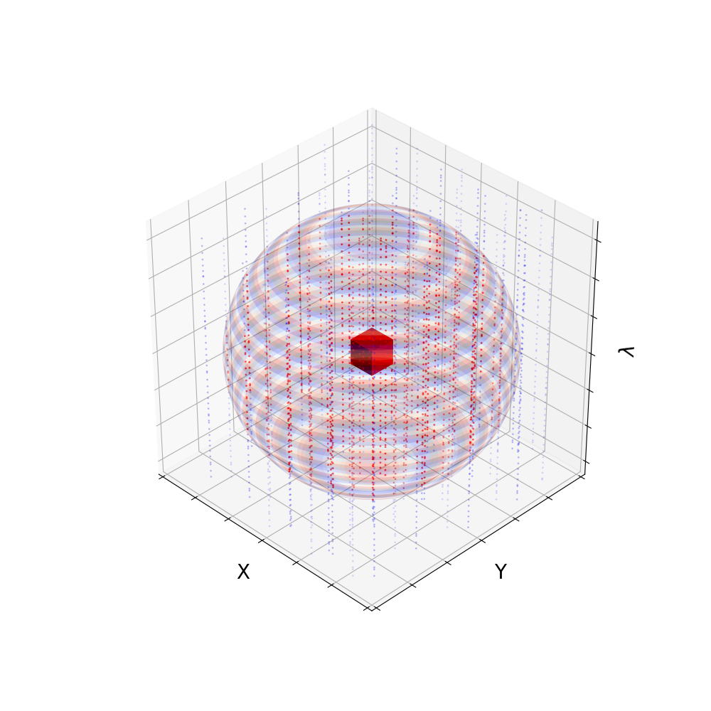

.. currentmodule:: sofia_redux.toolkit.resampling

.. _resample_parameters:

Parameters
==========

Domain Window
-------------
The `window` parameter (:math:`\omega`) is used to define the region about each
point from which samples are taken to generate a local polynomial fit.  In
1-dimension this is simply a distance, an ellipse is used for 2-dimensions, an
ellipsoid for 3-dimensions, and a hyperellipsoid for dimensions greater than 3.

If a single value is given, it will be applied to each dimension.  For example,
setting `window=1.5` for 2-dimensional data will generate a fit at a point from
all samples within a circular region of radius 1.5, centered on that point.
The alternative is to supply an array of values where each element defines the
principle semi-axis of the ellipsoid.  For example, setting
`window` :math:`=(\omega_{1}, \omega_{2})` for 2-dimensional data where
:math:`\omega > 0` requires that all samples used to fit point
:math:`(x_0, y_0)` have coordinates :math:`(x, y)` such that

    .. math::
        \frac {(x - x_0)^2}{\omega_{1}^2} +
        \frac {(y - y_0)^2}{\omega_{2}^2} \leq 1

In general, for :math:`ndim`-dimensional data, sample :math:`i` at coordinate
:math:`x` is considered inside the window region of a resampling point
:math:`j` at coordinate :math:`v` if:

    .. math::
        \sum_{m=1}^{ndim}{
            \left( \frac{x_{m, i} - v_{m, j}}{\omega_{m}} \right)^2
        } \leq 1

Coordinates are stored internally in the resampler in units of :math:`\omega`.
Therefore, there is no need to scale coordinates a priori.  However,
:math:`\omega` should be supplied in the units of each coordinate dimension.

   An elipsoid window centered around a point (red voxel).  Samples enclosed
   within the window are used to derive a local polynomial fit (red dots).  All
   other samples are excluded (blue dots).

If `window` is not provided, the default is to use the average spacing of the
input coordinates scaled such that on average, there should be sufficient
samples to derive a polynomial fit of the desired `order`.

Order
-----
`order` is used to set the polynomial fit order.  Either a single `order` value
may be applied over all dimensions, or an array may be provided specifying the
fit order for each dimension.  Coefficients are calculated for terms as
defined by :func:`polynomial_exponents`.  A polynomial function in one
dimension has the form:

    .. math:: f(x) = c_{0} + c_{1}x + c_{2}x^{2} + ... + c_{order}x^n

where :math:`c` defines the polynomial coefficient for each term.  In
higher dimensions, the resampler uses a Taylor expansion of polynomial
coefficients for robustness.  For example, in two dimensions (x, y),
`order=(2, 3)` results in the following terms:

>>> from sofia_redux.toolkit.resampling import polynomial_exponents
>>> print(polynomial_exponents((2, 3)))
[[0 0]
 [1 0]
 [2 0]
 [0 1]
 [1 1]
 [2 1]
 [0 2]
 [1 2]
 [0 3]]

i.e.,

    .. math::
        f(x, y) = c_{0,0} + c_{1,0}x + c_{2,0}x^2 + c_{0,1}y +
        c_{1,1}xy + c_{2,1}x^2y + c_{0,2}y^2 + c_{1,2}xy^2 + c_{0,3}y^3

.. _order mode:

Order as a function of sample distribution
^^^^^^^^^^^^^^^^^^^^^^^^^^^^^^^^^^^^^^^^^^
The `fix_order` boolean switch (on, or `True` by default) is used to specify
whether the polynomial order is allowed to decrease such that the number of
available samples (:math:`n`) at each point obeys one of the following
conditions:

    1. `mode=`'counts':
           :math:`n >= (order + 1)^{ndim}`

           where :math:`ndim` is the number of dimensions.

           Checks order based on the total number of samples within the
           `window` region of a point.  This is the least robust mode as there
           may be multiple samples occupying the same coordinate leading to
           singlar values in the design matrix when solving for polynomial
           coefficients.

    2. `mode=`'extrapolate':
            .. math::
                :nowrap:

                \begin{eqnarray}
                &U(c_{dim}) = \{c_{(dim, i)}\}_{i \in \{1,...,m\} }
                \text{, where } c_{dim} = [c_{(dim,1)},...,c_{(dim,m)}] \\
                &|U(c_{dim})| \geq order + 1
                \end{eqnarray}

            is evaluated over each dimension (:math:`dim`) where
            :math:`U(c_{dim})` is the set of unique coordinate values for a
            single dimension within the `window` region of a point.

            Checks that for each dimension within the region, there are
            enough unique values to fit for each polynomial coefficient.  This
            is a fairly robust mode and also allows values to be extrapolated
            at points that are not bounded by samples.

    3. `mode=`'edges':
            .. math::
                &U^{-}(c_{dim}) = \{c_{(dim, i)} | c_{(dim, i)}
                                  < v_{dim}\}_{i \in \{1,...,m\} }\\
                &U^{+}(c_{dim}) = \{c_{(dim, i)} | c_{(dim, i)}
                                  > v_{dim}\}_{i \in \{1,...,m\} }\\
                &min{|U^{-}(c_{dim})|, |U^{+}(c_{dim})|} \geq order + 1

            is evaluated over each dimension (:math:`dim`) where
            :math:`c_{dim}` are the sample coordinates in a single dimension
            within the `window` of point coordinate :math:`v`.

            Checks that for each dimension within the region, there are
            sufficient unique sample coordinates either side of the resampling
            point.  This is the most robust mode and will disallow resampling
            at points that are not bounded by samples.

If for a certain point, the selected `mode` check fails and `fix_order` =
`True`, the resampled value at that point will be set to `cval` (defined during
:func:`Resample.__call__`).  If `fix_order` = `False`, the order
will decrease until the `mode` condition is met.  **NOTE**: `fix_order` =
`False` will only apply when `order` is the same for each dimension.

It is possible to run into issues with the `extrapolate` and `counts` modes
as there is no guarantee that a sample distribution is suitable for polynomial
fitting.  Encountering a singular matrix error would be an indication that the
scheme is unacceptable.

Edge clipping
-------------
Polynomial fits to points near the edges of the sample distribution may
sometimes be unrepresentative of the data, fitting values that are excessively
high or low.  The "edge" to a sample distribution is defined by the
`edge_algorithm` parameter, and the `edge_threshold` parameter sets the
threshold by which to measure whether a resampling point falls outside of this
boundary. Points outside of the sample distribution edge are set to `cval`.

    - 'com_distance' (default):
        Defines the edge in terms of deviation from the Center-Of-Mass of the
        samples within a window region.  Deviation from the edge
        (:math:`\theta_{j}`) for point :math:`j` from a sample distribution
        (:math:`x \text{, where } x=[x_1,...,x_N]`) within the window
        region centered about coordinate :math:`v_{j}` with semi-principle axes
        :math:`\omega` is defined as:

        .. math::
            \theta_{j} = \frac{1}{N} \left( \sum_{m=1}^{ndim}
                   \left( \sum_{i=1}^{N}
                   \frac{x_{i,m} - v_{j,m}}
                   {\omega_{m}(1 - \epsilon_{m})} \right)^2 \right)^{1/2}

        where, :math:`\epsilon` is the `edge_threshold` and will only be
        applied if :math:`0<\epsilon<1`.  The actual edge is at
        :math:`\theta=1`.  If :math:`\theta_{j} > 1`, it will be clipped and
        replaced with `cval` in the final fit.

    - 'com_feature':
        Defines an edge based on the Center-Of-Mass deviation of a point from
        the sample distribution for each feature (dimension) in turn.  A point
        will be clipped if:

        .. math::
           max \left\{ \theta_{m,j} \right\} > 1

        where,

        .. math::
           \theta_{m,j} = \left| \frac{1}{N} \sum_{i=1}^{N}{
           \frac{x_{i,m} - v_{m,j}} {\omega_{m}(1 - \epsilon_{m})}} \right|

    - 'range':
        A point will be defined as outside a sample distribution "edge" if for
        any dimension :math:`m`:

        .. math::
            min \left\{ |\theta_{m}^{+}| , |\theta_{m,j}^{-}| \right\} = 0

        where,

        .. math::
            \theta_{m}^{+} &= \left\{ i |
                \frac{x_{m,i} - v_{m,j}}{\omega_{m} \epsilon_{m}} > 1 \right\} \\
            \theta_{m}^{-} &= \left\{ i |
                \frac{x_{m,i} - v_{m,j}}{\omega_{m} \epsilon_{m}} < -1 \right\}

        and :math:`omega` is the `window` parameter, :math:`\epsilon` is the
        `edge_threshold`, :math:`x` are the sample coordinates and :math:`v_j`
        is the coordinate of point :math:`j`. i.e., at each resampling point,
        there must be at least one sample greater than the `edge_threshold`
        distance (in units of `window`) for each dimension in both the
        positive and negative directions.

See :ref:`edge_clipping_example` for a demonstration of order and edge
clipping.

Data Rejection
--------------
The `robust` and `negthresh` parameters used to identify data outliers prior to
fitting during :func:`Resample.__call__`.  Any identified outliers will be
masked out and not included in any subsequent fitting.  If multiple data sets
are provided, outlier rejection will be run independently on each set, and all
statistical measures apply to each set as a whole.  Therefore, care should be
taken to avoid flagging local valid data that deviates significantly from the
majority of samples.  This is especially important when working with high
dimensional data.

- The `robust` parameter identifies a data point (:math:`d_i`) as an outlier
  if:

    .. math::
        \frac{|d_i - median(d)|}{MAD} > robust

  where :math:`MAD` is the Median Absolute Deviation defined as:

    .. math::
        MAD = 1.482 * median(|d - median(d)|)

- The `negthresh` parameter is used to reject negative values in the data
  in which a data point :math:`d_i` is identified as an outlier if:

    .. math::
        d_i < -\sigma_d * negthresh

  where :math:`\sigma_d` is the standard deviation of the data set.

Fit Rejection
-------------
The `fit_threshold` is used to reject a fit at a resampling point if:

    .. math::
        d_{fit} - \bar{d}_{\omega} > |fit\_threshold| * \sigma_{d_{\omega}}

where :math:`d_{fit}` is the fit calculated fit, :math:`\bar{d}_{\omega}` is
the weighted mean of samples within the window region, and
:math:`\sigma_{d_{\omega}}` is the standard deviation of samples within the
window region.  If `fit_threshold` is negative, the replacement value will be
NaN.  Otherwise, :math:`\bar{d}_{\omega}` will be used instead.  Fit rejection
will not be applied if `fit_threshold` is `None` or zero.

.. _edge clipping:

Weighting Polynomial Fits
-------------------------

.. _distance weighting:

Distance Weighting
^^^^^^^^^^^^^^^^^^
The `smoothing` :math:`\alpha` parameter may be applied to weight the
polynomial fitting of each sample by the distance from the resampling point.
This weighting takes the form of Gaussian such that the distance weighting
(:math:`w_{i,j}^{\delta}`) to a sample in the fit is applied as:

    .. math::
        w_{i,j}^{\delta} = exp \left( \frac{-\left( \frac{x_{i} - v_{j}}{\omega}
            \right)^{2}} {\alpha}\right)

    where, :math:`x_i` is the coordinate of sample :math:`i`, :math:`v_j` is the
    coordinate of resampling point :math:`j`, and :math:`\omega` is the
    `window` parameter.

Note that `smoothing` may take a different value for each dimension or a single
value across all dimensions.  Distance weighting is enabled by setting
`smoothing` :math:`> 0`.  Otherwise :math:`w_{i,j}^{\delta}=1`.

Error Weighting
^^^^^^^^^^^^^^^
If errors are passed into :class:`Resample` upon initialization, samples may
be weighted by their associated inverse errors during polynomial fitting. i.e,

    .. math::
        w_{i,j}^{\sigma} = \frac{1}{\sigma_{i}}

    where, :math:`\sigma_{i}` is the error associated with sample :math:`i`,
    supplied during initialization by the `error` parameter.

Error weighting is enabled by setting `error_weighting` = `True`.  Otherwise,
:math:`w_{i,j}^{\sigma}=1`.

Final Weighting
^^^^^^^^^^^^^^^
The final weighting applied to sample :math:`i` at a resampling point is the
product of the distance and error weighting
(:math:`w_{i,j} = w_{i,j}^{\delta} w_{i,j}^{\sigma}`).

.. _adaptive_weighting:

Adaptive Weighting
------------------

Adaptive weighting is accomplished by adjusting both the distance weighting
function (:math:`\alpha`) and the window region (:math:`\omega`) about each
resampling point.  Unlike most algorithms that achieve an estimate of optimal
kernel parameters through iterative regression, an estimate is calculated in a
single pass.  While this approach dramatically improves speed, the onus is on
the user to characterize their data (or expected results) in two ways:

1. The actual error associated with the input samples, or desired error in
the final fit.

2. The actual or desired resolution of the data across each dimension (FWHM of
the spatial scale, instrumental response, etc.).

The algorithm determines how well a polynomial fit of the desired order can
describe the input samples assuming the data is represented according to the
points above.  For samples that are poorly represented, :math:`\omega` is
truncated as it is assumed the polynomial is incapable of successfully fitting
all samples within the full range of the window.

Two properties are used when deriving :math:`\alpha`: the above fit
discrepancy, and also sample distribution.  If samples are well represented by
the polynomial, the :math:`\alpha` is increased to allow greater influence
from more distant samples, effectively resulting in a smoother fit.  The
converse is also true: :math:`\alpha` is decreased when samples are not well
represented, resulting in a "peakier" fit.

The weighting function close to a high density local cluster of samples will
be tightened to allow discrimination of finer details when possible.  If a
resampling point is located within a locally sparse density region, the
weighting function will be widened to present a more global view of the data.
Note that this is only relevant if samples are irregularly spaced.  The
weighting function of regularly spaced data  are only influenced by fit
discrepancy.

Initial parameter selection
^^^^^^^^^^^^^^^^^^^^^^^^^^^

The initial value of :math:`\alpha` is set via the initial estimate of the
:math:`fwhm` supplied by the user through the `smoothing` parameter and is
allowed to vary between :math:`0 < \alpha < \infty`.  However, it is
important to carefully choose the initial :math:`\omega` value set by the
`window` parameter, and a minimum :math:`\omega_{min}` limit (passed in
through the `adaptive_smoothing` parameter). A good guide is to select
:math:`\omega = 3 * fwhm`.  :math:`\omega_{min}` should be set so that the
window is not clipped so severely that there are not enough samples to
perform fits of the desired order or generate unstable fits.

.. _enabling_adaptive:

Enabling adaptive weighting
^^^^^^^^^^^^^^^^^^^^^^^^^^^
To enable adaptive weighting, the `adaptive_smoothing` parameter should be
set to a non-zero value for dimensions in which :math:`\omega`
and :math:`\alpha` are allowed to vary.  If a non-zero scalar value is passed
into `adaptive_smoothing`, it will apply across all dimensions.  For those
dimensions in which adaptive weighting is enabled, the :math:`fwhm` should be
passed into the `smoothing` parameter.  For those dimensions where adaptive
weighting is disabled, `smoothing` should be set to :math:`\alpha`.

An example of enabling adaptive weighting for the first two dimensions of
3-dimensional data would be:

.. code-block:: python

    adaptive_smoothing = [0.1, 0.1, 0]
    smoothing = [0.25, 0.25, 0.5]

Which would set :math:`\omega_{min} = 0.1 \omega` for the first two
dimensions and disable adaptive weighting in the 3rd dimension.  The
:math:`fwhm` would be set to :math:`0.25 \omega` for dimensions 1 and 2 and
fix :math:`\alpha=0.5` in the 3rd dimension.

See the :ref:`adaptive_weighting_example` example for a demonstration of usage
and discussion on parameter selection.
