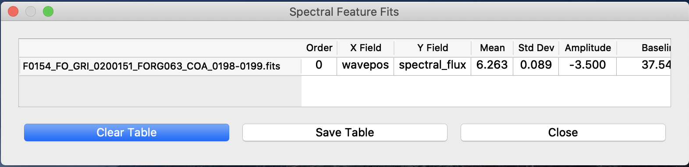

.. _fitting:

Fitting Curves to Data
======================

A common desire when exploring data is to fit some kind of line to the data,
and the Eye of SOFIA obliges. Through keyboard shortcuts, the user can
select a range of data and have a simple two component model fit to the
selection. The fit is overplotted on the data for a quick check on if the fit
worked, while the parameters of the fit are displayed in a separate window,
where they can be saved to file.

The fitting methods are found the the
:class:`Pane <sofia_redux.visualization.display.pane.Pane>` class
(described in more
detail :ref:`plotting`). The process of fitting data requires interacting
with both the data and the GUI. Only the ``Pane`` object has easy access to
both. Additionally, if the data has been altered in any way from its original
values read from the FITS file (such as changing units), then only the
``Pane`` object has access to the data with the correct values.

The kinds of curves available to fit to data are shown in
:ref:`available-fits`. All models include fitting a baseline model to the data
(linear model for spectra, plane for an image). The baseline improves the
quality of the fit as the curve itself no longer has to account for any
background and can focus more the feature of interest.

.. table:: Models Available for Curve Fitting
   :widths: auto
   :name: available-fits

   +------------+-------------+-----------+
   | Data Type  | Model       | Available |
   +============+=============+===========+
   | Spectrum   | 1D Gaussian | Yes       |
   |            +-------------+-----------+
   |            | 1D Moffat   | No        |
   |            +-------------+-----------+
   |            | Lorentz     | No        |
   |            +-------------+-----------+
   |            | Linear      | No        |
   +------------+-------------+-----------+
   | Image      | 2D Gaussian | No        |
   |            +-------------+-----------+
   |            | 2D Moffat   | No        |
   |            +-------------+-----------+
   |            | Sersic      | No        |
   |            +-------------+-----------+
   |            | Planar      | No        |
   +------------+-------------+-----------+

Selecting Data
--------------
The first step to fitting a curve to data is to select the data to be fit.
The process is initialized by pressing the "F" key, setting the figure to
selection mode. This uses the same methods as the zooming process to reduce
the limits of the plot. While in selection mode the Eye will record the data
coordinates of any place the user clicks. When two coordinates are recorded
the selection mode ends and the *x*-coordinates of the points are passed to
the ``Pane`` object for fitting. The *y*-coordinates of the points are not
used. Currently there are no non-interactive methods for selecting the data
range.

.. _fitting_methods:

Method
------
Once the data range has been selected it is passed to the ``perform_fit``
method of the ``Pane`` class, where it determines which kind of model to fit
to the data, which determines which fitting method gets called. The first
step is to select the subsample of data to apply the curve fitting algorithm
to. For each order in each dataset loaded in the pane, all *x* data within the
*x*-axis limits along with the corresponding *y* data are retrieved. The
*y*-axis limits are not used. Only data points where both the *x* and *y*
values are not NaN are used for for fitting.

Once the subset is ready it is used to create a rough initial guess for the
curve parameters. For example, a Gaussian fit has *amplitude*, *mean*, and
*stddev* parameters. The *amplitude* is initialized to the *y* value in the
middle pixel less the median *y* value, the *mean* is initialized to the *x*
value in the middle pixel, and *sigma* is initialized to :math:`1/3` of the
width of the *x* window.  Additionally, bounds to the parameters are set to
speed up the curve fit. For a Gaussian all paramters are allowed to span the
set of real numbers except for the *mean*, which is restricted to lie within
the *x* window, and the *sigma*, which is restricted to positive values less
than the width of the *x* window.

With the initial values set the curve models can be initialized. The Eye uses
curve models from the :class:`astropy.modeling` module. All curves fit to
data are a composite of the requested curve and a baseline curve. For
example, fitting a Gaussian to a spectrum feature would result in fitting a
a combined
:class:`Gaussian1D <modeling.models.Gaussian1D>` and
:class:`Linear1D <modeling.models.Linear1D>` model.

The actual fitting is done with scipy's
:class:`curve_fit <scipy.optimization.curve_fit>` function
. While :class:`astropy.modeling` models have built-in fitting routines, they
tend
to be unreliable. The :class:`scipy` routines produce more consistently good
fits.
However if errors are encountered while fitting, the error is logged and the
dataset is skipped. If no errors were raised, the fitted curve is then
displayed.

.. _fitting_display:

Displaying Results
------------------
The results of a curve fit are displayed in two ways. First the curve itself
is plotted over the data for visual inspection on the quality of fit. Second
the parameters of all fits are displayed in a separate window.

Plotting the curve for a 1D fit involves plotting two distinct lines. The
first is the fitted curve itself. The second is a vertical line located at
the fit's centroid. Both of these artists are added to the ``Gallery`` class
as described in :ref:`gallery`. An example is shown in
:ref:`Spectrum with Fit <spectrum-with-fit>`.

The separate window is controlled by the
:class:`FittingResults <sofia_redux.visualization.display.fitting_results.FittingResults>`
class.
The window is a simple QtTable widget that lists the details of all fits
performed, as outlined in :ref:`fit-parameters`. An example is shown in
:ref:`Results window <results-table>`.
If the fitting method is invoked an additional time, the parameters
of the new fit are appended to the end of the table. The table can be cleared
of all results with the "Clear Table" button. Additionally the table can be
written to a CSV file with the "Save Table" button. If one or more rows are
selected when the "Save Table" button is pressed only the selected rows
will be written to file.

.. table:: Curve Fit Parameters Displayed
   :widths: auto
   :name: fit-parameters

   ==============  ====================================================
   Field           Description
   ==============  ====================================================
   filename        Name of FITS file
   order           Spectral order curve was fit to
   x_field         Data field on *x*-axis (e.g. "wavepos")
   y_field         Data field on *y*-axis (e.g. "spectral_flux")
   mean            Centroid of ``Gaussian1D`` fit
   stddev          Sigma of ``Gaussian1D`` fit
   amplitude       Peak value of ``Gaussian1D`` fit.
   baseline        Value of ``Linear1D`` fit at "mean"
   base_intercept  *y*-intercept of ``Linear1D`` fit
   base_slope      Slope of ``Linear1D`` fit
   lower_limit     Lower limit of *x*-coordinates of the fitting window
   upper_limit     Upper limit of *x*-coordinates of the fitting window
   ==============  ====================================================

.. figure:: images/spectrum_with_fit.png
   :name: spectrum-with-fit
   :align: center
   :width: 400 px
   :alt: Gaussian fit to spectrum.

   Eye of SOFIA displaying FORCAST grism data with a Gaussian
   fit to a feature.

   Parameters for a Gaussian fit to a feature in a FORCAST grism
   dataset.

