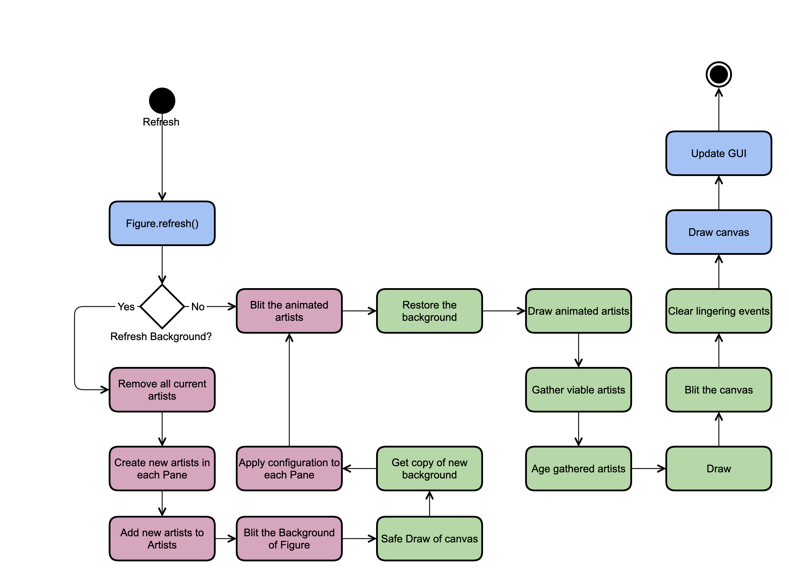

.. _plotting:

Plotting
========

Overview
--------

The plotting routines are the very core of the Eye, which interprets the
information stored in models and coverts them to images/plots in the
:class:`Figure <sofia_redux.visualization.display.figure.Figure>`.
The :class:`Figure` class creates a
:class:`Pane <sofia_redux.visualization.display.pane.Pane>` instance for
each axes created. The :class:`Pane` oversees the details of applying plot
configurations and data to the underlying :class:`matplotlib.Axes` instance.

All display processes are overseen by the
:class`View <sofia_redux.visualization.display.view.View>` class which
interprets commands from the
:class:`Eye <sofia_redux.visualization.eye.Eye>` class along with interactions
from the user and GUI to create instructions for the :class:`Figure` class. To
keep the display current, the :class:`View` utilizes :ref:`signals` to respond
to instructions (from the :class:`Eye` and the user) in preparation for the
refresh loop to complete.

Diagram
-------

  Activity diagram for the figure refresh loop. Blue events are handled
  by the :class:`Figure` class, red events are handled by the
  :class:`Pane` class, green events are handled by the
  :class:`BlitManager` class.

Initial Plot Creation
---------------------

When the Eye initially starts up, the figure is blank, with no axes or Panes.
A data set is loaded into the Eye, either through command line arguments, GUI
navigation, or API calls. The user can then select the model from the
"model_list" to display. The :class:`Eye` passes the model selected to the
:class:`View`, which then passes it to the :class:`Figure`, flags the full
background as stale (see :ref:`figure-atrophy`), and updates the controls
panels to reflect the newly visible dataset.

The :class:`Figure` instance starts the display process by first determining
what pane the model should be added to. Since initially there are no panes, one
must be created. A singe :class:`Pane` object is instantiated based on the
number
of dimensions the data being displayed has, so diplaying spectral data leads
to the creation of a one-dimensional pane object (ie
:class:`OneDimPane <sofia_redux.visualization.display.pane.OneDimPane>`).

After the pane is created, the model is added. The pane creates a copy of the
model and keeps reference to that. This allows the pane to change and
manipulate the model (e.g., by changing units) while keeping the original
model tracked by the :class:`Eye` identical to the FITS file. The pane then
sets the extensions to be plotted based on the pane's fields,
assigns a color to the model based on its color cycle, and assigns a marker
style. With the model now configured for the pane, an artist object can be
created.

In the :class:`OneDimPane`, an artist represents a single line of data that
displays one field against another (e.g., 'flux' vs. 'wavepos'). Each order
in the model to be displayed represents an additional line to be plotted. By
default, all orders in a model are shown. For grism data, there is only every
one model. However echelle data can have several orders, all of which are
displayed by default. The data are then converted to the desired units based
on the :class`Pane` settings, For each order in the model, the data
corresponding to
the *x*- and *y*-axis are pulled using the :mod:`retrieve` method and used to
create :class:`matplotlib.lines.Line2D` objects. It the *y*-axis field shows is
'flux' then an additional artist
(:class:`matplotlib.collections.PolyCollection` this time) is created to show
the error  range based on the associated error extension.

All artists created are then returned to the :class:`Figure`, which then adds
them to the :class:`Artist <sofia_redux.visualization.display.artists.Artist>`
instance to be tracked. The :class:`Pane` only keeps track of the
:class:`matplotlib.Axes` instance and the plot configurations, then uses them
to create and return artists and returns. If the artists need to be
updated, removed,  or redrawn in any manner, the :class:`Artists` class handles
those changes.

Once the artists have been added to the :class:`Artist` instance everything is
prepped to be drawn. The standard refresh process describe in
:ref:`figure-atrophy` is utilized to finally draw all artists on screen.

.. _figure-atrophy:

Atrophy System
--------------

The Eye is an interactive tool, meaning it spends much of its time running an
idle looping waiting for user interactions. After the user interacts with the
Eye in a manner, be that by adding new models, changing the color, or merely
moving the cursor across the plot, the Eye must assess the interaction,
determine what actions need to be taken to respond to the interaction, then
process those actions.

Whenever the Eye determines an interaction requires
the plot to respond, it implements the change in two steps. First the
settings and underlying data structures of the plot are changed. This can be
changing the units of a model, selecting a different field to plot, or just
updating the cursor's location. Second the figure is marked as "stale" by
emitting the "atrophy" signal.
During the idle loop, the Eye checks if the figure is stale. If is not stale,
then the loop continues on, waiting for its next interaction. However if the
figure is stale, the figure is updated to reflect the new settings and data.

By default, matplotlib plots redraw every part of
themselves whenever they are updated. Usually this is minor, but if there are
many panes, models, or fits plotted it can get wasteful. If the user moved
the cursor to a new location on the plot, only the cursor's location artist
needs to be updated. The axis, labels, and other lines do not need to
redrawn, but the default implementation of matplotlib will do just that.
This issue is avoided by implementing blitting techniques, which are
described in :ref:`blitting`. To use it properly, the Eye needs to keep track
of when the background of a pane needs to be updated or if just the artists
need to be updated. To differentiate between the type of update that needs to
happen, the Eye has three different atrophy signals which correspond to three
different stale states.

* atrophy: The simplest of the atrophy signals, this marks the figure as
  "stale" which corresponds to the lowest level of changes required. In this
  state only the animated artists will be updated. The background and axes of
  the figure are still valid and does not need to be updated.

* atrophy_background_partial: The second stage of atrophy signals. In this
  state the background needs to updated but the axis are still good, which
  keeps the figure from having to redraw the  :class:`matplotlib.Axes` objects.
  This signal is used when the current :class:`Axes` is still valid but
  needs to be altered, such as turning on the grid, changing limits, changing
  the scale, or enabling dark mode.

* atrophy_background_full: The third stage of atrophy signals, this marks
  everything in the figure as out of date. All aspects of the :class:`Axes`
  object are redrawn. This is used when new data is added to a pane, or a new
  pane itself is added to the figure, or other similarly large scale changes.

If any of the atrophy signals are emitted, the refresh loop in the Eye
catches it and sets up the figure to be refreshed. Before that, though, the
refresh flags are reset. If this did not happen until after the figure
refresh, the Eye could miss later atrophy emits that occur while the figure
is refreshing.

Updating the figure has two steps. First the panes each have to apply any
changes they've recorded to their axes. The "correct" value of an axis
property, such as its limit or scale, is held by the Pane instance the axis
is member of. Any changes made by the user or from other parts of the Eye do
not interact with the axis itself. Instead the changes are made to the
properties of the Pane instance. This limits the access to the axes to the
Pane, preventing any other commands to overwrite the axes, as well as
abstracting away the details of how to apply a parameter to the
:class:`matplotlib.Axes` object in favor of the easier to use
:class:`Pane` object. The cost of this protection and abstraction is the
additional step of applying the parameters of the pane to the Axes object.
This is the first step of the refresh process.

Once all the axes object have been updated with the correct configuration,
the second step is to use the
:class:`BlitManager <sofia_redux.visualization.display.blitting.BlitManager>`
class to actually implement the changes. If either the
"atrophy_background_full" or "atrophy_background_partial" flags were
triggered, then the blitter is instructed to update everything. Otherwise,
only the animated artists are updated.

