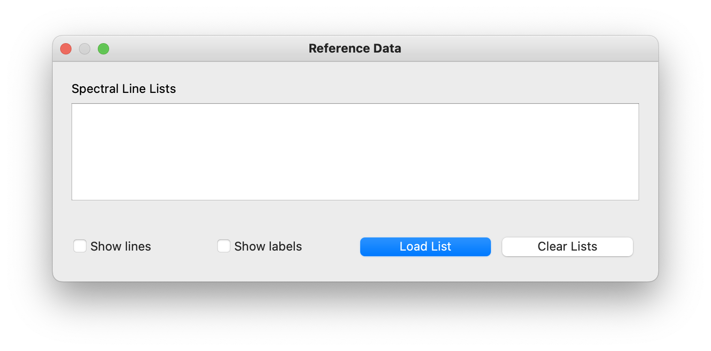

.. _reference_data_dev:

Reference Spectral Data
=======================

A key feature of the Eye is the ability to plot spectral reference lines
over data. The loading, managament, and display of reference data is handled
by two classes: ``ReferenceData`` and ``ReferenceWindow``.

Reference Data
--------------

The ``ReferenceData`` class, found at
:class:`sofia_redux.visualization.models.reference_model`, manages the
reference data. It is responsible for reading in and storing the data in a
dictionary. The keys are the transition labels and the values are a list of
transition wavelengths associated with the transition. Additionally the
``ReferenceData`` class keeps track of the units of the lines. By default it
is assumed the initial units are microns. If the units of the pane on which
the lines are plotted are different, the ``ReferenceData`` class uses the
``convert_wave`` method in the ``utils`` module to return a copy of the
reference lines converted into the target wavelengths. The original data as
read in is never altered.

Reference data can be formatted in either single column or double column
formats. In a single column file it is assumed the data are the wavelengths
of the spectral lines and are given the label of "<wavelength> um'. For a
two column data file it is assumed the first column is the wavelength and
second column is the label. The columns can be seperated by commas, pipes, or
whitespace. Any addition columns are ignored, as are any lines starting with
'#'.

Reference Window
----------------

The ``ReferenceWindow`` class, found at
:class:`sofia_redux.visualization.display.reference_window`, manages the GUI
interface to load and inspect reference data. The base window, opened by
clicking the "Open" button next to "Reference Data" in the "Analysis" tab of
the Eye, looks like :numref:`empty_reference_window` .

   Reference data window for loading spectral lines.

Multiple reference data files can be loaded at once, and any duplicates will
be ignored. Once data files are loaded in their original source is dropped,
condensing all data into a single list. The lines and labels can be hidden
with the checkboxes in this window as well. Double-clicking on a filename
after loading it opens a simple display that shows the details of the
reference data. The window is managed by the ``TextView`` class, found at
:class:`sofia_redux.visualization.display.text_view` . This simple view shows
the loaded wavelengths and their associated labels, and includes filtering
and search functionality for additional inspection.

